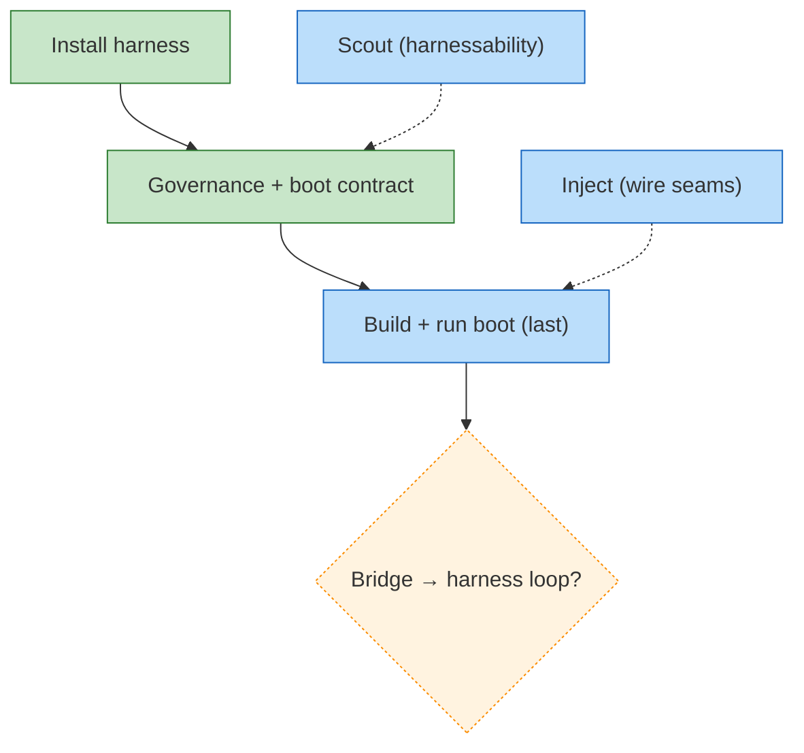

<!-- GENERATED by `harness flow render` — do not hand-edit; regenerate from the flow JSON. -->
# Flow · chainglass-adopt

**Kind**: harness-adopt · **Now**: scout · **Next**: inject · **Intent**: Adopt engineering-harness in chainglass (dogfood; coexist with / supplant the existing Docker 'just harness dev' concept; report back) · **Nodes**: 6 · **Events**: 9

**Rail**: ◆─[ ◆ ]─◇─◇  ◆ Install harness · [ ◆ Governance + boot contract ] · ◇ Build + run boot (last) · ◇ Bridge → harness loop?

**Legend**: 🟩 done · 🟧 in-progress · 🟥 blocked · 🟦 known (designed) · ⬜ assumed (speculative) · 🔶 decision · 🗣 user input · 🟪 harness loop · 🤖 companion · 🛠 worker · 🧰 chore (upkeep).
