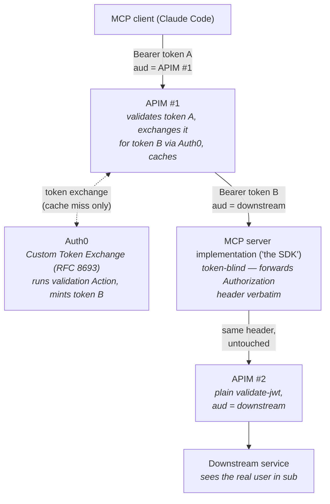
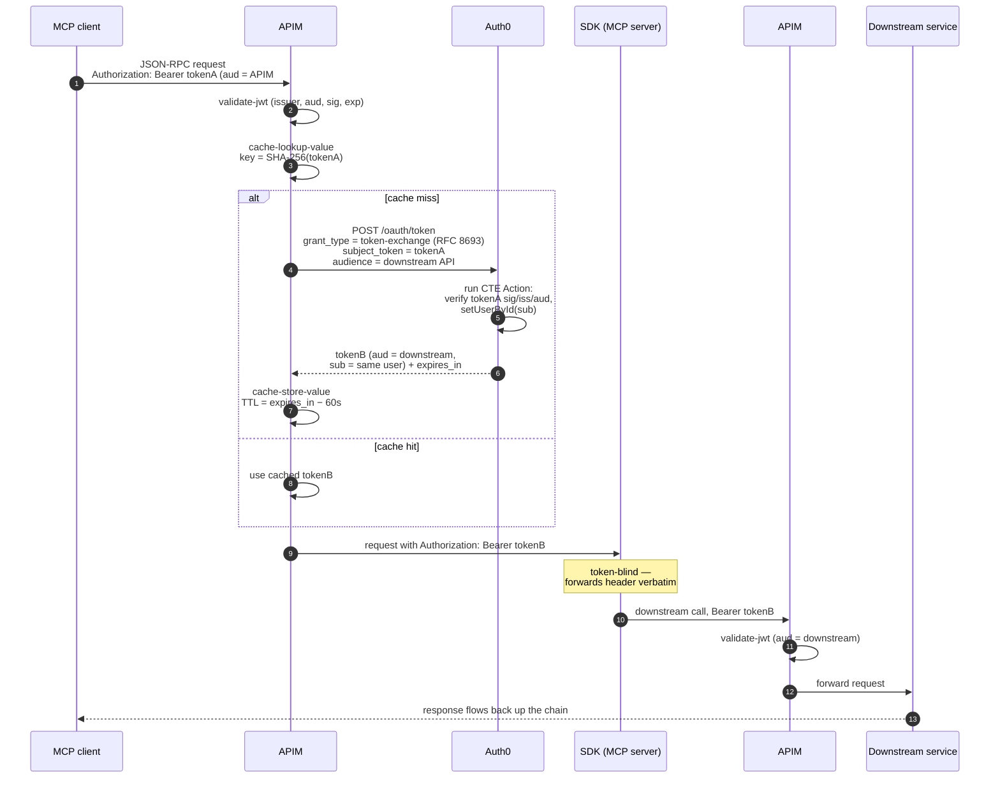

# On-Behalf-Of Token Exchange at the Gateway: APIM + Auth0 for a Token-Blind MCP Server

## The problem

We have a chain of services where a user's identity must flow end-to-end, but the
middle tier (the MCP server implementation — "the SDK") must not contain any token
logic at all:



Requirements:

1. The MCP client holds an Auth0-issued access token whose audience is **APIM #1**.
2. The downstream service has its **own audience** and requires a user-delegated
   (on-behalf-of) token — it must see *who the user is*, not just "the gateway called me".
3. The SDK must **never acquire, exchange, cache, or understand tokens**. It forwards
   the `Authorization` header it receives when calling downstream. That's it.
4. No application code anywhere for auth — everything lives in APIM policy XML and
   Auth0 configuration. (One small exception: an Auth0 Action, see below.)

## The pattern: token exchange at the gateway

This is the classic **On-Behalf-Of (OBO)** delegation problem: a middle tier needs to
call a downstream API *as the user*, with a token minted for the downstream audience.

- **Microsoft Entra ID** solves this with its proprietary OBO grant
  (`grant_type=urn:ietf:params:oauth:grant-type:jwt-bearer` + `requested_token_use=on_behalf_of`).
  Entra does **not** support RFC 8693.
- **Auth0** solves it with the standards-based **RFC 8693 Token Exchange**
  (`grant_type=urn:ietf:params:oauth:grant-type:token-exchange`), exposed as a feature
  called **Custom Token Exchange (CTE)**. Auth0 has a dedicated doc page for exactly
  this middle-tier scenario:
  [On-Behalf-Of Token Exchange](https://auth0.com/docs/secure/call-apis-on-users-behalf/on-behalf-of-token-exchange).

Since our IdP is Auth0, we use CTE. The key architectural decision is **where** the
exchange happens: instead of the SDK doing it (which would require auth code in the
SDK), **APIM #1 performs the exchange in policy**, so the SDK receives a request whose
`Authorization` header *already contains* the downstream-audience token and simply
passes it through.

### Who ratifies what

Be clear-eyed about what is officially documented versus assembled by us:

| Piece | Status |
|---|---|
| RFC 8693 token exchange on `/oauth/token` | **Auth0-documented** ([Custom Token Exchange](https://auth0.com/docs/authenticate/custom-token-exchange)) |
| OBO / middle-tier delegation via CTE | **Auth0-documented** ([OBO Token Exchange](https://auth0.com/docs/secure/call-apis-on-users-behalf/on-behalf-of-token-exchange)) |
| APIM validating inbound JWTs (`validate-jwt`) | **Microsoft-documented** |
| APIM calling an external token endpoint via `send-request` | **Microsoft-documented policy primitive** (no APIM-specific "token exchange" sample exists) |
| APIM value caching (`cache-lookup-value` / `cache-store-value`) | **Microsoft-documented** |
| The composition of the above into a gateway OBO flow | **Our pattern** — every building block is supported, but there is no single Microsoft/Auth0 page describing the whole assembly |

Notably, APIM's **Credential Manager does not help here** — it supports auth-code
(static pre-consented connections) and app-only (client credentials / managed identity)
flows, not per-request exchange driven by the inbound user token.

## Flow, end to end



1. MCP client sends a JSON-RPC request to APIM #1 with `Authorization: Bearer <tokenA>`
   (`aud` = APIM #1's API identifier in Auth0).
2. APIM #1 `validate-jwt` verifies issuer, audience, signature, expiry.
3. APIM #1 checks its cache for a previously exchanged token keyed to `<tokenA>`.
4. On a miss, APIM #1 POSTs to Auth0 `/oauth/token` with the RFC 8693 grant, sending
   `<tokenA>` as the `subject_token` and requesting `audience` = downstream API.
5. Auth0 authenticates the APIM client, looks up the **Token Exchange Profile** matching
   our `subject_token_type` URN, and runs our **Custom Token Exchange Action**.
6. The Action validates `<tokenA>` (signature, issuer, audience, expiry) and binds the
   exchange to the user via `api.authentication.setUserById(sub)`.
7. Auth0 mints `<tokenB>` — same user identity, `aud` = downstream service.
8. APIM #1 caches `<tokenB>` and overwrites the outbound `Authorization` header with it.
9. The SDK receives the request, does its work, and when calling APIM #2 forwards the
   `Authorization` header verbatim. It never inspects or decodes it.
10. APIM #2 does a plain `validate-jwt` for its own audience and forwards to the
    downstream service. The user's identity (`sub`, custom claims) is present in the token.

## Auth0 configuration

### Prerequisites / caveats

- **Custom Token Exchange is Early Access** (explicitly approved for production use),
  available on **B2C Professional, B2B Professional, and Enterprise** plans. It may need
  to be enabled on the tenant by Auth0 support.
- The APIM client application must be **first-party** and **OIDC-conformant**.
- The legacy `/delegation` endpoint is deprecated — CTE is its replacement.

### 1. Register APIM #1 as a client and enable CTE

Register a client (machine-to-machine or regular web app) representing APIM #1, note
its `client_id`/`client_secret`, then enable token exchange via the Management API:

```http
PATCH /api/v2/clients/{APIM_CLIENT_ID}
Content-Type: application/json

{
  "token_exchange": {
    "allow_any_profile_of_type": ["custom_authentication"]
  }
}
```

### 2. Register the APIs

- **API A**: APIM #1's API identifier (e.g. `https://mcp-gateway.example.com`) — the
  audience the MCP client requests tokens for.
- **API B**: the downstream service (e.g. `https://downstream.example.com`) — the
  audience the exchange will mint tokens for. Configure its token lifetime and scopes here.

### 3. Create the Custom Token Exchange Action (the only "code" in the system)

Auth0 deliberately treats the `subject_token` as **opaque** — validating it is your
responsibility, implemented in a small Node.js Action that runs inside Auth0's Actions
runtime (nothing to host or deploy; it lives in the Auth0 dashboard).

Create it under **Actions → Library → Create Action → Custom Token Exchange trigger**:

```javascript
const { createRemoteJWKSet, jwtVerify } = require('jose'); // add 'jose' as an Action dependency

const JWKS = createRemoteJWKSet(
  new URL('https://YOUR_TENANT.auth0.com/.well-known/jwks.json')
);

exports.onExecuteCustomTokenExchange = async (event, api) => {
  try {
    // 1. Cryptographically verify the subject token against our own tenant's keys.
    //    Enforce that it was issued by us, for the *gateway* audience (API A) —
    //    a token minted for any other audience must not be exchangeable.
    const { payload } = await jwtVerify(
      event.transaction.subject_token,
      JWKS,
      {
        issuer: 'https://YOUR_TENANT.auth0.com/',
        audience: 'https://mcp-gateway.example.com', // API A — APIM #1's identifier
      }
    );

    // 2. Optional: additional authorization checks (org, scopes, allow-lists).
    //    e.g. if (!payload.scope?.includes('mcp:use')) { ... reject ... }

    // 3. Bind the exchange to the user from the validated token. Auth0 will then
    //    run the normal post-login pipeline and mint the new token for the
    //    requested downstream audience with this user's identity.
    api.authentication.setUserById(payload.sub);

  } catch (err) {
    // Marks the subject token invalid; Auth0 applies progressive rate limiting
    // to clients that repeatedly present bad tokens.
    api.access.rejectInvalidSubjectToken(`Subject token validation failed: ${err.message}`);
  }
};
```

> Verify the exact API surface (`event.transaction.subject_token`,
> `api.authentication.setUserById`, `api.access.rejectInvalidSubjectToken`) against the
> [Custom Token Exchange trigger docs](https://auth0.com/docs/customize/actions/explore-triggers/signup-and-login-triggers/custom-token-exchange-trigger)
> when implementing — the trigger is Early Access and the API may evolve.

Security notes on the Action:

- **Always verify the signature** — never trust a decoded-but-unverified JWT.
- **Pin the audience to API A.** This is the OBO integrity rule: only tokens issued
  *for the gateway* may be exchanged. Without this check, any token from the tenant
  (for any API) could be laundered into a downstream token.
- `setUserById` preserves the original user — the downstream token's `sub` is the real
  user, which is exactly what "on-behalf-of" means.

### 4. Create the Token Exchange Profile

Maps our chosen `subject_token_type` URN to the Action:

```http
POST /api/v2/token-exchange-profiles
Content-Type: application/json

{
  "name": "apim-gateway-obo",
  "subject_token_type": "urn:example:apim-user-token",
  "action_id": "{ACTION_ID}",
  "type": "custom_authentication"
}
```

The URN is arbitrary but must match exactly between this profile and the APIM policy.

## APIM #1 policy (the whole gateway implementation)

Everything below is declarative policy XML — no application code. The Auth0 client
secret is stored as a **Key Vault-backed named value** (`auth0-client-secret`), never
inline.

```xml
<policies>
  <inbound>
    <base />

    <!-- 1. Validate the inbound Auth0 token (aud = this gateway) -->
    <validate-jwt header-name="Authorization"
                  failed-validation-httpcode="401"
                  failed-validation-error-message="Invalid or missing token">
      <openid-config url="https://YOUR_TENANT.auth0.com/.well-known/openid-configuration" />
      <audiences>
        <audience>https://mcp-gateway.example.com</audience>
      </audiences>
      <issuers>
        <issuer>https://YOUR_TENANT.auth0.com/</issuer>
      </issuers>
    </validate-jwt>

    <!-- 2. Cache key derived from the *validated inbound token itself*.
            NOT from Mcp-Session-Id or any client-supplied header (see Security). -->
    <set-variable name="oboCacheKey" value="@{
        var auth = context.Request.Headers.GetValueOrDefault("Authorization", "");
        using (var sha = System.Security.Cryptography.SHA256.Create())
        {
            var hash = sha.ComputeHash(System.Text.Encoding.UTF8.GetBytes(auth));
            return "obo-" + Convert.ToBase64String(hash);
        }
    }" />

    <!-- 3. Cache lookup -->
    <cache-lookup-value key="@((string)context.Variables["oboCacheKey"])"
                        variable-name="downstreamToken" />

    <!-- 4. On miss: RFC 8693 token exchange against Auth0 -->
    <choose>
      <when condition="@(!context.Variables.ContainsKey("downstreamToken"))">

        <send-request mode="new" response-variable-name="tokenResponse" timeout="10" ignore-error="false">
          <set-url>https://YOUR_TENANT.auth0.com/oauth/token</set-url>
          <set-method>POST</set-method>
          <set-header name="Content-Type" exists-action="override">
            <value>application/x-www-form-urlencoded</value>
          </set-header>
          <set-body>@{
              var subjectToken = context.Request.Headers
                  .GetValueOrDefault("Authorization", "").Replace("Bearer ", "");
              return "grant_type=" + System.Net.WebUtility.UrlEncode("urn:ietf:params:oauth:grant-type:token-exchange")
                   + "&client_id={{auth0-client-id}}"
                   + "&client_secret={{auth0-client-secret}}"
                   + "&subject_token=" + System.Net.WebUtility.UrlEncode(subjectToken)
                   + "&subject_token_type=" + System.Net.WebUtility.UrlEncode("urn:example:apim-user-token")
                   + "&audience=" + System.Net.WebUtility.UrlEncode("https://downstream.example.com");
          }</set-body>
        </send-request>

        <!-- Fail closed if the exchange did not succeed -->
        <choose>
          <when condition="@(((IResponse)context.Variables["tokenResponse"]).StatusCode != 200)">
            <return-response>
              <set-status code="401" reason="Token exchange failed" />
            </return-response>
          </when>
        </choose>

        <set-variable name="tokenBody"
                      value="@(((IResponse)context.Variables["tokenResponse"]).Body.As<JObject>())" />
        <set-variable name="downstreamToken"
                      value="@((string)((JObject)context.Variables["tokenBody"])["access_token"])" />

        <!-- 5. Cache for min(expires_in, inbound token remaining life) minus skew -->
        <set-variable name="cacheTtl" value="@{
            var expiresIn = (int?)((JObject)context.Variables["tokenBody"])["expires_in"] ?? 300;
            return Math.Max(60, expiresIn - 60);
        }" />
        <cache-store-value key="@((string)context.Variables["oboCacheKey"])"
                           value="@((string)context.Variables["downstreamToken"])"
                           duration="@((int)context.Variables["cacheTtl"])" />
      </when>
    </choose>

    <!-- 6. Replace the Authorization header with the downstream-audience token.
            From here on, the SDK is token-blind: it just forwards this header. -->
    <set-header name="Authorization" exists-action="override">
      <value>@("Bearer " + (string)context.Variables["downstreamToken"])</value>
    </set-header>
  </inbound>

  <backend><base /></backend>
  <outbound><base /></outbound>
  <on-error><base /></on-error>
</policies>
```

APIM #2's policy is just a plain `validate-jwt` for `https://downstream.example.com` —
nothing novel.

## Token caching, done securely

Caching is essential: an MCP session (FastMCP streamable-HTTP) sends many JSON-RPC
requests under one bearer token, and without a cache every `tools/call` would hit
Auth0's `/oauth/token` — slow, and it will hit Auth0 rate limits.

Rules we follow:

1. **Key on the validated inbound token, never on session identity.** FastMCP's
   `Mcp-Session-Id` is a client-supplied correlation header, not an authenticated
   identity. Keying the cache on it would let a different authenticated user who
   presents (or replays) the same session ID receive *someone else's* downstream token.
   The SHA-256 of the bearer token is safe: the cache entry is only reachable by a
   caller who possesses that exact token, and the token itself was just validated.
2. **Token rotation invalidates naturally.** When the MCP client refreshes its token,
   the hash — and therefore the cache key — changes. No stale-identity edge cases,
   no explicit invalidation logic.
3. **TTL = `expires_in` from the Auth0 response minus skew** (60s), floor of 60s. Never
   hardcode the lifetime; it's governed by API B's token settings in Auth0.
4. **Internal cache only.** APIM's built-in per-gateway cache is sufficient — a miss
   across gateway instances just costs one extra exchange. An external Redis cache
   would put user access tokens at rest in another store for marginal benefit.
   (Note: the **Consumption tier has no internal cache** — use any other tier, or
   accept wiring external Redis.)
5. **Secrets in Key Vault.** `auth0-client-id` / `auth0-client-secret` are Key
   Vault-backed named values; they never appear in the policy source or ARM templates.

APIM has no *token-specific* first-class cache for tokens you fetch via `send-request`
(auto-caching exists only for `authentication-managed-identity` and Credential Manager,
neither of which applies here) — but `cache-lookup-value`/`cache-store-value` are
first-class generic policies, and the five lines above are the entire wiring.

## What each component ends up owning

| Component | Auth responsibility |
|---|---|
| MCP client (Claude Code) | Acquires token for APIM #1's audience (normal OAuth) |
| **APIM #1** | Validates inbound JWT; performs RFC 8693 exchange; caches; injects downstream token |
| **SDK / MCP server** | **Nothing.** Forwards the `Authorization` header verbatim |
| APIM #2 | Plain `validate-jwt` for the downstream audience |
| Downstream service | Normal bearer-token validation; sees the real user in `sub` |
| Auth0 | Runs the CTE Action; mints the downstream-audience token; enforces the user pipeline/RBAC |

## Open items before implementation

- [ ] Confirm Auth0 plan (B2C Pro / B2B Pro / Enterprise) and get **Custom Token
      Exchange enabled on the tenant** (Early Access — may require an Auth0 ticket).
- [ ] Verify the CTE Action trigger API surface against current Auth0 docs (Early
      Access APIs can shift).
- [ ] Decide API B's token lifetime in Auth0 (drives cache hit rate).
- [ ] Confirm the APIM tier has internal cache (not Consumption).
- [ ] Load-test the exchange path against Auth0 rate limits with realistic MCP
      session concurrency (cold-cache burst behavior).

## References

- Auth0 — Custom Token Exchange: <https://auth0.com/docs/authenticate/custom-token-exchange>
- Auth0 — On-Behalf-Of Token Exchange: <https://auth0.com/docs/secure/call-apis-on-users-behalf/on-behalf-of-token-exchange>
- Auth0 — Token Exchange flow / calling your API: <https://auth0.com/docs/get-started/authentication-and-authorization-flow/token-exchange-flow>
- Auth0 — Custom Token Exchange trigger (Actions): <https://auth0.com/docs/customize/actions/explore-triggers/signup-and-login-triggers/custom-token-exchange-trigger>
- Auth0 — Configure Custom Token Exchange: <https://auth0.com/docs/authenticate/custom-token-exchange/configure-custom-token-exchange>
- RFC 8693 — OAuth 2.0 Token Exchange: <https://datatracker.ietf.org/doc/html/rfc8693>
- APIM — `validate-jwt` policy: <https://learn.microsoft.com/en-us/azure/api-management/validate-jwt-policy>
- APIM — `send-request` policy: <https://learn.microsoft.com/en-us/azure/api-management/send-request-policy>
- APIM — caching policies: <https://learn.microsoft.com/en-us/azure/api-management/api-management-caching-policies>
- APIM — Secure MCP servers: <https://learn.microsoft.com/en-us/azure/api-management/secure-mcp-servers>
- (Contrast) Entra OBO flow — not applicable here but the conceptual ancestor: <https://learn.microsoft.com/en-us/entra/identity-platform/v2-oauth2-on-behalf-of-flow>
