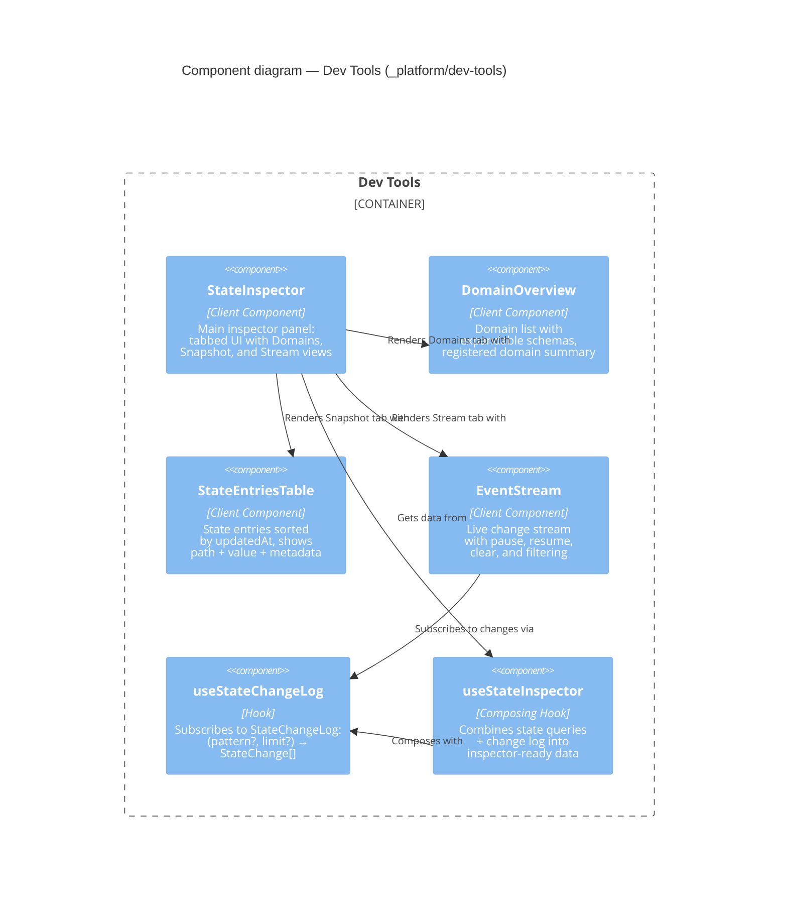

# Component: Dev Tools (`_platform/dev-tools`)

> **Domain Definition**: [_platform/dev-tools/domain.md](../../../../domains/_platform/dev-tools/domain.md)
> **Source**: `apps/web/src/features/_platform/dev-tools/`
> **Registry**: [registry.md](../../../../domains/registry.md) — Row: Dev Tools

Developer-facing observability tooling — inspector panels and diagnostic displays for debugging platform state at runtime. Pure observer: reads state but never modifies it. Provides a tabbed inspector with domain overview, state snapshot, and live event stream views.

## Components

| Component | Type | Description |
|-----------|------|-------------|
| StateInspector | Client Component | Main inspector: tabbed UI with Domains, Snapshot, Stream views |
| DomainOverview | Client Component | Registered domain list with expandable schemas |
| StateEntriesTable | Client Component | State entries sorted by updatedAt with path/value/metadata |
| EventStream | Client Component | Live change stream with pause/resume/clear and filtering |
| useStateChangeLog | Hook | `(pattern?, limit?) → StateChange[]` from StateChangeLog ring buffer |
| useStateInspector | Composing Hook | Combines state queries + change log for inspector data |

## External Dependencies

Depends on: _platform/state (IStateService, StateChangeLog, useStateSystem hooks).
Consumed by: (pure observer — no downstream dependents).

---

## Navigation

- **Zoom Out**: [Web App Container](../../containers/web-app.md) | [Container Overview](../../containers/overview.md)
- **Domain**: [_platform/dev-tools/domain.md](../../../../domains/_platform/dev-tools/domain.md)
- **Hub**: [C4 Overview](../../README.md)
