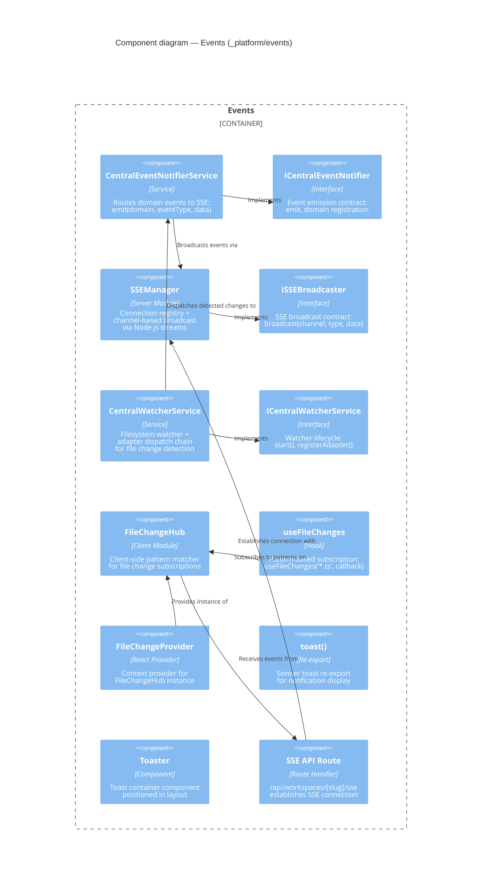

# Component: Events (`_platform/events`)

> **Domain Definition**: [_platform/events/domain.md](../../../../domains/_platform/events/domain.md)
> **Source**: `packages/shared/src/features/027-central-notify-events/` + `apps/web/src/features/027-central-notify-events/`
> **Registry**: [registry.md](../../../../domains/registry.md) — Row: Events

Central event platform for real-time events (file changes, graph updates, agent status) via Server-Sent Events transport. Provides domain-scoped event emission on the server, SSE broadcast to connected clients, filesystem watching with adapter dispatch, and client-side pattern-based subscriptions.

## Components

| Component | Type | Description |
|-----------|------|-------------|
| ICentralEventNotifier | Interface | Domain event emission: emit(domain, eventType, data) |
| CentralEventNotifierService | Service | Routes domain events to SSE broadcast channels |
| ISSEBroadcaster | Interface | SSE broadcast: broadcast(channel, eventType, data) |
| SSEManager | Server Module | Connection registry + channel broadcast via Node.js streams |
| ICentralWatcherService | Interface | Filesystem watcher lifecycle: start(), registerAdapter() |
| CentralWatcherService | Service | Filesystem watcher with adapter dispatch chain |
| FileChangeHub | Client Module | Client-side pattern-based file change subscription matcher |
| useFileChanges | Hook | Pattern subscription: useFileChanges('*.ts', callback) |
| FileChangeProvider | React Provider | Context provider for FileChangeHub instance |
| toast() | Re-export | Sonner toast function for notifications |
| Toaster | Component | Toast container positioned in layout |
| SSE API Route | Route Handler | /api/workspaces/[slug]/sse — SSE connection endpoint |

## External Dependencies

Depends on: sonner (npm), zod, Node.js fs.watch, _platform/sdk (IUSDK).
Consumed by: file-browser, workflow-ui, _platform/state (SSE transport).

---

## Navigation

- **Zoom Out**: [Web App Container](../../containers/web-app.md) | [Container Overview](../../containers/overview.md)
- **Domain**: [_platform/events/domain.md](../../../../domains/_platform/events/domain.md)
- **Hub**: [C4 Overview](../../README.md)
