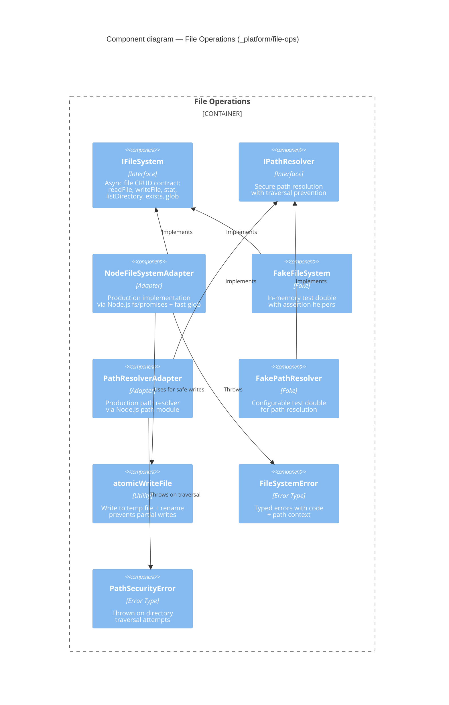

# Component: File Operations (`_platform/file-ops`)

> **Domain Definition**: [_platform/file-ops/domain.md](../../../../domains/_platform/file-ops/domain.md)
> **Source**: `packages/shared/src/interfaces/` + `packages/shared/src/adapters/` + `packages/shared/src/fakes/`
> **Registry**: [registry.md](../../../../domains/registry.md) — Row: File Operations

Type-safe file system abstraction and path security for all services that touch disk. Provides async CRUD operations with traversal prevention, typed errors, and atomic writes. Every domain that reads or writes files goes through this contract.

## Components

| Component | Type | Description |
|-----------|------|-------------|
| IFileSystem | Interface | Async file operations: readFile, writeFile, stat, listDirectory, exists, glob |
| IPathResolver | Interface | Resolves paths securely within workspace boundaries |
| NodeFileSystemAdapter | Adapter | Production fs via `fs/promises` + `fast-glob` |
| FakeFileSystem | Fake | In-memory filesystem with test assertion helpers |
| PathResolverAdapter | Adapter | Production path resolver via Node.js `path` |
| FakePathResolver | Fake | Configurable path resolver for unit tests |
| atomicWriteFile | Utility | Write to temp then rename — prevents partial/corrupt writes |
| FileSystemError | Error | Typed error with error code and path context |
| PathSecurityError | Error | Thrown when path traversal is attempted |

## External Dependencies

Depends on: Node.js `fs/promises`, `path`, `fast-glob` (npm).
Consumed by: viewer (Shiki reads files), file-browser, workspace-url, positional-graph, workflow services.

---

## Navigation

- **Zoom Out**: [Web App Container](../../containers/web-app.md) | [Container Overview](../../containers/overview.md)
- **Domain**: [_platform/file-ops/domain.md](../../../../domains/_platform/file-ops/domain.md)
- **Hub**: [C4 Overview](../../README.md)
