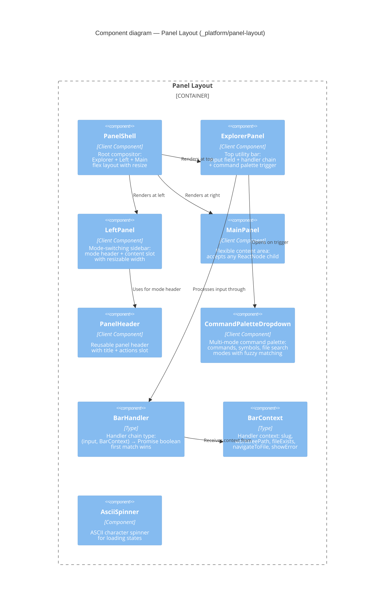

# Component: Panel Layout (`_platform/panel-layout`)

> **Domain Definition**: [_platform/panel-layout/domain.md](../../../../domains/_platform/panel-layout/domain.md)
> **Source**: `apps/web/src/features/_platform/panel-layout/`
> **Registry**: [registry.md](../../../../domains/registry.md) — Row: Panel Layout

Reusable three-panel layout system for workspace detail pages. Provides a root compositor (PanelShell) that arranges an ExplorerPanel (top utility bar), LeftPanel (mode-switching sidebar), and MainPanel (flexible content area). The ExplorerPanel includes a multi-mode command palette with handler chain for extensible input processing.

## Components

| Component | Type | Description |
|-----------|------|-------------|
| PanelShell | Client Component | Root compositor: Explorer + Left + Main flex layout |
| ExplorerPanel | Client Component | Top utility bar with input field, handler chain, command palette |
| LeftPanel | Client Component | Mode-switching sidebar with header and content slot |
| MainPanel | Client Component | Flexible content area accepting any ReactNode |
| PanelHeader | Client Component | Reusable header with title and actions slot |
| CommandPaletteDropdown | Client Component | Multi-mode palette: commands, symbols, search with fuzzy matching |
| BarHandler | Type | Input handler chain: `(input, BarContext) → Promise<boolean>` |
| BarContext | Type | Handler context with slug, worktreePath, navigation methods |
| AsciiSpinner | Component | ASCII character spinner for loading states |

## External Dependencies

Depends on: _platform/workspace-url, _platform/sdk, nuqs, lucide-react, sonner.
Consumed by: file-browser, future workspace pages.

---

## Navigation

- **Zoom Out**: [Web App Container](../../containers/web-app.md) | [Container Overview](../../containers/overview.md)
- **Domain**: [_platform/panel-layout/domain.md](../../../../domains/_platform/panel-layout/domain.md)
- **Hub**: [C4 Overview](../../README.md)
