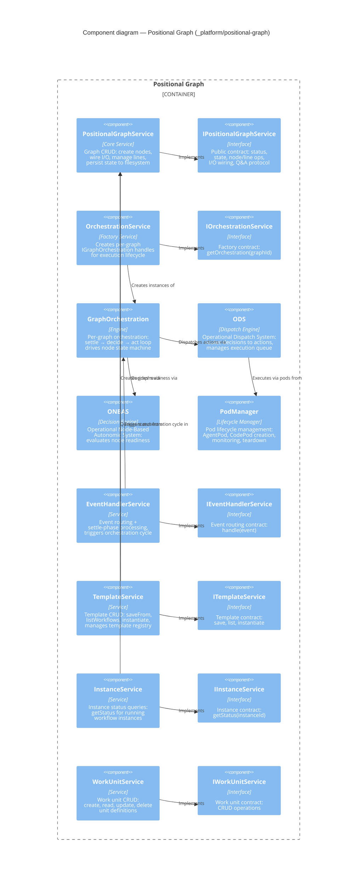

# Component: Positional Graph (`_platform/positional-graph`)

> **Domain Definition**: [_platform/positional-graph/domain.md](../../../../domains/_platform/positional-graph/domain.md)
> **Source**: `packages/positional-graph/src/` + `packages/workflow/src/`
> **Registry**: [registry.md](../../../../domains/registry.md) — Row: Positional Graph

Core graph engine for the line-based workflow execution system. Owns graph structure (nodes, lines, positions), state persistence, node execution state machine, and the full orchestration stack. The orchestration flow runs: Reality (external events) → ONBAS (decision engine) → ODS (dispatch engine) → PodManager (execution). This is the most complex infrastructure domain.



## Components

| Component | Type | Description |
|-----------|------|-------------|
| IPositionalGraphService | Interface | Graph CRUD, status, state, node/line operations, I/O wiring, Q&A |
| PositionalGraphService | Core Service | Graph engine: create nodes, wire I/O, manage lines, persist state |
| IOrchestrationService | Interface | Factory for per-graph orchestration handles |
| OrchestrationService | Factory Service | Creates IGraphOrchestration instances per graph |
| GraphOrchestration | Engine | Per-graph settle→decide→act loop driving the node state machine |
| ONBAS | Decision Engine | Operational Node-Based Autonomic System — evaluates node readiness |
| ODS | Dispatch Engine | Operational Dispatch System — routes decisions to execution actions |
| PodManager | Lifecycle Manager | Pod lifecycle: AgentPod/CodePod creation, monitoring, teardown |
| IEventHandlerService | Interface | Event routing and settle-phase processing |
| EventHandlerService | Service | Routes events, triggers orchestration cycles |
| ITemplateService | Interface | Template CRUD: save, list, instantiate |
| TemplateService | Service | Template registry and instantiation from graph definitions |
| IInstanceService | Interface | Instance status queries |
| InstanceService | Service | Running workflow instance status |
| IWorkUnitService | Interface | Work unit CRUD operations |
| WorkUnitService | Service | Work unit definition management |

## Orchestration Flow

```
External Event → EventHandlerService → GraphOrchestration
                                            │
                                    ┌───────┴───────┐
                                    │   SETTLE      │ (wait for quiescence)
                                    │   DECIDE      │ (ONBAS evaluates readiness)
                                    │   ACT         │ (ODS dispatches to PodManager)
                                    └───────────────┘
```

## External Dependencies

Depends on: _platform/file-ops (IFileSystem, IPathResolver), _platform/state (publishes orchestration state), @chainglass/shared.
Consumed by: CLI (`cg wf`, `cg template`), workflow-ui, workunit-editor.

---

## Navigation

- **Zoom Out**: [Web App Container](../../containers/web-app.md) | [Container Overview](../../containers/overview.md)
- **Domain**: [_platform/positional-graph/domain.md](../../../../domains/_platform/positional-graph/domain.md)
- **Hub**: [C4 Overview](../../README.md)
