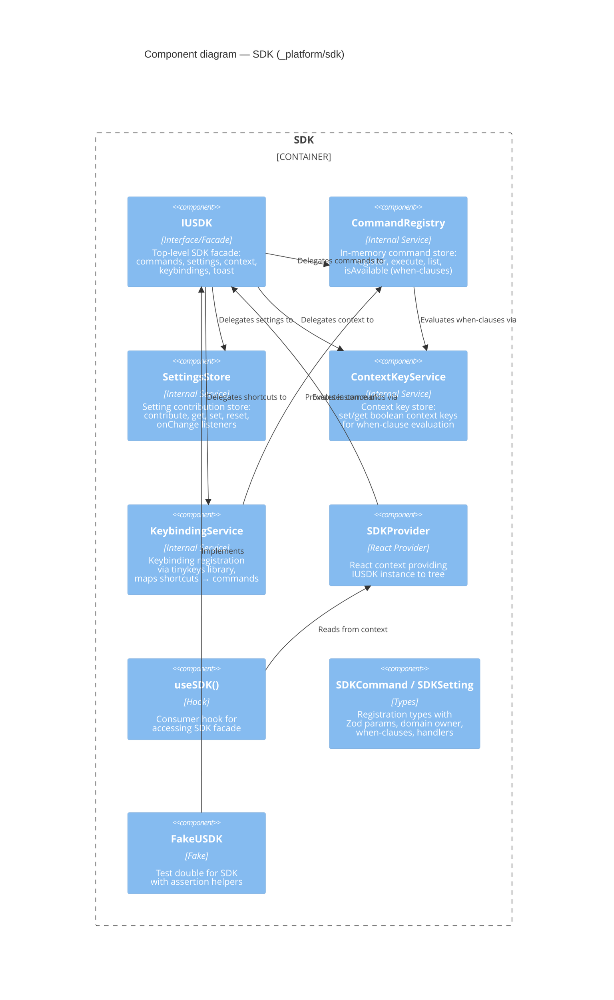

# Component: SDK (`_platform/sdk`)

> **Domain Definition**: [_platform/sdk/domain.md](../../../../domains/_platform/sdk/domain.md)
> **Source**: `packages/shared/src/interfaces/sdk.interface.ts` + `apps/web/src/lib/sdk/`
> **Registry**: [registry.md](../../../../domains/registry.md) — Row: SDK

Client-side internal SDK layer where domains publish commands, settings, and keyboard shortcuts. Provides a facade (IUSDK) that unifies command registration, setting contribution, context key evaluation, and keybinding management. Domains register their capabilities at startup; the SDK makes them available to the command palette and keyboard shortcuts.

## Components

| Component | Type | Description |
|-----------|------|-------------|
| IUSDK | Interface/Facade | Top-level SDK: commands, settings, context, keybindings, toast |
| CommandRegistry | Internal Service | In-memory command registration, execution, when-clause filtering |
| SettingsStore | Internal Service | Setting contribution with get/set/reset and onChange listeners |
| ContextKeyService | Internal Service | Boolean context key store for when-clause evaluation |
| KeybindingService | Internal Service | Keybinding registration via tinykeys, maps shortcuts → commands |
| SDKProvider | React Provider | Provides IUSDK instance to React component tree |
| useSDK() | Hook | Consumer hook for accessing SDK facade from components |
| SDKCommand / SDKSetting | Types | Registration types: Zod params, domain owner, when-clauses |
| FakeUSDK | Fake | Test double with assertion helpers |

## External Dependencies

Depends on: tinykeys (npm). No domain dependencies.
Consumed by: _platform/settings, _platform/panel-layout, _platform/events, file-browser, workflow-ui.

---

## Navigation

- **Zoom Out**: [Web App Container](../../containers/web-app.md) | [Container Overview](../../containers/overview.md)
- **Domain**: [_platform/sdk/domain.md](../../../../domains/_platform/sdk/domain.md)
- **Hub**: [C4 Overview](../../README.md)
