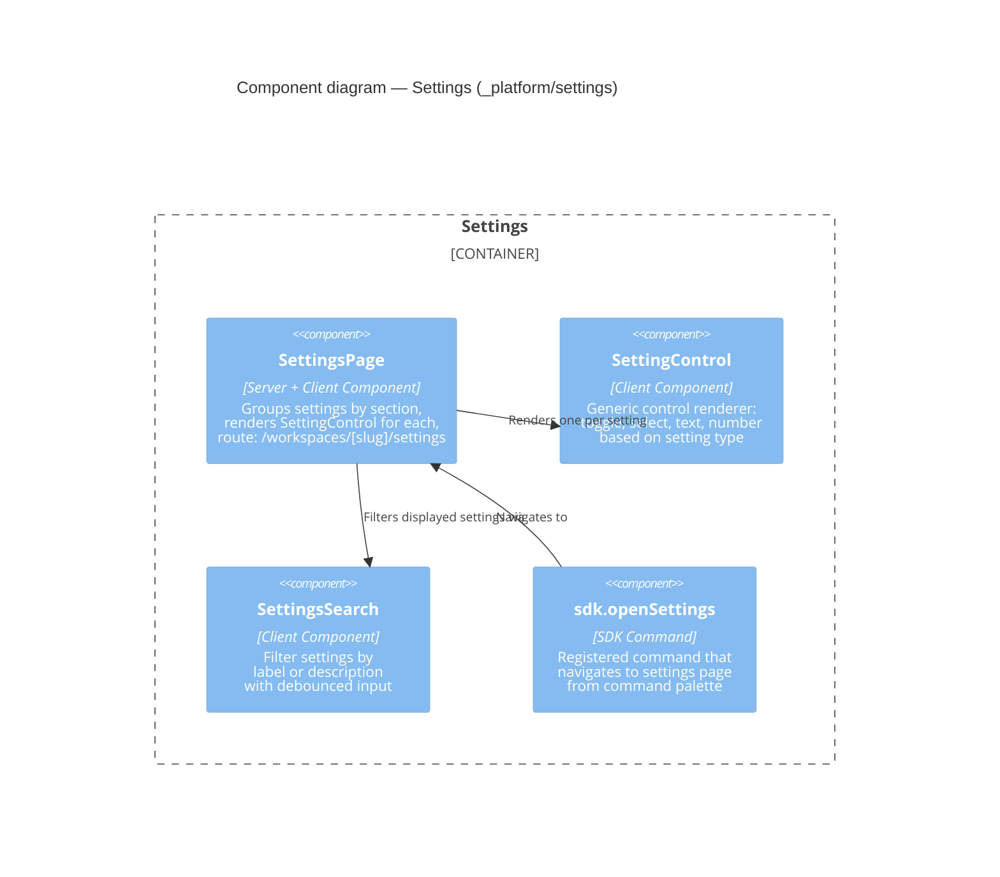

# Component: Settings (`_platform/settings`)

> **Domain Definition**: [_platform/settings/domain.md](../../../../domains/_platform/settings/domain.md)
> **Source**: `apps/web/app/(dashboard)/workspaces/[slug]/settings/page.tsx` + `apps/web/src/features/settings/`
> **Registry**: [registry.md](../../../../domains/registry.md) — Row: Settings

User-facing settings page that auto-generates controls from SDK setting contributions. Domains contribute settings via `ISDKSettings.contribute()` at startup; this page reads them, groups by section, and renders appropriate controls (toggle, select, text, number). Includes search filtering for large setting sets.

## Components

| Component | Type | Description |
|-----------|------|-------------|
| SettingsPage | Server + Client Component | Groups settings by section, renders controls, route handler |
| SettingControl | Client Component | Generic renderer: toggle/select/text/number based on setting type |
| SettingsSearch | Client Component | Debounced search filter across setting labels and descriptions |
| sdk.openSettings | SDK Command | Registered command for navigating to settings from palette |

## External Dependencies

Depends on: _platform/sdk (ISDKSettings.list, useSDKSetting, useSDK), shadcn/ui.
Consumed by: (leaf consumer — no downstream dependents).

---

## Navigation

- **Zoom Out**: [Web App Container](../../containers/web-app.md) | [Container Overview](../../containers/overview.md)
- **Domain**: [_platform/settings/domain.md](../../../../domains/_platform/settings/domain.md)
- **Hub**: [C4 Overview](../../README.md)
