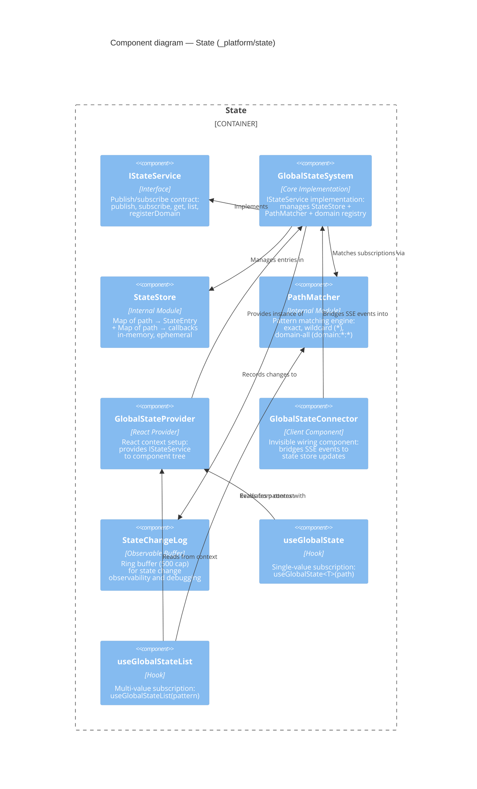

# Component: State (`_platform/state`)

> **Domain Definition**: [_platform/state/domain.md](../../../../domains/_platform/state/domain.md)
> **Source**: `packages/shared/src/state/` + `apps/web/src/lib/state/`
> **Registry**: [registry.md](../../../../domains/registry.md) — Row: State

Centralized ephemeral runtime state system for cross-domain values (workflow status, active files, execution progress). Uses hierarchical path addressing (e.g., `orchestration:graphId:nodeStatus`), wildcard pattern matching for subscriptions, and SSE transport for server→client state synchronization. The state store is in-memory — not persisted across restarts.

## Components

| Component | Type | Description |
|-----------|------|-------------|
| IStateService | Interface | Publish/subscribe: publish, subscribe, get, list, registerDomain |
| GlobalStateSystem | Core Implementation | IStateService impl managing StateStore + PathMatcher + domain registry |
| StateStore | Internal Module | Map<path, StateEntry> + Map<path, Set<callback>> — ephemeral |
| PathMatcher | Internal Module | Pattern matching: exact, wildcard (`*`), domain-all (`domain:*:*`) |
| GlobalStateProvider | React Provider | Provides IStateService to React component tree |
| GlobalStateConnector | Client Component | Invisible bridge: SSE events → state store updates |
| StateChangeLog | Observable Buffer | Ring buffer (500 cap) for debugging state changes |
| useGlobalState | Hook | Single-value subscription: `useGlobalState<T>(path)` |
| useGlobalStateList | Hook | Multi-value pattern subscription: `useGlobalStateList(pattern)` |

## External Dependencies

Depends on: _platform/events (SSE transport via useSSE), React 19 (useSyncExternalStore).
Consumed by: _platform/positional-graph (publishes), workflow-ui, file-browser, panel-layout, _platform/dev-tools.

---

## Navigation

- **Zoom Out**: [Web App Container](../../containers/web-app.md) | [Container Overview](../../containers/overview.md)
- **Domain**: [_platform/state/domain.md](../../../../domains/_platform/state/domain.md)
- **Hub**: [C4 Overview](../../README.md)
