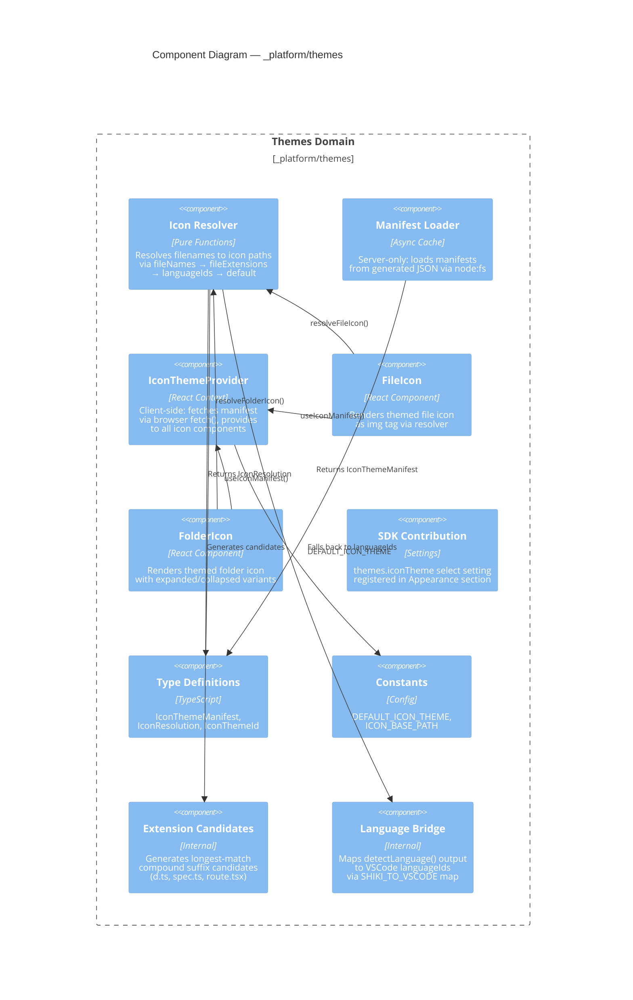
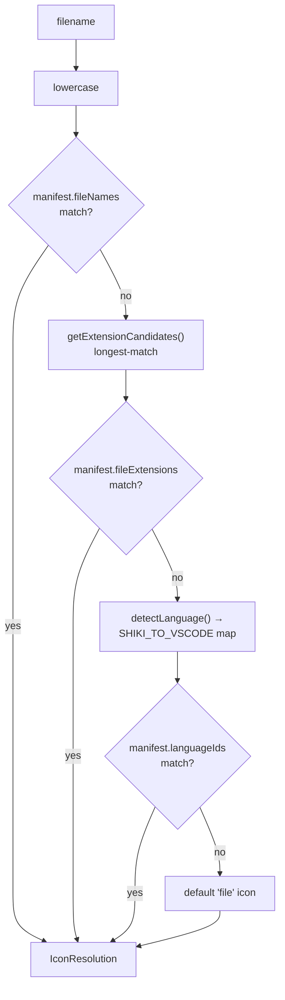

# C4 L3 Component: Themes (`_platform/themes`)

> **Domain Definition**: [domain.md](../../../domains/_platform/themes/domain.md)
> **Source**: `apps/web/src/features/_platform/themes/`
> **Registry**: [registry.md](../../../domains/registry.md) — Row: Themes

## Component Diagram

## Internal Data Flow

Depends on `_platform/viewer` for `detectLanguage()` utility (consumed, not owned).

---

## Navigation

- **Zoom Out**: [Web App Container](../../containers/web-app.md)
- **Domain**: [domain.md](../../../domains/_platform/themes/domain.md)
- **Hub**: [C4 Overview](../../README.md)
