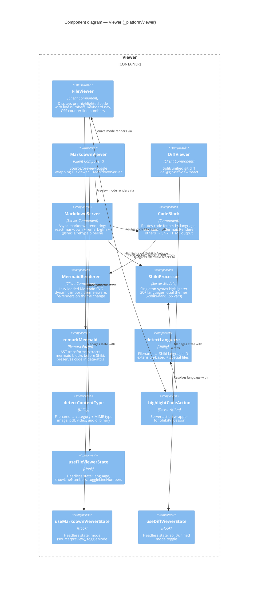

# Component: Viewer (`_platform/viewer`)

> **Domain Definition**: [_platform/viewer/domain.md](../../../../domains/_platform/viewer/domain.md)
> **Source**: `apps/web/src/components/viewers/` + `apps/web/src/lib/server/` + `apps/web/src/hooks/`
> **Registry**: [registry.md](../../../../domains/registry.md) — Row: Viewer

Reusable rendering primitives for displaying code, markdown, and git diffs. Provides syntax-highlighted code display (Shiki server-side singleton), markdown preview with mermaid support, and split/unified diff viewing. Built as headless-first components with separated state hooks.

## Components

| Component | Type | Description |
|-----------|------|-------------|
| FileViewer | Client Component | Read-only code display with line numbers, keyboard nav, CSS counters |
| MarkdownViewer | Client Component | Source/preview toggle wrapping FileViewer + MarkdownServer |
| DiffViewer | Client Component | Split/unified git diff via @git-diff-view/react + @git-diff-view/shiki |
| MarkdownServer | Server Component | Async markdown pipeline: react-markdown + remark-gfm + @shikijs/rehype |
| CodeBlock | Component | Routes code fences: mermaid → MermaidRenderer, others → Shiki HTML |
| MermaidRenderer | Client Component | Lazy-loaded Mermaid SVG, dynamic import('mermaid'), theme-aware re-render |
| remarkMermaid | Remark Plugin | AST transform extracting mermaid blocks before Shiki processes them |
| ShikiProcessor | Server Module | Singleton highlighter, 30+ languages, dual themes via CSS variables |
| detectLanguage | Utility | Extension-based filename → Shiki language ID mapping |
| detectContentType | Utility | Filename → {category, mimeType} for viewer routing |
| highlightCodeAction | Server Action | Server action wrapper: (code, lang) → highlighted HTML |
| useFileViewerState | Hook | Headless state for FileViewer (language, line numbers) |
| useMarkdownViewerState | Hook | Headless state for MarkdownViewer (source/preview mode) |
| useDiffViewerState | Hook | Headless state for DiffViewer (split/unified mode) |

## External Dependencies

Depends on: shiki, react-markdown, @shikijs/rehype, @git-diff-view/react, mermaid, _platform/file-ops (IFileSystem).
Consumed by: file-browser, workunit-editor (CodeEditor), demo pages.

---

## Navigation

- **Zoom Out**: [Web App Container](../../containers/web-app.md) | [Container Overview](../../containers/overview.md)
- **Domain**: [_platform/viewer/domain.md](../../../../domains/_platform/viewer/domain.md)
- **Hub**: [C4 Overview](../../README.md)
