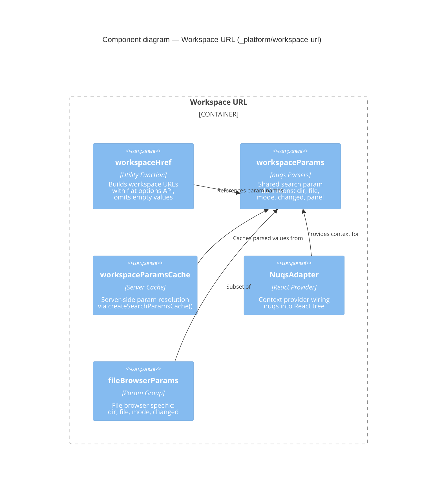

# Component: Workspace URL (`_platform/workspace-url`)

> **Domain Definition**: [_platform/workspace-url/domain.md](../../../../domains/_platform/workspace-url/domain.md)
> **Source**: `apps/web/src/lib/workspace-url.ts` + `apps/web/src/lib/workspace.params.ts`
> **Registry**: [registry.md](../../../../domains/registry.md) — Row: Workspace URL

Type-safe URL building and search parameter parsing for all workspace-scoped pages. Provides a flat options API for constructing workspace URLs, nuqs-based parameter definitions for client-side state, and server-side caching for parameter resolution.

## Components

| Component | Type | Description |
|-----------|------|-------------|
| workspaceHref | Utility | Builds `/workspaces/[slug]/...` URLs with flat options API |
| workspaceParams | nuqs Parsers | Shared nuqs parser definitions for workspace search params |
| workspaceParamsCache | Server Cache | Server-side `createSearchParamsCache()` for SSR param resolution |
| NuqsAdapter | React Provider | Wires nuqs into the React component tree |
| fileBrowserParams | Param Group | File browser-specific param subset (dir, file, mode, changed) |

## External Dependencies

Depends on: nuqs (npm), Next.js App Router.
Consumed by: file-browser, panel-layout, workflow-ui, workunit-editor.

---

## Navigation

- **Zoom Out**: [Web App Container](../../containers/web-app.md) | [Container Overview](../../containers/overview.md)
- **Domain**: [_platform/workspace-url/domain.md](../../../../domains/_platform/workspace-url/domain.md)
- **Hub**: [C4 Overview](../../README.md)
