# Component: File Browser (`file-browser`)

> **Domain Definition**: [file-browser/domain.md](../../domains/file-browser/domain.md)
> **Source**: `apps/web/src/features/041-file-browser/` + `apps/web/app/(dashboard)/workspaces/[slug]/browser/`
> **Registry**: [registry.md](../../domains/registry.md) — Row: File Browser

Workspace-scoped file browsing, editing, diffing, and inline CRUD. The core feature that makes workspaces useful — users navigate files in a tree, view code with syntax highlighting, edit with CodeMirror, preview markdown, create/rename/delete files inline, and see uncommitted git changes. Every state is deep-linkable via URL params.

```mermaid
C4Component
    title Component diagram — File Browser (file-browser)

    Container_Boundary(fileBrowser, "File Browser") {
        Component(browserPage, "Browser Page", "Server + Client Component", "Two-panel layout:<br/>FileTree + FileViewerPanel<br/>route: /workspaces/[slug]/browser")
        Component(fileTree, "FileTree", "Client Component", "Lazy per-directory loading,<br/>expand/collapse, changed-only filter,<br/>keyboard navigation, inline<br/>create/rename/delete affordances")
        Component(inlineEdit, "InlineEditInput", "Client Component", "Auto-focused text input for<br/>tree create and rename modes,<br/>validates names via validateFileName")
        Component(deleteDialog, "DeleteConfirmationDialog", "Client Component", "VS Code-style confirmation<br/>for file/folder deletion,<br/>shows recursive warning for folders")
        Component(fileMutations, "useFileMutations", "Client Hook", "Orchestrates CRUD callbacks<br/>with toast feedback, tree refresh,<br/>and edge-case handling")
        Component(viewerPanel, "FileViewerPanel", "Client Component", "Mode toggle: edit/preview/diff<br/>save button, conflict detection,<br/>dispatches to viewer components")
        Component(codeEditor, "CodeEditor Wrapper", "Client Component", "CodeMirror 6 lazy-loaded,<br/>theme-synced, language-aware,<br/>change tracking")
        Component(dirService, "Directory Listing Service", "Server Service", "git ls-files per directory<br/>with readDir fallback,<br/>returns FileEntry[]")
        Component(fileListService, "File List Service", "Server Service", "git ls-files --cached --others<br/>full-tree flat listing with mtimes<br/>for file search cache")
        Component(changedFiles, "Changed Files Service", "Server Service", "git diff --name-only<br/>for changed-only tree filter")
        Component(readFile, "readFile Action", "Server Action", "Size limit, binary detection,<br/>symlink check, returns content +<br/>highlightedHtml + previewHtml")
        Component(saveFile, "saveFile Action", "Server Action", "Mtime conflict detection,<br/>atomic write via temp+rename")
        Component(crudActions, "CRUD Server Actions", "Server Actions", "createFile, createFolder,<br/>deleteItem, renameItem —<br/>auth + DI + delegation to services")
        Component(crudServices, "File Mutation Services", "Server Services", "createFileService, createFolderService,<br/>deleteItemService, renameItemService —<br/>path security, duplicate detection,<br/>size guard for recursive delete")
        Component(validateFn, "validateFileName", "Utility", "Git-portable filename validation:<br/>rejects invalid chars, reserved<br/>names, trailing spaces")
        Component(filesRoute, "Files API Route", "Route Handler", "/api/workspaces/[slug]/files<br/>client-side directory fetching")
        Component(rawRoute, "Raw File Route", "Route Handler", "/api/workspaces/[slug]/files/raw<br/>Range request support for binary")
        Component(binaryViewers, "Binary Viewers", "Client Components", "ImageViewer, PdfViewer,<br/>VideoViewer, AudioViewer,<br/>BinaryPlaceholder")
        Component(undoRedo, "UndoRedoManager", "Client Module", "Snapshot-based undo/redo<br/>via structuredClone,<br/>50-item stack")
        Component(wsContext, "WorkspaceContext", "React Provider", "Workspace-scoped context:<br/>slug, worktreePath,<br/>file operations")
        Component(pickers, "Emoji/Color Pickers", "Client Components", "EmojiPicker, ColorPicker<br/>for workspace customization")
    }

    Rel(browserPage, fileTree, "Left panel renders")
    Rel(browserPage, viewerPanel, "Main panel renders")
    Rel(browserPage, fileMutations, "Wires CRUD callbacks via")
    Rel(fileTree, dirService, "Fetches directories from")
    Rel(fileTree, filesRoute, "Client-side fetch via")
    Rel(fileTree, changedFiles, "Filters with")
    Rel(fileTree, inlineEdit, "Renders during create/rename")
    Rel(fileTree, deleteDialog, "Shows on delete request")
    Rel(fileMutations, crudActions, "Calls server actions via")
    Rel(viewerPanel, readFile, "Loads file content via")
    Rel(viewerPanel, saveFile, "Saves edits via")
    Rel(viewerPanel, codeEditor, "Edit mode renders")
    Rel(viewerPanel, binaryViewers, "Binary files render via")
    Rel(viewerPanel, undoRedo, "Tracks changes with")
    Rel(crudActions, crudServices, "Delegates to")
    Rel(crudServices, validateFn, "Validates names with")
    Rel(inlineEdit, validateFn, "Client-side validation via")
    Rel(readFile, fileListService, "Resolves paths with")
    Rel(browserPage, wsContext, "Wrapped in")
```

## Components

| Component | Type | Description |
|-----------|------|-------------|
| Browser Page | Server + Client Component | Two-panel layout with FileTree + FileViewerPanel |
| FileTree | Client Component | Lazy per-directory tree with expand/collapse, changed-only filter, inline create/rename/delete |
| InlineEditInput | Client Component | Auto-focused text input for tree create and rename modes, validates via validateFileName |
| DeleteConfirmationDialog | Client Component | VS Code-style confirmation for file/folder deletion with recursive warning |
| useFileMutations | Client Hook | Orchestrates CRUD callbacks with toast feedback, tree refresh, and edge-case handling |
| FileViewerPanel | Client Component | Mode toggle (edit/preview/diff), save, conflict detection |
| CodeEditor Wrapper | Client Component | CodeMirror 6, lazy-loaded, theme-synced |
| Directory Listing Service | Server Service | `git ls-files` per directory with readDir fallback |
| File List Service | Server Service | Full-tree flat listing with mtimes for search cache |
| Changed Files Service | Server Service | `git diff --name-only` for filter |
| readFile Action | Server Action | Size limit, binary detection, returns content + highlighted + preview HTML |
| saveFile Action | Server Action | Mtime conflict detection, atomic write |
| CRUD Server Actions | Server Actions | createFile, createFolder, deleteItem, renameItem — auth + DI + delegation |
| File Mutation Services | Server Services | createFileService, createFolderService, deleteItemService, renameItemService — path security, duplicate detection |
| validateFileName | Utility | Git-portable filename validation: rejects invalid chars, reserved names, trailing spaces |
| Files API Route | Route Handler | `/api/workspaces/[slug]/files` for client-side fetch |
| Raw File Route | Route Handler | `/api/workspaces/[slug]/files/raw` with Range request support |
| Binary Viewers | Client Components | Image, PDF, Video, Audio, BinaryPlaceholder |
| UndoRedoManager | Client Module | Snapshot undo/redo via structuredClone (50-item stack) |
| WorkspaceContext | React Provider | Workspace-scoped context (slug, worktreePath) |
| Emoji/Color Pickers | Client Components | Workspace customization pickers |

## External Dependencies

Depends on: _platform/file-ops (IFileSystem, IPathResolver), _platform/viewer (FileViewer, MarkdownViewer, DiffViewer), _platform/workspace-url (workspaceHref, params), _platform/panel-layout (PanelShell, ExplorerPanel), _platform/events (toast, useFileChanges), _platform/sdk (IUSDK), _platform/state (useGlobalState).
Consumed by: (leaf consumer — no downstream dependents).

---

## Navigation

- **Zoom Out**: [Web App Container](../containers/web-app.md) | [Container Overview](../containers/overview.md)
- **Domain**: [file-browser/domain.md](../../domains/file-browser/domain.md)
- **Hub**: [C4 Overview](../README.md)
