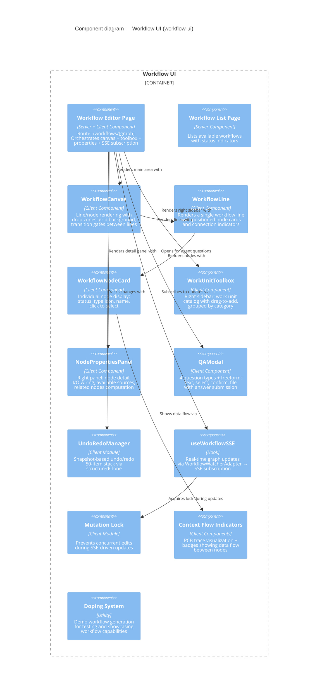

# Component: Workflow UI (`workflow-ui`)

> **Domain Definition**: [workflow-ui/domain.md](../../../domains/workflow-ui/domain.md)
> **Source**: `apps/web/src/features/050-workflow-page/`
> **Registry**: [registry.md](../../../domains/registry.md) — Row: Workflow UI

Visual workflow editor for the positional graph system. Provides a drag-drop canvas for building workflows, a toolbox for adding work units, a properties panel for node configuration, Q&A modals for agent interaction, and SSE-based live updates during execution. Includes an undo/redo system and context flow visualization.

## Components

| Component | Type | Description |
|-----------|------|-------------|
| Workflow Editor Page | Server + Client Component | Main editor orchestrating canvas + toolbox + properties + SSE |
| Workflow List Page | Server Component | Lists workflows with status indicators |
| WorkflowCanvas | Client Component | Line/node rendering with drop zones and grid |
| WorkflowLine | Client Component | Single line with positioned node cards |
| WorkflowNodeCard | Client Component | Individual node: status, type, name |
| WorkUnitToolbox | Client Component | Right sidebar work unit catalog with drag-to-add |
| NodePropertiesPanel | Client Component | Node detail, I/O wiring, available sources |
| QAModal | Client Component | 4 question types + freeform with answer submission |
| UndoRedoManager | Client Module | Snapshot undo/redo (50-item structuredClone stack) |
| useWorkflowSSE | Hook | Real-time updates via SSE subscription |
| Mutation Lock | Client Module | Prevents concurrent edits during SSE updates |
| Context Flow Indicators | Client Components | PCB trace + badges showing data flow |
| Doping System | Utility | Demo workflow generation for testing |

## External Dependencies

Depends on: _platform/positional-graph (IPositionalGraphService, IWorkUnitService, ITemplateService), _platform/events (useSSE), _platform/workspace-url (workspaceHref), _platform/sdk (IUSDK), _platform/state (useGlobalState).
Consumed by: (leaf consumer — no downstream dependents).

---

## Navigation

- **Zoom Out**: [Web App Container](../containers/web-app.md) | [Container Overview](../containers/overview.md)
- **Domain**: [workflow-ui/domain.md](../../../domains/workflow-ui/domain.md)
- **Hub**: [C4 Overview](../README.md)
