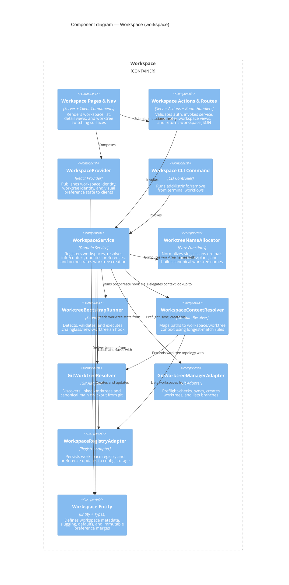

# Component: Workspace (`workspace`)

> **Domain Definition**: [workspace/domain.md](../../domains/workspace/domain.md)
> **Source**: `packages/workflow/src/` + `apps/web/app/(dashboard)/workspaces/` + `apps/web/src/components/workspaces/`
> **Registry**: [registry.md](../../domains/registry.md) — Row: Workspace

Workspace lifecycle and identity management. This domain registers named workspace roots, resolves active workspace/worktree context, discovers git worktree topology, and exposes the UI entrypoints that let the rest of the product stay workspace-aware without duplicating rules.

## Components

| Component | Type | Description |
|-----------|------|-------------|
| Workspace Pages & Nav | Server + Client Components | Renders workspace list, detail views, and worktree switching surfaces |
| Workspace Actions & Routes | Server Actions + Route Handlers | Validates auth, invokes service, revalidates views, returns workspace JSON |
| WorkspaceProvider | React Provider | Publishes workspace/worktree identity and visual preference state |
| Workspace CLI Command | CLI Controller | Exposes add/list/info/remove from terminal workflows |
| WorkspaceService | Domain Service | Registers workspaces, resolves info/context, updates preferences, orchestrates worktree creation |
| WorktreeNameAllocator | Pure Functions | Normalizes slugs, scans ordinals across branches/plans, builds canonical worktree names |
| WorktreeBootstrapRunner | Service | Detects, validates, and executes `.chainglass/new-worktree.sh` post-create hook |
| WorkspaceContextResolver | Domain Resolver | Maps paths to workspace/worktree context with longest-match rules |
| GitWorktreeResolver | Git Adapter (Read) | Discovers linked worktrees and canonical main checkout |
| GitWorktreeManagerAdapter | Git Adapter (Write) | Preflight-checks, syncs, creates worktrees, lists branches for naming |
| WorkspaceRegistryAdapter | Registry Adapter | Persists registry and preference updates to config storage |
| Workspace Entity | Entity + Types | Defines metadata, slugging, defaults, and immutable preference merges |

## External Dependencies

Depends on: _platform/file-ops (IFileSystem, IPathResolver), _platform/workspace-url (workspaceHref, workspaceParams), _platform/auth (requireAuth, middleware protection), shared process-manager infrastructure for git command execution.
Consumed by: file-browser, workflow-ui, 058-workunit-editor, terminal, agents.

---

## Navigation

- **Zoom Out**: [Web App Container](../containers/web-app.md) | [Container Overview](../containers/overview.md)
- **Domain**: [workspace/domain.md](../../domains/workspace/domain.md)
- **Hub**: [C4 Overview](../README.md)
