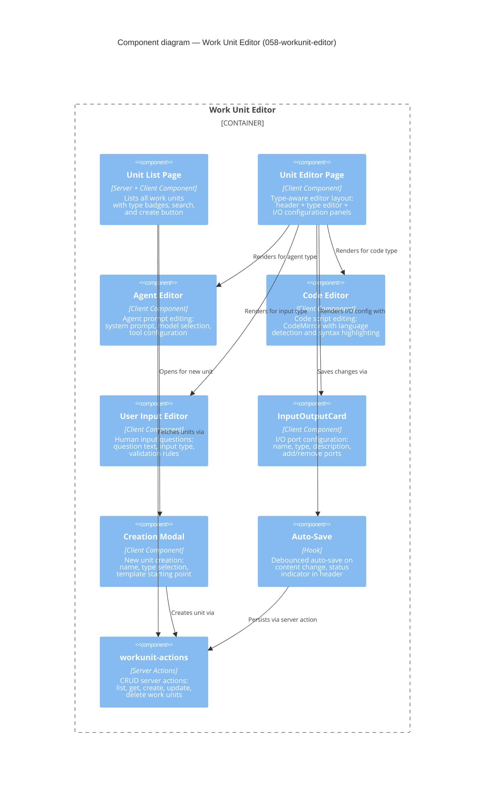

# Component: Work Unit Editor (`058-workunit-editor`)

> **Domain Definition**: [058-workunit-editor/domain.md](../../domains/058-workunit-editor/domain.md)
> **Source**: `apps/web/src/features/058-workunit-editor/`
> **Registry**: [registry.md](../../domains/registry.md) — Row: Work Unit Editor

Visual editor for creating and editing work unit templates — the building blocks of workflows. Supports three unit types (agent prompts, code scripts, human input questions) with type-specific editors, I/O configuration, and auto-save. Provides a list view for browsing units and a creation modal for new units.

## Components

| Component | Type | Description |
|-----------|------|-------------|
| Unit List Page | Server + Client Component | Lists units with type badges, search, create button |
| Unit Editor Page | Client Component | Type-aware editor: header + type editor + I/O panels |
| Agent Editor | Client Component | Agent prompt, model selection, tool configuration |
| Code Editor | Client Component | CodeMirror with language detection |
| User Input Editor | Client Component | Question text, input type, validation rules |
| InputOutputCard | Client Component | I/O port configuration: name, type, description |
| Creation Modal | Client Component | New unit: name, type selection, template |
| Auto-Save | Hook | Debounced auto-save with status indicator |
| workunit-actions | Server Actions | CRUD: list, get, create, update, delete |

## External Dependencies

Depends on: _platform/positional-graph (IWorkUnitService), _platform/viewer (code display via viewer contracts), _platform/workspace-url (workspaceHref).
Consumed by: (leaf consumer — no downstream dependents).

---

## Navigation

- **Zoom Out**: [Web App Container](../containers/web-app.md) | [Container Overview](../containers/overview.md)
- **Domain**: [058-workunit-editor/domain.md](../../domains/058-workunit-editor/domain.md)
- **Hub**: [C4 Overview](../README.md)
