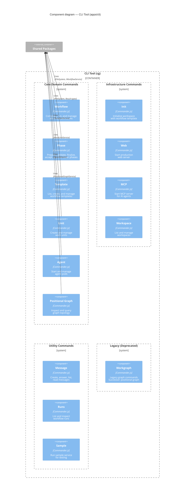

# Level 2 Detail: CLI Tool

> Internal structure of the Chainglass CLI (`cg`) — command groups organized by purpose.

## Command Groups

| Group | Commands | Purpose |
|-------|----------|---------|
| **Core** | workflow, phase, template, unit, agent, positional-graph | Domain-specific workflow operations |
| **Infrastructure** | init, web, mcp, workspace | Setup, servers, workspace management |
| **Utility** | message, runs, sample | Messaging, run inspection, testing |
| **Legacy** | workgraph | Deprecated — successor: positional-graph |

## Entry Point

`apps/cli/src/bin/cg.ts` — Creates Commander.js program, registers all command groups via `apps/cli/src/commands/index.ts`. Bundled with esbuild for distribution.

---

## Navigation

- **Zoom Out**: [Container Overview](overview.md) | [System Context](../system-context.md)
- **Hub**: [C4 Overview](../README.md)
