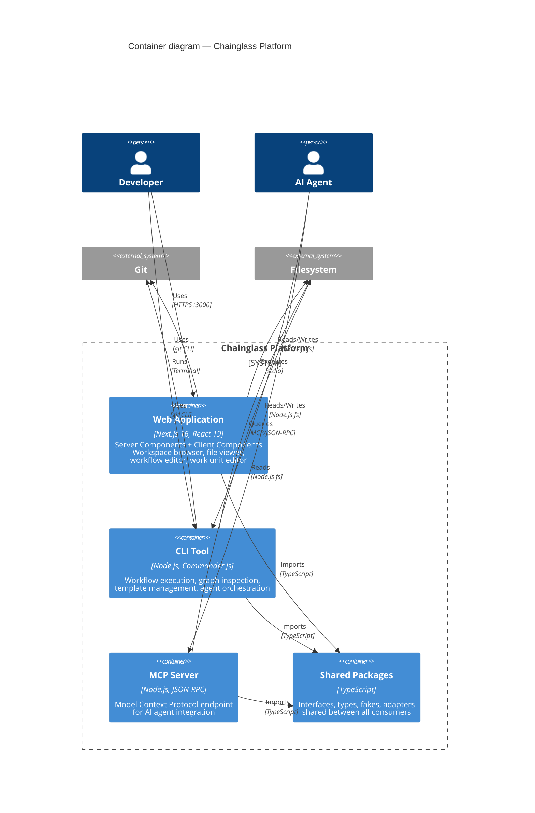

# Level 2: Container Overview

> The deployable units that make up the Chainglass platform and how they relate.

## Containers

| Container | Technology | Source | Zoom In |
|-----------|-----------|--------|---------|
| Web Application | Next.js 16, React 19, Tailwind v4 | `apps/web/` | [web-app.md](web-app.md) |
| CLI Tool | Node.js, Commander.js, esbuild | `apps/cli/` | [cli.md](cli.md) |
| MCP Server | Node.js, JSON-RPC, MCP SDK | `packages/mcp-server/` | — |
| Shared Packages | TypeScript | `packages/shared/` | [shared-packages.md](shared-packages.md) |

## Key Relationships

- **All containers** import from Shared Packages (no circular dependencies)
- **Web + CLI** both access the filesystem and Git
- **MCP Server** is the AI agent's primary integration point (JSON-RPC over stdio)
- **No container imports from another container** — only through Shared Packages

---

## Navigation

- **Zoom Out**: [System Context](../system-context.md)
- **Zoom In**: [Web App](web-app.md) | [CLI](cli.md) | [Shared Packages](shared-packages.md)
- **Hub**: [C4 Overview](../README.md)
