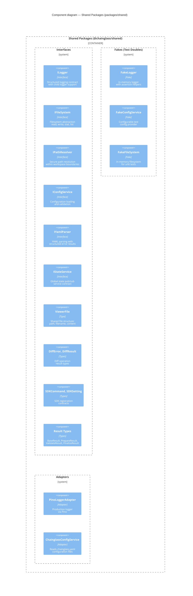

# Level 2 Detail: Shared Packages

> Cross-cutting types, interfaces, fakes, and adapters shared by all Chainglass consumers.

## Package Exports

| Category | Key Exports | Consumers |
|----------|------------|-----------|
| **Interfaces** | ILogger, IFileSystem, IPathResolver, IConfigService, IYamlParser, IStateService | apps/web, apps/cli, packages/mcp-server |
| **Types** | ViewerFile, DiffError, SDKCommand, Result types | apps/web (viewers, SDK), apps/cli (workflow output) |
| **Fakes** | FakeLogger, FakeConfigService, FakeFileSystem | test/ (all test suites) |
| **Adapters** | PinoLoggerAdapter, ChainglassConfigService | apps/web (DI container), apps/cli (bootstrap) |

## Design Principle

> **Shared by Default** (Constitution P7): Code belongs in `@chainglass/shared` unless it is app-specific. Interfaces, fakes, adapters go here. App-specific adapters (rare) go in `apps/web/` or `apps/cli/`.

---

## Navigation

- **Zoom Out**: [Container Overview](overview.md) | [System Context](../system-context.md)
- **Hub**: [C4 Overview](../README.md)
