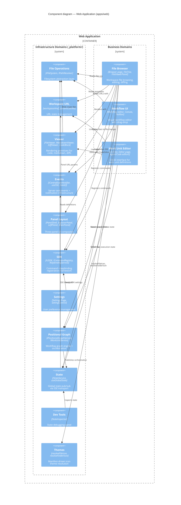

# Level 2 Detail: Web Application

> This diagram zooms INTO the Web Application container to show its domain components.
> For the container-level overview, see [overview.md](overview.md).

## Domain Index

### Infrastructure Domains

| Domain | Key Contracts | Component Diagram |
|--------|--------------|-------------------|
| File Operations | IFileSystem, IPathResolver | [file-ops.md](../components/_platform/file-ops.md) |
| Workspace URL | workspaceHref, paramsCaches | [workspace-url.md](../components/_platform/workspace-url.md) |
| Viewer | FileViewer, MarkdownViewer, DiffViewer | [viewer.md](../components/_platform/viewer.md) |
| Events | ICentralEventNotifier, useSSE, toast() | [events.md](../components/_platform/events.md) |
| Panel Layout | PanelShell, ExplorerPanel, LeftPanel, MainPanel | [panel-layout.md](../components/_platform/panel-layout.md) |
| SDK | IUSDK, ICommandRegistry, IKeybindingService | [sdk.md](../components/_platform/sdk.md) |
| Settings | Settings Page, SettingControl | [settings.md](../components/_platform/settings.md) |
| Positional Graph | IPositionalGraphService, IWorkUnitService | [positional-graph.md](../components/_platform/positional-graph.md) |
| State | IStateService, useGlobalState | [state.md](../components/_platform/state.md) |
| Dev Tools | StateInspector, useStateChangeLog | [dev-tools.md](../components/_platform/dev-tools.md) |
| Themes | resolveFileIcon, resolveFolderIcon | [themes.md](../components/_platform/themes.md) |

### Business Domains

| Domain | Key Contracts | Component Diagram |
|--------|--------------|-------------------|
| File Browser | Browser page, FileTree, FileViewerPanel | [file-browser.md](../components/file-browser.md) |
| Workflow UI | Workflow editor, Canvas, Toolbox | [workflow-ui.md](../components/workflow-ui.md) |
| Work Unit Editor | Unit list, Editor page, Agent/Code editors | [workunit-editor.md](../components/workunit-editor.md) |

---

## Navigation

- **Zoom Out**: [Container Overview](overview.md) | [System Context](../system-context.md)
- **Zoom In**: Select a domain from the tables above to see its L3 component diagram
- **Hub**: [C4 Overview](../README.md)
