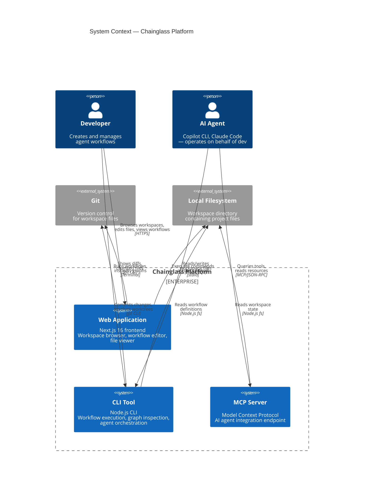

# Level 1: System Context

> The highest-level view of Chainglass — who uses it and what it connects to.

## Key Elements

| Element | Type | Description |
|---------|------|-------------|
| Developer | Person | Human user who creates workflows, browses workspaces, and manages agents |
| AI Agent | Person | External AI tool (Copilot CLI, Claude Code) that executes workflow tasks |
| Web Application | System | Next.js 16 frontend — workspace browser, file viewer, workflow editor |
| CLI Tool | System | Node.js CLI (`cg`) — workflow execution, graph inspection, agent orchestration |
| MCP Server | System | Model Context Protocol server — AI agent integration via JSON-RPC |
| Git | External | Version control for all workspace files and workflow state |
| Local Filesystem | External | Workspace directory containing project files, workflow definitions, and state |

---

## Navigation

- **Zoom In**: [Container Overview](containers/overview.md) | [Web App](containers/web-app.md) | [CLI](containers/cli.md) | [MCP Server](containers/mcp-server.md) | [Shared Packages](containers/shared-packages.md)
- **Hub**: [C4 Overview](README.md)
