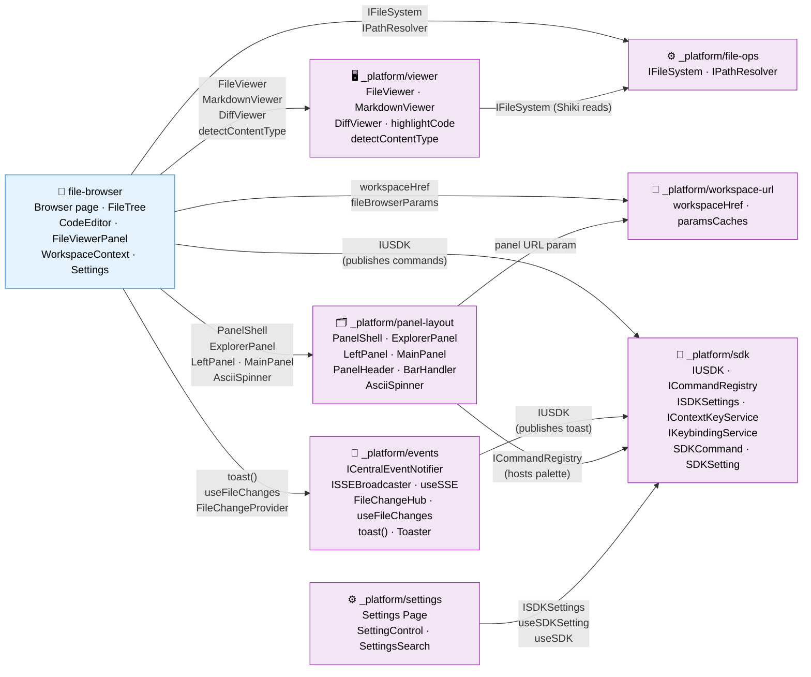

# Domain Map

> Auto-maintained by plan commands. Shows all domains and their contract relationships.
> Domains are first-class components — this diagram is the system architecture at business level.

## Legend

- **Blue**: Business domains (user-facing capabilities)
- **Purple**: Infrastructure domains (cross-cutting technical capabilities)
- **Solid arrows** (→): Contract dependency (A consumes B's contract)
- **Labels on arrows**: Contract name being consumed

## Domain Health Summary

| Domain | Contracts Out | Consumers | Contracts In | Providers | Status |
|--------|--------------|-----------|-------------|-----------|--------|
| _platform/file-ops | IFileSystem, IPathResolver | file-browser, viewer | — | — | ✅ |
| _platform/workspace-url | workspaceHref, paramsCaches | file-browser, panel-layout | — | — | ✅ |
| _platform/viewer | FileViewer, MarkdownViewer, DiffViewer, highlightCode, detectContentType, isBinaryExtension | file-browser | IFileSystem | file-ops | ✅ |
| _platform/events | ICentralEventNotifier, ISSEBroadcaster, useSSE, FileChangeHub, useFileChanges, FileChangeProvider, toast() | file-browser, workgraph-ui*, agent-ui* | — | — | ✅ |
| _platform/panel-layout | PanelShell, ExplorerPanel, LeftPanel, MainPanel, PanelHeader, BarHandler, AsciiSpinner | file-browser, future workspace pages | panel URL param | workspace-url | ✅ |
| file-browser | Browser page, FileTree, FileViewerPanel, WorkspaceContext, EmojiPicker, ColorPicker, Settings | — | IFileSystem, workspaceHref, viewers, toast, events, panels | file-ops, workspace-url, viewer, events, panel-layout | ✅ |
| _platform/sdk | IUSDK, ICommandRegistry, ISDKSettings, IContextKeyService, IKeybindingService, SDKCommand, SDKSetting, FakeUSDK | file-browser, events, panel-layout, settings | — | — | ✅ |
| _platform/settings | Settings Page, sdk.openSettings | — | ISDKSettings, useSDKSetting, useSDK | sdk | ✅ |

*workgraph-ui and agent-ui are not yet formalized as domains but are known consumers
