# Domain Map

> Auto-maintained by plan commands. Shows all domains and their contract relationships.
> Domains are first-class components — this diagram is the system architecture at business level.

```mermaid
flowchart LR
    classDef business fill:#E3F2FD,stroke:#2196F3,color:#000
    classDef infra fill:#F3E5F5,stroke:#9C27B0,color:#000
    classDef deprecated fill:#FFEBEE,stroke:#F44336,color:#000
    classDef new fill:#FFF3E0,stroke:#FF9800,color:#000

    %% Infrastructure domains
    fileOps["⚙️ _platform/file-ops<br/>IFileSystem · IPathResolver"]:::infra
    wsUrl["🔗 _platform/workspace-url<br/>workspaceHref · paramsCaches"]:::infra
    viewer["🖥️ _platform/viewer<br/>FileViewer · MarkdownViewer<br/>DiffViewer · highlightCode<br/>detectContentType"]:::infra
    events["🔔 _platform/events<br/>ICentralEventNotifier<br/>ISSEBroadcaster · useSSE<br/>MultiplexedSSEProvider · useChannelEvents<br/>FileChangeHub · useFileChanges<br/>toast() · Toaster"]:::infra
    panels["🗂️ _platform/panel-layout<br/>PanelShell · ExplorerPanel<br/>LeftPanel · MainPanel<br/>PanelHeader · BarHandler<br/>AsciiSpinner<br/>FlowSpace types"]:::infra
    sdk["🧩 _platform/sdk<br/>IUSDK · ICommandRegistry<br/>ISDKSettings · IContextKeyService<br/>IKeybindingService<br/>SDKCommand · SDKSetting"]:::infra
    settings["⚙️ _platform/settings<br/>Settings Page<br/>SettingControl · SettingsSearch"]:::infra
    posGraph["📊 _platform/positional-graph<br/>IPositionalGraphService<br/>IOrchestrationService<br/>IEventHandlerService<br/>IWorkUnitService<br/>ITemplateService<br/>IInstanceService"]:::infra
    state["💾 _platform/state<br/>IStateService<br/>useGlobalState<br/>useGlobalStateList<br/>GlobalStateProvider<br/>GlobalStateConnector<br/>StateChangeLog<br/>ServerEventRoute"]:::infra
    devTools["🛠️ _platform/dev-tools<br/>StateInspector<br/>useStateInspector<br/>useStateChangeLog"]:::infra
    auth["🔐 _platform/auth<br/>auth() · signIn() · signOut()<br/>requireAuth() · useAuth()<br/>middleware protection<br/>isUserAllowed()<br/>SessionProvider"]:::infra
    themes["🎨 _platform/themes<br/>resolveFileIcon · resolveFolderIcon<br/>FileIcon · FolderIcon<br/>themes.iconTheme setting"]:::infra

    %% Business domains
    fileBrowser["📁 file-browser<br/>Browser page · FileTree<br/>CodeEditor re-export<br/>FileViewerPanel<br/>WorkspaceContext · Settings"]:::business
    workflowUI["🔀 workflow-ui<br/>Workflow editor · Canvas<br/>Toolbox · Properties<br/>Doping system"]:::business
    workunitEditor["✏️ 058-workunit-editor<br/>Unit list page · Editor page<br/>Agent/Code/Input editors<br/>Creation modal · Auto-save"]:::business
    terminal["🖥️ terminal<br/>TerminalView · TerminalOverlay<br/>TmuxSessionManager · copyTmuxBuffer<br/>Sidecar WS/WSS Server"]:::business

    %% NEW business domains (Plan 069)
    workspace["🗂️ workspace<br/>IWorkspaceService<br/>IWorkspaceContextResolver<br/>IGitWorktreeResolver<br/>IGitWorktreeManager<br/>useWorkspaceContext"]:::new

    %% NEW business domains (Plan 059)
    agents["🤖 agents<br/>IAgentManagerService<br/>IAgentAdapter · IAgentInstance<br/>useAgentManager · useAgentInstance<br/>useAgentOverlay · useRecentAgents<br/>AgentChipBar · AgentOverlayPanel<br/>AgentWorkUnitBridge"]:::new
    workUnitState["📋 work-unit-state<br/>IWorkUnitStateService<br/>WorkUnitEntry · WorkUnitEvent<br/>FakeWorkUnitStateService<br/>workUnitStateRoute"]:::new

    %% NEW business domains (Plan 061)
    wfEvents["📡 workflow-events<br/>IWorkflowEvents<br/>WorkflowEventType<br/>WorkflowEventError<br/>FakeWorkflowEventsService"]:::new

    %% NEW business domains (Plan 065)
    activityLog["📋 activity-log<br/>ActivityLogEntry<br/>appendActivityLogEntry<br/>readActivityLog<br/>shouldIgnorePaneTitle<br/>useActivityLogOverlay<br/>GET /api/activity-log"]:::new

    %% NEW infrastructure domains (Plan 067)
    externalEvents["⚙️ _platform/external-events<br/>EventPopperRequest<br/>generateEventId<br/>readServerInfo<br/>localhostGuard<br/>detectTmuxContext"]:::new

    %% NEW business domains (Plan 067)
    questionPopper["❓ question-popper<br/>IQuestionPopperService<br/>QuestionPayloadSchema<br/>AnswerPayloadSchema<br/>AlertPayloadSchema<br/>FakeQuestionPopperService"]:::new

    %% Contract dependencies (consumer → provider)
    fileBrowser -->|"IFileSystem<br/>IPathResolver"| fileOps
    fileBrowser -->|"workspaceHref<br/>fileBrowserParams"| wsUrl
    fileBrowser -->|"FileViewer<br/>MarkdownViewer<br/>DiffViewer<br/>detectContentType"| viewer
    fileBrowser -->|"toast()<br/>useFileChanges<br/>FileChangeProvider"| events
    fileBrowser -->|"PanelShell<br/>ExplorerPanel<br/>LeftPanel · MainPanel<br/>AsciiSpinner"| panels
    fileBrowser -->|"IWorkspaceService<br/>useWorkspaceContext<br/>WorktreeVisualPreferences"| workspace
    panels -->|"panel URL param"| wsUrl
    viewer -->|"IFileSystem (Shiki reads)"| fileOps

    %% Workspace domain dependencies
    workspace -->|"IFileSystem<br/>IPathResolver"| fileOps
    workspace -->|"workspaceHref<br/>workspaceParams"| wsUrl

    %% SDK consumed by publishing domains
    fileBrowser -->|"IUSDK<br/>(publishes commands)"| sdk
    events -->|"IUSDK<br/>(publishes toast)"| sdk
    panels -->|"ICommandRegistry<br/>(hosts palette)"| sdk
    settings -->|"ISDKSettings<br/>useSDKSetting<br/>useSDK"| sdk

    %% Positional graph dependencies
    posGraph -->|"IFileSystem<br/>IPathResolver"| fileOps

    %% Workflow UI dependencies
    workflowUI -->|"IPositionalGraphService<br/>ITemplateService<br/>IWorkUnitService"| posGraph
    workflowUI -->|"IFileSystem<br/>IPathResolver"| fileOps
    workflowUI -->|"useChannelEvents<br/>multiplexed SSE"| events
    workflowUI -->|"workspaceHref"| wsUrl
    workflowUI -->|"IUSDK"| sdk
    workflowUI -->|"IWorkspaceService<br/>WorkspaceContext"| workspace

    %% State system dependencies
    state -->|"useChannelEvents<br/>multiplexed SSE transport"| events
    posGraph -->|"IStateService<br/>(publish orchestration)"| state
    workflowUI -->|"useGlobalState<br/>(subscribe execution)"| state
    panels -->|"useGlobalState<br/>(subscribe alerts)"| state
    fileBrowser -->|"useGlobalState<br/>(subscribe worktree)"| state
    fileBrowser -->|"resolveFileIcon<br/>resolveFolderIcon<br/>FileIcon · FolderIcon"| themes
    panels -->|"FileIcon"| themes

    %% Themes domain dependencies
    themes -->|"IUSDK<br/>(publishes iconTheme)"| sdk

    %% Dev tools dependencies
    devTools -->|"IStateService<br/>StateChangeLog<br/>useStateSystem"| state

    %% NEW: Agents domain dependencies
    agents -->|"ISSEBroadcaster<br/>useSSE · toast()"| events
    agents -->|"CopilotClient"| sdk
    agents -->|"IStateService<br/>useGlobalState"| state
    agents -->|"IWorkUnitStateService<br/>(publish status)"| workUnitState
    agents -->|"DashboardShell<br/>(top bar slot)"| panels
    agents -->|"IWorkspaceService<br/>WorkspaceContext"| workspace
    posGraph -->|"IAgentManagerService<br/>IAgentInstance<br/>(orchestration)"| agents

    %% NEW: Work Unit State dependencies
    workUnitState -->|"ICentralEventNotifier<br/>(emit SSE events)"| events
    workUnitState -->|"ServerEventRouteDescriptor<br/>(state path bridge)"| state

    %% NEW: Workflow UI → agents (overlay integration)
    workflowUI -->|"useAgentOverlay<br/>(onAgentClick)"| agents

    %% NEW: Workflow Events dependencies (Plan 061)
    wfEvents -->|"IPositionalGraphService<br/>raiseNodeEvent"| posGraph
    wfEvents -->|"ICentralEventNotifier<br/>SSE broadcast<br/>(Phase 3)"| events
    agents -->|"IWorkflowEvents<br/>onQuestionAsked<br/>onQuestionAnswered"| wfEvents
    workflowUI -->|"IWorkflowEvents<br/>answerQuestion"| wfEvents
    posGraph -->|"IWorkflowEvents<br/>CLI ask/answer/get-answer"| wfEvents

    %% Work Unit Editor dependencies
    workunitEditor -->|"IWorkUnitService<br/>(CRUD)"| posGraph
    workunitEditor -->|"CodeEditor"| viewer
    workunitEditor -->|"workspaceHref"| wsUrl
    workunitEditor -->|"WorkspaceInfo<br/>WorkspaceContext"| workspace

    %% Terminal dependencies
    terminal -->|"PanelShell<br/>LeftPanel · MainPanel"| panels
    terminal -->|"toast()"| events
    terminal -->|"IUSDK<br/>ICommandRegistry"| sdk
    terminal -->|"workspaceHref"| wsUrl
    terminal -->|"IWorkspaceService<br/>useWorkspaceContext"| workspace

    %% Activity Log dependencies (consumer → provider)
    activityLog -->|"PanelShell<br/>overlay anchor"| panels
    terminal -->|"appendActivityLogEntry()<br/>shouldIgnorePaneTitle()"| activityLog

    %% External Events dependencies (Plan 067)
    externalEvents -->|"WorkspaceDomain.EventPopper"| events

    %% Question Popper dependencies (Plan 067)
    questionPopper -->|"EventPopperRequest<br/>generateEventId()"| externalEvents
    questionPopper -->|"ICentralEventNotifier<br/>WorkspaceDomain.EventPopper"| events

    %% Auth dependencies (consumer → provider: business domains consume auth protection)
    events -->|"auth()<br/>session check"| auth
    fileBrowser -->|"middleware protection"| auth
    workflowUI -->|"middleware protection"| auth
    workunitEditor -->|"middleware protection"| auth
    workspace -->|"requireAuth()<br/>middleware protection"| auth
```

## Legend

- **Blue**: Business domains (user-facing capabilities)
- **Purple**: Infrastructure domains (cross-cutting technical capabilities)
- **Orange**: Newly added domains (change to blue or purple after follow-on implementation/documentation passes)
- **Red**: Deprecated domains (pending removal)
- **Solid arrows** (→): Contract dependency (A consumes B's contract)
- **Labels on arrows**: Contract name being consumed

## Domain Health Summary

| Domain | Contracts Out | Consumers | Contracts In | Providers | Status |
|--------|--------------|-----------|-------------|-----------|--------|
| _platform/file-ops | IFileSystem, IPathResolver | file-browser, viewer, workflow-ui, workspace | — | — | ✅ |
| _platform/workspace-url | workspaceHref, paramsCaches | file-browser, panel-layout, workflow-ui, workunit-editor, terminal, workspace | — | — | ✅ |
| _platform/viewer | FileViewer, MarkdownViewer, DiffViewer, highlightCode, detectContentType, isBinaryExtension | file-browser | IFileSystem | file-ops | ✅ |
| _platform/events | ICentralEventNotifier, ISSEBroadcaster, useSSE, MultiplexedSSEProvider, useChannelEvents, useChannelCallback, FileChangeHub, useFileChanges, FileChangeProvider, toast() | file-browser, workflow-ui, agents, state, question-popper | — | — | ✅ |
| _platform/panel-layout | PanelShell, ExplorerPanel, LeftPanel, MainPanel, PanelHeader, BarHandler, AsciiSpinner, FlowSpaceSearchResult, FlowSpaceAvailability, FlowSpaceSearchMode | file-browser, future workspace pages | panel URL param | workspace-url | ✅ |
| file-browser | Browser page, FileTree, FileViewerPanel, WorkspaceContext, EmojiPicker, ColorPicker, Settings | — | IFileSystem, workspaceHref, viewers, toast, events, panels, IWorkspaceService, useWorkspaceContext | file-ops, workspace-url, viewer, events, panel-layout, workspace | ✅ |
| workspace | IWorkspaceService, IWorkspaceContextResolver, IGitWorktreeResolver, IGitWorktreeManager, useWorkspaceContext | file-browser, workflow-ui, workunit-editor, terminal, agents | IFileSystem, IPathResolver, workspaceHref, workspaceParams, requireAuth(), middleware protection | file-ops, workspace-url, auth | 🟠 New |
| _platform/sdk | IUSDK, ICommandRegistry, ISDKSettings, IContextKeyService, IKeybindingService, SDKCommand, SDKSetting, FakeUSDK | file-browser, workflow-ui, events, panel-layout, settings | — | — | ✅ |
| _platform/settings | Settings Page, sdk.openSettings | — | ISDKSettings, useSDKSetting, useSDK | sdk | ✅ |
| _platform/positional-graph | IPositionalGraphService, IOrchestrationService, IEventHandlerService, IWorkUnitService, ITemplateService, IInstanceService | CLI (`cg wf`, `cg template`), workflow-ui, dev/test-graphs | IFileSystem, IPathResolver, IStateService | file-ops, state | ✅ |
| _platform/workgraph | IWorkGraphService, IWorkNodeService, IWorkUnitService | CLI (`cg wg`, `cg unit`) | IFileSystem, IPathResolver | file-ops | ❌ Removed from web (Plan 050 Phase 7) |
| _platform/state | IStateService, useGlobalState, useGlobalStateList, GlobalStateProvider, GlobalStateConnector, StateChangeLog, ServerEventRoute, FakeGlobalStateSystem | positional-graph (publish), workflow-ui, panel-layout, file-browser, agents, work-unit-state (subscribe), dev-tools | useChannelEvents | events | ✅ |
| workflow-ui | _(none — leaf consumer)_ | — | IPositionalGraphService, ITemplateService, IWorkUnitService, IFileSystem, IPathResolver, useChannelEvents, workspaceHref, IUSDK, useGlobalState, useAgentOverlay (future), IWorkspaceService, WorkspaceContext | positional-graph, file-ops, events, workspace-url, sdk, state, agents (future), workspace | ✅ |
| _platform/dev-tools | StateInspector, useStateChangeLog, useStateInspector | — | IStateService, StateChangeLog, useStateSystem | state | ✅ |
| 058-workunit-editor | _(none — leaf consumer)_ | — | IWorkUnitService, CodeEditor, workspaceHref, WorkspaceInfo, WorkspaceContext | positional-graph, viewer, workspace-url, workspace | ✅ |
| agents | IAgentManagerService, IAgentAdapter, IAgentInstance, IAgentNotifierService, useAgentManager, useAgentInstance, useAgentOverlay, useRecentAgents, useWorktreeActivity, AgentChipBar, AgentOverlayPanel, AgentWorkUnitBridge | positional-graph (orchestration), workflow-ui (overlay), panel-layout (badge data via composition) | ISSEBroadcaster, useSSE, toast(), CopilotClient, IStateService, IWorkUnitStateService, IWorkflowEvents, DashboardShell, IWorkspaceService, WorkspaceContext | events, sdk, state, work-unit-state, workflow-events, panel-layout, workspace | 🟠 New |
| work-unit-state | IWorkUnitStateService, WorkUnitEntry, WorkUnitEvent, FakeWorkUnitStateService, workUnitStateRoute | agents (AgentWorkUnitBridge), workflow-ui (future) | ICentralEventNotifier, ServerEventRouteDescriptor | events, state | 🟠 New |
| workflow-events | IWorkflowEvents, WorkflowEventType, WorkflowEventError, FakeWorkflowEventsService | agents (observer hooks), workflow-ui (answerQuestion), CLI (ask/answer/get-answer) | IPositionalGraphService, ICentralEventNotifier | positional-graph, events | 🟠 New |
| terminal | _(none — leaf consumer)_ | — | PanelShell, LeftPanel, MainPanel, toast(), IUSDK, ICommandRegistry, workspaceHref, IWorkspaceService, useWorkspaceContext | panel-layout, events, sdk, workspace-url, workspace | ✅ |
| _platform/auth | auth(), signIn(), signOut(), requireAuth(), useAuth(), middleware protection, isUserAllowed(), SessionProvider | file-browser, workflow-ui, workunit-editor (via middleware), workspace (via middleware and server actions) | — | — | ✅ |
| _platform/external-events | EventPopperRequest, EventPopperResponse, generateEventId, readServerInfo, writeServerInfo, localhostGuard, detectTmuxContext, WorkspaceDomain.EventPopper | question-popper | WorkspaceDomain | events | 🟠 New |
| question-popper | IQuestionPopperService, QuestionPayloadSchema, AnswerPayloadSchema, AlertPayloadSchema, FakeQuestionPopperService, QuestionIn, QuestionOut, AlertIn | (Phase 3: API routes) | EventPopperRequest, generateEventId, ICentralEventNotifier | external-events, events | 🟠 New |
