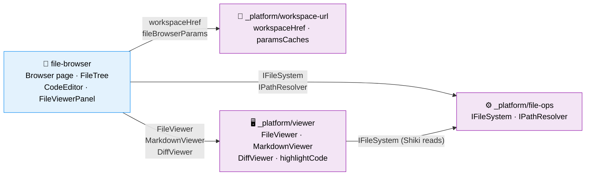

# Domain Map

> Auto-maintained by plan commands. Shows all domains and their contract relationships.
> Domains are first-class components — this diagram is the system architecture at business level.

## Legend

- **Blue**: Business domains (user-facing capabilities)
- **Purple**: Infrastructure domains (cross-cutting technical capabilities)
- **Solid arrows** (→): Contract dependency (A consumes B's contract)
- **Labels on arrows**: Contract name being consumed
