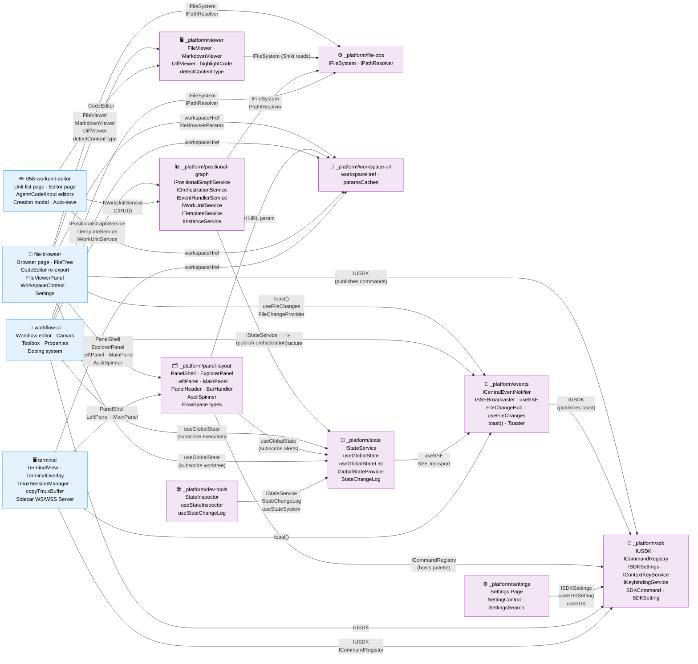

# Domain Map

> Auto-maintained by plan commands. Shows all domains and their contract relationships.
> Domains are first-class components — this diagram is the system architecture at business level.

## Legend

- **Blue**: Business domains (user-facing capabilities)
- **Purple**: Infrastructure domains (cross-cutting technical capabilities)
- **Red**: Deprecated domains (pending removal)
- **Solid arrows** (→): Contract dependency (A consumes B's contract)
- **Labels on arrows**: Contract name being consumed

## Domain Health Summary

| Domain | Contracts Out | Consumers | Contracts In | Providers | Status |
|--------|--------------|-----------|-------------|-----------|--------|
| _platform/file-ops | IFileSystem, IPathResolver | file-browser, viewer, workflow-ui | — | — | ✅ |
| _platform/workspace-url | workspaceHref, paramsCaches | file-browser, panel-layout | — | — | ✅ |
| _platform/viewer | FileViewer, MarkdownViewer, DiffViewer, highlightCode, detectContentType, isBinaryExtension | file-browser | IFileSystem | file-ops | ✅ |
| _platform/events | ICentralEventNotifier, ISSEBroadcaster, useSSE, FileChangeHub, useFileChanges, FileChangeProvider, toast() | file-browser, workflow-ui, agent-ui*, state | — | — | ✅ |
| _platform/panel-layout | PanelShell, ExplorerPanel, LeftPanel, MainPanel, PanelHeader, BarHandler, AsciiSpinner, FlowSpaceSearchResult, FlowSpaceAvailability, FlowSpaceSearchMode | file-browser, future workspace pages | panel URL param | workspace-url | ✅ |
| file-browser | Browser page, FileTree, FileViewerPanel, WorkspaceContext, EmojiPicker, ColorPicker, Settings | — | IFileSystem, workspaceHref, viewers, toast, events, panels | file-ops, workspace-url, viewer, events, panel-layout | ✅ |
| _platform/sdk | IUSDK, ICommandRegistry, ISDKSettings, IContextKeyService, IKeybindingService, SDKCommand, SDKSetting, FakeUSDK | file-browser, workflow-ui, events, panel-layout, settings | — | — | ✅ |
| _platform/settings | Settings Page, sdk.openSettings | — | ISDKSettings, useSDKSetting, useSDK | sdk | ✅ |
| _platform/positional-graph | IPositionalGraphService, IOrchestrationService, IEventHandlerService, IWorkUnitService, ITemplateService, IInstanceService | CLI (`cg wf`, `cg template`), workflow-ui, dev/test-graphs | IFileSystem, IPathResolver, IStateService | file-ops, state | ✅ |
| _platform/workgraph | IWorkGraphService, IWorkNodeService, IWorkUnitService | CLI (`cg wg`, `cg unit`) | IFileSystem, IPathResolver | file-ops | ❌ Removed from web (Plan 050 Phase 7) |
| _platform/state | IStateService, useGlobalState, useGlobalStateList, GlobalStateProvider, StateChangeLog, FakeGlobalStateSystem | positional-graph (publish), workflow-ui, panel-layout, file-browser (subscribe), dev-tools | useSSE | events | ✅ |
| workflow-ui | _(none — leaf consumer)_ | — | IPositionalGraphService, ITemplateService, IWorkUnitService, IFileSystem, IPathResolver, useSSE, workspaceHref, IUSDK, useGlobalState | positional-graph, file-ops, events, workspace-url, sdk, state | ✅ |
| _platform/dev-tools | StateInspector, useStateChangeLog, useStateInspector | — | IStateService, StateChangeLog, useStateSystem | state | ✅ |
| 058-workunit-editor | _(none — leaf consumer)_ | — | IWorkUnitService, CodeEditor, workspaceHref | positional-graph, viewer, workspace-url | ✅ |
| terminal | _(none — leaf consumer)_ | — | PanelShell, LeftPanel, MainPanel, toast(), IUSDK, ICommandRegistry, workspaceHref | panel-layout, events, sdk, workspace-url | ✅ |
