# Central Domain Event Notification System

This guide describes the architecture of the central domain event notification system (Plan 027) and how to extend it with new domain adapters.

## Overview

The system provides automatic browser notifications when workspace data changes on the filesystem. It replaces ad-hoc notification patterns (like `broadcastGraphUpdated()`) with a unified pipeline:

```
Filesystem Change --> CentralWatcherService --> WatcherAdapter --> DomainEventAdapter --> CentralEventNotifierService --> SSE --> Browser Toast
```

The key design principle is **notification-fetch** (ADR-0007): SSE messages carry only minimal identifiers (e.g., `graphSlug`), and clients fetch full state via REST. This prevents data staleness and reduces bandwidth.

## Component Flow

```mermaid
flowchart LR
    FS["Filesystem<br/>(state.json)"]
    CW["CentralWatcherService<br/>(chokidar)"]
    WA["WorkGraphWatcherAdapter"]
    DA["WorkgraphDomainEventAdapter"]
    CN["CentralEventNotifierService"]
    SSE["SSEManager.broadcast()"]
    ES["EventSource<br/>(browser)"]
    Toast["Toast Notification"]

    FS --> CW --> WA --> DA --> CN --> SSE --> ES --> Toast

    style FS fill:#E3F2FD
    style Toast fill:#E8F5E9
```



### Components

| Component | Location | Role |
|-----------|----------|------|
| `ICentralEventNotifier` | `packages/shared` | Interface: `emit(domain, eventType, data)` |
| `CentralEventNotifierService` | `apps/web` | Implementation: routes events to SSE channels by domain |
| `DomainEventAdapter<T>` | `packages/shared` | Abstract base: transforms domain events into `emit()` calls |
| `WorkgraphDomainEventAdapter` | `apps/web` | Concrete adapter for workgraph filesystem changes |
| `WorkspaceDomain` | `packages/shared` | Const defining domain names (also SSE channel names) |
| `startCentralNotificationSystem()` | `apps/web` | Bootstrap: wires DI, registers adapters, starts watcher |

## SSE Protocol

Events use **unnamed SSE messages** (no `event:` field). The type is carried in the JSON data payload:

```
data: {"domain":"workgraphs","eventType":"graph-updated","data":{"graphSlug":"demo-graph"}}
```

Browser clients subscribe via `EventSource.onmessage`:

```typescript
const es = new EventSource('/api/events/workgraphs');
es.onmessage = (event) => {
  const { domain, eventType, data } = JSON.parse(event.data);
  // data.graphSlug -> fetch latest state via REST
};
```

The domain value **is** the SSE channel name: `WorkspaceDomain.Workgraphs = 'workgraphs'` routes to `/api/events/workgraphs`.

## Bootstrap and DI

The system starts once at Next.js server startup via `instrumentation.ts`:

```typescript
// instrumentation.ts (Next.js register hook)
export async function register() {
  const { startCentralNotificationSystem } = await import(
    '@/features/027-central-notify-events'
  );
  await startCentralNotificationSystem();
}
```

`startCentralNotificationSystem()` resolves services from DI, creates adapters, and starts the watcher. It uses a `globalThis` flag for idempotency across HMR reloads.

DI tokens:
- `WORKSPACE_DI_TOKENS.CENTRAL_EVENT_NOTIFIER` — resolves `CentralEventNotifierService` (production) or `FakeCentralEventNotifier` (test)
- `WORKSPACE_DI_TOKENS.CENTRAL_WATCHER_SERVICE` — resolves the filesystem watcher

The notifier is registered with `useValue` (not `useFactory`) to preserve singleton identity across DI resolutions (ADR-0004).

## Adding a New Domain Adapter

To add notifications for a new workspace domain (e.g., templates, samples):

### Step 1: Add the domain constant

In `packages/shared/src/features/027-central-notify-events/workspace-domain.ts`:

```typescript
export const WorkspaceDomain = {
  Workgraphs: 'workgraphs',
  Agents: 'agents',
  Templates: 'templates',  // <-- new
} as const;
```

### Step 2: Create the domain event adapter

In `apps/web/src/features/027-central-notify-events/`:

```typescript
import { DomainEventAdapter } from '@chainglass/shared/features/027-central-notify-events/domain-event-adapter';
import { WorkspaceDomain } from '@chainglass/shared/features/027-central-notify-events';
import type { ICentralEventNotifier } from '@chainglass/shared/features/027-central-notify-events';

interface TemplateChangedEvent {
  templateSlug: string;
  filePath: string;
  timestamp: Date;
}

export class TemplateDomainEventAdapter extends DomainEventAdapter<TemplateChangedEvent> {
  constructor(notifier: ICentralEventNotifier) {
    super(notifier, WorkspaceDomain.Templates);
  }

  handleEvent(event: TemplateChangedEvent): void {
    this.notifier.emit(this.domain, 'template-updated', {
      templateSlug: event.templateSlug,
    });
  }
}
```

### Step 3: Register in bootstrap

In `startCentralNotificationSystem()`, add the adapter wiring alongside the workgraph adapter:

```typescript
const templateAdapter = new TemplateDomainEventAdapter(notifier);
// Subscribe to watcher events for the template domain
templateWatcherAdapter.onTemplateChanged((event) => templateAdapter.handleEvent(event));
```

### Step 4: Add SSE route (if needed)

If the domain needs its own SSE endpoint, add a route handler at `app/api/events/templates/route.ts` following the pattern in `app/api/events/workgraphs/route.ts`.

### Step 5: Add client subscription

Use the existing `useSSE` hook pattern to subscribe to the new channel.

No changes are needed to `CentralEventNotifierService`, `SSEManager`, or the SSE infrastructure — the domain adapter pattern handles routing automatically.

## Deprecation Notes

The following legacy notification entry points are deprecated:

- **`broadcastGraphUpdated()`** in `features/022-workgraph-ui/sse-broadcast.ts` — replaced by `WorkgraphDomainEventAdapter` which provides automatic filesystem-driven notifications
- **`AgentNotifierService`** in `features/019-agent-manager-refactor/agent-notifier.service.ts` — future migration to a domain event adapter is planned

These functions still work and are not removed. The `@deprecated` JSDoc tags direct developers to this guide.

## Key ADRs

- **ADR-0004**: DI Architecture — `useValue` singleton for stateful services
- **ADR-0007**: SSE Single Channel Routing — notification-fetch pattern, minimal SSE payloads
- **ADR-0008**: Workspace Storage — data path structure for workgraph detection
