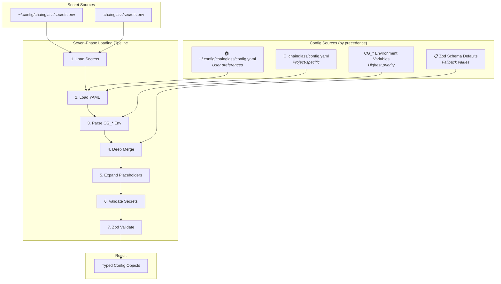

# Configuration System Overview

This guide explains the Chainglass configuration system architecture and when to use it.

## What is the Configuration System?

The configuration system provides type-safe, multi-source configuration for Chainglass applications. It:

- Loads configuration from YAML files and environment variables
- Validates configuration using Zod schemas
- Provides typed access to configuration values
- Supports secrets via placeholders (`${API_KEY}`)
- Integrates with the dependency injection system

## Architecture



## Key Concepts

### 1. ConfigType<T>

Each configuration section is defined by a `ConfigType<T>` that pairs a path with a Zod parser:

```typescript
interface ConfigType<T> {
  readonly configPath: string;  // e.g., 'sample'
  parse(raw: unknown): T;       // Zod validation
}
```

### 2. IConfigService Interface

The service provides type-safe access to configuration:

```typescript
interface IConfigService {
  get<T>(type: ConfigType<T>): T | undefined;    // Returns undefined if missing
  require<T>(type: ConfigType<T>): T;            // Throws if missing
  set<T>(type: ConfigType<T>, config: T): void;  // Manual registration
  isLoaded(): boolean;                           // Load status check
}
```

### 3. Precedence Rules

Configuration sources override each other in this order (highest priority last):

| Priority | Source | Example |
|----------|--------|---------|
| 1 | Zod schema defaults | `z.number().default(30)` |
| 2 | User config file | `~/.config/chainglass/config.yaml` |
| 3 | Project config file | `.chainglass/config.yaml` |
| 4 | Environment variables | `CG_SAMPLE__TIMEOUT=60` |

**Rule**: Later sources override earlier sources. Environment variables always win.

### 4. Secret Management

Secrets use placeholder syntax in YAML files:

```yaml
# config.yaml
sample:
  api_key: ${MY_API_KEY}  # Expanded from secrets.env or environment
```

Secrets are loaded from:
1. `~/.config/chainglass/secrets.env` (user secrets)
2. `.chainglass/secrets.env` (project secrets)

Hardcoded secrets (e.g., `sk-abc123...`) are detected and rejected.

## When to Use Configuration

### Use Config For:

- **Application settings**: Timeouts, feature flags, retry counts
- **External service URLs**: API endpoints, database hosts
- **User preferences**: Default behaviors, output formats
- **Secrets via placeholders**: API keys, tokens (never hardcoded)

### Don't Use Config For:

- **Command-line arguments**: Use CLI flags instead
- **Request-specific data**: Pass as function parameters
- **Transient state**: Use in-memory storage
- **Build-time constants**: Use TypeScript `const`

## Startup Sequence

Configuration loads before the DI container is created:

```typescript
// 1. Create config service
const config = new ChainglassConfigService({
  userConfigDir: getUserConfigDir(),
  projectConfigDir: getProjectConfigDir(),
});

// 2. Load configuration (synchronous, throws on error)
config.load();

// 3. Create DI container with pre-loaded config
const container = createProductionContainer(config);

// 4. Resolve services (config is now available)
const service = container.resolve(DI_TOKENS.MY_SERVICE);
```

## File Locations

| Platform | User Config Directory |
|----------|----------------------|
| Linux | `~/.config/chainglass/` |
| macOS | `~/.config/chainglass/` |
| Windows | `%APPDATA%/chainglass/` |

Project config is discovered by walking up from CWD looking for `.chainglass/` directory.

## Next Steps

- [Usage Guide](./2-usage.md) - Step-by-step guide for common tasks
- [Testing Guide](./3-testing.md) - Testing patterns with FakeConfigService
- [ADR-0003](../../adr/adr-0003-configuration-system.md) - Architecture decision record
