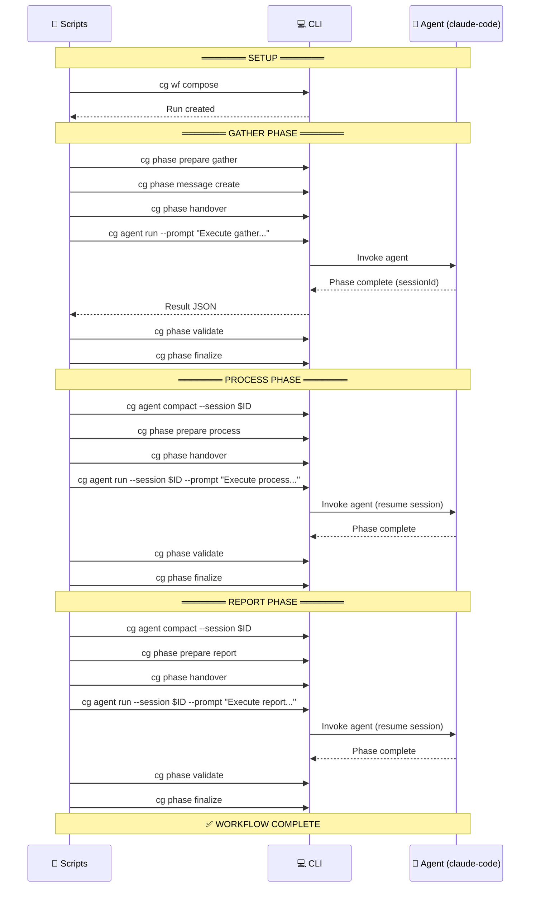

# Manual Workflow Test Harness

Test harness for validating the workflow orchestration system with **programmatic agent invocation** via `cg agent` CLI.

> **Phase 6 Update**: This harness now uses `cg agent run` and `cg agent compact` to invoke agents programmatically, replacing the previous human-in-the-loop orchestration.

---

## Quick Start

```bash
cd docs/how/dev/manual-wf-run

# Reset and start fresh
./01-clean-slate.sh
./02-compose-run.sh

# Run all phases (each phase is compacted before the next)
./03-run-gather.sh
./04-run-process.sh
./05-run-report.sh

# Validate results
./06-validate-entity.sh
./07-validate-runs.sh

# Check state at any time
./check-state.sh
```

---

## Prerequisites

```bash
# Build CLI
pnpm build

# Ensure jq is installed (for JSON parsing)
which jq || echo "Install jq: sudo apt install jq"
```

---

## Scripts

| Script | Purpose |
|--------|---------|
| `01-clean-slate.sh` | Reset test environment (remove runs, clear state) |
| `02-compose-run.sh` | Create a fresh run from hello-workflow template |
| `03-run-gather.sh` | Run gather phase with agent |
| `04-run-process.sh` | Compact + run process phase with agent |
| `05-run-report.sh` | Compact + run report phase with agent |
| `06-validate-entity.sh` | Validate entity JSON format |
| `07-validate-runs.sh` | Validate `cg runs list/get` commands |
| `check-state.sh` | Show current state of all phases |

---

## How It Works

```
┌────────────────────────────────────────────────────────────────────┐
│ Scripts: Orchestrate phases, invoke agents via CLI                 │
│ Agent: Executes phase work using ONLY phase prompts (wf.md, etc.) │
└────────────────────────────────────────────────────────────────────┘
```

### Command Flow



---

## Agent CLI Commands

### `cg agent run`

Invokes an agent with a prompt:

```bash
# New session
cg agent run \
  --type claude-code \
  --prompt "Execute the gather phase..." \
  --cwd /path/to/phases/gather

# Resume existing session
cg agent run \
  --type claude-code \
  --session <session-id> \
  --prompt "Execute the process phase..." \
  --cwd /path/to/phases/process
```

**Output (JSON):**
```json
{
  "output": "Agent response...",
  "sessionId": "15523ff5-a900-4dd9-ab49-73cb1e04342c",
  "status": "completed",
  "exitCode": 0,
  "tokens": { "used": 30455, "total": 30455, "limit": 200000 }
}
```

### `cg agent compact`

Reduces session context between phases:

```bash
cg agent compact \
  --type claude-code \
  --session <session-id>
```

---

## Session Flow Pattern

```
Phase 1 (gather)
  └── cg agent run → captures sessionId
        ↓
Compact
  └── cg agent compact --session $SESSION_ID
        ↓
Phase 2 (process)
  └── cg agent run --session $SESSION_ID
        ↓
Compact
  └── cg agent compact --session $SESSION_ID
        ↓
Phase 3 (report)
  └── cg agent run --session $SESSION_ID
```

---

## State Files

- `.current-run` - Path to current run directory
- `.current-session` - Session ID for agent continuity

---

## Validation Tests

### Entity JSON Validation (`06-validate-entity.sh`)

Validates:
- Workflow entity JSON from `cg runs get`
- Phase entity JSON from completed phases

### Runs Commands Validation (`07-validate-runs.sh`)

Validates:
- `cg runs list` (table and JSON format)
- `cg runs get <run-id> --workflow <slug>` (table and JSON format)

---

## Troubleshooting

### Agent fails to complete phase

Check the agent output and phase state:
```bash
./check-state.sh
cat /path/to/run/phases/<phase>/run/wf-data/wf-phase.json
```

### Validation fails

Check outputs directory:
```bash
ls -la /path/to/run/phases/<phase>/run/outputs/
```

### Session issues

Clear session and restart:
```bash
rm .current-session
./01-clean-slate.sh
```

---

## Run Folders

Runs are created in: `dev/examples/wf/runs/`

Each compose creates a new folder: `run-YYYY-MM-DD-NNN`

These are gitignored, so you can create as many test runs as needed.
