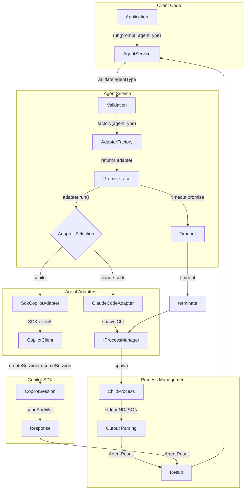

# Agent Control Service Overview

The Agent Control Service provides a unified interface for programmatically controlling AI coding agents (Claude Code, GitHub Copilot) with session continuity, token tracking, and graceful termination.

## What is the Agent Control Service?

The Agent Control Service enables:

- Running prompts through AI coding agents
- Resuming sessions across service restarts
- Tracking token usage and context limits
- Gracefully terminating long-running agents
- Reducing context via `/compact` command

## Architecture



## Key Concepts

### 1. IAgentAdapter Interface

The core interface for all agent adapters:

```typescript
interface IAgentAdapter {
  // Execute a prompt, return structured result
  run(options: AgentRunOptions): Promise<AgentResult>;

  // Send /compact to reduce context
  compact(sessionId: string): Promise<AgentResult>;

  // Terminate a running session
  terminate(sessionId: string): Promise<AgentResult>;
}
```

### 2. AgentResult Type

Every operation returns a structured result:

```typescript
interface AgentResult {
  output: string;              // Agent output text
  sessionId: string;           // For session resumption
  status: AgentStatus;         // 'completed' | 'failed' | 'killed'
  exitCode: number;            // 0 for success
  stderr?: string;             // Error output if present
  tokens: TokenMetrics | null; // Token usage (null for Copilot)
}
```

### 3. AgentStatus Values

| Status | Meaning | Exit Code |
|--------|---------|-----------|
| `completed` | Agent finished successfully | 0 |
| `failed` | Agent exited with error | > 0 |
| `killed` | Agent was terminated | -1 |

### 4. TokenMetrics

Token tracking for context management:

```typescript
interface TokenMetrics {
  used: number;   // Tokens in current turn
  total: number;  // Cumulative session tokens
  limit: number;  // Context window limit
}
```

**Note**: Copilot does not report token usage; `tokens` will be `null`.

### 5. AgentService Orchestration

The `AgentService` wraps adapters with:

- **Timeout enforcement**: Configurable via `AgentConfigType` (default 10 minutes)
- **agentType validation**: Only `'claude-code'` and `'copilot'` allowed
- **Factory pattern**: Lazy adapter creation per request

```typescript
interface AgentServiceRunOptions {
  prompt: string;           // What to execute
  agentType: string;        // 'claude-code' | 'copilot'
  sessionId?: string;       // For resumption
  cwd?: string;             // Working directory
}
```

## Adapter Implementations

### ClaudeCodeAdapter

- **I/O Pattern**: Parses stdout (stream-json / NDJSON format)
- **Session ID**: Extracted from JSON output
- **Token Metrics**: Extracted from `usage` field
- **Flags**: `--output-format=stream-json`, `--dangerously-skip-permissions`

### CopilotAdapter (SDK-Based)

- **I/O Pattern**: Event-driven via `@github/copilot-sdk`
- **Session ID**: Available immediately from SDK session object
- **Token Metrics**: Always `null` (SDK limitation)
- **Session Management**: `createSession()`, `resumeSession()`, `sendAndWait()`

### Process Management

ClaudeCodeAdapter uses `IProcessManager` for process lifecycle:

- **Signal Escalation**: SIGINT (2s) → SIGTERM (2s) → SIGKILL
- **Platform Support**: Unix (`UnixProcessManager`) and Windows (`WindowsProcessManager`)
- **Zombie Prevention**: Processes cleaned up on termination

**Note**: CopilotAdapter (now `SdkCopilotAdapter`) does not use `IProcessManager` directly - it delegates to the Copilot SDK which manages its own CLI process internally.

## DI Integration

The service integrates with TSyringe dependency injection:

```typescript
import { CopilotClient } from '@github/copilot-sdk';

// Production container setup
container.register(DI_TOKENS.AGENT_SERVICE, {
  useFactory: (c) => {
    const processManager = c.resolve<IProcessManager>(DI_TOKENS.PROCESS_MANAGER);
    const logger = c.resolve<ILogger>(DI_TOKENS.LOGGER);
    
    const adapterFactory: AdapterFactory = (agentType) => {
      if (agentType === 'claude-code') {
        return new ClaudeCodeAdapter(processManager, { logger });
      }
      if (agentType === 'copilot') {
        const client = new CopilotClient();
        return new SdkCopilotAdapter(client, { logger });
      }
      throw new Error(`Unknown agent type: ${agentType}`);
    };
    return new AgentService(adapterFactory, config, logger);
  },
});
```

## Configuration

Timeout is configurable via the configuration system:

```yaml
# config.yaml
agent:
  timeout: 600000  # 10 minutes in milliseconds
```

See [Configuration Overview](../../configuration/1-overview.md) for config system details.

## Design Decisions

- **Stateless Service**: AgentService tracks only active processes, not session history
- **Fakes-Only Testing**: Use `FakeAgentAdapter` and `FakeProcessManager` for tests
- **Adapter Pattern**: Each agent type has its own adapter for I/O differences

See [ADR-0002: Exemplar-Driven Development](../../../adr/adr-0002-exemplar-driven-development.md) for testing philosophy.

## Next Steps

- [Usage Guide](./2-usage.md) - Step-by-step guides for common tasks
- [Adapters Guide](./3-adapters.md) - How to implement new adapters
- [Testing Guide](./4-testing.md) - Testing patterns with FakeAgentAdapter
