# Central Domain Event Notification System — Overview

The central domain event notification system (Plan 027) provides automatic browser notifications when workspace data changes on the filesystem. It replaces ad-hoc, scattered notification code with a unified pipeline that any workspace domain can plug into.

## Problem It Solves

Before Plan 027, the application had two independent notification systems:

- **Agents**: `AgentNotifierService` broadcast agent status via SSE directly
- **Workgraphs**: `broadcastGraphUpdated()` broadcast graph-updated events via SSE directly

Both called `SSEManager.broadcast()` with hardcoded channel names and no shared abstraction. External filesystem changes (CLI tools, agent processes, manual edits to `state.json`) never reached the browser because the filesystem watcher existed but was never wired to SSE.

## Architecture

The system has three layers:

```
Filesystem Layer          Domain Adapter Layer       Notification Hub Layer
─────────────────         ──────────────────────     ──────────────────────
chokidar detects       →  WatcherAdapter filters  →  DomainEventAdapter    →  CentralEventNotifierService  →  SSE  →  Browser
file change               by path regex              extracts minimal data     routes to SSE channel
```



```mermaid
flowchart LR
    FS["Filesystem<br/>(state.json)"]
    CW["CentralWatcherService<br/>(chokidar)"]
    WA["WorkGraphWatcherAdapter<br/>(path filter)"]
    DA["WorkgraphDomainEventAdapter<br/>(extracts graphSlug)"]
    CN["CentralEventNotifierService<br/>(domain → channel)"]
    SSE["SSEManager.broadcast()"]
    ES["EventSource<br/>(browser)"]
    Toast["Toast / Refresh"]

    FS --> CW --> WA --> DA --> CN --> SSE --> ES --> Toast

    style FS fill:#E3F2FD
    style Toast fill:#E8F5E9
```

## Components

| Component | Package | File | Role |
|-----------|---------|------|------|
| `WorkspaceDomain` | `@chainglass/shared` | `packages/shared/src/features/027-central-notify-events/workspace-domain.ts` | Const defining domain names — values ARE SSE channel names |
| `ICentralEventNotifier` | `@chainglass/shared` | `packages/shared/src/features/027-central-notify-events/central-event-notifier.interface.ts` | Interface: `emit(domain, eventType, data)` |
| `DomainEventAdapter<T>` | `@chainglass/shared` | `packages/shared/src/features/027-central-notify-events/domain-event-adapter.ts` | Abstract base: template method with `extractData()` |
| `FakeCentralEventNotifier` | `@chainglass/shared` | `packages/shared/src/features/027-central-notify-events/fake-central-event-notifier.ts` | Test double with inspectable `emittedEvents` array |
| `CentralEventNotifierService` | `apps/web` | `apps/web/src/features/027-central-notify-events/central-event-notifier.service.ts` | Real implementation: routes domain events to SSE channels |
| `WorkgraphDomainEventAdapter` | `apps/web` | `apps/web/src/features/027-central-notify-events/workgraph-domain-event-adapter.ts` | Concrete adapter for workgraph `state.json` changes |
| `startCentralNotificationSystem()` | `apps/web` | `apps/web/src/features/027-central-notify-events/start-central-notifications.ts` | Bootstrap: wires DI, registers adapters, starts watcher |
| `WorkGraphWatcherAdapter` | `@chainglass/workflow` | `packages/workflow/src/features/023-central-watcher-notifications/workgraph-watcher.adapter.ts` | Filters filesystem events by path regex, emits `WorkGraphChangedEvent` |
| `CentralWatcherService` | `@chainglass/workflow` | `packages/workflow/src/features/023-central-watcher-notifications/central-watcher.service.ts` | Watches `<worktree>/.chainglass/data/` directories via chokidar |

## Key Concepts

### 1. WorkspaceDomain — Domain Identity

```typescript
export const WorkspaceDomain = {
  Workgraphs: 'workgraphs',
  Agents: 'agents',
} as const;

export type WorkspaceDomainType = (typeof WorkspaceDomain)[keyof typeof WorkspaceDomain];
```

The values are the SSE channel names. `WorkspaceDomain.Workgraphs === 'workgraphs'` maps directly to `/api/events/workgraphs`. A mismatch causes silent event delivery failure — events go to the wrong channel with no error.

### 2. ICentralEventNotifier — The Core Interface

```typescript
export interface ICentralEventNotifier {
  emit(domain: WorkspaceDomainType, eventType: string, data: Record<string, unknown>): void;
}
```

Single method. Domain maps to SSE channel. `eventType` becomes the `type` field in the JSON payload. `data` carries only identifiers per ADR-0007.

### 3. DomainEventAdapter — The Extensibility Pattern

```typescript
export abstract class DomainEventAdapter<TEvent> {
  constructor(
    protected readonly notifier: ICentralEventNotifier,
    protected readonly domain: WorkspaceDomainType,
    protected readonly eventType: string
  ) {}

  abstract extractData(event: TEvent): Record<string, unknown>;

  handleEvent(event: TEvent): void {
    this.notifier.emit(this.domain, this.eventType, this.extractData(event));
  }
}
```

Subclasses implement `extractData()` to produce a minimal payload. The base class `handleEvent()` method calls `extractData()` and delegates to the notifier. Adapters are not coupled to filesystem changes — any source can call `handleEvent()`.

### 4. Notification-Fetch Pattern (ADR-0007)

SSE messages carry only identifiers, never full state:

```
SSE payload:  { "type": "graph-updated", "graphSlug": "demo-graph" }
                                          ^^^ identifier only

Client action: GET /api/workspaces/[slug]/workgraphs/demo-graph
                   ^^^ full state fetch via REST
```

### 5. Unnamed SSE Events

All broadcasts use unnamed SSE events (no `event:` line). The SSE frame looks like:

```
data: {"type":"graph-updated","graphSlug":"demo-graph"}\n\n
```

Browser `EventSource.onmessage` only receives unnamed events. Named events (with `event:` line) require explicit `addEventListener()`. The `useSSE` hook uses `.onmessage`, so unnamed events are required.

### 6. HMR Survival via globalThis

Both `SSEManager` and the bootstrap function use `globalThis` flags to survive Next.js Hot Module Replacement:

```typescript
// SSEManager singleton
const globalForSSE = globalThis as typeof globalThis & { sseManager?: SSEManager };
if (!globalForSSE.sseManager) {
  globalForSSE.sseManager = new SSEManager();
}

// Bootstrap idempotency
if (globalThis.__centralNotificationsStarted) return;
globalThis.__centralNotificationsStarted = true;
```

Without this, every HMR reload would create duplicate chokidar watchers and SSE connections.

## DI Tokens

| Token | Interface | Production | Test |
|-------|-----------|------------|------|
| `WORKSPACE_DI_TOKENS.CENTRAL_EVENT_NOTIFIER` | `ICentralEventNotifier` | `CentralEventNotifierService` (useValue singleton) | `FakeCentralEventNotifier` |
| `WORKSPACE_DI_TOKENS.CENTRAL_WATCHER_SERVICE` | `ICentralWatcherService` | `CentralWatcherService` (useFactory) | `FakeCentralWatcherService` |
| `WORKSPACE_DI_TOKENS.FILE_WATCHER_FACTORY` | `IFileWatcherFactory` | `ChokidarFileWatcherFactory` | `FakeFileWatcherFactory` |

The notifier is registered with `useValue` (not `useFactory`) to preserve singleton identity — the same instance must be shared by all domain adapters. The watcher uses `useFactory` because it resolves 6 dependencies from the container.

## Bootstrap Sequence

1. Next.js calls `instrumentation.ts` → `register()` at server startup
2. `register()` checks `process.env.NEXT_RUNTIME === 'nodejs'` (skip Edge)
3. Dynamic import of `startCentralNotificationSystem()`
4. Check `globalThis.__centralNotificationsStarted` flag (idempotency)
5. Resolve `CentralWatcherService` and `CentralEventNotifier` from DI
6. Create `WorkgraphDomainEventAdapter` (takes notifier)
7. Create `WorkGraphWatcherAdapter` and register with watcher
8. Wire subscription: `watcherAdapter.onGraphChanged()` → `domainAdapter.handleEvent()`
9. Call `watcher.start()` to begin watching filesystem
10. On failure, reset flag so next call can retry

## Design Decisions

- **ADR-0004**: Decorator-free DI — all registrations use `useFactory`/`useValue`, no `@injectable()`
- **ADR-0007**: Notification-fetch — SSE carries identifiers only, clients fetch full state via REST
- **ADR-0010**: Central Domain Event Notification Architecture — the core signpost ADR for this system
- **Client-side deduplication**: `isRefreshing` guard in the SSE hook prevents duplicate toasts when UI saves trigger filesystem echo events. No server-side suppression needed.

## Next Steps

- [Usage Guide](./2-usage.md) — How to trigger events, verify delivery, and debug
- [Adapters Guide](./3-adapters.md) — How to add a new domain adapter
- [Testing Guide](./4-testing.md) — Testing with FakeCentralEventNotifier
