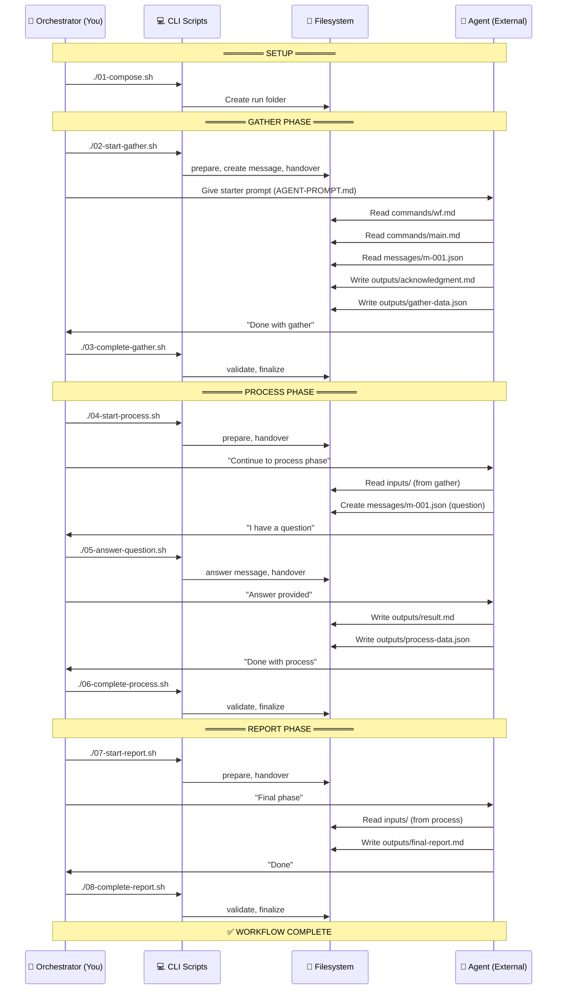

# Manual Workflow Test (Mode 2 - Real Agent)

Run the hello-workflow with a **real external agent** to validate that phase prompts are self-sufficient.

> **Reference**: This is the operational version of [Subtask 001: Manual Test Harness](../../../plans/003-wf-basics/tasks/phase-6-documentation/001-subtask-create-manual-test-harness.md)

---

## Quick Start

```bash
cd docs/how/dev/manual-wf-run

# 1. Create fresh run
./01-compose.sh

# 2. Start gather phase (creates message, hands to agent)
./02-start-gather.sh

# 3. Give agent the prompt from AGENT-PROMPT.md
#    Wait for agent to complete gather phase...

# 4. Complete gather, start process
./03-complete-gather.sh
./04-start-process.sh

# 5. If agent asks question, answer it
./05-answer-question.sh

# 6. Complete process, start report
./06-complete-process.sh
./07-start-report.sh

# 7. Complete workflow
./08-complete-report.sh

# Check state anytime
./check-state.sh
```

---

## How It Works

```
┌─────────────────────────────────────────────────────────────────┐
│ YOU: Orchestrator (run scripts, answer questions)              │
│ AGENT: Does the work using ONLY phase prompts (wf.md, main.md) │
└─────────────────────────────────────────────────────────────────┘
```

**The test**: Can an external agent complete the workflow using ONLY the files in the phase folders?

### Command/Action Flow



### Who Does What

| Action | Who | How |
|--------|-----|-----|
| Create run folder | Orchestrator | `./01-compose.sh` |
| Prepare phase | Orchestrator | `./0X-start-*.sh` |
| Create user request message | Orchestrator | `./02-start-gather.sh` |
| Handover to agent | Orchestrator | Scripts do this |
| **Read prompts (wf.md, main.md)** | **Agent** | File access |
| **Read messages** | **Agent** | File access |
| **Write outputs** | **Agent** | File access |
| **Ask questions (create message)** | **Agent** | File access |
| Answer questions | Orchestrator | `./05-answer-question.sh` |
| Validate outputs | Orchestrator | `./0X-complete-*.sh` |
| Finalize phase | Orchestrator | `./0X-complete-*.sh` |

---

## Files

| File | Purpose |
|------|---------|
| `01-compose.sh` | Create fresh run folder |
| `02-start-gather.sh` | Prepare gather, create user message, handover |
| `03-complete-gather.sh` | Validate outputs, finalize gather |
| `04-start-process.sh` | Prepare process, handover to agent |
| `05-answer-question.sh` | Answer agent's multi-choice question |
| `06-complete-process.sh` | Validate outputs, finalize process |
| `07-start-report.sh` | Prepare report, handover to agent |
| `08-complete-report.sh` | Validate outputs, finalize report |
| `check-state.sh` | Show current state of all phases |
| `AGENT-PROMPT.md` | What to give the external agent |

---

## Giving Instructions to the Agent

Copy the prompt from **AGENT-PROMPT.md** and give it to your external agent (Claude, GPT, etc.).

**Important**: 
- Do NOT help the agent beyond the starter prompt
- If they get confused, that's valuable feedback about the prompts!
- Document any failures in the subtask's Discoveries table

---

## Recording Results

After the test, document results in:
- [Subtask Discoveries Table](../../../plans/003-wf-basics/tasks/phase-6-documentation/001-subtask-create-manual-test-harness.md#discoveries--learnings)

**If agent succeeded**: Note any minor friction points.

**If agent failed**: Document:
1. Which phase?
2. What confused them?
3. What prompt needs improvement?

---

## Run Folders

Runs are created in: `dev/examples/wf/runs/`

Each compose creates a new folder: `run-YYYY-MM-DD-NNN`

These are gitignored, so you can create as many test runs as needed.
