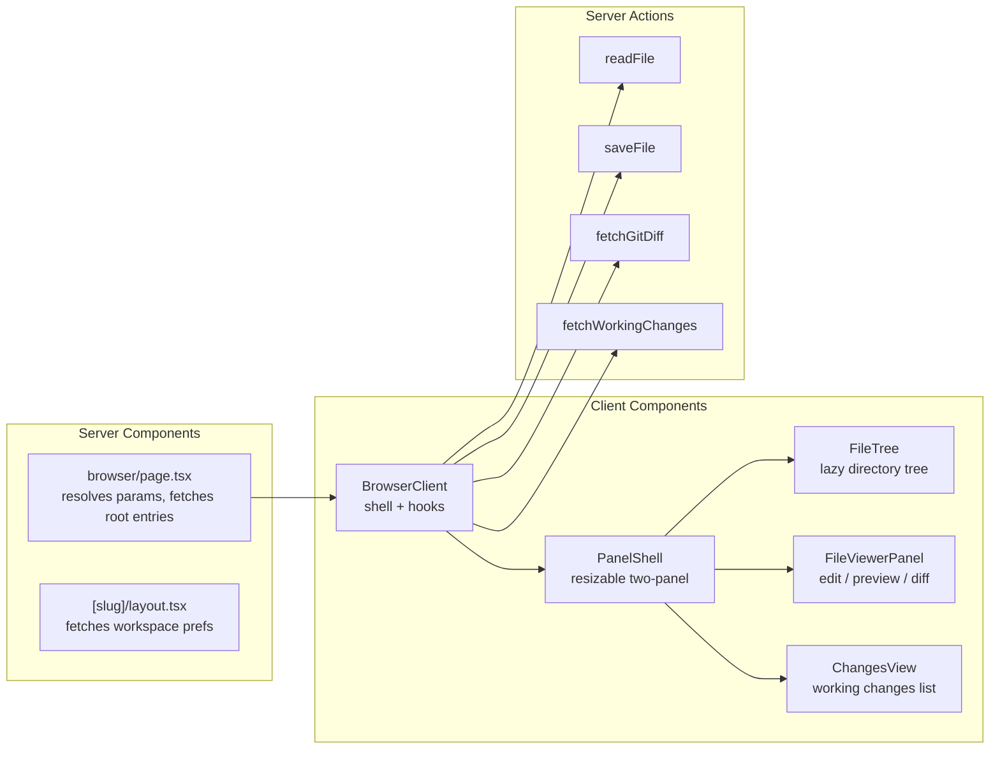

# File Browser

Architecture, security model, and extension guide for the workspace file browser.

## Overview

The file browser is a two-panel layout (tree + viewer) for navigating, viewing, and editing files within a workspace worktree. It supports code editing with syntax highlighting, markdown preview with mermaid, git diffs, and binary file viewing (images, PDF, video, audio).

All state is URL-driven via deep linking (see [deep-linking.md](./deep-linking.md)). Every file, mode, and panel state is bookmarkable.

## Architecture

```
/workspaces/[slug]/browser?worktree=/path&file=README.md&mode=preview
```



### Key Files

| File | Role |
|------|------|
| `app/(dashboard)/workspaces/[slug]/browser/page.tsx` | Server Component — resolves worktree, fetches root entries |
| `app/(dashboard)/workspaces/[slug]/browser/browser-client.tsx` | Client shell — composes hooks, wires panels |
| `src/features/041-file-browser/components/file-tree.tsx` | Lazy directory tree with expand/collapse |
| `src/features/041-file-browser/components/file-viewer-panel.tsx` | Mode toggle (edit/preview/diff) + binary routing |
| `src/features/041-file-browser/components/changes-view.tsx` | Working changes list (git status) |
| `src/features/041-file-browser/services/file-actions.ts` | readFile + saveFile service logic |
| `app/api/workspaces/[slug]/files/route.ts` | Directory listing API (lazy expansion) |
| `app/api/workspaces/[slug]/files/raw/route.ts` | Binary file streaming with Range support |

## Security Model

All file operations go through a two-phase security check:

### Phase 1: Path Traversal Prevention

`IPathResolver.resolvePath(worktreePath, filePath)` validates the requested path:
- Rejects `..` components
- Rejects absolute paths that escape the worktree
- Returns the resolved absolute path

### Phase 2: Symlink Escape Detection

After resolving the path, `fileSystem.realpath()` follows symlinks to get the canonical path, then verifies containment:

```typescript
const absolutePath = pathResolver.resolvePath(worktreePath, filePath);
const realPath = await fileSystem.realpath(absolutePath);

if (!realPath.startsWith(worktreePath + '/') && realPath !== worktreePath) {
  return { ok: false, error: 'security' };
}
```

This prevents symlinks that point outside the worktree from being followed.

### Where Security Is Enforced

| Operation | Security Check Location |
|-----------|------------------------|
| Read file | `file-actions.ts` readFileService |
| Save file | `file-actions.ts` saveFileService |
| List directory | `directory-listing.ts` listDirectory |
| Stream binary | `raw/route.ts` GET handler |

## File Operations

### Reading Files

```typescript
type ReadFileResult =
  | { ok: true; isBinary: false; content: string; mtime: string; size: number; language: string; highlightedHtml: string; markdownHtml?: string }
  | { ok: true; isBinary: true; contentType: string; mtime: string; size: number }
  | { ok: false; error: 'file-too-large' | 'not-found' | 'security' }
```

Flow:
1. Resolve + validate path (security)
2. `stat()` for size + mtime
3. Binary detection: extension-first via `isBinaryExtension()`, then null-byte scan for unknown extensions
4. Binary files return metadata only (no content) — the viewer fetches via the raw streaming route
5. Text files: read content, detect language, generate syntax-highlighted HTML via Shiki, render markdown if applicable
6. **Size limit**: 5MB for text files. Binary files have no size limit (streamed).

### Saving Files

```typescript
type SaveFileResult =
  | { ok: true; newMtime: string }
  | { ok: false; error: 'conflict' | 'security'; serverMtime?: string }
```

Flow:
1. Resolve + validate path (security)
2. **Conflict detection**: compare `expectedMtime` against current `stat.mtime`. If they differ, return `conflict` error with the server's mtime.
3. **Atomic write**: write to `.tmp` file, then `rename()` to target. Prevents partial writes on crash.
4. Return new mtime for the client to track.

### Binary File Streaming

The raw route (`/api/workspaces/[slug]/files/raw`) streams binary files:

- **Never buffers the full file** — uses `fs.createReadStream()`
- **Range requests**: parses `Range: bytes=start-end`, returns 206 Partial Content with `Content-Range` header
- **Content-Disposition**: `inline` by default (browser renders), `?download=true` for attachment
- **Content-Type**: detected via `detectContentType()` from file extension

Supported binary types:
- **Images**: png, jpg, jpeg, gif, webp, svg, ico, avif, bmp
- **PDF**: pdf (rendered via iframe with blob URL for cross-platform support)
- **Video**: mp4, webm, mov, avi, mkv
- **Audio**: mp3, wav, ogg, flac, aac, m4a

## Upload

Files can be uploaded via the paste/upload modal (Plan 044):
- **Max size**: 250MB (`bodySizeLimit` in next.config.mjs)
- **Destination**: `scratch/paste/` directory with timestamped filenames
- **Server action**: `uploadFile` with atomic write

## Working Changes

The changes panel shows uncommitted git changes:

- `fetchWorkingChanges()` — runs `git status --porcelain`, returns `ChangedFile[]` with path, status (modified/added/deleted/untracked/renamed), and area (staged/unstaged/untracked)
- `fetchChangedFiles()` — runs `git diff --name-only` for the tree filter
- `fetchRecentFiles()` — runs `git log --name-only` for recently modified files

## Viewer Modes

| Mode | Component | Description |
|------|-----------|-------------|
| Edit | `CodeEditor` (CodeMirror 6) | Lazy-loaded, theme-synced, language detection |
| Preview | `FileViewer` / `MarkdownPreview` | Shiki syntax highlighting, rehype-slug headings, mermaid diagrams |
| Diff | `DiffViewer` | Git diff with `fetchGitDiff()` |
| Binary | `ImageViewer` / `PdfViewer` / `VideoViewer` / `AudioViewer` / `BinaryPlaceholder` | Routed by `detectContentType()` |

## Attention System

The file browser integrates with the workspace attention system:

- **Tab titles**: Show `{emoji} {branch} — Browser` via `WorkspaceContext.setWorktreeIdentity()`
- **Attention prefix**: Tab shows `❗` when the worktree has uncommitted changes
- **Per-worktree emoji**: Each worktree can have its own emoji/color (set via gear icon in sidebar)
- **Browser history**: File selection creates history entries for back/forward navigation

See [deep-linking.md](./deep-linking.md) for details on URL state and WorkspaceContext.

## Adding New File Operations

To add a new file operation (e.g., rename, delete):

1. **Service function** in `src/features/041-file-browser/services/file-actions.ts`:
   - Accept `fileSystem` and `pathResolver` via options (DI)
   - Use two-phase security check (resolvePath + realpath + containment)
   - Return a discriminated union result type

2. **Server action** in `app/actions/file-actions.ts`:
   - Resolve DI container, call service function
   - Return typed result to client

3. **Wire into BrowserClient** via `useFileNavigation` hook or a new hook

4. **Test** in `test/unit/web/features/041-file-browser/` using `FakeFileSystem` and `FakePathResolver` from `@chainglass/shared`
