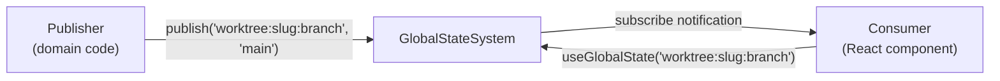
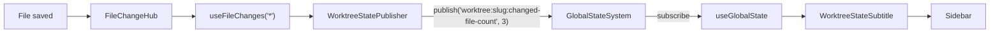

# Global State System

Centralized ephemeral runtime state for cross-domain communication without coupling.

## Overview

The GlobalStateSystem lets domains publish runtime values (file counts, branch names, workflow status) to named state paths, and lets consumers subscribe by path or pattern — without knowing who publishes. Think of it as "runtime settings": SDK settings handle persistent configuration, GlobalStateSystem handles ephemeral values that change during a session.

**Core principle**: Consumers are read-only. Publishers are write-only. They never see each other's API.



## Path Syntax

State paths use colon-delimited segments:

| Pattern | Example | Use Case |
|---------|---------|----------|
| `domain:property` | `alerts:count` | Singleton domain — one instance globally |
| `domain:instanceId:property` | `worktree:my-slug:branch` | Multi-instance domain — one per workspace/entity |

**Validation rules**:
- Domain/property names: `[a-z][a-z0-9-]*` (strict kebab-case)
- Instance IDs: `[a-zA-Z0-9_-]+` (permissive — allows slugs, UUIDs)

### Subscription Patterns

| Pattern | Example | Matches |
|---------|---------|---------|
| Exact | `worktree:my-slug:branch` | Only that path |
| Domain wildcard | `worktree:*:status` | Any instance, one property |
| Instance wildcard | `worktree:my-slug:*` | One instance, all properties |
| Domain-all | `worktree:**` | Everything in the domain |
| Global | `*` | All state changes (use sparingly) |

## Consumer Quick-Start

Read state with `useGlobalState`. The hook re-renders your component when the value changes.

```tsx
'use client';

import { useGlobalState } from '@/lib/state';

export function WorkflowStatusBadge({ instanceId }: { instanceId: string }) {
  const status = useGlobalState<string>(`workflow:${instanceId}:status`, 'idle');

  return <span className="text-xs text-muted-foreground">{status}</span>;
}
```

**That's it.** No provider setup needed (GlobalStateProvider is already mounted in `providers.tsx`). No subscription management — the hook handles subscribe/unsubscribe automatically.

### Reading Multiple Values

```tsx
const branch = useGlobalState<string>(`worktree:${slug}:branch`, '');
const fileCount = useGlobalState<number>(`worktree:${slug}:changed-file-count`, 0);
```

### Listing Entries by Pattern

```tsx
import { useGlobalStateList } from '@/lib/state';

// All properties for one worktree instance
const entries = useGlobalStateList(`worktree:${slug}:*`);
// entries: [{ path: 'worktree:slug:branch', value: 'main', updatedAt: ... }, ...]
```

## Publisher Quick-Start

Publishing is a 3-step process: register domain, create publisher component, wire it in.

### Step 1: Register Your Domain

Create a registration function that declares your domain's shape:

```ts
// features/my-domain/state/register.ts
import type { IStateService } from '@chainglass/shared/state';

export function registerMyDomain(state: IStateService): void {
  // Idempotent guard — React Strict Mode and HMR re-run initializers
  const already = state.listDomains().some((d) => d.domain === 'my-domain');
  if (already) return;

  state.registerDomain({
    domain: 'my-domain',
    description: 'What this domain publishes',
    multiInstance: false,  // true if keyed by instance ID
    properties: [
      { key: 'status', description: 'Current status', typeHint: 'string' },
      { key: 'count', description: 'Item count', typeHint: 'number' },
    ],
  });
}
```

> **⚠️ Registration Gotcha**: Registration MUST be idempotent. React Strict Mode and HMR will re-run `useState` initializers. Without the `listDomains().some()` guard, you'll get `"Domain already registered"` errors. We learned this the hard way in Phase 5 — see the worktree exemplar below.

### Step 2: Create a Publisher Component

The publisher is an invisible component that reads data from your domain's source and publishes it to state:

```tsx
// features/my-domain/state/my-publisher.tsx
'use client';

import { useEffect } from 'react';
import { useStateSystem } from '@/lib/state';

export function MyDomainPublisher() {
  const state = useStateSystem();

  // Publish on mount and when data changes
  useEffect(() => {
    state.publish('my-domain:status', 'active');
  }, [state]);

  return null;  // Invisible — no UI
}
```

### Step 3: Wire It with a Connector

The connector registers the domain and mounts the publisher:

```tsx
// In your connector or wiring component
import { useState } from 'react';
import { useStateSystem } from '@/lib/state';
import { registerMyDomain } from './state/register';
import { MyDomainPublisher } from './state/my-publisher';

export function MyDomainConnector() {
  const state = useStateSystem();

  // Register synchronously via useState initializer — NOT useEffect!
  useState(() => {
    registerMyDomain(state);
  });

  return <MyDomainPublisher />;
}
```

> **⚠️ Why `useState`, not `useEffect`?** `useEffect` fires after paint. If the publisher's `useEffect` fires in the same commit, `publish()` runs before `registerDomain()`, causing a crash. `useState` initializers run synchronously during render, guaranteeing registration completes before any child effects.

## Pattern Cheatsheet

### Hooks

| Hook | Purpose | Signature |
|------|---------|-----------|
| `useGlobalState<T>(path, default?)` | Read single value | Returns `T \| undefined`, re-renders on change |
| `useGlobalStateList(pattern)` | Read multiple entries | Returns `StateEntry[]`, stable ref when unchanged |
| `useStateSystem()` | Access IStateService | For publishers — `publish()`, `registerDomain()` |

### IStateService Methods

| Method | Who Uses It | Purpose |
|--------|------------|---------|
| `registerDomain(descriptor)` | Publisher (bootstrap) | Declare domain shape |
| `publish<T>(path, value)` | Publisher | Set state at path |
| `remove(path)` | Publisher | Remove state entry |
| `removeInstance(domain, id)` | Publisher | Remove all state for an instance |
| `get<T>(path)` | Consumer (rare) | Read outside React |
| `list(pattern)` | Consumer (rare) | List entries outside React |
| `subscribe(pattern, callback)` | Internal (hooks) | Raw subscription |

### Guarantees

- **Store-first**: Value is stored BEFORE subscribers are notified
- **Error isolation**: One throwing subscriber doesn't block others
- **Stable refs**: `get()` returns same object identity between publishes
- **Pattern-scoped cache**: `list()` returns stable array ref when no matching values changed

## Worktree Exemplar Walkthrough

Phase 5 wired the first real domain — `worktree` — as a multi-instance domain publishing file change counts and git branch per workspace. Here's how it works end-to-end:

### 1. Domain Registration (`state/register.ts`)

```
apps/web/src/features/041-file-browser/state/register.ts
```

Registers `worktree` as multi-instance (keyed by workspace slug) with `changed-file-count` and `branch` properties. Idempotent via `listDomains().some()` guard.

### 2. Publisher (`state/worktree-publisher.tsx`)

```
apps/web/src/features/041-file-browser/state/worktree-publisher.tsx
```

Invisible component that:
- Reads `useFileChanges('*').changes.length` → publishes to `worktree:{slug}:changed-file-count`
- Reads `worktreeBranch` prop → publishes to `worktree:{slug}:branch`

Must mount inside `FileChangeProvider` scope to access `useFileChanges`.

### 3. Consumer (`components/worktree-state-subtitle.tsx`)

```
apps/web/src/features/041-file-browser/components/worktree-state-subtitle.tsx
```

Reads state via `useGlobalState<string>('worktree:{slug}:branch')` and `useGlobalState<number>('worktree:{slug}:changed-file-count')`. Renders branch name + file count in the sidebar.

### 4. Connector (`lib/state/state-connector.tsx`)

```
apps/web/src/lib/state/state-connector.tsx
```

Registers domain via `useState` initializer, renders `<WorktreeStatePublisher>`.

### 5. Wiring (`browser-client.tsx`)

```
apps/web/app/(dashboard)/workspaces/[slug]/browser/browser-client.tsx
```

Mounts `<GlobalStateConnector>` inside `<FileChangeProvider>`. Consumer renders in `dashboard-sidebar.tsx`.

### Data Flow



## Testing with FakeGlobalStateSystem

Use `FakeGlobalStateSystem` for unit tests — it's a full behavioral implementation with inspection methods:

```tsx
import { FakeGlobalStateSystem } from '@chainglass/shared/fakes';
import { StateContext } from '@/lib/state';

const fake = new FakeGlobalStateSystem();
fake.registerDomain({ domain: 'test', ... });

// Inject via context
const wrapper = ({ children }) => (
  <StateContext.Provider value={fake}>{children}</StateContext.Provider>
);

// Inspect state
fake.get('test:value');            // Current value
fake.getPublished();               // All published entries
fake.wasPublishedWith('test:key', expectedValue);  // Assertion helper
fake.getSubscribers();             // Active subscriptions
fake.reset();                      // Clear all state
```

The fake passes all 19 contract tests identically to the real implementation.

## Architecture

```
packages/shared/src/
  ├── interfaces/state.interface.ts    # IStateService contract
  ├── state/
  │   ├── types.ts                     # ParsedPath, StateEntry, StateChange, etc.
  │   ├── path-parser.ts               # parsePath()
  │   ├── path-matcher.ts              # createStateMatcher()
  │   ├── tokens.ts                    # DI tokens
  │   └── index.ts                     # Barrel exports
  └── fakes/fake-state-system.ts       # FakeGlobalStateSystem

apps/web/src/lib/state/
  ├── global-state-system.ts           # Real implementation
  ├── state-provider.tsx               # GlobalStateProvider + useStateSystem
  ├── state-connector.tsx              # GlobalStateConnector (wiring)
  ├── use-global-state.ts              # useGlobalState<T> hook
  ├── use-global-state-list.ts         # useGlobalStateList hook
  └── index.ts                         # Barrel exports
```
