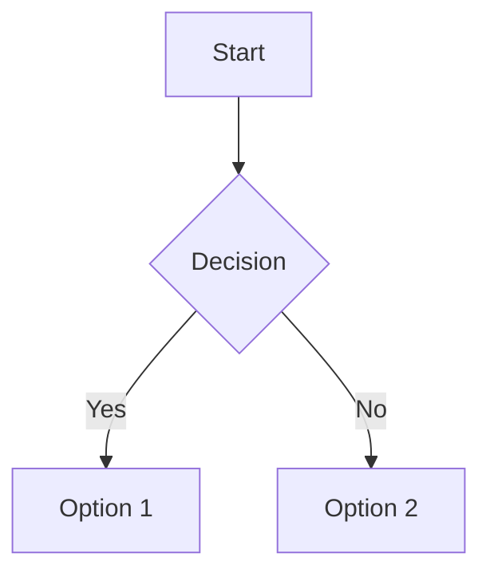

# Viewer Component Patterns

This document covers the viewer components implemented in Phases 2-5, including FileViewer, MarkdownViewer, and DiffViewer. These components provide rich content display capabilities for source files, documentation, and git diffs.

## Overview

The Chainglass web application includes three specialized viewer components:

| Component | Purpose | Key Features |
|-----------|---------|--------------|
| **FileViewer** | Source code display | Syntax highlighting, line numbers, keyboard navigation |
| **MarkdownViewer** | Markdown preview | Source/preview toggle, GFM support, code fence highlighting |
| **DiffViewer** | Git diff display | Split/unified modes, additions/deletions, syntax highlighting |

**Key architecture principle**: Shiki syntax highlighting runs **server-side only** to keep the client bundle small (Shiki is ~900KB).

## FileViewer

### Basic Usage

FileViewer displays source code with syntax highlighting and line numbers. Because Shiki runs server-side, you must pre-process the code in a Server Component.

```tsx
// app/demo/file-viewer/page.tsx (Server Component)
import { FileViewer } from '@/components/viewers';
import { highlightCode } from '@/lib/server/shiki-processor';
import { detectLanguage } from '@/lib/language-detection';

export default async function FileViewerDemo() {
  const file = {
    path: 'src/example.ts',
    filename: 'example.ts',
    content: 'const greeting = "Hello, World!";',
  };

  // Generate highlighted HTML server-side
  const highlightedHtml = await highlightCode(
    file.content,
    detectLanguage(file.filename)
  );

  return <FileViewer file={file} highlightedHtml={highlightedHtml} />;
}
```

### Props

```typescript
interface FileViewerProps {
  /** The file to display */
  file: ViewerFile | undefined;
  /** Pre-highlighted HTML from Shiki (generated server-side) */
  highlightedHtml: string;
}

interface ViewerFile {
  path: string;      // Full file path
  filename: string;  // File name (used for language detection)
  content: string;   // Raw file content
}
```

### Features

- **CSS Counter Line Numbers**: Line numbers don't copy when selecting code
- **Dual-Theme Support**: Automatically adapts to light/dark mode via Shiki CSS variables
- **Keyboard Navigation**: Arrow keys scroll, Home/End jump to start/end
- **Toggle Line Numbers**: Users can hide line numbers if desired
- **Accessibility**: ARIA labels for screen readers

### Server-Side Processing

The `highlightCode` function in `lib/server/shiki-processor.ts` handles syntax highlighting:

```typescript
import { highlightCode } from '@/lib/server/shiki-processor';

// Returns HTML string with syntax tokens and CSS variables
const html = await highlightCode(code, 'typescript');
```

Shiki uses `--shiki-dark` CSS variables for theme switching, so no re-processing is needed when the user toggles between light and dark mode.

## MarkdownViewer

### Basic Usage

MarkdownViewer extends FileViewer with a source/preview toggle. It requires both highlighted source HTML and pre-rendered preview content.

```tsx
// app/demo/markdown-viewer/page.tsx (Server Component)
import { MarkdownViewer, MarkdownServer } from '@/components/viewers';
import { highlightCode } from '@/lib/server/shiki-processor';

export default async function MarkdownViewerDemo() {
  const file = {
    path: 'README.md',
    filename: 'README.md',
    content: '# Hello\n\nThis is **markdown**.\n\n```ts\nconst x = 1;\n```',
  };

  // Pre-process for both modes
  const highlightedHtml = await highlightCode(file.content, 'markdown');
  const preview = await MarkdownServer({ content: file.content });

  return (
    <MarkdownViewer
      file={file}
      highlightedHtml={highlightedHtml}
      preview={preview}
    />
  );
}
```

### Props

```typescript
interface MarkdownViewerProps {
  /** The markdown file to display */
  file: ViewerFile | undefined;
  /** Pre-highlighted HTML for source mode (from Shiki) */
  highlightedHtml: string;
  /** Pre-rendered preview content (from MarkdownServer) */
  preview: ReactNode;
}
```

### Features

- **Source Mode**: Raw markdown with syntax highlighting (uses FileViewer)
- **Preview Mode**: Rendered markdown with prose styling
- **GFM Support**: Tables, task lists, strikethrough via remark-gfm
- **Code Fence Highlighting**: Code blocks in preview use Shiki (via @shikijs/rehype)
- **Mermaid Diagrams**: Mermaid code blocks render as SVG diagrams
- **Mode Persistence**: Toggle state persists within session via hook

### MarkdownServer Component

The `MarkdownServer` component is an async Server Component that renders markdown:

```tsx
import { MarkdownServer } from '@/components/viewers/markdown-server';

// In a Server Component
const preview = await MarkdownServer({ content: markdownContent });
```

It uses:
- `react-markdown` for parsing
- `remark-gfm` for GitHub Flavored Markdown
- `@shikijs/rehype` for code block highlighting
- `@tailwindcss/typography` for prose styling
- Custom `remarkMermaid` plugin for diagram blocks

## DiffViewer

### Basic Usage

DiffViewer displays git diffs with split or unified view modes. It fetches diff data via a server action.

```tsx
// app/demo/diff-viewer/page.tsx (Server Component)
import { DiffViewer } from '@/components/viewers';
import { getGitDiff } from '@/lib/server/git-diff-action';

export default async function DiffViewerDemo() {
  const file = {
    path: 'src/example.ts',
    filename: 'example.ts',
    content: '', // Content not needed for diff
  };

  // Fetch diff from git
  const result = await getGitDiff(file.path);

  return (
    <DiffViewer
      file={file}
      diffData={result.diff}
      error={result.error}
    />
  );
}
```

### Props

```typescript
interface DiffViewerProps {
  /** The file to display diff for */
  file: ViewerFile | undefined;
  /** The git diff output, or null if error/no-changes */
  diffData: string | null;
  /** Error type if diff failed */
  error: DiffError | null;
  /** Whether diff is currently loading */
  isLoading?: boolean;
  /** View mode override (default: from hook state) */
  viewMode?: 'split' | 'unified';
}

type DiffError = 'not-git' | 'no-changes' | 'git-not-available';
```

### Features

- **Split View**: Side-by-side comparison of old and new versions
- **Unified View**: Single column with +/- markers
- **Syntax Highlighting**: Uses @git-diff-view/shiki (client-side)
- **Theme-Aware**: Automatically adapts to light/dark mode
- **Error States**: Clear messages for not-git, no-changes, git-not-available
- **View Mode Toggle**: Switch between split and unified views

### Server Action

The `getGitDiff` server action fetches the git diff:

```typescript
import { getGitDiff } from '@/lib/server/git-diff-action';

const result = await getGitDiff('/path/to/file.ts');
// Returns: { diff: string | null, error: DiffError | null }
```

The action handles:
- Checking if git is available
- Checking if file is in a git repository
- Running `git diff` command
- Path validation and sanitization

## Headless Hooks

Each viewer has an associated headless hook for state management:

### useFileViewerState

```typescript
import { useFileViewerState } from '@/hooks/useFileViewerState';

const { file, language, showLineNumbers, toggleLineNumbers } = useFileViewerState(file);
```

### useMarkdownViewerState

```typescript
import { useMarkdownViewerState } from '@/hooks/useMarkdownViewerState';

const { file, isPreviewMode, setMode, toggleMode } = useMarkdownViewerState(file);
```

### useDiffViewerState

```typescript
import { useDiffViewerState } from '@/hooks/useDiffViewerState';

const { file, viewMode, toggleViewMode, setViewMode } = useDiffViewerState(file);
```

## Language Detection

The `detectLanguage` utility maps file extensions to Shiki language names:

```typescript
import { detectLanguage } from '@/lib/language-detection';

detectLanguage('Button.tsx');     // 'tsx'
detectLanguage('config.json');    // 'json'
detectLanguage('Makefile');       // 'makefile' (special filename)
detectLanguage('unknown.xyz');    // 'text' (fallback)
```

Supports 20+ languages including TypeScript, JavaScript, Python, Go, Rust, and more.

## Mermaid Diagrams

Mermaid diagrams in markdown are rendered as SVG:

````markdown

````

Features:
- Flowcharts, sequence diagrams, state diagrams
- Theme-aware (light/dark)
- Error boundary for invalid syntax
- Async/non-blocking rendering

## Best Practices

1. **Always pre-process on the server** - Generate highlighted HTML in Server Components
2. **Use the hooks for state** - Don't manage viewer state manually
3. **Handle loading states** - DiffViewer fetches data asynchronously
4. **Provide fallbacks** - Handle undefined file gracefully
5. **Test with different themes** - Verify both light and dark mode

## Related Files

### Components
- `/apps/web/src/components/viewers/file-viewer.tsx`
- `/apps/web/src/components/viewers/markdown-viewer.tsx`
- `/apps/web/src/components/viewers/markdown-server.tsx`
- `/apps/web/src/components/viewers/diff-viewer.tsx`
- `/apps/web/src/components/viewers/mermaid-renderer.tsx`

### Hooks
- `/apps/web/src/hooks/useFileViewerState.ts`
- `/apps/web/src/hooks/useMarkdownViewerState.ts`
- `/apps/web/src/hooks/useDiffViewerState.ts`

### Utilities
- `/apps/web/src/lib/server/shiki-processor.ts`
- `/apps/web/src/lib/server/git-diff-action.ts`
- `/apps/web/src/lib/language-detection.ts`
- `/apps/web/src/lib/remark-mermaid.ts`

### CSS
- `/apps/web/src/components/viewers/file-viewer.css`
- `/apps/web/src/components/viewers/markdown-viewer.css`
- `/apps/web/src/components/viewers/diff-viewer.css`

### Demo Pages
- `/apps/web/app/(dashboard)/demo/file-viewer/page.tsx`
- `/apps/web/app/(dashboard)/demo/markdown-viewer/page.tsx`
- `/apps/web/app/(dashboard)/demo/diff-viewer/page.tsx`
