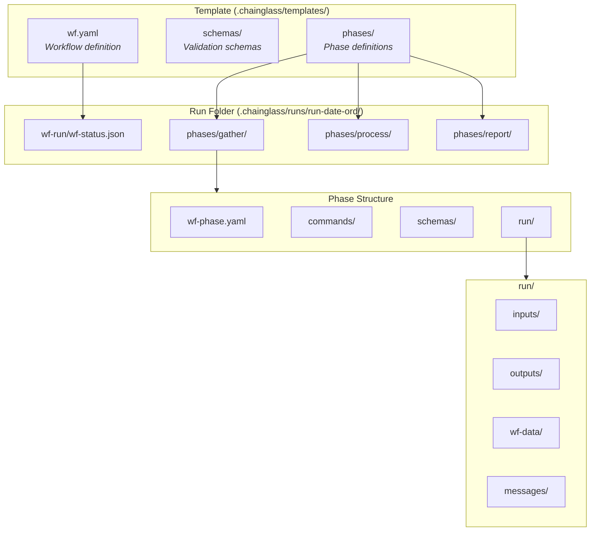
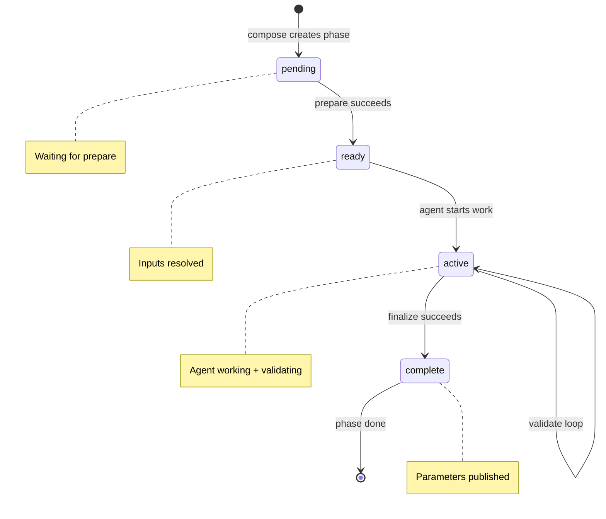
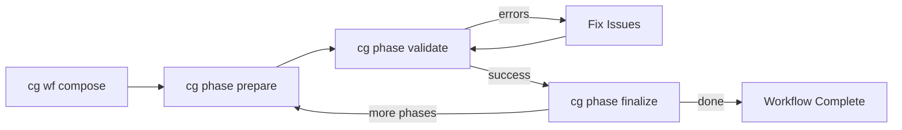

# Workflow System Overview

This guide explains the Chainglass workflow system and how to use it for multi-phase task execution.

## What is the Workflow System?

The workflow system enables structured, multi-phase task execution with:

- **Explicit Contracts**: Phases declare their inputs, outputs, and published parameters
- **Schema Validation**: JSON outputs are validated against schemas before completion
- **Phase Independence**: Each phase is self-contained with its own directories and state
- **Filesystem-First**: All workflow state lives in files - no database required
- **Dual Interface**: Same operations available via CLI and MCP tools

## Architecture



## Key Concepts

### 1. Templates

Templates define reusable workflow structures. Each template includes:

- **wf.yaml**: Workflow definition with phases, inputs, outputs, and parameters
- **schemas/**: JSON Schema files for output validation
- **phases/**: Per-phase configuration and commands

Templates are stored in `.chainglass/templates/<slug>/` or can be referenced by path.

### 2. Runs

A run is an execution instance of a template. When you run `cg wf compose`, a new run folder is created:

```
.chainglass/runs/run-2026-01-23-001/
├── wf.yaml                    # Copied from template
├── wf-run/wf-status.json      # Run status tracking
└── phases/
    ├── gather/                # First phase
    ├── process/               # Second phase
    └── report/                # Third phase
```

Run folders are named `run-{YYYY-MM-DD}-{NNN}` with auto-incrementing ordinal.

### 3. Phases

Phases are the building blocks of workflows. Each phase:

- Has a defined order (1, 2, 3...)
- Declares required inputs and outputs
- Can reference outputs from prior phases via `from_phase`
- Publishes parameters for downstream phases via `output_parameters`

### 4. Phase Lifecycle

Each phase goes through a lifecycle:



## Workflow Lifecycle



1. **Compose**: Create a run folder from a template
2. **Prepare**: Resolve inputs, copy files from prior phases
3. **Validate**: Check outputs against schemas (loop until valid)
4. **Finalize**: Extract parameters and mark phase complete
5. Repeat for each phase

## Quick Start

### 1. Create a Workflow Run

```bash
# From a template slug (looks in .chainglass/templates/)
cg wf compose hello-workflow

# From a path
cg wf compose ./my-templates/my-workflow

# With JSON output for parsing
cg wf compose hello-workflow --json
```

### 2. Execute a Phase

```bash
# Set the run directory
RUN_DIR=".chainglass/runs/run-2026-01-23-001"

# Prepare the phase (resolves inputs)
cg phase prepare gather --run-dir $RUN_DIR --json

# Do your work (create outputs)
# ...

# Validate outputs against schema
cg phase validate gather --run-dir $RUN_DIR --check outputs --json

# If validation fails, fix issues and re-validate
# When valid, finalize the phase
cg phase finalize gather --run-dir $RUN_DIR --json
```

### 3. Continue to Next Phase

```bash
# Prepare the next phase (copies from_phase inputs)
cg phase prepare process --run-dir $RUN_DIR --json

# Work, validate, finalize...
```

## When to Use Workflows

### Use Workflows For:

- **Multi-step agent tasks**: Break complex work into manageable phases
- **Auditable processes**: Need complete execution history
- **Explicit contracts**: Inputs and outputs must be validated
- **Parameter passing**: Later phases need data from earlier phases

### Don't Use Workflows For:

- **Simple one-shot tasks**: Use direct commands instead
- **Real-time processing**: Workflows are for batch/async work
- **Transient operations**: Workflows persist to filesystem

## Error Codes

| Code | Description | Resolution |
|------|-------------|------------|
| E001 | Missing required input | Ensure input file exists |
| E010 | Missing required output | Create the output file |
| E011 | Empty output file | Add content to output |
| E012 | Schema validation failed | Fix JSON to match schema |
| E020 | Phase/template not found | Check path and name |
| E031 | Prior phase not finalized | Finalize prior phase first |

## Next Steps

- [Template Authoring](./2-template-authoring.md) - Create custom workflow templates
- [CLI Reference](./3-cli-reference.md) - Complete command documentation
- [MCP Reference](./4-mcp-reference.md) - MCP tool documentation
