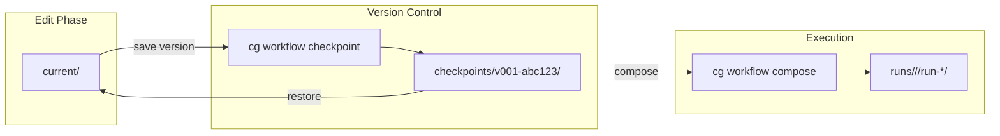

# Workflow Management Guide

This guide covers managing workflow templates, checkpointing versions, and organizing runs with the Chainglass multi-workflow system.

## Overview

The workflow management system enables teams to:

- **Organize multiple workflow templates** in a project with clear versioning
- **Create immutable checkpoints** of template state for reproducibility
- **Track template evolution** through checkpoint history
- **Run workflows from specific versions** ensuring traceability

All workflow state lives in the filesystem - no database required.

## Getting Started

### Initialize a Project

Use `cg init` to set up the Chainglass directory structure with starter templates:

```bash
cg init
```

This creates:

```
.chainglass/
├── workflows/              # Workflow templates
│   └── hello-workflow/     # Starter template
│       ├── workflow.json   # Template metadata
│       └── current/        # Active working directory
│           ├── wf.yaml     # Workflow definition
│           └── phases/     # Phase definitions
└── runs/                   # Workflow execution runs
```

The `--force` flag recreates templates if they already exist.

## Template Structure

Each workflow template lives in `.chainglass/workflows/<slug>/` with this structure:

```
.chainglass/workflows/my-workflow/
├── workflow.json           # Template metadata
├── current/                # Working directory (editable)
│   ├── wf.yaml             # Workflow definition
│   ├── schemas/            # Validation schemas
│   └── phases/             # Phase definitions
└── checkpoints/            # Immutable version snapshots
    ├── v001-abc12345/      # First checkpoint
    └── v002-def67890/      # Second checkpoint
```

### workflow.json

The `workflow.json` file contains template metadata:

```json
{
  "slug": "my-workflow",
  "name": "My Workflow",
  "description": "A multi-phase data processing workflow",
  "created_at": "2026-01-25T10:00:00.000Z"
}
```

This file is auto-generated on first checkpoint if not present.

### current/ Directory

The `current/` directory is where you edit your workflow template. Changes here do not affect existing runs - you must create a checkpoint to use new changes.

### checkpoints/ Directory

Each checkpoint is a timestamped, immutable snapshot named `v<NNN>-<hash>/`:

- `<NNN>` is a 3-digit ordinal (001, 002, 003...)
- `<hash>` is an 8-character content hash for deduplication

Checkpoints contain:

```
checkpoints/v001-abc12345/
├── .checkpoint.json        # Checkpoint metadata
├── wf.yaml                 # Workflow definition snapshot
├── schemas/                # Schema snapshots
└── phases/                 # Phase definition snapshots
```

The `.checkpoint.json` file records:

```json
{
  "ordinal": 1,
  "hash": "abc12345",
  "created_at": "2026-01-25T10:00:00.000Z",
  "comment": "Initial release"
}
```

## Workflow Lifecycle

The checkpoint-based workflow follows this lifecycle:



1. **Edit** templates in `current/`
2. **Checkpoint** to create an immutable version
3. **Compose** runs from checkpoints
4. **Restore** checkpoints to iterate on older versions

## Managing Templates

### List Templates

View all workflow templates in your project:

```bash
cg workflow list
```

Output shows the slug, name, and checkpoint count for each template:

```
┌─────────────────┬──────────────────┬─────────────┐
│ Slug            │ Name             │ Checkpoints │
├─────────────────┼──────────────────┼─────────────┤
│ hello-workflow  │ Hello Workflow   │ 3           │
│ data-pipeline   │ Data Pipeline    │ 1           │
└─────────────────┴──────────────────┴─────────────┘
```

### View Template Details

Get detailed information about a specific template:

```bash
cg workflow info hello-workflow
```

Output includes description and version history:

```
hello-workflow - Hello Workflow

A starter workflow demonstrating the multi-phase pattern.

Checkpoint History:
  v003-def67890  2026-01-25  "Added validation schema"
  v002-789xyz12  2026-01-24  "Enhanced gather phase"
  v001-abc12345  2026-01-23  "Initial release"
```

## Checkpoint Operations

### Create a Checkpoint

Save the current state of a template as an immutable checkpoint:

```bash
cg workflow checkpoint hello-workflow
```

Add a comment describing the changes:

```bash
cg workflow checkpoint hello-workflow --comment "Added error handling"
```

Output confirms the version created:

```
✓ Checkpoint created

Workflow: hello-workflow
Version: v002-def67890
Comment: Added error handling
```

### Duplicate Detection

The system detects when `current/` content matches an existing checkpoint:

```
✗ Checkpoint failed

[E035] Template unchanged since v001-abc12345

Action: Make changes to current/ before creating a new checkpoint,
        or use --force to create duplicate.
```

Use `--force` to create an intentional duplicate:

```bash
cg workflow checkpoint hello-workflow --force --comment "Tagged for release"
```

### List Versions

View all checkpoints for a template (newest first):

```bash
cg workflow versions hello-workflow
```

```
hello-workflow - Checkpoint Versions

  v003-def67890  2026-01-25  "Added validation schema"
  v002-789xyz12  2026-01-24  "Enhanced gather phase"
  v001-abc12345  2026-01-23  "Initial release"
```

### Restore a Checkpoint

Copy a checkpoint back to `current/` for editing:

```bash
cg workflow restore hello-workflow v001
```

This prompts for confirmation since it overwrites `current/`:

```
Restore will overwrite current/ for 'hello-workflow'. Continue? (y/N)
```

Use `--force` to skip the confirmation:

```bash
cg workflow restore hello-workflow v001 --force
```

## Creating Runs

### Compose from Checkpoint

Create a workflow run from a template checkpoint:

```bash
cg workflow compose hello-workflow
```

By default, this uses the latest checkpoint. Specify a version:

```bash
cg workflow compose hello-workflow --checkpoint v001
```

Runs are created in versioned paths:

```
.chainglass/runs/hello-workflow/v001-abc12345/run-2026-01-25-001/
```

This structure ensures:
- Runs are organized by workflow slug
- Runs from the same checkpoint version are grouped
- Each run has a unique timestamped folder

### Run Status Extension

The `wf-status.json` in each run includes version tracking:

```json
{
  "workflow": {
    "name": "Hello Workflow",
    "version": "1.0.0",
    "template_path": ".chainglass/workflows/hello-workflow/checkpoints/v001-abc12345",
    "slug": "hello-workflow",
    "version_hash": "abc12345",
    "checkpoint_comment": "Initial release"
  }
}
```

## CLI Commands Availability

The workflow management commands are available via CLI only. Per design, they are not exposed through MCP tools - workflow template management is intended for human operators, not agent automation.

| Operation | CLI Command | MCP Tool |
|-----------|-------------|----------|
| List templates | `cg workflow list` | Not available |
| View details | `cg workflow info <slug>` | Not available |
| Create checkpoint | `cg workflow checkpoint <slug>` | Not available |
| Restore checkpoint | `cg workflow restore <slug> <version>` | Not available |
| List versions | `cg workflow versions <slug>` | Not available |
| Compose run | `cg workflow compose <slug>` | `wf_compose` |

Only the `compose` operation is available to agents via MCP. This separation keeps workflow template versioning under human control while allowing agents to execute runs.

## Error Codes

The workflow management system uses error codes in the E030-E039 range:

| Code | Name | Description | Resolution |
|------|------|-------------|------------|
| E030 | WORKFLOW_NOT_FOUND | The specified workflow slug does not exist | Check the slug matches a directory in `.chainglass/workflows/` |
| E033 | VERSION_NOT_FOUND | The specified checkpoint version does not exist | Use `cg workflow versions <slug>` to list available versions |
| E034 | NO_CHECKPOINT | No checkpoints exist for the workflow | Create a checkpoint first with `cg workflow checkpoint <slug>` |
| E035 | DUPLICATE_CONTENT | Checkpoint content matches an existing version | Make changes to `current/` or use `--force` to create intentional duplicate |
| E036 | INVALID_TEMPLATE | The `current/` directory lacks a valid `wf.yaml` | Create or fix `current/wf.yaml` |
| E037 | DIR_READ_FAILED | Failed to read the workflows directory | Check directory permissions and path |
| E038 | CHECKPOINT_FAILED | Checkpoint creation failed | Check file permissions and disk space |
| E039 | RESTORE_FAILED | Checkpoint restore failed | Check file permissions |

**Note**: Error codes E031-E032 are reserved for the phase system and are not used by workflow management.

### Common Error Scenarios

**E030 - Workflow not found**
```bash
$ cg workflow info non-existent
✗ [E030] Workflow 'non-existent' not found

Action: Check that the workflow exists in .chainglass/workflows/
        Run 'cg workflow list' to see available workflows.
```

**E034 - No checkpoint**
```bash
$ cg workflow compose hello-workflow
✗ [E034] Workflow 'hello-workflow' has no checkpoints

Action: Create a checkpoint first with:
        cg workflow checkpoint hello-workflow
```

**E035 - Duplicate content**
```bash
$ cg workflow checkpoint hello-workflow
✗ [E035] Template unchanged since v003-def67890

Action: Make changes to current/ before creating a new checkpoint,
        or use --force to create duplicate.
```

## Migration Notes

### From Flat Runs to Versioned Runs

Prior versions of Chainglass created runs directly in `.chainglass/runs/`:

```
# Old structure (flat)
.chainglass/runs/run-2026-01-20-001/
.chainglass/runs/run-2026-01-21-001/
```

The new versioned structure organizes runs by workflow and checkpoint:

```
# New structure (versioned)
.chainglass/runs/hello-workflow/v001-abc12345/run-2026-01-25-001/
.chainglass/runs/hello-workflow/v002-def67890/run-2026-01-25-002/
```

### Key Differences

| Aspect | Old (Flat) | New (Versioned) |
|--------|------------|-----------------|
| Run location | `runs/run-YYYY-MM-DD-NNN/` | `runs/<slug>/<version>/run-YYYY-MM-DD-NNN/` |
| Template source | `templates/<slug>/` | `workflows/<slug>/checkpoints/<version>/` |
| Version tracking | `template_path` field | `slug`, `version_hash`, `checkpoint_comment` fields |
| Template editing | Direct in templates/ | Edit in `current/`, checkpoint to version |

### Compatibility

- **Existing flat runs** continue to work with phase commands
- **New runs** require checkpointed workflows
- **Template resolution** now prefers `.chainglass/workflows/` over `.chainglass/templates/`

### Recommended Migration Path

1. Keep existing flat runs for reference
2. Use `cg init` to create the new structure
3. Move valuable templates to `workflows/<slug>/current/`
4. Create checkpoints before new runs
5. New runs use versioned paths automatically

## Next Steps

- [CLI Reference](./3-cli-reference.md) - Complete command documentation
- [Template Authoring](./2-template-authoring.md) - Create custom workflow templates
- [Overview](./1-overview.md) - System concepts and phase lifecycle
