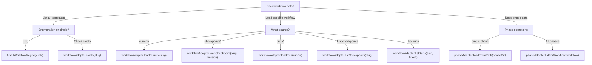

# Entity Architecture Guide

This guide explains the Chainglass entity architecture - the unified model for workflows, phases, and runs.

## Why Entities Exist

Prior to the entity architecture, workflows, runs, and phases were "diffuse concepts" expressed entirely through service calls and scattered JSON files. This made:

- **CLI commands like `cg runs list` impossible** - no way to enumerate runs
- **Web integration friction-heavy** - each consumer needed to understand filesystem structure
- **Testing difficult** - services mixed I/O with business logic

The entity architecture solves these problems with:

- **First-class entity classes** (Workflow, Phase) that can be instantiated from filesystem paths
- **Unified models** - current, checkpoint, and run are all Workflows (same structure, different populated state)
- **Pure data** - entities contain no adapter references and have no async methods
- **Adapter separation** - adapters handle I/O, entities are pure data

## Key Invariants

These invariants define the unified entity model:

### 1. Workflow Source Exclusivity

```
isCurrent XOR isCheckpoint XOR isRun
```

A Workflow is loaded from EXACTLY ONE source - never both checkpoint AND run. The `source` property returns `'current'`, `'checkpoint'`, or `'run'`.

### 2. Phase Structure Identity

```
Template Phase ≡ Run Phase (same fields, different populated values)
```

- **Template phase**: `exists=false`, `value=undefined`, `status='pending'`
- **Run phase**: `exists=true/false`, `value=populated`, `status=runtime state`

### 3. Adapter Responsibility

```
Adapters do I/O → Entities are pure data
```

No adapter references in entities, no async methods on entities. All filesystem operations go through adapters.

### 4. Data Locality

```
Each entity loads from its OWN filesystem path
```

Phase reads from `phaseDir`, not from parent `wf.yaml`. This enables independent loading and testing.

---

## Unified Workflow Model

A Workflow can be loaded from three sources, all using the same `Workflow` class:

| Source | Property | Metadata Populated | Purpose |
|--------|----------|-------------------|---------|
| `current/` | `isCurrent=true` | None | Editable working copy |
| `checkpoints/` | `isCheckpoint=true` | `checkpoint` | Immutable snapshot |
| `runs/` | `isRun=true` | `checkpoint` + `run` | Execution with runtime state |

### Factory Methods

The `Workflow` class uses the factory pattern with a private constructor to enforce the XOR invariant:

```typescript
import { Workflow } from '@chainglass/workflow';

// Create from current/ (editable template)
const current = Workflow.createCurrent({
  slug: 'hello-workflow',
  workflowDir: '.chainglass/workflows/hello-workflow/current',
  version: '1.0.0',
  phases: [],
});
// current.isCurrent === true
// current.isCheckpoint === false
// current.isRun === false

// Create from a checkpoint (frozen snapshot)
const checkpoint = Workflow.createCheckpoint({
  slug: 'hello-workflow',
  workflowDir: '.chainglass/workflows/hello-workflow/checkpoints/v001-abc12345',
  version: '1.0.0',
  phases: [],
  checkpoint: {
    ordinal: 1,
    hash: 'abc12345',
    createdAt: new Date('2026-01-25T10:00:00Z'),
    comment: 'Initial release',
  },
});
// checkpoint.isCurrent === false
// checkpoint.isCheckpoint === true
// checkpoint.isRun === false

// Create from a run (execution with runtime state)
const run = Workflow.createRun({
  slug: 'hello-workflow',
  workflowDir: '.chainglass/runs/hello-workflow/v001-abc12345/run-2026-01-25-001',
  version: '1.0.0',
  phases: [],
  checkpoint: {
    ordinal: 1,
    hash: 'abc12345',
    createdAt: new Date('2026-01-25T10:00:00Z'),
  },
  run: {
    runId: 'run-2026-01-25-001',
    runDir: '.chainglass/runs/hello-workflow/v001-abc12345/run-2026-01-25-001',
    status: 'active',
    createdAt: new Date('2026-01-25T10:00:00Z'),
  },
});
// run.isCurrent === false
// run.isCheckpoint === false
// run.isRun === true
```

### Computed Properties

The Workflow class provides helper properties:

| Property | Type | Description |
|----------|------|-------------|
| `isCurrent` | `boolean` | True if loaded from `current/` |
| `isCheckpoint` | `boolean` | True if loaded from `checkpoints/` |
| `isRun` | `boolean` | True if loaded from `runs/` |
| `isTemplate` | `boolean` | True if current OR checkpoint (not a run) |
| `source` | `string` | Returns `'current'`, `'checkpoint'`, or `'run'` |

---

## Phase Entity

The Phase entity represents a single phase in a workflow. Like Workflow, it uses a unified model where template phases and run phases have the same structure:

| Scenario | `exists` | `value` | `status` |
|----------|----------|---------|----------|
| Template phase | `false` | `undefined` | `'pending'` |
| Run phase | `true`/`false` | populated | runtime state |

### Phase Status Lifecycle

```
pending → ready → active → complete
                     ↓
                  blocked
                     ↓
                  failed
```

| Status | Description | Computed Property |
|--------|-------------|-------------------|
| `pending` | Waiting for prepare | `isPending` |
| `ready` | Inputs resolved, ready to start | `isReady` |
| `active` | Agent currently working | `isActive` |
| `blocked` | Needs human input (question) | `isBlocked` |
| `complete` | Successfully completed | `isComplete` |
| `failed` | Failed with error | `isFailed` |

Additional computed properties:
- `isDone` - True if complete OR failed
- `duration` - Milliseconds between `startedAt` and `completedAt`

### Phase Structure

```typescript
import { Phase } from '@chainglass/workflow';

const phase = new Phase({
  // Identity
  name: 'gather',
  phaseDir: '.chainglass/runs/.../phases/gather',
  runDir: '.chainglass/runs/.../run-2026-01-25-001',

  // Definition
  description: 'Collect input data',
  order: 1,

  // Runtime state
  status: 'active',
  facilitator: 'agent',
  state: 'active',
  startedAt: new Date('2026-01-25T10:05:00Z'),

  // Input files (with existence status)
  inputFiles: [{
    name: 'data.json',
    required: true,
    exists: true,
    path: '.../inputs/data.json',
  }],

  // Input parameters (with resolved values)
  inputParameters: [{
    name: 'item_count',
    required: true,
    value: 42,
  }],

  // Output files (with validation status)
  outputs: [{
    name: 'result.json',
    type: 'file',
    required: true,
    exists: true,
    valid: true,
    path: '.../outputs/result.json',
  }],
});
```

---

## Adapter Method Decision Tree

When you need to load workflow data, use the correct adapter method:



### Method Reference

| Method | Input | Returns | Use Case |
|--------|-------|---------|----------|
| `loadCurrent(slug)` | Slug | `Workflow` (isCurrent) | Edit template |
| `loadCheckpoint(slug, version)` | Slug + version | `Workflow` (isCheckpoint) | Inspect snapshot |
| `loadRun(runDir)` | Path | `Workflow` (isRun) | Run details |
| `listCheckpoints(slug)` | Slug | `Workflow[]` | Version history |
| `listRuns(slug, filter?)` | Slug + filter | `Workflow[]` | Run listing |
| `exists(slug)` | Slug | `boolean` | Check existence |
| `loadFromPath(phaseDir)` | Path | `Phase` | Single phase |
| `listForWorkflow(workflow)` | Workflow | `Phase[]` | All phases |

### Two-Adapter Pattern

When loading a run with its phases, you must call BOTH adapters:

```typescript
// Per DYK-04: loadRun() returns a Workflow with empty phases[]
// You MUST call PhaseAdapter separately to get phase data

const workflowAdapter = container.resolve<IWorkflowAdapter>(WORKFLOW_DI_TOKENS.WORKFLOW_ADAPTER);
const phaseAdapter = container.resolve<IPhaseAdapter>(WORKFLOW_DI_TOKENS.PHASE_ADAPTER);

// Step 1: Load the run
const workflow = await workflowAdapter.loadRun(runDir);
// workflow.phases === [] (always empty from loadRun)

// Step 2: Load phases separately
const phases = await phaseAdapter.listForWorkflow(workflow);
// phases is populated Phase[] array

// Step 3: Combine for output
console.log(JSON.stringify({
  ...workflow.toJSON(),
  phases: phases.map(p => p.toJSON()),
}));
```

---

## Testing with Fake Adapters

The entity architecture uses dependency injection for testability. Test containers use fake adapters instead of real filesystem operations.

### FakeWorkflowAdapter

```typescript
import { FakeWorkflowAdapter, Workflow } from '@chainglass/workflow';

const adapter = new FakeWorkflowAdapter();

// Configure expected responses
adapter.loadCurrentResult = Workflow.createCurrent({
  slug: 'test-workflow',
  workflowDir: '/fake/path',
  version: '1.0.0',
  phases: [],
});

// Call the method
const workflow = await adapter.loadCurrent('test-workflow');

// Assert on calls made
expect(adapter.loadCurrentCalls).toHaveLength(1);
expect(adapter.loadCurrentCalls[0].slug).toBe('test-workflow');
```

### Call Tracking Pattern

Fake adapters use private arrays with spread operator getters:

```typescript
// Private tracking (mutation safe)
private _loadCurrentCalls: LoadCurrentCall[] = [];

// Public getter returns a copy
get loadCurrentCalls(): LoadCurrentCall[] {
  return [...this._loadCurrentCalls];
}
```

### Default Behaviors

| Method Type | Default Behavior |
|-------------|-----------------|
| Entity lookups (`load*`) | Throws `EntityNotFoundError` |
| Collection queries (`list*`) | Returns `[]` |
| Boolean checks (`exists`) | Returns `false` |

### Per-Slug Results

For multi-workflow tests, use `listRunsResultBySlug`:

```typescript
const adapter = new FakeWorkflowAdapter();

// Configure different results per workflow
adapter.listRunsResultBySlug.set('hello-wf', [helloRun]);
adapter.listRunsResultBySlug.set('data-wf', [dataRun]);

// Each workflow returns its configured runs
const helloRuns = await adapter.listRuns('hello-wf'); // [helloRun]
const dataRuns = await adapter.listRuns('data-wf');   // [dataRun]
```

### Test Container Registration

Per ADR-0004, use `useFactory` for production and `useValue` for fakes:

```typescript
import { createContainer } from 'tsyringe';
import { WORKFLOW_DI_TOKENS } from '@chainglass/shared';
import { FakeWorkflowAdapter, FakePhaseAdapter } from '@chainglass/workflow';

function createTestContainer() {
  const container = createContainer();

  const fakeWorkflowAdapter = new FakeWorkflowAdapter();
  const fakePhaseAdapter = new FakePhaseAdapter();

  // Use useValue for test containers
  container.register(WORKFLOW_DI_TOKENS.WORKFLOW_ADAPTER, { useValue: fakeWorkflowAdapter });
  container.register(WORKFLOW_DI_TOKENS.PHASE_ADAPTER, { useValue: fakePhaseAdapter });

  return container;
}
```

---

## JSON Output Format

Entities provide `toJSON()` methods for serialization to API/web consumers.

### Serialization Rules

| Rule | Entity Value | JSON Output |
|------|--------------|-------------|
| Property names | camelCase | camelCase |
| `undefined` | `undefined` | `null` |
| `Date` | `Date` object | ISO-8601 string |
| Nested entities | Entity instances | Recursive `toJSON()` |

### WorkflowJSON Type

```typescript
interface WorkflowJSON {
  slug: string;
  workflowDir: string;
  version: string;
  description: string | null;        // undefined → null
  isCurrent: boolean;
  isCheckpoint: boolean;
  isRun: boolean;
  isTemplate: boolean;
  source: 'current' | 'checkpoint' | 'run';
  checkpoint: {
    ordinal: number;
    hash: string;
    createdAt: string;               // Date → ISO string
    comment: string | null;
  } | null;
  run: {
    runId: string;
    runDir: string;
    status: RunStatus;
    createdAt: string;
  } | null;
  phases: PhaseJSON[];
}
```

### PhaseJSON Type

```typescript
interface PhaseJSON {
  name: string;
  phaseDir: string;
  runDir: string;
  description: string;
  order: number;
  status: PhaseRunStatus;
  facilitator: 'agent' | 'orchestrator' | 'system';
  state: PhaseState;
  startedAt: string | null;          // Date → ISO string
  completedAt: string | null;
  duration: number | null;           // milliseconds
  isPending: boolean;
  isReady: boolean;
  isActive: boolean;
  isBlocked: boolean;
  isComplete: boolean;
  isFailed: boolean;
  isDone: boolean;
  inputFiles: PhaseInputFile[];
  inputParameters: PhaseInputParameter[];
  inputMessages: PhaseInputMessage[];
  outputs: PhaseOutput[];
  outputParameters: PhaseOutputParameter[];
  statusHistory: PhaseStatusEntry[];
  messages: unknown[];
}
```

### Example Output

```typescript
const workflow = Workflow.createRun({...});
console.log(JSON.stringify(workflow.toJSON(), null, 2));
```

```json
{
  "slug": "hello-workflow",
  "workflowDir": ".chainglass/runs/hello-workflow/v001-abc12345/run-2026-01-25-001",
  "version": "1.0.0",
  "description": null,
  "isCurrent": false,
  "isCheckpoint": false,
  "isRun": true,
  "isTemplate": false,
  "source": "run",
  "checkpoint": {
    "ordinal": 1,
    "hash": "abc12345",
    "createdAt": "2026-01-25T10:00:00.000Z",
    "comment": null
  },
  "run": {
    "runId": "run-2026-01-25-001",
    "runDir": ".chainglass/runs/hello-workflow/v001-abc12345/run-2026-01-25-001",
    "status": "active",
    "createdAt": "2026-01-25T10:00:00.000Z"
  },
  "phases": []
}
```

---

## Common Pitfalls

### What NOT to Do

| Anti-Pattern | Why It's Wrong | Correct Approach |
|--------------|----------------|------------------|
| `workflow.loadPhases()` | Entities have no async methods | `phaseAdapter.listForWorkflow(workflow)` |
| `new WorkflowAdapter()` | Bypasses DI container | `container.resolve(WORKFLOW_DI_TOKENS.WORKFLOW_ADAPTER)` |
| `path.join(a, b)` | No path security | `pathResolver.join(a, b)` |
| `workflow.phases` on runs | Always empty from loadRun | Call PhaseAdapter separately |
| Caching adapter results | Violates always-fresh reads | Re-fetch when needed |

### Correct Patterns

```typescript
// GOOD: Resolve adapter from container
const adapter = container.resolve<IWorkflowAdapter>(WORKFLOW_DI_TOKENS.WORKFLOW_ADAPTER);

// GOOD: Use pathResolver for paths
const fullPath = pathResolver.join(baseDir, subDir);

// GOOD: Get phases via adapter, not entity
const workflow = await workflowAdapter.loadRun(runDir);
const phases = await phaseAdapter.listForWorkflow(workflow);

// GOOD: Use toJSON() for serialization
const output = {
  ...workflow.toJSON(),
  phases: phases.map(p => p.toJSON()),
};
```

---

## Next Steps

- [CLI Reference](./3-cli-reference.md) - Command documentation including `cg runs` commands
- [MCP Reference](./4-mcp-reference.md) - MCP tool documentation
- [Overview](./1-overview.md) - System concepts and phase lifecycle
