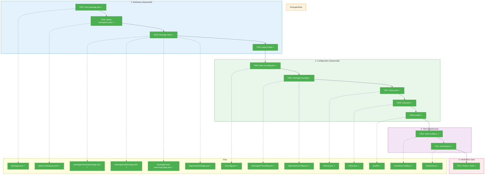
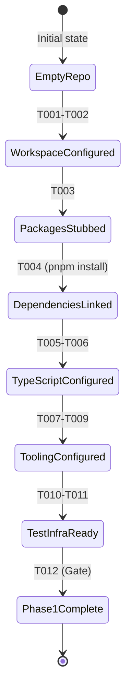
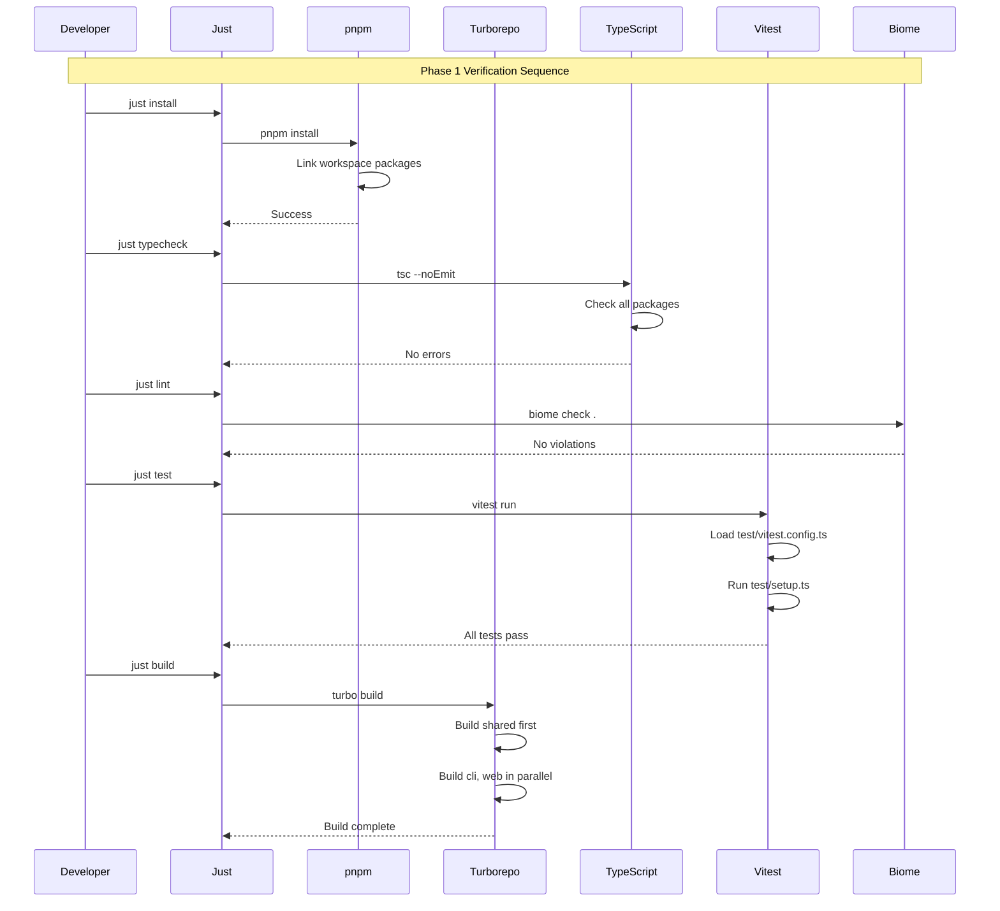

# Phase 1: Monorepo Foundation – Tasks & Alignment Brief

**Spec**: [../../project-setup-spec.md](../../project-setup-spec.md)
**Plan**: [../../project-setup-plan.md](../../project-setup-plan.md)
**Date**: 2026-01-18
**Phase Slug**: `phase-1-monorepo-foundation`

---

## Executive Briefing

### Purpose

This phase establishes the monorepo infrastructure that enables all subsequent development. Without these foundations, no code can be written, tested, or built. This is the critical bootstrap sequence that every other phase depends on.

### What We're Building

A fully functional TypeScript monorepo with:
- **pnpm workspaces**: Links `packages/shared`, `packages/cli`, `packages/mcp-server`, and `apps/web` for efficient dependency management
- **Turborepo**: Orchestrates builds with intelligent caching and dependency-aware task execution
- **TypeScript**: Strict mode configuration with path aliases for clean imports
- **Biome**: Fast linting and formatting (20x faster than ESLint/Prettier)
- **Vitest**: Test runner with path resolution matching pnpm workspaces
- **Just**: Task runner providing ergonomic developer commands

### User Value

Developers can clone the repository and be productive immediately:
```bash
git clone <repo>
cd chainglass
just install && just dev
```

All tooling works out of the box. No manual configuration, no dependency conflicts, no "works on my machine" issues.

### Example

**Before Phase 1**:
```bash
$ pnpm install
Error: No pnpm-workspace.yaml found
$ just test
Error: just command not found (no justfile)
```

**After Phase 1**:
```bash
$ pnpm install
Packages linked from workspace...done
$ just --list
  install   - Install dependencies
  dev       - Start development server
  build     - Build all packages
  test      - Run tests
  lint      - Run linter
  format    - Format code
  fft       - Fix, format, and test
  typecheck - Run TypeScript checks
$ just typecheck
✓ No errors found
```

---

## Objectives & Scope

### Objective

Establish the monorepo infrastructure with pnpm, Turborepo, TypeScript, Biome, Vitest, and Just. Upon completion, the verification gate `pnpm install && just --list && just typecheck` must pass.

### Behavior Checklist (from Spec AC-1, AC-3, AC-4, AC-9, AC-10)

- [ ] `pnpm install` completes without errors, workspace packages linked
- [ ] `just --list` displays all defined commands
- [ ] `just typecheck` passes with strict mode
- [ ] `just lint` runs Biome without errors
- [ ] `pnpm tsc --build --dry` shows correct build order

### Goals

- ✅ Create root `package.json` with bin exports for `cg` and `chainglass`
- ✅ Define workspace packages in `pnpm-workspace.yaml`
- ✅ Create minimal package stubs (shared, cli, mcp-server, web) to satisfy bootstrap
- ✅ Configure base `tsconfig.json` with strict mode and path aliases
- ✅ Configure `biome.json` for linting and formatting
- ✅ Configure `turbo.json` for build orchestration with caching
- ✅ Create `justfile` with developer commands
- ✅ Set up centralized test infrastructure with `test/vitest.config.ts`

### Non-Goals (Scope Boundaries)

- ❌ **Implementing business logic** – Only empty stubs with package.json
- ❌ **Writing tests for business features** – Only test infrastructure setup
- ❌ **Creating UI components** – No React components in this phase
- ❌ **Configuring CI/CD** – Out of scope per spec Non-Goals
- ❌ **npm publish setup** – Package registry configuration is Phase 4+
- ❌ **Database configuration** – Explicitly excluded in spec
- ❌ **Performance optimization** – Focus on correctness first

---

## Architecture Map

### Component Diagram

<!-- Status: grey=pending, orange=in-progress, green=completed, red=blocked -->
<!-- Updated by plan-6 during implementation -->



### Task-to-Component Mapping

<!-- Status: ⬜ Pending | 🟧 In Progress | ✅ Complete | 🔴 Blocked -->

| Task | Component(s) | Files | Status | Comment |
|------|-------------|-------|--------|---------|
| T001 | Root Config | `/package.json` | ✅ Complete | pnpm init + bin exports |
| T002 | Workspace | `/pnpm-workspace.yaml` | ✅ Complete | Define packages/* and apps/* |
| T003 | Package Stubs | `/packages/*/package.json`, `/apps/web/package.json` | ✅ Complete | Minimal name+version only |
| T004 | Dependency Link | N/A (command) | ✅ Complete | Verify `pnpm install` success |
| T005 | TypeScript | `/tsconfig.json` | ✅ Complete | Strict mode + path aliases |
| T006 | TypeScript | `/packages/*/tsconfig.json`, `/apps/web/tsconfig.json` | ✅ Complete | Extends root, composite mode |
| T007 | Linting | `/biome.json` | ✅ Complete | Recommended rules |
| T008 | Build | `/turbo.json` | ✅ Complete | Pipeline with ^build deps |
| T009 | Task Runner | `/justfile` | ✅ Complete | Developer commands |
| T010 | Test Config | `/test/vitest.config.ts` | ✅ Complete | Path resolution setup |
| T011 | Test Setup | `/test/setup.ts`, `/test/unit/placeholder.test.ts` | ✅ Complete | DI reset + placeholder test |
| T012 | Gate | N/A (verification) | ✅ Complete | All checks pass |

---

## Tasks

| Status | ID | Task | CS | Type | Dependencies | Absolute Path(s) | Validation | Subtasks | Notes |
|--------|------|------|-----|------|--------------|------------------|------------|----------|-------|
| [x] | T001 | Create root package.json with workspace config and bin exports | 1 | Setup | – | `/Users/jordanknight/substrate/chainglass/package.json` | `pnpm init` succeeds; `bin.cg` and `bin.chainglass` defined | – | log#T001 [^1] |
| [x] | T002 | Create pnpm-workspace.yaml defining workspace packages | 1 | Setup | T001 | `/Users/jordanknight/substrate/chainglass/pnpm-workspace.yaml` | References `packages/*` and `apps/*` | – | Must exist before `pnpm install` · log#T002 [^1] |
| [x] | T003 | Create minimal package stubs (shared, cli, mcp-server, web) | 1 | Setup | T002 | `/Users/jordanknight/substrate/chainglass/packages/shared/package.json`, `/Users/jordanknight/substrate/chainglass/packages/cli/package.json`, `/Users/jordanknight/substrate/chainglass/packages/mcp-server/package.json`, `/Users/jordanknight/substrate/chainglass/apps/web/package.json` | Each has `name` and `version` fields; names match workspace patterns | – | Per Critical Discovery 01: staged bootstrap · log#T003 [^1] |
| [x] | T004 | Run initial pnpm install and verify workspace linking | 1 | Setup | T003 | N/A | `pnpm install` completes without errors; `node_modules/@chainglass` contains symlinks | – | Gate before configuration · log#T004 [^1] |
| [x] | T005 | Create base tsconfig.json with strict mode and path aliases | 2 | Config | T004 | `/Users/jordanknight/substrate/chainglass/tsconfig.json` | Strict mode enabled; paths for `@chainglass/shared`, `@chainglass/cli`, `@test/*` defined | – | Per Critical Discovery 05 · log#T005 [^2] |
| [x] | T006 | Create package-level tsconfigs extending root with composite mode | 2 | Config | T005 | `/Users/jordanknight/substrate/chainglass/packages/shared/tsconfig.json`, `/Users/jordanknight/substrate/chainglass/packages/cli/tsconfig.json`, `/Users/jordanknight/substrate/chainglass/packages/mcp-server/tsconfig.json`, `/Users/jordanknight/substrate/chainglass/apps/web/tsconfig.json` | Each extends root; `composite: true`; `pnpm tsc --build --dry` shows correct order | – | log#T006 [^2] |
| [x] | T007 | Create biome.json with recommended linter and formatter rules | 1 | Config | T006 | `/Users/jordanknight/substrate/chainglass/biome.json` | `pnpm biome check .` runs without config errors; recommended preset active | – | Must exist before writing source code · log#T007 [^1] |
| [x] | T008 | Create turbo.json with build pipeline and caching | 2 | Config | T007 | `/Users/jordanknight/substrate/chainglass/turbo.json` | `build` task has `dependsOn: ["^build"]`; `outputs: ["dist/**"]` defined; cached builds work | – | log#T008 [^1] |
| [x] | T009 | Create justfile with developer commands | 2 | Config | T008 | `/Users/jordanknight/substrate/chainglass/justfile` | Commands: install, dev, build, test, lint, format, fft, typecheck, check; `just --list` shows all | – | log#T009 [^1] |
| [x] | T010 | Create test/vitest.config.ts with path resolution | 2 | Test | T009 | `/Users/jordanknight/substrate/chainglass/test/vitest.config.ts` | `vite-tsconfig-paths` plugin configured; aliases for workspace packages resolve | – | Per Critical Discovery 05 · log#T010 [^3] |
| [x] | T011 | Create test/setup.ts and placeholder test | 1 | Test | T010 | `/Users/jordanknight/substrate/chainglass/test/setup.ts`, `/Users/jordanknight/substrate/chainglass/test/unit/placeholder.test.ts` | TSyringe container cleared in beforeEach; `just test` passes with 1 test | – | NO @chainglass/* imports; placeholder deleted in Phase 2 · log#T011 [^3] |
| [x] | T012 | Verify Phase 1 gate: pnpm install && just --list && just typecheck | 1 | Gate | T011 | N/A | All three commands pass without errors | – | GATE: Must pass before Phase 2 · log#T012 |

---

## Alignment Brief

### Prior Phases Review

N/A – This is Phase 1 (foundational phase). No prior phases to review.

### Critical Findings Affecting This Phase

| Finding | What It Constrains | Tasks Addressing |
|---------|-------------------|------------------|
| **Critical Discovery 01: Bootstrap Sequence** | Files must be created in specific order: workspace yaml before install, packages before turbo | T001→T002→T003→T004 (strict sequence) |
| **Critical Discovery 05: Vitest Path Resolution** | Three systems must align: pnpm, TypeScript, Vitest | T005 (path aliases), T010 (vitest plugin) |

**Critical Discovery 01 Detail**:

> **Problem**: Phase 1 has a strict internal dependency order. Running `pnpm install` on incomplete configuration fails with cryptic errors. Turborepo needs packages that don't exist yet.
>
> **Solution**: Staged bootstrap approach:
> 1. Create minimal `pnpm-workspace.yaml` first
> 2. Create package directories with minimal `package.json` (name + version only)
> 3. Run `pnpm install` to establish linking
> 4. Add `turbo.json` after packages have build scripts

**Critical Discovery 05 Detail**:

> **Problem**: Centralized test suite at `test/` must resolve imports from multiple packages. Three systems must agree: pnpm, TypeScript, Vitest.
>
> **Solution**: Configure all three with matching path aliases in `tsconfig.json` AND `vitest.config.ts`.

### ADR Decision Constraints

| ADR | Status | Constraint | Addressed By |
|-----|--------|------------|--------------|
| ADR-001: Monorepo Structure | SEED | Must use pnpm workspaces + Turborepo | T002, T003, T008 |
| ADR-003: Test Strategy | SEED | Must use Vitest with centralized test suite | T010, T011 |

### Invariants & Guardrails

- **No source code in this phase**: Only configuration files and empty package stubs
- **Strict TypeScript mode**: All tsconfig.json files must have `strict: true`
- **Path aliases must resolve**: Test imports like `@chainglass/shared` must work

### Inputs to Read

| File | Purpose |
|------|---------|
| `/Users/jordanknight/substrate/chainglass/README.md` | Existing content to preserve |
| `/Users/jordanknight/substrate/chainglass/.gitignore` | Existing patterns |

### Visual Alignment Aids

#### System State Flow



#### Interaction Sequence



### Test Plan

**Approach**: No unit tests in Phase 1 (configuration only). Verification through CLI commands.

| Test | Type | Command | Expected Result |
|------|------|---------|-----------------|
| Workspace linking | Integration | `pnpm install` | Exit 0, symlinks created |
| TypeScript compilation | Integration | `pnpm tsc --noEmit` | Exit 0, no errors |
| Build order | Integration | `pnpm tsc --build --dry` | Shows shared → cli, web |
| Linter works | Integration | `pnpm biome check .` | Exit 0 |
| Task runner | Integration | `just --list` | Shows all commands |

### Implementation Outline

| Step | Tasks | Action | Verification |
|------|-------|--------|--------------|
| 1 | T001 | Initialize root package.json with pnpm | File exists with correct structure |
| 2 | T002 | Create pnpm-workspace.yaml | File exists, valid YAML |
| 3 | T003 | Create 4 package stubs | All 4 package.json files exist |
| 4 | T004 | Run `pnpm install` | No errors, symlinks present |
| 5 | T005 | Create root tsconfig.json | Valid JSON, strict mode |
| 6 | T006 | Create 4 package tsconfigs | All extend root, composite true |
| 7 | T007 | Create biome.json | Biome can lint |
| 8 | T008 | Create turbo.json | Turbo recognizes pipeline |
| 9 | T009 | Create justfile | `just --list` works |
| 10 | T010 | Create vitest.config.ts | Config loads without errors |
| 11 | T011 | Create test/setup.ts | File imports without errors |
| 12 | T012 | Run gate verification | All three commands pass |

### Commands to Run

```bash
# After T001-T003: Verify workspace structure
cat package.json | jq '.name'
cat pnpm-workspace.yaml
ls packages/*/package.json apps/*/package.json

# After T004: Verify linking
pnpm install
ls -la node_modules/@chainglass/

# After T005-T006: Verify TypeScript
pnpm tsc --build --dry

# After T007: Verify Biome
pnpm biome check .

# After T008: Verify Turborepo
pnpm turbo build --dry-run

# After T009: Verify Just
just --list

# After T010-T011: Verify test infrastructure
pnpm vitest run --passWithNoTests

# T012: Phase Gate (full verification)
pnpm install && just --list && just typecheck
```

### Risks & Unknowns

| Risk | Severity | Likelihood | Mitigation |
|------|----------|------------|------------|
| pnpm workspace linking fails | High | Low | Follow exact bootstrap sequence (T001→T002→T003→T004) |
| TypeScript path aliases don't resolve | Medium | Medium | Verify with actual imports in T010 |
| Biome conflicts with TypeScript | Low | Low | Use recommended preset, minimal customization |
| Just not installed on machine | Medium | Medium | Document in README, provide npm script fallbacks |

### Ready Check

- [x] Critical findings mapped to tasks (Bootstrap sequence: T001-T004, Path resolution: T005+T010)
- [x] ADR constraints mapped to tasks (ADR-001: T002,T003,T008; ADR-003: T010,T011)
- [x] All 12 tasks have validation criteria defined
- [x] Task dependencies form valid DAG (no cycles)
- [x] All absolute paths verified correct
- [ ] **GO/NO-GO**: Awaiting human approval

---

## Phase Footnote Stubs

**NOTE**: Footnotes will be added during implementation by plan-6a-update-progress.

| Footnote | Task | Description | Date |
|----------|------|-------------|------|
| [^1] | T001-T004, T007-T009 | Root configuration files | 2026-01-18 |
| [^2] | T003, T005-T006 | Package configurations | 2026-01-18 |
| [^3] | T003, T006, T010-T011 | Web app and test configurations | 2026-01-18 |

[^1]: Phase 1 - Root configuration files
  - `file:/Users/jordanknight/substrate/chainglass/package.json`
  - `file:/Users/jordanknight/substrate/chainglass/pnpm-workspace.yaml`
  - `file:/Users/jordanknight/substrate/chainglass/tsconfig.json`
  - `file:/Users/jordanknight/substrate/chainglass/biome.json`
  - `file:/Users/jordanknight/substrate/chainglass/turbo.json`
  - `file:/Users/jordanknight/substrate/chainglass/justfile`

[^2]: Phase 1 - Package configurations
  - `file:/Users/jordanknight/substrate/chainglass/packages/shared/package.json`
  - `file:/Users/jordanknight/substrate/chainglass/packages/shared/tsconfig.json`
  - `file:/Users/jordanknight/substrate/chainglass/packages/shared/src/index.ts`
  - `file:/Users/jordanknight/substrate/chainglass/packages/cli/package.json`
  - `file:/Users/jordanknight/substrate/chainglass/packages/cli/tsconfig.json`
  - `file:/Users/jordanknight/substrate/chainglass/packages/cli/src/index.ts`
  - `file:/Users/jordanknight/substrate/chainglass/packages/mcp-server/package.json`
  - `file:/Users/jordanknight/substrate/chainglass/packages/mcp-server/tsconfig.json`
  - `file:/Users/jordanknight/substrate/chainglass/packages/mcp-server/src/index.ts`

[^3]: Phase 1 - Web app and test configurations
  - `file:/Users/jordanknight/substrate/chainglass/apps/web/package.json`
  - `file:/Users/jordanknight/substrate/chainglass/apps/web/tsconfig.json`
  - `file:/Users/jordanknight/substrate/chainglass/apps/web/next.config.ts`
  - `file:/Users/jordanknight/substrate/chainglass/apps/web/app/page.tsx`
  - `file:/Users/jordanknight/substrate/chainglass/apps/web/app/layout.tsx`
  - `file:/Users/jordanknight/substrate/chainglass/test/vitest.config.ts`
  - `file:/Users/jordanknight/substrate/chainglass/test/setup.ts`
  - `file:/Users/jordanknight/substrate/chainglass/test/unit/placeholder.test.ts`

---

## Evidence Artifacts

**Execution Log Location**: `/Users/jordanknight/substrate/chainglass/docs/plans/001-project-setup/tasks/phase-1-monorepo-foundation/execution.log.md`

**Evidence Files** (created during implementation):
- `execution.log.md` – Detailed implementation narrative
- Screenshots or terminal output as needed

---

## Discoveries & Learnings

_Populated during implementation by plan-6. Log anything of interest to your future self._

| Date | Task | Type | Discovery | Resolution | References |
|------|------|------|-----------|------------|------------|
| | | | | | |

**Types**: `gotcha` | `research-needed` | `unexpected-behavior` | `workaround` | `decision` | `debt` | `insight`

**What to log**:
- Things that didn't work as expected
- External research that was required
- Implementation troubles and how they were resolved
- Gotchas and edge cases discovered
- Decisions made during implementation
- Technical debt introduced (and why)
- Insights that future phases should know about

_See also: `execution.log.md` for detailed narrative._

---

## Directory Layout

```
docs/plans/001-project-setup/
├── project-setup-spec.md
├── project-setup-plan.md
├── research-dossier.md
├── implementation-discoveries.md
├── risk-mitigation.md
└── tasks/
    └── phase-1-monorepo-foundation/
        ├── tasks.md                 # This file
        └── execution.log.md         # Created by plan-6
```

---

**Tasks Generated**: 2026-01-18
**Task Count**: 12 tasks (T001-T012)
**Total Complexity Score**: 16 (CS-1 × 6 + CS-2 × 6)
**Ready for Implementation**: Awaiting GO confirmation
