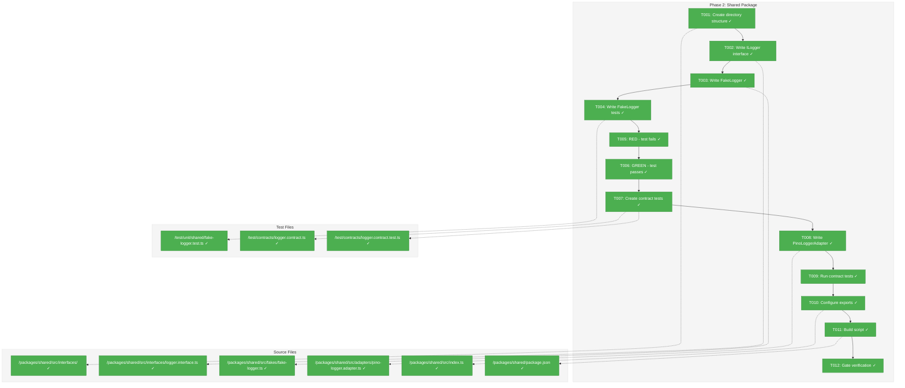
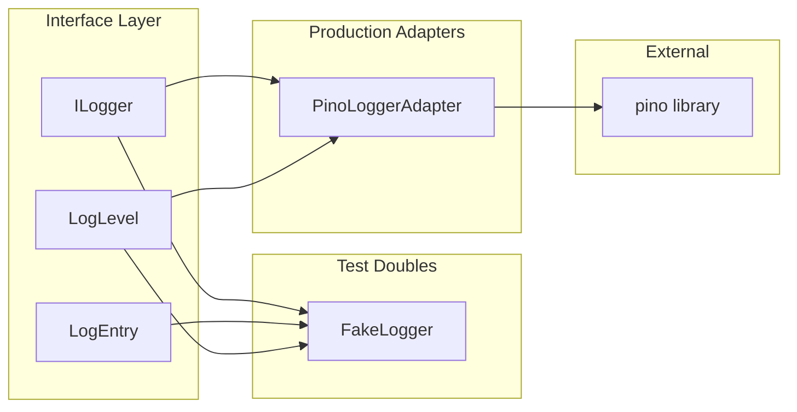
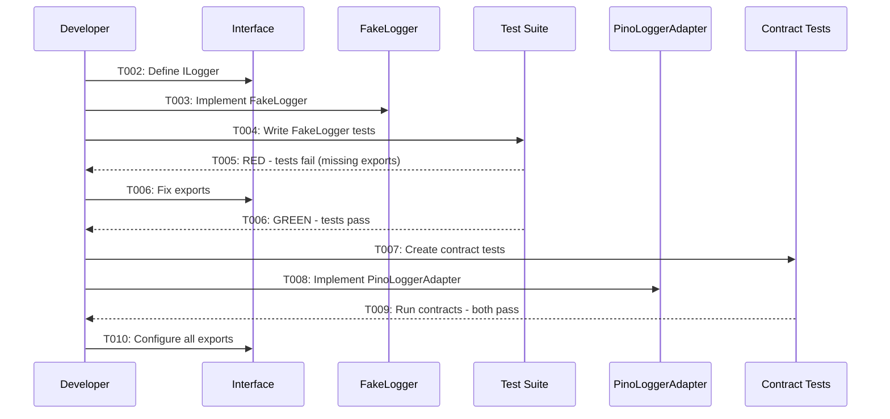

# Phase 2: Shared Package – Tasks & Alignment Brief

**Spec**: [../../project-setup-spec.md](../../project-setup-spec.md)
**Plan**: [../../project-setup-plan.md](../../project-setup-plan.md)
**Date**: 2026-01-18

---

## Executive Briefing

### Purpose
This phase creates the core `@chainglass/shared` package with the foundational `ILogger` interface, `FakeLogger` test double, and `PinoLoggerAdapter` real implementation. This establishes the interface-first TDD pattern that all future services and adapters will follow.

### What We're Building
A fully functional shared package that:
- Defines the `ILogger` interface with all standard log levels (trace, debug, info, warn, error, fatal) and child logger support
- Implements `FakeLogger` with assertion helpers for testing (`assertLoggedAtLevel()`, `getEntries()`, `getEntriesByLevel()`, `clear()`)
- Implements `PinoLoggerAdapter` as the production logging solution
- Provides contract tests ensuring both implementations behave identically
- Exports all interfaces, fakes, and adapters properly for consumption by other packages

### User Value
All packages in the monorepo will use a consistent logging interface. Tests can use `FakeLogger` for deterministic assertions without external dependencies. Production code uses `PinoLoggerAdapter` for structured JSON logging.

### Example
```typescript
// Test code using FakeLogger
const fakeLogger = new FakeLogger();
const service = new MyService(fakeLogger);
await service.process('input');
fakeLogger.assertLoggedAtLevel(LogLevel.INFO, 'Processing input');

// Production code using PinoLoggerAdapter
const logger = new PinoLoggerAdapter();
const service = new MyService(logger);
await service.process('input'); // Logs to stdout as JSON
```

---

## Objectives & Scope

### Objective
Create the `@chainglass/shared` package with ILogger interface, FakeLogger, and PinoLoggerAdapter using interface-first TDD, as specified in plan.md Phase 2.

### Goals

- ✅ Create directory structure: `interfaces/`, `adapters/`, `fakes/`, `types/`
- ✅ Define `ILogger` interface with all log levels and child() method
- ✅ Implement `FakeLogger` with test assertion helpers
- ✅ Implement `PinoLoggerAdapter` using pino
- ✅ Create contract tests verifying both implementations
- ✅ Configure package exports for clean imports
- ✅ Verify imports resolve from centralized `test/` directory

### Non-Goals

- ❌ Implementing services that use ILogger (deferred to Phase 3)
- ❌ Creating additional interfaces beyond ILogger (future phases)
- ❌ Log aggregation, log shipping, or external logging infrastructure
- ❌ Custom log formatters or prettifiers (use pino defaults)
- ❌ Log level configuration via environment variables (future enhancement)
- ❌ Async logging or buffering (keep synchronous for simplicity)

---

## Architecture Map

### Component Diagram
<!-- Status: grey=pending, orange=in-progress, green=completed, red=blocked -->
<!-- Updated by plan-6 during implementation -->



### Task-to-Component Mapping

<!-- Status: ⬜ Pending | 🟧 In Progress | ✅ Complete | 🔴 Blocked -->

| Task | Component(s) | Files | Status | Comment |
|------|-------------|-------|--------|---------|
| T001 | Directory Setup | /packages/shared/src/{interfaces,adapters,fakes,types}/ | ✅ Complete | Create clean architecture directories |
| T002 | ILogger Interface | /packages/shared/src/interfaces/logger.interface.ts | ✅ Complete | Interface-first per Critical Discovery 08 |
| T003 | FakeLogger | /packages/shared/src/fakes/fake-logger.ts | ✅ Complete | Test double with assertion helpers |
| T004 | FakeLogger Tests | /test/unit/shared/fake-logger.test.ts | ✅ Complete | TDD: write tests for FakeLogger |
| T005 | RED Phase | - | ✅ Complete | TDD: verify tests fail initially |
| T006 | GREEN Phase | /packages/shared/src/index.ts | ✅ Complete | TDD: fix exports to pass tests |
| T007 | Contract Tests | /test/contracts/logger.contract.ts | ✅ Complete | Shared test suite per Critical Discovery 09 |
| T008 | PinoLoggerAdapter | /packages/shared/src/adapters/pino-logger.adapter.ts | ✅ Complete | Real implementation using pino |
| T009 | Contract Validation | - | ✅ Complete | Run contracts against real adapter |
| T010 | Package Exports | /packages/shared/src/index.ts | ✅ Complete | Configure all exports |
| T011 | Build Script | /packages/shared/package.json | ✅ Complete | Add build configuration |
| T012 | Gate Verification | - | ✅ Complete | Verify build + test + imports |

---

## Tasks

| Status | ID | Task | CS | Type | Dependencies | Absolute Path(s) | Validation | Subtasks | Notes |
|--------|------|-----------------------------------|-----|------|--------------|------------------------------|-------------------------------|----------|---------------------|
| [x] | T001 | Create packages/shared/src directory structure | 1 | Setup | – | `/Users/jordanknight/substrate/chainglass/packages/shared/src/interfaces/`, `/Users/jordanknight/substrate/chainglass/packages/shared/src/adapters/`, `/Users/jordanknight/substrate/chainglass/packages/shared/src/fakes/`, `/Users/jordanknight/substrate/chainglass/packages/shared/src/types/` | All 4 directories exist | – | – |
| [x] | T002 | Write ILogger interface with all log levels | 1 | Core | T001 | `/Users/jordanknight/substrate/chainglass/packages/shared/src/interfaces/logger.interface.ts`, `/Users/jordanknight/substrate/chainglass/packages/shared/src/interfaces/index.ts` | Interface defines trace, debug, info, warn, error, fatal, child() | – | Per Critical Discovery 08: Interface first |
| [x] | T003 | Write FakeLogger implementing ILogger | 2 | Core | T002 | `/Users/jordanknight/substrate/chainglass/packages/shared/src/fakes/fake-logger.ts`, `/Users/jordanknight/substrate/chainglass/packages/shared/src/fakes/index.ts` | FakeLogger has getEntries(), getEntriesByLevel(), assertLoggedAtLevel(), clear() | – | Per Critical Discovery 08: Fake second. child() shares parent's entries array (no parent ref needed) so tests can verify child logs from parent. |
| [x] | T004 | Write tests for FakeLogger | 2 | Test | T003 | `/Users/jordanknight/substrate/chainglass/test/unit/shared/fake-logger.test.ts` | Tests cover: log capture, level filtering, assertion helpers, clear() | – | TDD: Tests written before run |
| [x] | T005 | Run FakeLogger tests - expect RED | 1 | Test | T004 | – | Tests fail due to missing exports | – | TDD: Verify RED state |
| [x] | T006 | Fix exports, run FakeLogger tests - expect GREEN | 1 | Core | T005 | `/Users/jordanknight/substrate/chainglass/packages/shared/src/index.ts` | All FakeLogger tests pass | – | TDD: Achieve GREEN state |
| [x] | T007 | Create logger contract tests | 2 | Test | T006 | `/Users/jordanknight/substrate/chainglass/test/contracts/logger.contract.ts`, `/Users/jordanknight/substrate/chainglass/test/contracts/logger.contract.test.ts` | Contract test suite exportable and runnable | – | Per Critical Discovery 09: Contract tests |
| [x] | T008 | Write PinoLoggerAdapter implementing ILogger | 2 | Core | T007 | `/Users/jordanknight/substrate/chainglass/packages/shared/src/adapters/pino-logger.adapter.ts`, `/Users/jordanknight/substrate/chainglass/packages/shared/src/adapters/index.ts` | Adapter compiles and implements all ILogger methods | – | Per Critical Discovery 08: Adapter last |
| [x] | T009 | Run contract tests for PinoLoggerAdapter | 1 | Test | T008 | – | All contract tests pass for both FakeLogger and PinoLoggerAdapter | – | Verifies fake-real behavioral parity |
| [x] | T010 | Configure package exports in index.ts | 1 | Core | T009 | `/Users/jordanknight/substrate/chainglass/packages/shared/src/index.ts` | Exports: ILogger, LogLevel, FakeLogger, PinoLoggerAdapter, LogEntry | – | – |
| [x] | T011 | Add package build script | 1 | Setup | T010 | `/Users/jordanknight/substrate/chainglass/packages/shared/package.json` | `pnpm -F @chainglass/shared build` succeeds | – | – |
| [x] | T012 | Verify Phase 2 gate | 1 | Gate | T011 | – | Build passes, tests pass, `import { ILogger, FakeLogger } from '@chainglass/shared'` resolves | – | GATE: Critical dependency for Phases 3-5 |

---

## Alignment Brief

### Prior Phases Review

#### Phase 1: Monorepo Foundation (COMPLETE)

**Phase-by-Phase Summary**:
Phase 1 established the complete monorepo infrastructure including pnpm workspaces, Turborepo build orchestration, TypeScript with path aliases, Biome linting/formatting, and the Just task runner. All 12 tasks completed successfully.

**Cumulative Deliverables from Phase 1**:

| Category | Files Created | Purpose |
|----------|--------------|---------|
| Root Config | `package.json`, `pnpm-workspace.yaml`, `tsconfig.json`, `biome.json`, `turbo.json`, `justfile` | Monorepo infrastructure |
| Package Stubs | `packages/shared/`, `packages/cli/`, `packages/mcp-server/`, `apps/web/` | Workspace packages with minimal package.json + tsconfig.json |
| Test Infrastructure | `test/vitest.config.ts`, `test/setup.ts`, `test/tsconfig.json`, `test/unit/placeholder.test.ts` | Centralized test suite |

**Complete Dependency Tree**:
- `@chainglass/cli` → `@chainglass/shared`
- `@chainglass/mcp-server` → `@chainglass/shared`
- `@chainglass/web` (apps/web) → `@chainglass/shared`

**Pattern Evolution**:
- Interface-first development pattern documented in plan
- Centralized test suite pattern established
- Turborepo `^build` dependency ordering verified

**Recurring Issues**: None - Phase 1 completed without persistent issues.

**Cross-Phase Learnings**:
1. pnpm requires corepack activation on fresh systems
2. Vitest config paths must use `import.meta.dirname` + `resolve()` for absolute paths
3. Root tsconfig excludes `test/` - vitest handles test types separately
4. Empty `index.ts` files needed for typecheck to pass on stub packages

**Foundation for Current Phase**:
- Working pnpm workspace with `workspace:*` linking
- Path alias `@chainglass/shared` → `./packages/shared/src` configured
- Test infrastructure ready to add real tests
- `just test`, `just typecheck`, `just lint` commands functional

**Reusable Infrastructure**:
- `test/setup.ts` - DI container reset (tsyringe `container.clearInstances()`)
- `test/vitest.config.ts` - Vitest configuration with path aliases
- `justfile` - All development commands

**Architectural Continuity**:
| Pattern | Established In | Must Maintain |
|---------|----------------|---------------|
| Centralized test suite | Phase 1 | All tests in `test/`, not colocated |
| tsyringe for DI | Phase 1 | Use `container.clearInstances()` in setup |
| Path aliases | Phase 1 | Use `@chainglass/shared` imports |
| Biome for linting | Phase 1 | Single-quote strings, 2-space indent |

**Anti-Patterns to Avoid**:
- ❌ Decorators in React Server Components (per Critical Discovery 02)
- ❌ Running pnpm install before workspace yaml exists
- ❌ Relative paths in vitest config

**Critical Findings Timeline**:
- Critical Discovery 01 (Bootstrap Sequence): Applied in Phase 1 T001-T004
- Critical Discovery 05 (Vitest Paths): Applied in Phase 1 T005, T010

**Key Log References**:
- [Phase 1 T004](../phase-1-monorepo-foundation/execution.log.md#T004) - pnpm corepack requirement discovered
- [Phase 1 T010](../phase-1-monorepo-foundation/execution.log.md#T010) - Vitest absolute paths fix
- [Phase 1 T012](../phase-1-monorepo-foundation/execution.log.md#T012) - Gate verification passed

---

### Critical Findings Affecting This Phase

#### Critical Discovery 03: Shared Package is Hard Dependency Gate
**Impact**: HIGH - Phases 3, 4, 5 CANNOT start until Phase 2 completes
**What it requires**:
- Package must build successfully
- ILogger interface exported
- FakeLogger implemented and tested
- Verification: `import { ILogger } from '@chainglass/shared'` resolves
**Tasks addressing**: T010 (exports), T011 (build), T012 (gate verification)

#### Critical Discovery 05: Vitest Path Resolution Requires Triple Alignment
**Impact**: HIGH - Tests must import from `@chainglass/shared` correctly
**What it requires**:
- pnpm workspace links active
- TypeScript path aliases configured (done in Phase 1)
- Vitest config has matching aliases (done in Phase 1)
**Tasks addressing**: T005, T006, T012 verify imports resolve

#### Critical Discovery 08: Interface-First TDD Cycle
**Impact**: MEDIUM - Defines implementation order
**What it requires**:
1. Write interface first (T002)
2. Write fake second (T003)
3. Write test using fake (T004-T006)
4. Write real adapter last (T008)
**Tasks addressing**: T002→T003→T004→T008 follows this exact sequence

#### Critical Discovery 09: Contract Tests Prevent Fake Drift
**Impact**: MEDIUM - Ensures fakes match real behavior
**What it requires**:
- Shared contract test suite
- Both FakeLogger and PinoLoggerAdapter pass same tests
**Tasks addressing**: T007 (create contracts), T009 (run for adapter)

---

### ADR Decision Constraints

**ADR-001: Monorepo Structure** (Status: SEED in spec)
- **Decision**: pnpm + Turborepo selected
- **Constraints**: Use `workspace:*` protocol, Turborepo pipeline
- **Addressed by**: T011 (build script uses Turborepo)

**ADR-002: Dependency Injection** (Status: SEED in spec)
- **Decision**: TSyringe selected
- **Constraints**: Decorator-free pattern for RSC compatibility
- **Addressed by**: Not directly in Phase 2 (DI container setup is Phase 3), but FakeLogger design anticipates DI usage

**ADR-003: Test Strategy** (Status: SEED in spec)
- **Decision**: Vitest + fakes over mocks
- **Constraints**: No `vi.mock()`, fakes implement real interfaces, contract tests
- **Addressed by**: T003 (FakeLogger), T007 (contract tests)

---

### Invariants & Guardrails

| Constraint | Limit | Enforcement |
|------------|-------|-------------|
| No mocks | Zero `vi.mock()` | Code review, test patterns |
| Interface-first | All adapters implement interfaces | TypeScript compilation |
| Contract parity | Fake and real pass same tests | T007, T009 |
| Build must succeed | `pnpm -F @chainglass/shared build` | T011, T012 |

---

### Inputs to Read

| File | Purpose |
|------|---------|
| `/Users/jordanknight/substrate/chainglass/packages/shared/src/index.ts` | Current exports (empty stub) |
| `/Users/jordanknight/substrate/chainglass/packages/shared/package.json` | Package configuration |
| `/Users/jordanknight/substrate/chainglass/packages/shared/tsconfig.json` | TypeScript config |
| `/Users/jordanknight/substrate/chainglass/test/setup.ts` | Test setup (will need update) |
| `/Users/jordanknight/substrate/chainglass/test/unit/placeholder.test.ts` | Placeholder to delete after adding real tests |

---

### Visual Alignment Aids

#### System State Flow



#### Implementation Sequence



---

### Test Plan (Full TDD - Fakes Only)

#### Test Files to Create

| Test File | Purpose | Fixtures Needed |
|-----------|---------|-----------------|
| `/test/unit/shared/fake-logger.test.ts` | FakeLogger unit tests | None |
| `/test/contracts/logger.contract.ts` | Shared contract definition | None |
| `/test/contracts/logger.contract.test.ts` | Run contracts for both impls | Creates loggers in tests |

#### Named Tests with Rationale

**FakeLogger Tests** (`/test/unit/shared/fake-logger.test.ts`):

| Test Name | Rationale | Expected Output |
|-----------|-----------|-----------------|
| `should capture log entries at all levels` | Validates FakeLogger captures every log level | 6 entries for trace/debug/info/warn/error/fatal |
| `should filter entries by level` | Enables level-specific assertions | Returns only entries matching specified level |
| `should assert message was logged` | Provides assertion helper for tests | Throws if message not found |
| `should clear all entries` | Enables test isolation | `getEntries()` returns empty array after clear |
| `should capture log data/context` | Validates structured logging | Entry.data contains passed object |
| `should create child logger with metadata` | Validates child logger pattern | Child logger captures entries with inherited context |

**Contract Tests** (`/test/contracts/logger.contract.ts`):

| Contract | Rationale | Both Must Pass |
|----------|-----------|----------------|
| `should not throw when logging at any level` | Basic functionality | FakeLogger, PinoLoggerAdapter |
| `should create child logger with metadata` | Child logger support | FakeLogger, PinoLoggerAdapter |
| `should accept error objects in error/fatal` | Error logging | FakeLogger, PinoLoggerAdapter |

---

### Step-by-Step Implementation Outline

| Step | Task | Implementation Action |
|------|------|----------------------|
| 1 | T001 | `mkdir -p packages/shared/src/{interfaces,adapters,fakes,types}` |
| 2 | T002 | Create `logger.interface.ts` with `ILogger`, `LogLevel`, `LogEntry` |
| 3 | T002 | Create `interfaces/index.ts` barrel export |
| 4 | T003 | Create `fake-logger.ts` implementing `ILogger` with test helpers |
| 5 | T003 | Create `fakes/index.ts` barrel export |
| 6 | T004 | Create `test/unit/shared/fake-logger.test.ts` with all tests |
| 7 | T005 | Run `just test` - verify RED (import errors) |
| 8 | T006 | Update `packages/shared/src/index.ts` to export FakeLogger |
| 9 | T006 | Run `just test` - verify GREEN |
| 10 | T007 | Create `test/contracts/logger.contract.ts` |
| 11 | T007 | Create `test/contracts/logger.contract.test.ts` |
| 12 | T008 | Create `pino-logger.adapter.ts` |
| 13 | T008 | Create `adapters/index.ts` barrel export |
| 14 | T008 | Add `pino` dependency to shared package |
| 15 | T009 | Run `just test` - verify contract tests pass for both |
| 16 | T010 | Update `packages/shared/src/index.ts` with all exports |
| 17 | T011 | Update `packages/shared/package.json` with build script |
| 18 | T011 | Run `pnpm -F @chainglass/shared build` |
| 19 | T012 | Run full gate: `just typecheck && just lint && just test` |
| 20 | T012 | Verify imports resolve from test file |
| 21 | – | Delete `test/unit/placeholder.test.ts` |

---

### Commands to Run (Copy/Paste)

```bash
# Setup - run once at start
cd /Users/jordanknight/substrate/chainglass

# T001: Create directory structure
mkdir -p packages/shared/src/{interfaces,adapters,fakes,types}

# T005: Run tests (expect RED)
just test

# T006: Run tests (expect GREEN)
just test

# T008: Add pino dependency (pino v9+ has built-in TypeScript types)
pnpm -F @chainglass/shared add pino

# T009: Run contract tests
just test

# T011: Build shared package
pnpm -F @chainglass/shared build

# T012: Full gate verification
just typecheck && just lint && just test

# T012: Verify import resolution
echo "import { ILogger, FakeLogger } from '@chainglass/shared';" > /tmp/import-test.ts

# Delete placeholder test after real tests added
rm test/unit/placeholder.test.ts
```

---

### Risks/Unknowns

| Risk | Severity | Likelihood | Mitigation |
|------|----------|------------|------------|
| Pino types mismatch | Low | Low | pino v9+ has built-in types; verify tsc compiles cleanly |
| Contract test false positives | Medium | Low | Tests check behavior, not just "no throw" |
| FakeLogger assertion helper design | Low | Medium | Follow plan.md examples exactly |
| Build script configuration | Low | Low | Follow existing package patterns |

---

### Ready Check

- [x] Phase 1 deliverables verified accessible
- [x] Critical Findings 03, 05, 08, 09 understood
- [x] TDD sequence clear (interface → fake → test → adapter)
- [x] Contract test pattern understood
- [x] ADR constraints mapped to tasks (N/A - ADRs are seeds)
- [x] Commands prepared for each task
- [x] Test file locations confirmed (`test/unit/shared/`, `test/contracts/`)

**✅ Phase 2 Implementation Complete**

---

## Phase Footnote Stubs

_Populated during implementation by plan-6. Footnotes link to Changed Files Ledger in plan.md § 11._

| Footnote | Task(s) | Files | Created By |
|----------|---------|-------|------------|
| [^13] | T001-T002 | interfaces/, adapters/, fakes/, types/, logger.interface.ts | plan-6a |
| [^14] | T003-T004 | fake-logger.ts, fakes/index.ts, fake-logger.test.ts | plan-6a |
| [^15] | T005-T006 | index.ts (exports) | plan-6a |
| [^16] | T007 | logger.contract.ts, logger.contract.test.ts | plan-6a |
| [^17] | T008-T009 | pino-logger.adapter.ts, adapters/index.ts | plan-6a |
| [^18] | T010-T012 | index.ts (type exports), build verification | plan-6a |

---

## Evidence Artifacts

**Execution Log Location**: `./execution.log.md` ✅ Created

**Evidence Summary**:
- Test output: 18 tests passing (8 unit + 10 contract)
- Build output: `just build` - 4 packages successful
- Typecheck: `just typecheck` - no errors
- Lint: `just lint` - 33 files checked, no issues
- Format/Fix/Test: `just fft` - all gates pass

**Supporting Evidence**:
- Test output captures in execution.log.md
- Build command output verified
- Import resolution verified via test imports

---

## Discoveries & Learnings

_Populated during implementation by plan-6. Log anything of interest to your future self._

| Date | Task | Type | Discovery | Resolution | References |
|------|------|------|-----------|------------|------------|
| 2026-01-18 | T011 | gotcha | Re-exporting types (ILogger, LogEntry) with `isolatedModules: true` requires `export type` syntax | Changed `export { ILogger, LogEntry }` to `export type { ILogger, LogEntry }` in barrel exports | log#task-t011 |
| 2026-01-18 | T008 | insight | pino v9+ includes built-in TypeScript types, `@types/pino` is unnecessary | Only install `pino`, not `@types/pino` | Critical Insights Discussion §1 |

**Types**: `gotcha` | `research-needed` | `unexpected-behavior` | `workaround` | `decision` | `debt` | `insight`

**What to log**:
- Things that didn't work as expected
- External research that was required
- Implementation troubles and how they were resolved
- Gotchas and edge cases discovered
- Decisions made during implementation
- Technical debt introduced (and why)
- Insights that future phases should know about

_See also: `execution.log.md` for detailed narrative._

---

## Directory Layout

```
docs/plans/001-project-setup/
├── project-setup-spec.md
├── project-setup-plan.md
└── tasks/
    ├── phase-1-monorepo-foundation/
    │   ├── tasks.md
    │   └── execution.log.md
    └── phase-2-shared-package/
        ├── tasks.md          # This file
        └── execution.log.md  # Created by plan-6
```

---

**Dossier Created**: 2026-01-18
**Next Step**: Run `/plan-6-implement-phase --phase 2` after GO approval

---

## Critical Insights Discussion

**Session**: 2026-01-18
**Context**: Phase 2: Shared Package Tasks Dossier
**Analyst**: AI Clarity Agent
**Reviewer**: Development Team
**Format**: Water Cooler Conversation (5 Critical Insights)

### Insight 1: Pino Types - No @types/pino Needed

**Did you know**: The dossier command `pnpm -F @chainglass/shared add pino @types/pino` was based on outdated guidance - modern pino (v9+) ships with built-in TypeScript types.

**Implications**:
- @types/pino is unnecessary for pino v9+
- Installing both could cause type conflicts
- Smaller dependency footprint without @types/pino

**Options Considered**:
- Option A: Use `pino` only (built-in types) - Recommended
- Option B: Follow documented guidance (add @types/pino)

**AI Recommendation**: Option A - Use pino only
- Reasoning: Modern best practice; pino has shipped built-in types since v7 (2020)

**Discussion Summary**: User agreed immediately with Option A.

**Decision**: Use `pino` only - no `@types/pino`

**Action Items**:
- [x] Update dossier command from `pnpm add pino @types/pino` to `pnpm add pino`
- [x] Update risk mitigation table to reflect built-in types

**Affects**: T008 command, Risks table

---

### Insight 2: FakeLogger child() Implementation

**Did you know**: The dossier didn't specify how FakeLogger.child() should handle log entries - shared vs separate storage affects testability.

**Implications**:
- Tests need to verify child logs from parent reference
- Complex parent-reference patterns add unnecessary complexity
- Shared entries array is simplest approach

**Options Considered**:
- Option A: Shared entries array (simple) - Recommended
- Option B: Separate entries with getAllEntries()
- Option C: Child references parent with traversal

**AI Recommendation**: Option A (after discussion simplified from Option C)
- Reasoning: KISS - shared entries array lets tests verify child logs from parent without complexity

**Discussion Summary**: User challenged "why does the logger need a parent?" - correctly identified that parent reference was unnecessary. Simplified to shared entries array approach.

**Decision**: FakeLogger child() shares parent's entries array, no parent reference needed

**Action Items**:
- [x] Add implementation note to T003 in dossier

**Affects**: T003 implementation approach

---

### Insight 3: Build Script Already Configured

**Did you know**: T011 ("Add package build script") is already complete - the shared package has working tsc build with dist/ output.

**Implications**:
- No implementation needed for T011
- Task is validation-only (run build, verify success)

**Options Considered**: None needed - verification only

**AI Recommendation**: N/A - no action required

**Discussion Summary**: Presented as informational - KISS confirmed.

**Decision**: Acknowledge T011 is validation task, not implementation task

**Action Items**: None

**Affects**: T011 expectations

---

### Insight 4: TDD Sequence is Correct

**Did you know**: The T002→T003→T004→T005→T006 sequence is deliberately designed - the RED state is "export not found" not "code doesn't exist".

**Implications**:
- Sequence is intentional TDD checkpoint
- Don't reorder tasks

**Options Considered**: None needed - verification confirmed correctness

**AI Recommendation**: N/A - no action required

**Discussion Summary**: Presented as informational - confirmed sequence is deliberate.

**Decision**: Keep existing task sequence

**Action Items**: None

**Affects**: Nothing - validated existing design

---

### Insight 5: test/setup.ts Timing

**Did you know**: The dossier lists test/setup.ts as "will need update" but Phase 2 doesn't actually require changes - DI registration of FakeLogger is a Phase 3 concern.

**Implications**:
- Phase 2 tests instantiate FakeLogger directly
- Comment in setup.ts is slightly misleading
- YAGNI - fix when needed

**Options Considered**:
- Option A: Leave unchanged, update in Phase 3 - Recommended
- Option B: Update comment now

**AI Recommendation**: Option A
- Reasoning: YAGNI - Phase 2 works as-is

**Discussion Summary**: User chose Option A - defer to Phase 3.

**Decision**: Leave test/setup.ts unchanged in Phase 2

**Action Items**: None for Phase 2

**Affects**: Nothing in Phase 2; deferred to Phase 3

---

## Session Summary

**Insights Surfaced**: 5 critical insights identified and discussed
**Decisions Made**: 3 decisions reached (Insights 1, 2, 5)
**Action Items Created**: 3 updates applied immediately
**Areas Updated**:
- T008 command (pino only)
- Risk mitigation table (built-in types)
- T003 notes (child() implementation guidance)

**Shared Understanding Achieved**: ✓

**Confidence Level**: High - Phase 2 dossier is ready for implementation

**Next Steps**: Run `/plan-6-implement-phase --phase 2` to begin implementation

**Notes**: User emphasized KISS and YAGNI principles - applied throughout session.
