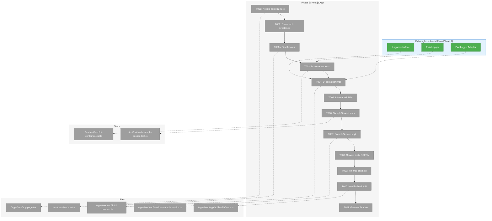
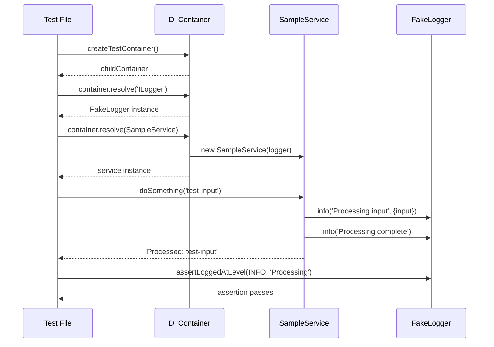

# Phase 3: Next.js App with Clean Architecture – Tasks & Alignment Brief

**Spec**: [../../project-setup-spec.md](../../project-setup-spec.md)
**Plan**: [../../project-setup-plan.md](../../project-setup-plan.md)
**Date**: 2026-01-18
**Status**: PENDING APPROVAL

---

## Executive Briefing

### Purpose

This phase creates the Next.js web application foundation with clean architecture patterns and dependency injection. It establishes the DI container that wires `@chainglass/shared` services/adapters, setting the architectural pattern for all future feature development.

### What We're Building

A Next.js 15 App Router application at `apps/web/` that demonstrates:
- **DI Container** with child container pattern for test isolation (per Critical Discovery 04)
- **SampleService** showing how services receive adapters via constructor injection
- **Clean Architecture** directory structure (`services/`, `adapters/`, `lib/`)
- **Architecture Enforcement** via automated import restriction checks

### User Value

Developers implementing features will have a clear, tested pattern to follow:
1. Create interface in `@chainglass/shared/interfaces/`
2. Create fake in `@chainglass/shared/fakes/`
3. Write tests using fake
4. Implement real adapter
5. Wire via DI container

The web app will be the main product UI for Chainglass.

### Example

**Production wiring**:
```typescript
const container = createProductionContainer();
const service = container.resolve(SampleService);
// service.logger is PinoLoggerAdapter
```

**Test wiring**:
```typescript
const container = createTestContainer();
const logger = container.resolve<ILogger>('ILogger') as FakeLogger;
const service = container.resolve(SampleService);
// service.logger is FakeLogger - can assert on logs
await service.doSomething('test');
logger.assertLoggedAtLevel(LogLevel.INFO, 'Processing input');
```

---

## Objectives & Scope

### Objective

Implement the Next.js web application with clean architecture patterns, DI container, and sample service demonstrating the pattern. All tasks must align with the plan acceptance criteria.

**Behavior Checklist**:
- [ ] `just dev` starts Next.js on localhost:3000
- [ ] `/api/health` returns `{ status: 'ok' }`
- [ ] DI container creates isolated child containers
- [ ] SampleService receives ILogger via constructor injection
- [ ] Tests use FakeLogger for assertions
- [ ] Architecture boundaries enforced via code review (no automated check)

### Goals

- ✅ Create Next.js 15 app with App Router and TypeScript
- ✅ Establish clean architecture directory structure (`services/`, `adapters/`, `lib/`)
- ✅ Implement DI container with child container pattern for test isolation
- ✅ Create SampleService demonstrating adapter injection pattern
- ✅ Wire production and test containers separately
- ✅ Document architecture boundaries for code review enforcement

### Non-Goals (Scope Boundaries)

- ❌ React components beyond minimal page.tsx (UI development is future scope)
- ❌ Styling, CSS, or design system
- ❌ Authentication/authorization
- ❌ API routes beyond health check
- ❌ Database adapters or persistence
- ❌ Performance optimization
- ❌ Web-specific adapters (SampleWebAdapter is illustrative only - not implemented)
- ❌ Full production configuration (environment variables, logging levels, etc.)

---

## Architecture Map

### Component Diagram

<!-- Status: grey=pending, orange=in-progress, green=completed, red=blocked -->
<!-- Updated by plan-6 during implementation -->



### Task-to-Component Mapping

<!-- Status: ⬜ Pending | 🟧 In Progress | ✅ Complete | 🔴 Blocked -->

| Task | Component(s) | Files | Status | Comment |
|------|-------------|-------|--------|---------|
| T001 | Next.js App | `/apps/web/` existing structure | ⬜ Pending | Verify/update create-next-app output |
| T002 | Directory Structure | `/apps/web/src/services/`, `/apps/web/src/adapters/`, `/apps/web/src/lib/` | ⬜ Pending | Clean architecture directories |
| T002a | Test Infrastructure | `/test/base/web-test.ts`, `/test/vitest.config.ts` | ⬜ Pending | Vitest fixtures for DI (DYK-04) |
| T003 | DI Container Tests | `/test/unit/web/di-container.test.ts` | ⬜ Pending | TDD: RED - Uses web-test fixtures |
| T004 | DI Container | `/apps/web/src/lib/di-container.ts` | ⬜ Pending | Child container pattern per Critical Discovery 04 |
| T005 | DI Verification | Tests | ⬜ Pending | TDD: GREEN |
| T006 | SampleService Tests | `/test/unit/web/sample-service.test.ts` | ⬜ Pending | TDD: RED |
| T007 | SampleService | `/apps/web/src/services/sample.service.ts` | ⬜ Pending | Demonstrates adapter injection |
| T008 | Service Verification | Tests | ⬜ Pending | TDD: GREEN |
| T009 | Home Page | `/apps/web/app/page.tsx` | ⬜ Pending | Minimal page that renders |
| T010 | Health API | `/apps/web/app/api/health/route.ts` | ⬜ Pending | Returns `{ status: 'ok' }` |
| T011 | Gate Verification | All | ⬜ Pending | `just dev`, `just test`, `just build` pass |

---

## Tasks

| Status | ID | Task | CS | Type | Dependencies | Absolute Path(s) | Validation | Subtasks | Notes |
|--------|------|------|-----|------|--------------|------------------|------------|----------|-------|
| [ ] | T001 | Verify/update Next.js app structure with App Router | 1 | Setup | – | `/Users/jordanknight/substrate/chainglass/apps/web/` | `pnpm -F @chainglass/web dev` starts without errors | – | Existing minimal structure from Phase 1; verified complete (DYK-02) |
| [ ] | T002 | Create services/, adapters/, lib/ directories | 1 | Setup | T001 | `/Users/jordanknight/substrate/chainglass/apps/web/src/services/`, `/Users/jordanknight/substrate/chainglass/apps/web/src/adapters/`, `/Users/jordanknight/substrate/chainglass/apps/web/src/lib/` | Directories exist with .gitkeep or index.ts | – | Clean architecture structure |
| [ ] | T002a | Create test/base/web-test.ts with Vitest fixtures | 2 | Setup | T002 | `/Users/jordanknight/substrate/chainglass/test/base/web-test.ts`, `/Users/jordanknight/substrate/chainglass/test/vitest.config.ts` | `@test/base/web-test` import resolves; fixtures provide container + logger | – | DRY test infrastructure (DYK-04) |
| [ ] | T003 | Write tests for DI container | 2 | Test | T002a | `/Users/jordanknight/substrate/chainglass/test/unit/web/di-container.test.ts` | Tests compile, all fail (RED) | – | TDD: RED per Critical Discovery 04; use web-test fixtures |
| [ ] | T004 | Implement DI container with child containers | 2 | Core | T003 | `/Users/jordanknight/substrate/chainglass/apps/web/src/lib/di-container.ts` | `createProductionContainer()`, `createTestContainer()` both resolve ILogger AND SampleService | – | Per Critical Discovery 04; decorator-free per Critical Discovery 02; explicit SampleService registration required (DYK-01) |
| [ ] | T005 | Run DI container tests - expect GREEN | 1 | Test | T004 | `/Users/jordanknight/substrate/chainglass/test/unit/web/di-container.test.ts` | All 4 DI tests pass | – | TDD: GREEN |
| [ ] | T006 | Write tests for SampleService | 2 | Test | T005 | `/Users/jordanknight/substrate/chainglass/test/unit/web/sample-service.test.ts` | Tests compile, all fail (RED) | – | TDD: RED; tests use FakeLogger |
| [ ] | T007 | Implement SampleService with ILogger injection | 2 | Core | T006 | `/Users/jordanknight/substrate/chainglass/apps/web/src/services/sample.service.ts` | Service accepts ILogger via constructor, has `doSomething()` method, includes REFERENCE IMPLEMENTATION header | – | Demonstrates DI pattern; add "DO NOT MODIFY FOR FEATURES" JSDoc (DYK-05) |
| [ ] | T008 | Run SampleService tests - expect GREEN | 1 | Test | T007 | `/Users/jordanknight/substrate/chainglass/test/unit/web/sample-service.test.ts` | All 3 service tests pass | – | TDD: GREEN |
| [ ] | T009 | Create minimal app/page.tsx | 1 | Core | T008 | `/Users/jordanknight/substrate/chainglass/apps/web/app/page.tsx` | Page renders at localhost:3000 without errors | – | Existing file - verify/update |
| [ ] | T010 | Create health check API route | 1 | Core | T009 | `/Users/jordanknight/substrate/chainglass/apps/web/app/api/health/route.ts` | GET /api/health returns `{ status: 'ok' }` with 200 | – | – |
| [ ] | T011 | Verify Phase 3 gate | 1 | Gate | T010 | All Phase 3 files | `just dev` starts, `just test` passes, `just build` succeeds | – | GATE; architecture enforcement via code review (DYK-03) |

---

## Alignment Brief

### Prior Phases Review

#### Phase-by-Phase Summary

**Phase 1: Monorepo Foundation** (Complete)

Established the complete monorepo infrastructure:
- pnpm workspaces + Turborepo for build orchestration
- TypeScript strict mode with path aliases
- Biome for linting/formatting
- Just task runner for developer commands
- Vitest configured with proper path resolution

**Phase 2: Shared Package** (Complete)

Built the foundational `@chainglass/shared` package:
- ILogger interface with all log levels (trace, debug, info, warn, error, fatal) + child()
- FakeLogger test double with assertion helpers
- PinoLoggerAdapter production implementation
- Contract tests ensuring fake-real behavioral parity
- 18 tests total (8 unit + 10 contract)

#### Cumulative Deliverables (Available to Phase 3)

**From Phase 1**:
| Deliverable | Path | Purpose |
|-------------|------|---------|
| Root package.json | `/Users/jordanknight/substrate/chainglass/package.json` | Workspace config, bin exports |
| pnpm-workspace.yaml | `/Users/jordanknight/substrate/chainglass/pnpm-workspace.yaml` | packages/* and apps/* |
| tsconfig.json | `/Users/jordanknight/substrate/chainglass/tsconfig.json` | Path aliases, strict mode |
| vitest.config.ts | `/Users/jordanknight/substrate/chainglass/test/vitest.config.ts` | Test runner with path resolution |
| test/setup.ts | `/Users/jordanknight/substrate/chainglass/test/setup.ts` | DI container clearing |
| justfile | `/Users/jordanknight/substrate/chainglass/justfile` | All dev commands |
| Web app stub | `/Users/jordanknight/substrate/chainglass/apps/web/` | Minimal Next.js structure |

**From Phase 2**:
| Deliverable | Path | Purpose |
|-------------|------|---------|
| ILogger interface | `/Users/jordanknight/substrate/chainglass/packages/shared/src/interfaces/logger.interface.ts` | Core logging contract |
| LogLevel enum | Same file | TRACE, DEBUG, INFO, WARN, ERROR, FATAL |
| LogEntry interface | Same file | Structured log entry type |
| FakeLogger | `/Users/jordanknight/substrate/chainglass/packages/shared/src/fakes/fake-logger.ts` | Test double with helpers |
| PinoLoggerAdapter | `/Users/jordanknight/substrate/chainglass/packages/shared/src/adapters/pino-logger.adapter.ts` | Production logger |
| Contract tests | `/Users/jordanknight/substrate/chainglass/test/contracts/logger.contract.ts` | Reusable test factory |

#### Pattern Evolution

1. **Phase 1**: Established ESM module system, path aliases, centralized tests
2. **Phase 2**: Established interface-first TDD cycle (interface → fake → tests → adapter → contract tests)
3. **Phase 3**: Will establish DI container pattern and service injection model

#### Recurring Issues Resolved

1. **Path resolution**: Solved in Phase 1 via `import.meta.dirname` + `resolve()` in vitest.config.ts
2. **Type exports**: Solved in Phase 2 via `export type` syntax for `isolatedModules` compliance
3. **pnpm availability**: Solved via corepack in Phase 1

#### Reusable Test Infrastructure

| Component | Location | How to Use |
|-----------|----------|------------|
| Global setup | `/test/setup.ts` | Auto-runs, initializes reflect-metadata |
| Path aliases | `/test/vitest.config.ts` | Import `@chainglass/shared`, `@test/base/*`, etc. |
| Contract test factory | `/test/contracts/logger.contract.ts` | `loggerContractTests(name, createLogger)` |
| **Web test fixtures** | `/test/base/web-test.ts` | `import { test, expect } from '@test/base/web-test'` - auto-injects `container` and `logger` (DYK-04) |

#### Architectural Continuity

**Patterns to Maintain**:
- ESM throughout (`"type": "module"`)
- Strict TypeScript
- Interface-first development
- Fakes over mocks
- Centralized tests at `test/`
- Path aliases for clean imports

**Anti-Patterns to Avoid**:
- No `vi.mock()` - use fakes
- No decorators in RSC (per Critical Discovery 02)
- No relative paths in vitest config
- No importing concrete adapters from services

---

### Critical Findings Affecting This Phase

| Finding | What it Constrains | Tasks Addressing It |
|---------|-------------------|---------------------|
| **Critical Discovery 02**: TSyringe Decorators Fail in RSC | Must use decorator-free pattern with explicit `container.register()` | T004 |
| **Critical Discovery 04**: DI Container Requires Child Container Pattern | Tests need isolated containers; use `container.createChildContainer()` | T003, T004 |
| **Critical Discovery 05**: Vitest Path Resolution | Must use absolute paths and vite-tsconfig-paths | Already solved in Phase 1 |
| **Critical Discovery 07**: Clean Architecture Needs Automated Enforcement | Services must not import concrete adapters | Code review (DYK-03) |

---

### ADR Decision Constraints

No ADRs have been formally created yet. ADR seeds exist in the spec:

| ADR Seed | Relevant Decisions |
|----------|-------------------|
| ADR-001: Monorepo Structure | pnpm + Turborepo (implemented Phase 1) |
| ADR-002: Dependency Injection | TSyringe with decorator-free pattern (implement Phase 3) |
| ADR-003: Test Strategy | Vitest + fakes only (implemented Phase 2) |

---

### Invariants & Guardrails

1. **No decorators in RSC**: All DI uses explicit `container.register()` calls
2. **Child containers for tests**: Never use global container in tests
3. **Services depend on interfaces only**: No importing from `*.adapter.ts`
4. **Fakes only, no mocks**: All test doubles implement real interfaces
5. **All tests have Test Doc comments**: 5 mandatory fields (Why, Contract, Usage Notes, Quality Contribution, Worked Example)

---

### Inputs to Read

Before implementing, review these files:

| File | Why |
|------|-----|
| `/Users/jordanknight/substrate/chainglass/packages/shared/src/interfaces/logger.interface.ts` | ILogger signature to wire in DI |
| `/Users/jordanknight/substrate/chainglass/packages/shared/src/fakes/fake-logger.ts` | FakeLogger API for tests |
| `/Users/jordanknight/substrate/chainglass/packages/shared/src/adapters/pino-logger.adapter.ts` | PinoLoggerAdapter for production wiring |
| `/Users/jordanknight/substrate/chainglass/apps/web/package.json` | Current Next.js dependencies |
| `/Users/jordanknight/substrate/chainglass/apps/web/tsconfig.json` | TypeScript config for web app |
| `/Users/jordanknight/substrate/chainglass/test/setup.ts` | Existing test setup to extend if needed |

---

### Visual Alignment Aids

#### Flow Diagram: DI Container Resolution

```mermaid
flowchart TD
    subgraph Production
        P1[App Startup] --> P2[createProductionContainer]
        P2 --> P3[Register PinoLoggerAdapter for ILogger]
        P3 --> P4[container.resolve SampleService]
        P4 --> P5[Service receives PinoLoggerAdapter]
    end

    subgraph Testing
        T1[Test Setup] --> T2[createTestContainer]
        T2 --> T3[Register FakeLogger for ILogger]
        T3 --> T4[container.resolve SampleService]
        T4 --> T5[Service receives FakeLogger]
        T5 --> T6[Assert on FakeLogger.getEntries]
    end
```



#### Sequence Diagram: SampleService Test Flow



---

### Test Plan (TDD, Fakes Only)

#### DI Container Tests (`/test/unit/web/di-container.test.ts`)

| Test | Purpose | Fixtures | Expected Output |
|------|---------|----------|-----------------|
| should create production container with real adapters | Verify production wiring | None | `container.resolve('ILogger')` returns PinoLoggerAdapter |
| should create test container with fakes | Verify test wiring | None | `container.resolve('ILogger')` returns FakeLogger |
| should isolate containers from each other | Prevent state leakage | None | Logs in container1 don't appear in container2 |
| should resolve SampleService with injected logger | Verify explicit registration works | None | `container.resolve(SampleService)` returns instance with ILogger |

#### SampleService Tests (`/test/unit/web/sample-service.test.ts`)

| Test | Purpose | Fixtures | Expected Output |
|------|---------|----------|-----------------|
| should process input and return result | Happy path | FakeLogger | Returns `'Processed: test-input'` |
| should log processing operations | Observability | FakeLogger | Log entries at INFO for start/complete |
| should include input in log metadata | Structured logging | FakeLogger | `entry.data.input === 'my-value'` |

---

### Step-by-Step Implementation Outline

| Step | Task ID | Action | Validation |
|------|---------|--------|------------|
| 1 | T001 | Verify existing Next.js app structure, update if needed | `pnpm -F @chainglass/web dev` runs |
| 2 | T002 | Create `src/services/`, `src/adapters/`, `src/lib/` directories | Directories exist |
| 3 | T002a | Create `test/base/web-test.ts` with Vitest fixtures + add `@test` alias | `import { test } from '@test/base/web-test'` resolves |
| 4 | T003 | Write `test/unit/web/di-container.test.ts` with 4 tests using fixtures | Tests fail (RED) |
| 5 | T004 | Implement `apps/web/src/lib/di-container.ts` | Functions exist |
| 6 | T005 | Run tests | All 4 DI tests pass (GREEN) |
| 7 | T006 | Write `test/unit/web/sample-service.test.ts` with 3 tests using fixtures | Tests fail (RED) |
| 8 | T007 | Implement `apps/web/src/services/sample.service.ts` | Class exists with doSomething() |
| 9 | T008 | Run tests | All 3 service tests pass (GREEN) |
| 10 | T009 | Update `apps/web/app/page.tsx` to be minimal and functional | Page renders at localhost:3000 |
| 11 | T010 | Create `apps/web/app/api/health/route.ts` | GET /api/health returns 200 |
| 12 | T011 | Run full gate verification | All checks pass |

---

### Commands to Run (Copy/Paste)

```bash
# Environment setup (if not done)
corepack enable && corepack prepare pnpm@9.15.4 --activate
pnpm install

# Development
just dev                    # Start Next.js on localhost:3000

# Testing (Phase 3)
just test                   # Run all tests
pnpm vitest test/unit/web/  # Run only web tests

# Build
just build                  # Build all packages

# Quality checks
just typecheck              # TypeScript check
just lint                   # Biome linting
just fft                    # Format, fix, test
just check                  # Full quality suite

# Gate verification
just build && just fft && just typecheck
```

---

### Risks/Unknowns

| Risk | Severity | Likelihood | Mitigation |
|------|----------|------------|------------|
| TSyringe in RSC | High | Medium | Use decorator-free pattern, test RSC rendering in T009 |
| Architecture boundary violations | High | Low | Add check-architecture command early (T011) |
| Container isolation | Medium | Low | Comprehensive isolation test in T003 |
| Web app path resolution | Medium | Low | Path aliases already configured in Phase 1 |

---

### Ready Check

- [ ] Phase 1 and Phase 2 review complete
- [ ] Critical Findings 02, 04, 07 understood and mapped to tasks
- [ ] Test plan covers all new components
- [ ] Architecture diagrams reviewed
- [ ] ADR constraints N/A (no formal ADRs yet, only seeds in spec)
- [ ] Commands validated against existing justfile

**Await explicit GO/NO-GO before implementation.**

---

## Phase Footnote Stubs

_Populated during implementation by plan-6a-update-progress._

| Footnote | Task(s) | Files | Notes |
|----------|---------|-------|-------|
| | | | |

---

## Evidence Artifacts

**Execution Log**: `./execution.log.md` (created by plan-6 during implementation)

**Supporting Files**:
- DI container implementation: `/apps/web/src/lib/di-container.ts`
- Sample service implementation: `/apps/web/src/services/sample.service.ts`
- Health check API: `/apps/web/app/api/health/route.ts`
- Test files: `/test/unit/web/*.test.ts`

---

## Discoveries & Learnings

_Populated during implementation by plan-6. Log anything of interest to your future self._

| Date | Task | Type | Discovery | Resolution | References |
|------|------|------|-----------|------------|------------|
| | | | | | |

**Types**: `gotcha` | `research-needed` | `unexpected-behavior` | `workaround` | `decision` | `debt` | `insight`

**What to log**:
- Things that didn't work as expected
- External research that was required
- Implementation troubles and how they were resolved
- Gotchas and edge cases discovered
- Decisions made during implementation
- Technical debt introduced (and why)
- Insights that future phases should know about

_See also: `execution.log.md` for detailed narrative._

---

## Directory Layout

```
docs/plans/001-project-setup/
├── project-setup-plan.md
├── project-setup-spec.md
├── reviews/
│   ├── review.phase-2-shared-package.md
│   └── fix-tasks.phase-2-shared-package.md
└── tasks/
    ├── phase-1-monorepo-foundation/
    │   ├── tasks.md
    │   └── execution.log.md
    ├── phase-2-shared-package/
    │   ├── tasks.md
    │   └── execution.log.md
    └── phase-3-nextjs-app-clean-architecture/
        ├── tasks.md              # This file
        └── execution.log.md      # Created by plan-6
```

---

**Generated by**: plan-5-phase-tasks-and-brief
**Next Step**: Await GO approval, then run `/plan-6-implement-phase --phase 3`

---

## Critical Insights Discussion

**Session**: 2026-01-18
**Context**: Phase 3: Next.js App with Clean Architecture - Tasks & Alignment Brief
**Analyst**: AI Clarity Agent
**Reviewer**: Development Team
**Format**: Water Cooler Conversation (5 Critical Insights)

### DYK-01: DI Registration Gap for SampleService

**Did you know**: The plan shows tests calling `container.resolve(SampleService)` but there's no code that registers SampleService with the DI container - and decorators are forbidden in RSC.

**Implications**:
- Without `@injectable()` decorators, TSyringe cannot auto-resolve classes
- Without explicit registration, container.resolve(SampleService) fails
- Tests as documented would not work

**Options Considered**:
- Option A: Add explicit SampleService registration - SELECTED
- Option B: Inject logger manually in tests
- Option C: Use decorators (Not Feasible - violates Critical Discovery 02)

**AI Recommendation**: Option A (Explicit Registration)
- Reasoning: Maintains decorator-free pattern while demonstrating complete DI wiring

**Decision**: Add explicit SampleService registration to DI container using factory pattern

**Action Items**:
- [x] Update T004 to include SampleService registration requirement
- [x] Add 4th DI test: "should resolve SampleService with injected logger"

**Affects**: T004, T005, test examples

---

### DYK-02: T001 Complexity is Overstated

**Did you know**: T001 "Verify/update Next.js app structure" is marked CS-2, but verification shows the Next.js app is already fully functional from Phase 1 with build artifacts present.

**Implications**:
- Build artifacts exist (.next/ with BUILD_ID)
- App Router fully structured (app/layout.tsx, app/page.tsx)
- Dependencies correct (Next.js 15.1.6, React 19)
- Task is pure verification, not setup

**Options Considered**:
- Option A: Downgrade T001 to CS-1 - SELECTED
- Option B: Keep CS-2 as buffer
- Option C: Merge T001 into T002

**AI Recommendation**: Option A (Downgrade to CS-1)
- Reasoning: Accurate complexity estimates help future planning

**Decision**: Change T001 complexity from CS-2 to CS-1

**Action Items**:
- [x] Update T001 CS column from 2 to 1

**Affects**: T001, overall phase complexity

---

### DYK-03: Architecture Check Command is Overkill

**Did you know**: The `just check-architecture` command using grep could have false positives and the directories it checks don't exist yet, giving false confidence.

**Implications**:
- Grep matches comments and strings, not just imports
- Empty directories = no matches = "OK" (false confidence)
- More sophisticated tools (dependency-cruiser) add complexity

**Options Considered**:
- Option A: Use refined grep pattern
- Option B: Add dependency-cruiser
- Option C: Add ESLint (Not Feasible - contradicts Biome choice)
- Option D: Remove and rely on code reviews - SELECTED

**AI Recommendation**: Option A + D (Refined grep + test violation)

**Decision**: Remove `just check-architecture` entirely; rely on code reviews

**Action Items**:
- [x] Remove T011 (architecture check) from task list
- [x] Renumber T012 to T011 (gate verification)
- [x] Update all references to check-architecture

**Affects**: T011, T012, justfile, behavior checklist

---

### DYK-04: Test Setup Needs Fixture-Based Isolation

**Did you know**: `container.clearInstances()` only clears singleton instances, not registrations - but the plan already specifies child containers, which is the right solution.

**Implications**:
- Current setup.ts is not sufficient alone
- Child container pattern in T004 is essential, not optional
- Tests MUST use `createTestContainer()`, not global container

**Options Considered**:
- Option A: Use child containers (Already Planned) - SELECTED
- Option B: Clear and re-register everything
- Option C: Use Vitest process isolation (Overkill)

**AI Recommendation**: Option A with DRY test infrastructure

**Decision**: Create `test/base/web-test.ts` with Vitest fixtures for automatic container/logger injection

**Action Items**:
- [x] Add T002a: Create test/base/web-test.ts with Vitest fixtures
- [x] Add @test path alias to vitest.config.ts
- [x] Update T003 dependency to T002a
- [x] Update Reusable Test Infrastructure table

**Affects**: T002, T002a, T003, T006, vitest.config.ts

---

### DYK-05: SampleService Needs "Reference Implementation" Documentation

**Did you know**: SampleService with its trivial return value might be mistaken for dead code and deleted, losing the architectural reference.

**Implications**:
- Future developers may not understand its pedagogical purpose
- Could be deleted as "unnecessary" placeholder
- Or worse, real features built into it

**Options Considered**:
- Option A: Add clear documentation to SampleService - SELECTED
- Option B: Rename to _ExampleService or ReferenceService
- Option C: Move to test/examples/
- Option D: Document only in architecture.md

**AI Recommendation**: Option A (Clear Documentation in Code)
- Reasoning: Self-documenting code follows FakeLogger precedent

**Decision**: Add "REFERENCE IMPLEMENTATION - DO NOT MODIFY FOR FEATURES" JSDoc header

**Action Items**:
- [x] Update T007 validation to require reference implementation header

**Affects**: T007

---

## Session Summary

**Insights Surfaced**: 5 critical insights identified and discussed
**Decisions Made**: 5 decisions reached through collaborative discussion
**Action Items Created**: 12 updates applied to tasks.md
**Tasks Modified**: T001, T002a (new), T003, T004, T005, T007, T011 (renumbered)

**Shared Understanding Achieved**: ✓

**Confidence Level**: High - All key risks identified and mitigated

**Next Steps**: Await GO approval, then run `/plan-6-implement-phase --phase 3`
