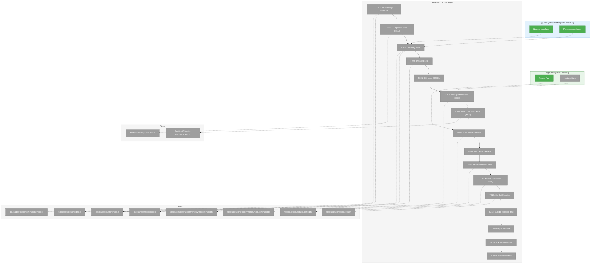
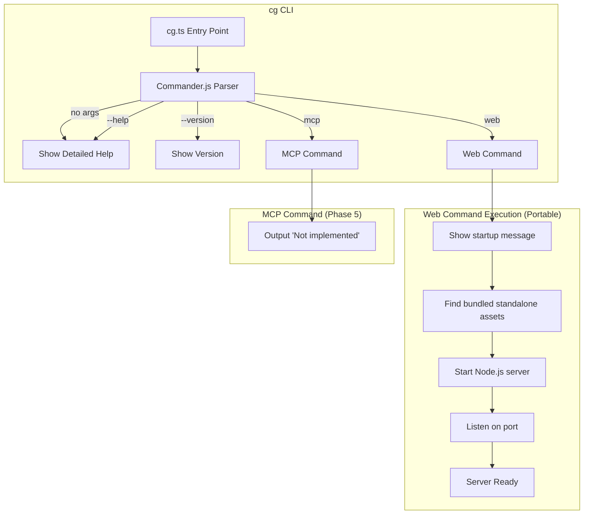
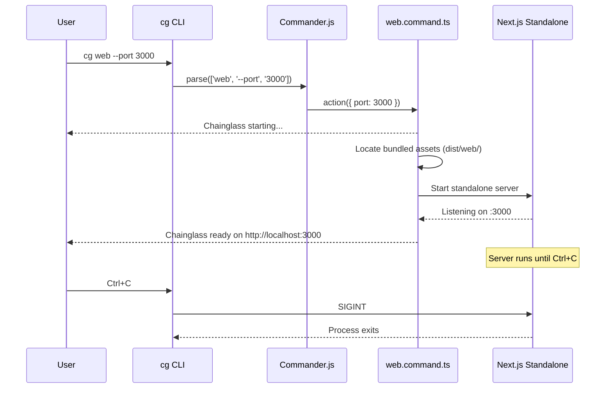

# Phase 4: CLI Package – Tasks & Alignment Brief

**Spec**: [../../project-setup-spec.md](../../project-setup-spec.md)
**Plan**: [../../project-setup-plan.md](../../project-setup-plan.md)
**Date**: 2026-01-19
**Status**: PENDING APPROVAL

---

## Executive Briefing

### Purpose

This phase creates the `cg` command-line interface that serves as the primary interaction point for Chainglass. The CLI provides both development workflows and production deployment—**users install and run Chainglass as a local web server** via a single npx command.

### What We're Building

A Commander.js-based CLI at `packages/cli/` that provides:
- **`cg web`** - Starts the production web server (portable via npx)
- **`cg mcp`** - Launches the MCP server (Phase 5 will implement the actual server)
- **`cg --help`** - Detailed, actionable help (default behavior)
- **`cg --version`** - Version information
- **Standalone bundling** - Next.js standalone output bundled into CLI for npx portability

> **Note**: Development mode (`next dev` with hot reload) is handled via `just dev` in the monorepo, not through the CLI.

### User Value

**For Chainglass Users** (developers using the tool):
```bash
npx @chainglass/cli web    # Install and run Chainglass instantly
```
No git clone, no dependencies to manage—just run the tool.

**For Chainglass Developers** (building the tool):
```bash
just dev                    # Hot reload development (via justfile)
cg web                      # Test production mode locally
```

### Architecture

```
┌─────────────────────────────────────────────────────────────┐
│                    @chainglass/cli                          │
│  ┌─────────────────────────────────────────────────────┐   │
│  │  CLI Commands (cg.ts)                                │   │
│  │  ├── web   → Starts bundled standalone server       │   │
│  │  └── mcp   → MCP server (Phase 5)                   │   │
│  └─────────────────────────────────────────────────────┘   │
│  ┌─────────────────────────────────────────────────────┐   │
│  │  Bundled Assets (dist/web/)                         │   │
│  │  └── .next/standalone/ (Next.js production server)  │   │
│  └─────────────────────────────────────────────────────┘   │
└─────────────────────────────────────────────────────────────┘
```

### Example

**End User Experience**:
```bash
$ npx @chainglass/cli web
Chainglass starting on http://localhost:3000...
✓ Ready
```

**Developer Experience**:
```bash
$ just dev                  # Development with hot reload (monorepo)
Next.js 15.x dev server...
✓ Ready in 500ms

$ cg web                    # Test production mode
Starting production server on http://localhost:3000
```

---

## Objectives & Scope

### Objective

Implement the CLI package as the **primary distribution mechanism for Chainglass**. The CLI must:
1. Be portable via npx (users run `npx @chainglass/cli web` from anywhere)
2. Support development workflows within the monorepo
3. Provide detailed, actionable help

**Behavior Checklist**:
- [ ] `cg` (no args) shows detailed, actionable help
- [ ] `cg --help` shows detailed, actionable help
- [ ] `cg --version` shows package version
- [ ] `cg web` starts production server (from bundled standalone)
- [ ] `cg web --port 8080` starts on custom port
- [ ] `cg mcp --help` shows MCP options (actual server is Phase 5)
- [ ] `npx @chainglass/cli web` works from any directory (portable)
- [ ] `npm link && cg web` works from any directory

### Goals

- ✅ Create CLI directory structure (bin/, commands/)
- ✅ Implement Commander.js program with web and mcp commands
- ✅ Configure Next.js with `output: 'standalone'` for portable bundling
- ✅ Write tests for CLI argument parsing (TDD)
- ✅ Write tests for web command (TDD)
- ✅ Configure build to bundle standalone web app into CLI
- ✅ Test npx portability (Critical Discovery 06 validation)
- ✅ Verify npm link workflow
- ✅ Implement detailed, actionable help as default

### Non-Goals (Scope Boundaries)

- ❌ MCP server implementation (Phase 5)
- ❌ Additional CLI commands beyond web/mcp
- ❌ CLI-specific services or adapters (not needed yet)
- ❌ Interactive prompts or terminal UI
- ❌ Configuration file support
- ❌ CLI plugin architecture
- ❌ Progress spinners or fancy terminal UI (chalk for basic colors only)
- ❌ Watch mode or hot reloading for CLI itself
- ❌ Docker image (separate concern)

---

## Architecture Map

### Component Diagram

<!-- Status: grey=pending, orange=in-progress, green=completed, red=blocked -->
<!-- Updated by plan-6 during implementation -->



### Task-to-Component Mapping

<!-- Status: ⬜ Pending | 🟧 In Progress | ✅ Complete | 🔴 Blocked -->

| Task | Component(s) | Files | Status | Comment |
|------|-------------|-------|--------|---------|
| T001 | Directory Structure | bin/, commands/ | ⬜ Pending | Create clean architecture directories |
| T002 | CLI Parser Tests | cli-parser.test.ts | ⬜ Pending | TDD: RED - tests for help, version, web, mcp |
| T003 | CLI Entry Point | cg.ts, index.ts | ⬜ Pending | Commander.js program setup |
| T004 | Detailed Help | cg.ts | ⬜ Pending | Detailed, actionable help as default behavior |
| T005 | Parser Verification | Tests | ⬜ Pending | TDD: GREEN - parser tests pass |
| T006 | Next.js Standalone | next.config.js | ⬜ Pending | Configure `output: 'standalone'` for bundling |
| T007 | Web Command Tests | web-command.test.ts | ⬜ Pending | TDD: RED - web command tests |
| T008 | Web Command | web.command.ts | ⬜ Pending | Starts bundled standalone server |
| T009 | Web Verification | Tests | ⬜ Pending | TDD: GREEN - web tests pass |
| T010 | MCP Command Stub | mcp.command.ts | ⬜ Pending | Placeholder for Phase 5 |
| T011 | esbuild + Bundle | esbuild.config.ts | ⬜ Pending | Bundle CLI + copy standalone web assets |
| T012 | Build Scripts | package.json | ⬜ Pending | Add build:bundle script, standalone copy |
| T013 | Bundle Isolation | Manual test | ⬜ Pending | Verify bundle works without node_modules |
| T014 | npm link Test | Manual test | ⬜ Pending | Verify `npm link && cg web` works |
| T015 | npx Portability | Manual test | ⬜ Pending | Verify `npx @chainglass/cli web` works |
| T016 | Gate Verification | All | ⬜ Pending | Full acceptance criteria check |

---

## Tasks

| Status | ID | Task | CS | Type | Dependencies | Absolute Path(s) | Validation | Subtasks | Notes |
|--------|------|------|-----|------|--------------|------------------|------------|----------|-------|
| [ ] | T001 | Create CLI directory structure (bin/, commands/) | 1 | Setup | – | `/Users/jordanknight/substrate/chainglass/packages/cli/src/bin/`, `/Users/jordanknight/substrate/chainglass/packages/cli/src/commands/` | Directories exist with index.ts exports | – | Clean architecture structure |
| [ ] | T002 | Write tests for CLI argument parsing | 2 | Test | T001 | `/Users/jordanknight/substrate/chainglass/test/unit/cli/cli-parser.test.ts` | Tests compile, all fail (RED) | – | TDD: RED; tests: help, version, web, mcp |
| [ ] | T003 | Implement cg.ts entry point with Commander.js program | 2 | Core | T002 | `/Users/jordanknight/substrate/chainglass/packages/cli/src/bin/cg.ts`, `/Users/jordanknight/substrate/chainglass/packages/cli/src/index.ts` | createProgram() exports Commander instance | – | Default behavior shows help; use factory pattern with `testMode` option for exitOverride()+configureOutput() |
| [ ] | T004 | Implement detailed, actionable help | 2 | Core | T003 | `/Users/jordanknight/substrate/chainglass/packages/cli/src/bin/cg.ts` | `cg` and `cg --help` show detailed help with examples | – | Help must be intuitive; use chalk for formatting; see Help Spec below |
| [ ] | T005 | Run CLI parser tests - expect GREEN | 1 | Test | T004 | `/Users/jordanknight/substrate/chainglass/test/unit/cli/cli-parser.test.ts` | All parser tests pass | – | TDD: GREEN |
| [ ] | T006 | Configure Next.js with output: 'standalone' | 1 | Setup | T005 | `/Users/jordanknight/substrate/chainglass/apps/web/next.config.js` | `next build` creates `.next/standalone/` directory | – | Required for portable bundling |
| [ ] | T007 | Write tests for web command | 2 | Test | T006 | `/Users/jordanknight/substrate/chainglass/test/unit/cli/web-command.test.ts` | Tests compile, fail (RED) | – | TDD: RED; test server start, port option; use random ports + afterEach proc.kill() cleanup |
| [ ] | T008 | Implement web command that starts production server | 2 | Core | T007 | `/Users/jordanknight/substrate/chainglass/packages/cli/src/commands/web.command.ts` | `cg web` starts production server from bundled assets | – | Uses bundled standalone; --port flag; use chalk for startup/ready messages; find assets via `import.meta.dirname`; explicit SIGINT forwarding to child for clean shutdown |
| [ ] | T009 | Run web command tests - expect GREEN | 1 | Test | T008 | `/Users/jordanknight/substrate/chainglass/test/unit/cli/web-command.test.ts` | All web tests pass | – | TDD: GREEN |
| [ ] | T010 | Implement mcp command stub (placeholder for Phase 5) | 1 | Core | T009 | `/Users/jordanknight/substrate/chainglass/packages/cli/src/commands/mcp.command.ts` | `cg mcp --help` shows options, `cg mcp` outputs "MCP server not implemented" | – | Stub only; use chalk for output; Phase 5 implements |
| [ ] | T011 | Create esbuild config + standalone bundling | 2 | Core | T010 | `/Users/jordanknight/substrate/chainglass/packages/cli/esbuild.config.ts` | Config bundles CLI + copies standalone web assets to dist/web/ | – | Per CD-06; bundle chalk + @chainglass/shared; external pino |
| [ ] | T012 | Add CLI build scripts to package.json | 1 | Setup | T011 | `/Users/jordanknight/substrate/chainglass/packages/cli/package.json` | `just build` creates dist/ with CLI + web assets | – | CLI `build` script must: (1) bundle CLI via esbuild, (2) copy .next/standalone/, (3) copy .next/static/, (4) copy public/ if exists. Integrated into Turborepo so `just build` does everything. |
| [ ] | T013 | Test bundle in isolation (no node_modules) | 2 | Test | T012 | `/Users/jordanknight/substrate/chainglass/packages/cli/dist/` | Copy dist/ to /tmp, run `node cli.js web` starts server | – | Per CD-06 safety check |
| [ ] | T014 | Test npm link workflow | 1 | Test | T013 | `/Users/jordanknight/substrate/chainglass/packages/cli/` | `npm link && cg web` works from any directory | – | Global CLI availability |
| [ ] | T015 | Test npx portability | 2 | Test | T014 | `/Users/jordanknight/substrate/chainglass/packages/cli/` | Pack CLI, install in /tmp, `npx @chainglass/cli web` starts server | – | Critical: proves distribution works |
| [ ] | T016 | Verify Phase 4 gate | 1 | Gate | T015 | All Phase 4 files | `just test`, `just build`, `cg web`, npx portability | – | GATE |

---

## Alignment Brief

### Prior Phases Review

#### Phase-by-Phase Summary

**Phase 1: Monorepo Foundation** (Complete)

Established the complete monorepo infrastructure:
- pnpm workspaces + Turborepo for build orchestration
- TypeScript strict mode with path aliases (`@chainglass/*`, `@test/*`)
- Biome for linting/formatting
- Just task runner with commands: install, dev, build, test, lint, format, fft, typecheck, check, clean, reset
- Vitest configured with `vite-tsconfig-paths` plugin
- Global test setup with `container.clearInstances()` in beforeEach

Key learnings:
- pnpm requires corepack activation first
- Vitest config needs `import.meta.dirname` for absolute paths
- Empty index.ts stubs needed for TypeScript typecheck

**Phase 2: Shared Package** (Complete)

Built the foundational `@chainglass/shared` package:
- ILogger interface with 6 log levels (trace, debug, info, warn, error, fatal) + child()
- FakeLogger test double with assertion helpers: `getEntries()`, `getEntriesByLevel()`, `assertLoggedAtLevel()`, `clear()`
- PinoLoggerAdapter production implementation
- Contract tests ensuring fake-real behavioral parity
- 18 tests total (8 unit + 10 contract)

Key learnings:
- Use `export type` for interface re-exports with `isolatedModules: true`
- pino v9+ has built-in types (no @types/pino needed)
- Contract test pattern: `loggerContractTests(name, createLogger)`

**Phase 3: Next.js App with Clean Architecture** (Complete)

Created the Next.js web application with DI patterns:
- DI container with `createProductionContainer()` and `createTestContainer()`
- SampleService reference implementation with REFERENCE IMPLEMENTATION header
- Health check API at `/api/health`
- Vitest test fixtures at `test/base/web-test.ts`
- 25 tests total (4 DI + 3 service + 10 contract + 8 FakeLogger)

Key discoveries (critical for Phase 4):
1. **useFactory pattern required**: TSyringe `useClass` fails without decorators - use `useFactory: () => new ClassName()` instead
2. **Static imports for ESM**: `require()` doesn't work in Vitest - use static imports
3. **tsconfig paths to dist/**: Next.js build needs paths pointing to `dist/` not `src/`

#### Cumulative Deliverables (Available to Phase 4)

**From Phase 1**:
| Deliverable | Path | Purpose |
|-------------|------|---------|
| Root package.json | `/Users/jordanknight/substrate/chainglass/package.json` | Workspace config, bin exports |
| pnpm-workspace.yaml | `/Users/jordanknight/substrate/chainglass/pnpm-workspace.yaml` | packages/* and apps/* |
| tsconfig.json | `/Users/jordanknight/substrate/chainglass/tsconfig.json` | Path aliases, strict mode |
| vitest.config.ts | `/Users/jordanknight/substrate/chainglass/test/vitest.config.ts` | Test runner with path resolution |
| justfile | `/Users/jordanknight/substrate/chainglass/justfile` | All dev commands |

**From Phase 2**:
| Deliverable | Path | Purpose |
|-------------|------|---------|
| ILogger interface | `/Users/jordanknight/substrate/chainglass/packages/shared/src/interfaces/logger.interface.ts` | Core logging contract |
| FakeLogger | `/Users/jordanknight/substrate/chainglass/packages/shared/src/fakes/fake-logger.ts` | Test double with helpers |
| PinoLoggerAdapter | `/Users/jordanknight/substrate/chainglass/packages/shared/src/adapters/pino-logger.adapter.ts` | Production logger |
| Contract tests | `/Users/jordanknight/substrate/chainglass/test/contracts/logger.contract.ts` | Reusable test factory |

**From Phase 3**:
| Deliverable | Path | Purpose |
|-------------|------|---------|
| DI container | `/Users/jordanknight/substrate/chainglass/apps/web/src/lib/di-container.ts` | Factory-based DI pattern |
| SampleService | `/Users/jordanknight/substrate/chainglass/apps/web/src/services/sample.service.ts` | Reference implementation |
| Web test fixtures | `/Users/jordanknight/substrate/chainglass/test/base/web-test.ts` | Vitest fixtures pattern |
| Next.js App | `/Users/jordanknight/substrate/chainglass/apps/web/` | Dev server for `cg dev` command |

#### Reusable Test Infrastructure

| Component | Location | How to Use |
|-----------|----------|------------|
| Global setup | `/test/setup.ts` | Auto-runs, initializes reflect-metadata |
| Path aliases | `/test/vitest.config.ts` | Import `@chainglass/*`, `@test/base/*` |
| Contract test factory | `/test/contracts/logger.contract.ts` | `loggerContractTests(name, createLogger)` |
| Web test fixtures | `/test/base/web-test.ts` | Pattern for CLI fixtures if needed |

#### Architectural Continuity

**Patterns to Maintain**:
- ESM throughout (`"type": "module"`)
- Strict TypeScript
- Interface-first development (not needed for CLI commands but good for future CLI services)
- Fakes over mocks
- Centralized tests at `test/`
- Path aliases for clean imports
- Factory-based DI with `useFactory` pattern

**Anti-Patterns to Avoid**:
- No `vi.mock()` - use fakes if needed
- No decorators (`@injectable()`, `@inject()`)
- No relative paths in vitest config
- No `require()` in ESM code

---

### Critical Findings Affecting This Phase

| Finding | What it Constrains | Tasks Addressing It |
|---------|-------------------|---------------------|
| **Critical Discovery 02**: TSyringe Decorators Fail in RSC | If CLI uses DI, must use decorator-free pattern | T003 (though CLI may not need full DI) |
| **Critical Discovery 06**: CLI Bundle Must Include Workspace Dependencies | esbuild must bundle `@chainglass/shared`, external `pino` | T011, T012, T013 |
| **Critical Discovery 07**: Clean Architecture Needs Enforcement | CLI services (if any) must not import concrete adapters | Code review - no automated check |

---

### Help Spec (T004)

The default behavior (`cg` with no args) and `cg --help` must show **detailed, actionable, intuitive** help:

```
Chainglass - Blockchain analysis toolkit

Usage: cg <command> [options]

Commands:
  web      Start the Chainglass web interface
  mcp      Start MCP server for AI agent integration

Options:
  -V, --version  Show version number
  -h, --help     Show this help message

Examples:
  $ cg web                  Start web UI on http://localhost:3000
  $ cg web --port 8080      Start web UI on custom port

Quick Start:
  $ npx @chainglass/cli web

Run 'cg <command> --help' for detailed command information.
```

**Command-specific help** (`cg web --help`):

```
Start the Chainglass web interface

Usage: cg web [options]

Options:
  -p, --port <number>  Port to listen on (default: 3000)
  -h, --help           Show this help message

Examples:
  $ cg web                  Start on default port 3000
  $ cg web --port 8080      Start on port 8080
  $ cg web -p 4000          Start on port 4000
```

---

### ADR Decision Constraints

No formal ADRs created yet. ADR seeds exist in the spec:

| ADR Seed | Relevant Decisions |
|----------|-------------------|
| ADR-001: Monorepo Structure | pnpm + Turborepo (implemented) |
| ADR-002: Dependency Injection | TSyringe with decorator-free pattern |
| ADR-003: Test Strategy | Vitest + fakes only |

---

### Invariants & Guardrails

1. **npx portability**: `npx @chainglass/cli web` must work from any directory
2. **No decorators**: All DI uses explicit registration if needed
3. **Child process cleanup**: Tests must kill spawned processes in afterEach; use random ports to avoid conflicts
4. **Standalone completeness**: Bundled web app must include all dependencies
5. **Help is default**: Running `cg` with no args shows help (not an error)
6. **External pino**: `pino` external in esbuild (runtime adapter loading)
7. **First-run feedback**: Web command shows progress message on startup
8. **Test-safe Commander**: Use `createProgram({ testMode: true })` in tests to enable `exitOverride()` + `configureOutput()` (prevents process.exit crashes)
9. **SIGINT forwarding**: Web command must forward Ctrl+C to child server via `process.on('SIGINT', () => server.kill('SIGINT'))` and exit cleanly via `server.on('exit')`
10. **Standalone static folders**: Next.js standalone doesn't include `public/` or `.next/static/` - CLI build must copy these alongside `standalone/` or assets won't load

**Note on bundle size**: The standalone Next.js bundle will be larger than a typical CLI (potentially 50-100MB+ with dependencies). This is acceptable for a tool that provides a full web UI. npm supports packages of this size. If size becomes problematic, we can explore:
- Lazy downloading assets on first run
- Separate `@chainglass/web` package
- Docker as alternative distribution

**Note on path resolution**: Two distinct path concerns exist:
- **Asset discovery**: Where is the bundled server? Use `import.meta.dirname` relative to CLI binary. Works for npx, npm link, global install.
- **Runtime context** (future): What project is Chainglass working on? Use `process.cwd()` - the user's working directory becomes the project root for configs, analysis, etc. (Not implemented in Phase 4)

---

### Inputs to Read

Before implementing, review these files:

| File | Why |
|------|-----|
| `/Users/jordanknight/substrate/chainglass/packages/cli/package.json` | Current dependencies (commander, chalk already added) |
| `/Users/jordanknight/substrate/chainglass/packages/cli/src/index.ts` | Current empty entry point |
| `/Users/jordanknight/substrate/chainglass/apps/web/package.json` | Verify `next dev` and `next build` scripts exist |
| `/Users/jordanknight/substrate/chainglass/apps/web/next.config.js` | Current Next.js config (will add standalone output) |
| `/Users/jordanknight/substrate/chainglass/test/base/web-test.ts` | Pattern for Vitest fixtures |
| [Next.js standalone output docs](https://nextjs.org/docs/app/building-your-application/deploying#self-hosting) | Understand standalone deployment |

---

### Visual Alignment Aids

#### Flow Diagram: CLI Command Execution



#### Sequence Diagram: `cg web` Command (Production)



---

### Test Plan (TDD, Fakes Only)

**Important**: Commander.js `--version` and `--help` call `process.exit(0)`, which terminates the test runner. Use `createProgram({ testMode: true })` for all tests that parse CLI arguments. This enables `exitOverride()` (throws `CommanderError` instead of exiting) and `configureOutput()` (suppresses output pollution).

#### CLI Parser Tests (`/test/unit/cli/cli-parser.test.ts`)

| Test | Purpose | Fixtures | Expected Output |
|------|---------|----------|-----------------|
| should show help when no args | Default behavior is help | None | helpInformation() contains command list |
| should parse --help flag | Verify help accessible | None | helpInformation() contains 'web', 'mcp' |
| should parse --version flag | Verify version accessible | None | version() returns package version |
| should register web command with --port option | Verify web options | None | web command has --port flag |
| should register mcp command with --stdio option | Verify MCP options | None | mcp command has --stdio flag |
| should show detailed help with examples | Help quality check | None | helpInformation() contains 'Examples:' |

#### Web Command Tests (`/test/unit/cli/web-command.test.ts`)

**Process Cleanup Pattern** (required for tests that spawn servers):
```typescript
import { ChildProcess } from 'child_process';

let proc: ChildProcess | null = null;

afterEach(() => {
  if (proc) {
    proc.kill();
    proc = null;
  }
});
```

**Random Ports**: Use random high ports (e.g., `30000 + Math.floor(Math.random() * 10000)`) or port 0 to avoid conflicts between parallel tests or cleanup failures.

| Test | Purpose | Fixtures | Expected Output |
|------|---------|----------|-----------------|
| should find bundled standalone assets | Asset location | Mock fs | Returns path to dist/web/ |
| should start server on default port | Default behavior | Mock server | Server started on :3000 |
| should start server on custom port | Port option | Mock server | Server started on specified port |
| should handle missing assets gracefully | Error handling | Mock fs | Throws descriptive error |
| should output ready message | User feedback | Mock server | Console shows ready URL |

---

### Step-by-Step Implementation Outline

| Step | Task ID | Action | Validation |
|------|---------|--------|------------|
| 1 | T001 | Create bin/, commands/ directories with index.ts | Directories exist |
| 2 | T002 | Write `test/unit/cli/cli-parser.test.ts` with 6 tests | Tests fail (RED) |
| 3 | T003 | Implement `src/bin/cg.ts` with Commander program | createProgram() exports |
| 4 | T004 | Add detailed help with examples (see Help Spec) | `cg` shows actionable help |
| 5 | T005 | Run parser tests | All pass (GREEN) |
| 6 | T006 | Add `output: 'standalone'` to `apps/web/next.config.js` | `next build` creates standalone |
| 7 | T007 | Write `test/unit/cli/web-command.test.ts` with 5 tests | Tests fail (RED) |
| 8 | T008 | Implement `src/commands/web.command.ts` | `cg web` starts bundled server with feedback |
| 9 | T009 | Run web tests | All pass (GREEN) |
| 10 | T010 | Implement `src/commands/mcp.command.ts` stub | `cg mcp --help` works |
| 11 | T011 | Create `esbuild.config.ts` + standalone copy script | Config bundles CLI + copies web |
| 12 | T012 | Update CLI `build` script to include bundling + static copy | `just build` produces complete CLI bundle |
| 13 | T013 | Test bundle in /tmp without node_modules | `node cli.js web` starts server |
| 14 | T014 | Test `npm link && cg web` | Global CLI works |
| 15 | T015 | Pack and test npx portability | `npx @chainglass/cli web` works |
| 16 | T016 | Run full gate verification | All criteria pass |

---

### Commands to Run (Copy/Paste)

```bash
# Environment setup (if not done)
corepack enable && corepack prepare pnpm@9.15.4 --activate
pnpm install

# Development (via justfile, not CLI)
just dev                    # Start Next.js with hot reload

# Testing (Phase 4)
just test                   # Run all tests
pnpm vitest test/unit/cli/  # Run only CLI tests

# Build
just build                  # Build all packages INCLUDING CLI bundle + standalone copy
# Note: just build triggers Turborepo which builds web first, then CLI.
# CLI build script handles: esbuild bundle + copy standalone + copy static folders

# Quality checks
just typecheck              # TypeScript check
just lint                   # Biome linting
just fft                    # Format, fix, test
just check                  # Full quality suite

# CLI testing via ts-node (after T004)
npx ts-node packages/cli/src/bin/cg.ts --help
npx ts-node packages/cli/src/bin/cg.ts          # Should show help

# Bundle testing (after T012)
node packages/cli/dist/cli.js --help
node packages/cli/dist/cli.js web               # Start bundled server

# Bundle isolation test (T013)
cp -r packages/cli/dist /tmp/chainglass-cli
cd /tmp/chainglass-cli && node cli.js web       # Should start server

# npm link testing (T014)
cd packages/cli && npm link && cd ../..
cg --help
cg web

# npx portability test (T015)
cd packages/cli && npm pack && cd ../..
mkdir -p /tmp/npx-test && cd /tmp/npx-test
npm init -y
npm install /path/to/chainglass-cli-0.0.1.tgz
npx @chainglass/cli web                         # Should start server

# Gate verification
just build && just fft && just typecheck
```

---

### Risks/Unknowns

| Risk | Severity | Likelihood | Mitigation |
|------|----------|------------|------------|
| Standalone bundle too large for npm | High | Medium | Monitor size; consider .npmignore for dev assets |
| esbuild bundle includes wrong deps | High | Medium | T016 isolation test in /tmp |
| workspace:* not resolved in bundle | High | Low | Use `packages: 'bundle'` in esbuild |
| Standalone server missing deps | High | Medium | Next.js standalone should be self-contained; test in T016 |
| Child process not cleaned up in tests | Medium | Medium | Always kill in afterEach |
| Next.js path resolution fails | Medium | Low | Use absolute paths with `import.meta.dirname` |
| npx download too slow | Medium | Low | First run will be slow; subsequent cached |
| Port conflicts on default 3000 | Low | Medium | --port flag available |

**Unknown: Standalone bundle size**
Next.js standalone includes all dependencies. Need to verify final package size is acceptable for npm distribution. If too large, may need to consider alternative approaches (separate web package, Docker, etc.).

---

### Ready Check

- [ ] Prior phases review complete (Phase 1, 2, 3)
- [ ] Critical Findings 02, 06 understood and mapped to tasks
- [ ] Test plan covers CLI parsing and web command
- [ ] Help Spec reviewed and approved
- [ ] Architecture diagrams reviewed (web flow)
- [ ] ADR constraints N/A (no formal ADRs yet)
- [ ] Commands validated against existing justfile
- [ ] Bundle isolation test planned (T013)
- [ ] npx portability test planned (T015)
- [ ] Next.js standalone output understood
- [ ] First-run feedback message requirement understood

**Await explicit GO/NO-GO before implementation.**

---

## Phase Footnote Stubs

_Populated during implementation by plan-6a-update-progress._

| Footnote | Task(s) | Files | Notes |
|----------|---------|-------|-------|
| | | | |

---

## Evidence Artifacts

**Execution Log**: `./execution.log.md` (created by plan-6 during implementation)

**Supporting Files**:
- CLI entry point: `/packages/cli/src/bin/cg.ts`
- Web command: `/packages/cli/src/commands/web.command.ts`
- MCP command stub: `/packages/cli/src/commands/mcp.command.ts`
- esbuild config: `/packages/cli/esbuild.config.ts`
- Next.js config: `/apps/web/next.config.js` (updated with standalone output)
- Test files: `/test/unit/cli/*.test.ts`
- Built bundle: `/packages/cli/dist/cli.js`
- Bundled web app: `/packages/cli/dist/web/` (standalone Next.js server)

---

## Discoveries & Learnings

_Populated during implementation by plan-6. Log anything of interest to your future self._

| Date | Task | Type | Discovery | Resolution | References |
|------|------|------|-----------|------------|------------|
| | | | | | |

**Types**: `gotcha` | `research-needed` | `unexpected-behavior` | `workaround` | `decision` | `debt` | `insight`

**What to log**:
- Things that didn't work as expected
- External research that was required
- Implementation troubles and how they were resolved
- Gotchas and edge cases discovered
- Decisions made during implementation
- Technical debt introduced (and why)
- Insights that future phases should know about

_See also: `execution.log.md` for detailed narrative._

---

## Directory Layout

```
docs/plans/001-project-setup/
├── project-setup-plan.md
├── project-setup-spec.md
├── reviews/
│   ├── review.phase-2-shared-package.md
│   └── fix-tasks.phase-2-shared-package.md
└── tasks/
    ├── phase-1-monorepo-foundation/
    │   ├── tasks.md
    │   └── execution.log.md
    ├── phase-2-shared-package/
    │   ├── tasks.md
    │   └── execution.log.md
    ├── phase-3-nextjs-app-clean-architecture/
    │   ├── tasks.md
    │   └── execution.log.md
    └── phase-4-cli-package/
        ├── tasks.md              # This file
        └── execution.log.md      # Created by plan-6
```

---

**Generated by**: plan-5-phase-tasks-and-brief
**Next Step**: Await GO approval, then run `/plan-6-implement-phase --phase 4`

---

## Critical Insights Discussion

**Session**: 2026-01-19
**Context**: Phase 4: CLI Package - Tasks & Alignment Brief
**Analyst**: AI Clarity Agent
**Reviewer**: Development Team
**Format**: Water Cooler Conversation (5 Critical Insights)

### Insight 1: Commander.js --version Terminates Tests

**Did you know**: Commander.js's `--version` flag calls `process.exit(0)` after outputting version, which terminates the test runner mid-suite.

**Implications**:
- Tests that simulate CLI invocation crash Vitest
- CI may report "success" (exit 0) but tests didn't complete
- Need to configure Commander for test-safe behavior

**Options Considered**:
- Option A: `exitOverride()` + `configureOutput()` via factory pattern - Commander-idiomatic
- Option B: Mock `process.exit` with `vi.spyOn` - No existing pattern
- Option C: Only test Commander state, not parsing - Less realistic

**AI Recommendation**: Option A
- Reasoning: Commander-idiomatic, establishes testable `createProgram()` API from day one

**Decision**: Use `createProgram({ testMode: true })` factory pattern with `exitOverride()` + `configureOutput()`

**Action Items**:
- [x] Updated T003 to use factory pattern with testMode
- [x] Added Invariant #8 for test-safe Commander
- [x] Updated Test Plan with testMode guidance

**Affects**: T003, T002, T005

---

### Insight 2: Web Command Tests Need Explicit Process Cleanup

**Did you know**: Testing `cg web` spawns a real Node.js server that continues running after test completion, becoming an orphan zombie that holds ports.

**Implications**:
- Port 3000 stays busy after test
- Subsequent tests fail with EADDRINUSE
- Watch mode accumulates zombie processes

**Options Considered**:
- Option A: Native Node.js `proc.kill()` in afterEach - Documented pattern
- Option B: execa with `cleanup: true` - New dependency, diverges from patterns
- Option C: Mock server startup - Less realistic

**AI Recommendation**: Option A
- Reasoning: Matches documented pattern in project-setup-plan.md, no new dependencies

**Discussion Summary**: User requested random ports as additional safety measure to avoid conflicts even if cleanup fails.

**Decision**: Use native `proc.kill()` cleanup pattern + random ports for test isolation

**Action Items**:
- [x] Updated T007 with random ports + afterEach cleanup
- [x] Added Process Cleanup Pattern code example to Test Plan
- [x] Updated Invariant #3 to include random ports

**Affects**: T007, T009

---

### Insight 3: Standalone Assets Must Be Found Relative to CLI Binary

**Did you know**: When `cg web` runs via npx, it executes from an unpredictable npm cache location. Using `process.cwd()` to find assets will fail.

**Implications**:
- Assets bundled inside npm package, not user's project
- Must discover assets relative to CLI binary, not current directory
- `import.meta.dirname` provides the solution

**Options Considered**:
- Option A: `import.meta.dirname` relative to CLI entry - Established pattern
- Option B: `import.meta.resolve()` with sentinel file - Adds complexity
- Option C: Package.json `exports` field - Unconventional for assets

**AI Recommendation**: Option A
- Reasoning: Already used in vitest.config.ts, simplest solution, pure ESM codebase

**Discussion Summary**: Clarified that `process.cwd()` will matter for future RUNTIME CONTEXT (what project Chainglass is analyzing), but asset discovery uses `import.meta.dirname`.

**Decision**: Use `import.meta.dirname` for asset discovery; `process.cwd()` reserved for future runtime context

**Action Items**:
- [x] Updated T008 with `import.meta.dirname` requirement
- [x] Added "Note on path resolution" explaining asset discovery vs runtime context

**Affects**: T008

---

### Insight 4: SIGINT Must Propagate to Child Server for Clean Shutdown

**Did you know**: When user presses Ctrl+C, the signal goes to CLI process but NOT automatically to the spawned Next.js server, leaving orphan processes.

**Implications**:
- Server continues running after CLI exits
- Port stays blocked
- User thinks they stopped it but localhost still serving

**Options Considered**:
- Option A: Explicit `process.on('SIGINT')` handler - Matches documented design
- Option B: `shell: true` for automatic signal group - Platform-dependent
- Option C: `detached: false` + inherited stdio - Doesn't guarantee forwarding

**AI Recommendation**: Option A
- Reasoning: Matches sequence diagram design, established pattern, predictable cross-platform

**Decision**: Use explicit `process.on('SIGINT')` handler to forward signal to child server

**Action Items**:
- [x] Updated T008 with SIGINT forwarding requirement
- [x] Added Invariant #9 for SIGINT forwarding pattern

**Affects**: T008

---

### Insight 5: Next.js Standalone Requires Copying Static Folders Separately

**Did you know**: Next.js `output: 'standalone'` creates server.js but doesn't include `public/` or `.next/static/` folders - the app will look broken without them.

**Implications**:
- No favicon, images, or public assets
- No CSS/JS chunks from build
- Server starts but app is broken

**Options Considered**:
- Option A: esbuild plugin for post-build copy - Integrated but custom code
- Option B: npm script orchestration - Simple, Turborepo-friendly
- Option C: `outputFileTracingRoot` - Doesn't actually solve it

**AI Recommendation**: Option B
- Reasoning: Matches T012 description, fits Turborepo patterns, explicit and debuggable

**Discussion Summary**: User requested integration with `just build` so one command does everything.

**Decision**: Use npm script orchestration, integrated into `just build` flow

**Action Items**:
- [x] Updated T012 to include static folder copy in CLI build
- [x] Updated Commands to Run section for `just build` clarity
- [x] Added Invariant #10 for standalone static folders

**Affects**: T011, T012

---

## Session Summary

**Insights Surfaced**: 5 critical insights identified and discussed
**Decisions Made**: 5 decisions reached through collaborative discussion
**Action Items Created**: 15+ task updates applied
**Areas Updated**:
- Tasks T003, T007, T008, T012 enhanced with implementation details
- Invariants expanded from 7 to 10
- Test Plan updated with patterns and guidance
- Issue file updated with technical notes

**Shared Understanding Achieved**: ✓

**Confidence Level**: High - All key gotchas identified and addressed with verified solutions

**Next Steps**:
- Await GO approval for Phase 4
- Run `/plan-6-implement-phase --phase 4`

**Notes**:
- All options were verified against codebase using FlowSpace before presentation
- User provided valuable input on random ports and `just build` integration
- Path resolution clarification (asset discovery vs runtime context) documented for future phases
