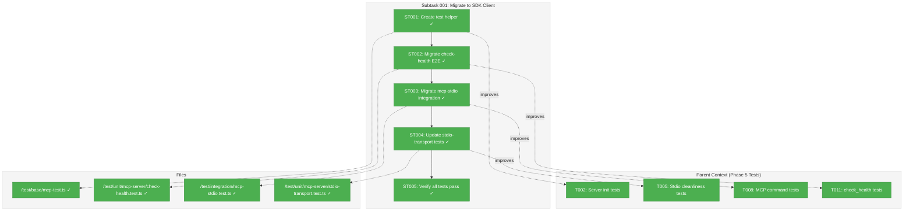
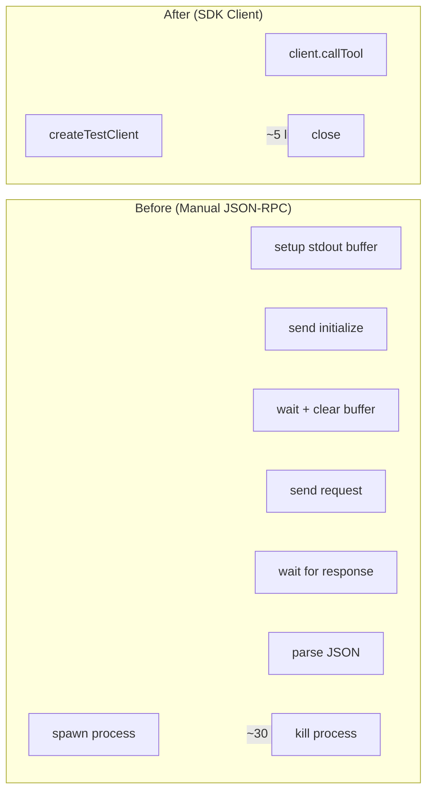

# Subtask 001: Migrate MCP Tests to SDK Client

**Parent Plan:** [View Plan](../../project-setup-plan.md)
**Parent Phase:** Phase 5: MCP Server Package
**Parent Task(s):** [T002: Write tests for MCP server initialization](../tasks.md#task-t002), [T005: Write tests for stdio cleanliness](../tasks.md#task-t005), [T008: Write tests for mcp command](../tasks.md#task-t008), [T011: Write tests for check_health tool](../tasks.md#task-t011)
**Plan Task Reference:** [Task 5.2-5.11 in Plan](../../project-setup-plan.md#phase-5-mcp-server-package)

**Why This Subtask:**
The MCP tests currently use manual JSON-RPC construction (~275 lines of boilerplate across 3 files). The `@modelcontextprotocol/sdk` v1.25.2 provides a proper `Client` class and `StdioClientTransport` that eliminates this boilerplate, improves test readability, and ensures protocol compliance.

**Created:** 2026-01-21
**Requested By:** Development Team

---

## Executive Briefing

### Purpose

This subtask refactors the MCP server tests to use the official SDK `Client` class instead of manual JSON-RPC construction. This eliminates ~180 lines of repetitive boilerplate, improves test readability, ensures protocol compliance, and provides type-safe API methods.

### What We're Building

A test helper infrastructure that:
- Creates `test/base/mcp-test.ts` with `createTestClient()` helper
- Migrates `test/unit/mcp-server/check-health.test.ts` (E2E tests) to use SDK client
- Migrates `test/integration/mcp-stdio.test.ts` to use SDK client
- Updates `test/unit/mcp-server/stdio-transport.test.ts` where applicable
- Preserves all existing test coverage while reducing code

### Unblocks

- No tasks are blocked; this is a quality improvement
- Future MCP tool tests will use this pattern (reduces effort for each new tool)

### Example

**Before** (~30 lines per test):
```typescript
proc = spawn(process.execPath, [cliPath, 'mcp', '--stdio'], {
  stdio: ['pipe', 'pipe', 'pipe'],
});
const stdout: string[] = [];
proc.stdout?.on('data', (data) => stdout.push(data.toString()));
await new Promise((r) => setTimeout(r, 500));

// Initialize
proc.stdin?.write(`${JSON.stringify({
  jsonrpc: '2.0', id: 1, method: 'initialize',
  params: { protocolVersion: '2024-11-05', capabilities: {}, clientInfo: { name: 'test', version: '1.0.0' }}
})}\n`);
await new Promise((r) => setTimeout(r, 300));
stdout.length = 0;

// Call tool
proc.stdin?.write(`${JSON.stringify({
  jsonrpc: '2.0', id: 2, method: 'tools/call',
  params: { name: 'check_health', arguments: {} }
})}\n`);
// ... more boilerplate
```

**After** (~10 lines per test):
```typescript
const { client, close } = await createTestClient();
try {
  const result = await client.callTool({ name: 'check_health', arguments: {} });
  const response = JSON.parse(result.content[0].text);
  expect(response.status).toBeDefined();
} finally {
  await close();
}
```

---

## Objectives & Scope

### Objective

Refactor MCP tests to use the SDK `Client` class, reducing boilerplate by ~70% while maintaining all existing test coverage.

### Goals

- ✅ Create `test/base/mcp-test.ts` with `createTestClient()` helper
- ✅ Migrate E2E tests in `check-health.test.ts` to use SDK client
- ✅ Migrate integration tests in `mcp-stdio.test.ts` to use SDK client
- ✅ Update `stdio-transport.test.ts` where SDK client is applicable
- ✅ Ensure all 21 MCP-related tests continue passing
- ✅ Delete or simplify redundant boilerplate code

### Non-Goals

- ❌ Adding new tests (this is refactoring, not feature work)
- ❌ Changing test assertions or coverage
- ❌ Modifying the MCP server implementation
- ❌ Creating a mock/fake MCP client (we use the real SDK client)

---

## Architecture Map

### Component Diagram

<!-- Status: grey=pending, orange=in-progress, green=completed, red=blocked -->
<!-- Updated by plan-6 during implementation -->



### Task-to-Component Mapping

<!-- Status: ⬜ Pending | 🟧 In Progress | ✅ Complete | 🔴 Blocked -->

| Task | Component(s) | Files | Status | Comment |
|------|-------------|-------|--------|---------|
| ST001 | Test Helper | /test/base/mcp-test.ts | ✅ Complete | Create createTestClient() helper using SDK |
| ST002 | E2E Tests | /test/unit/mcp-server/check-health.test.ts | ✅ Complete | Refactor 3 E2E tests to use SDK client |
| ST003 | Integration Tests | /test/integration/mcp-stdio.test.ts | ✅ Complete | Refactor 5 tests to use SDK client |
| ST004 | Stdio Tests | /test/unit/mcp-server/stdio-transport.test.ts | ✅ Complete | Mixed pattern: Test 2 uses SDK, Tests 1,3,4 keep spawn |
| ST005 | Verification | All test files | ✅ Complete | 21 MCP tests, 66 total tests pass |

---

## Tasks

| Status | ID | Task | CS | Type | Dependencies | Absolute Path(s) | Validation | Subtasks | Notes |
|--------|------|------|-----|------|--------------|------------------|------------|----------|-------|
| [x] | ST001 | Create `test/base/mcp-test.ts` with `createTestClient()` helper | 2 | Setup | – | `/Users/jordanknight/substrate/chainglass/test/base/mcp-test.ts` | Helper compiles, exports McpTestClient type | – | Use SDK Client + StdioClientTransport; capture stderr |
| [x] | ST002 | Migrate `check-health.test.ts` E2E tests to use SDK client | 2 | Core | ST001 | `/Users/jordanknight/substrate/chainglass/test/unit/mcp-server/check-health.test.ts` | 3 E2E tests pass using SDK client | – | Tests at lines 99-303; UPDATE Test Doc "Usage Notes" + "Worked Example" sections |
| [x] | ST003 | Migrate `mcp-stdio.test.ts` integration tests to use SDK client | 2 | Core | ST001 | `/Users/jordanknight/substrate/chainglass/test/integration/mcp-stdio.test.ts` | 5 tests pass using SDK client | – | All tests except --help; UPDATE Test Doc "Usage Notes" + "Worked Example" sections |
| [x] | ST004 | Evaluate and update `stdio-transport.test.ts` | 1 | Core | ST001 | `/Users/jordanknight/substrate/chainglass/test/unit/mcp-server/stdio-transport.test.ts` | 4 tests pass; boilerplate reduced where applicable | – | MIXED PATTERN: Tests 1,3,4 (pre-connection) keep spawn; Test 2 migrates to SDK client |
| [x] | ST005 | Verify all MCP tests pass and clean up | 1 | Gate | ST002, ST003, ST004 | All | `just test` passes; 21+ MCP tests green | – | GATE; verify no test coverage lost |

---

## Alignment Brief

### Objective Recap

Improve MCP test maintainability by using the official SDK client instead of manual JSON-RPC construction, reducing ~180 lines of boilerplate while preserving all test coverage.

### Critical Findings Affecting This Subtask

#### Research Validation (2026-01-21)

The SDK client pattern was validated in `test/scratch/`:
- `mcp-sdk-client-validation.ts` - Basic connect → listTools → callTool → close
- `mcp-sdk-test-example.ts` - 5 tests demonstrating migration pattern

**Key API Methods**:
| Method | Purpose | Replaces |
|--------|---------|----------|
| `client.connect(transport)` | Initialize + handshake | Manual `initialize` + `initialized` |
| `client.listTools()` | Get available tools | Manual `tools/list` request |
| `client.callTool(params)` | Call a tool | Manual `tools/call` request |
| `client.getServerVersion()` | Get server info | Parsing initialize response |
| `client.close()` | Graceful shutdown | Manual SIGTERM + cleanup |

### Invariants & Guardrails

| Invariant | Measurement | Threshold |
|-----------|-------------|-----------|
| Test count | Number of MCP-related tests | >= 21 (no reduction) |
| Test pass rate | `just test` result | 100% |
| Code coverage | Lines covered | No reduction |

### Inputs to Read

| File | Purpose |
|------|---------|
| `/Users/jordanknight/substrate/chainglass/test/scratch/mcp-sdk-client-validation.ts` | Validated SDK client pattern |
| `/Users/jordanknight/substrate/chainglass/test/scratch/mcp-sdk-test-example.ts` | Example test patterns |
| `/Users/jordanknight/substrate/chainglass/test/base/web-test.ts` | Reference for test helper patterns |

### Test Doc Format (Mandatory 5-Part Structure)

Every test MUST have a Test Doc comment with these 5 parts:

```typescript
it('should do something', async () => {
  /*
  Test Doc:
  - Why: [Rationale for why this test exists]
  - Contract: [The expected behavior being verified]
  - Usage Notes: [How to run/setup the test - UPDATE THIS FOR SDK]
  - Quality Contribution: [What bug/regression this catches]
  - Worked Example: [Concrete input → output - UPDATE THIS FOR SDK]
  */
});
```

**Migration guidance:**
- "Why", "Contract", "Quality Contribution" usually stay the same (describe WHAT)
- "Usage Notes" and "Worked Example" need updating (describe HOW)
- Replace `stdin`, `JSON.stringify`, `proc.stdin?.write` → SDK methods
- SDK patterns: `createTestClient()`, `client.listTools()`, `client.callTool()`, `client.close()`

### Cleanup Pattern (Use afterEach)

All migrated tests MUST use this cleanup pattern:

```typescript
describe('MCP tests', () => {
  let testClient: McpTestClient | null = null;

  afterEach(async () => {
    await testClient?.close();
    testClient = null;
  });

  it('should do something', async () => {
    testClient = await createTestClient();
    // test logic using testClient.client
  });
});
```

**Why this pattern:**
- `client.close()` gracefully shuts down transport (vs `proc.kill()` which is forceful)
- `afterEach` guarantees cleanup even if test throws
- Matches existing test structure in MCP test files

### Test Helper Design

```typescript
// test/base/mcp-test.ts
import { Client } from '@modelcontextprotocol/sdk/client/index.js';
import { StdioClientTransport } from '@modelcontextprotocol/sdk/client/stdio.js';
import path from 'node:path';

const projectRoot = path.resolve(import.meta.dirname, '../..');
const cliPath = path.join(projectRoot, 'apps/cli/dist/cli.cjs');

export interface McpTestClient {
  client: Client;
  transport: StdioClientTransport;
  stderr: string[];
  close: () => Promise<void>;
}

export async function createTestClient(): Promise<McpTestClient> {
  const stderr: string[] = [];

  const transport = new StdioClientTransport({
    command: process.execPath,
    args: [cliPath, 'mcp', '--stdio'],
    stderr: 'pipe',
  });

  transport.stderr?.on('data', (chunk: Buffer) => {
    stderr.push(chunk.toString());
  });

  const client = new Client(
    { name: 'test-client', version: '1.0.0' },
    { capabilities: {} }
  );

  await client.connect(transport);

  return {
    client,
    transport,
    stderr,
    close: () => client.close(),
  };
}
```

### Visual Alignment Aid

#### Migration Flow



### Test Plan

**Testing Approach**: Refactoring - maintain existing test coverage
**Mock Policy**: No mocks; SDK client is a real client talking to real server

| Test File | Before | After | Validation |
|-----------|--------|-------|------------|
| `check-health.test.ts` | 3 E2E tests with manual JSON-RPC | 3 E2E tests with SDK client | All pass |
| `mcp-stdio.test.ts` | 5 integration tests | 4+ tests with SDK client | All pass |
| `stdio-transport.test.ts` | 4 unit tests | Mixed: some SDK, some spawn | All pass |

### Implementation Outline

| Step | Task | Action | Validation |
|------|------|--------|------------|
| 1 | ST001 | Create `test/base/mcp-test.ts` with helper | Helper compiles |
| 2 | ST002 | Refactor `check-health.test.ts` E2E section | 3 tests pass |
| 3 | ST003 | Refactor `mcp-stdio.test.ts` | 5 tests pass |
| 4 | ST004 | Evaluate `stdio-transport.test.ts` | 4 tests pass |
| 5 | ST005 | Run `just test`, verify all green | 66+ tests pass |

### Commands to Run

```bash
# Build CLI (required - tests spawn CLI process)
just build

# Run all tests
just test

# Run MCP tests only
pnpm vitest run test/unit/mcp-server/ test/integration/mcp-stdio.test.ts

# Run with watch for development
pnpm vitest test/unit/mcp-server/
```

### Risks/Unknowns

| Risk | Severity | Likelihood | Mitigation |
|------|----------|------------|------------|
| SDK client behavior differs from manual | Low | Low | Validated in scratch scripts |
| Some tests require pre-connection assertions | Medium | Medium | Keep spawn pattern for those specific tests |
| Timing differences | Low | Low | SDK handles timeouts internally |

### Ready Check

- [x] Research validated (scratch scripts pass)
- [x] SDK client API understood
- [x] Test helper pattern designed
- [x] Existing test files reviewed
- [x] Migration scope identified (3 files, ~21 tests)

**Awaiting explicit GO/NO-GO from human sponsor.**

---

## Phase Footnote Stubs

_Populated by plan-6a-update-progress during implementation._

| Footnote | Content | Tasks | Files |
|----------|---------|-------|-------|
| | | | |

---

## Evidence Artifacts

- **Execution Log**: `./001-subtask-migrate-mcp-tests-to-sdk-client.execution.log.md` (created by plan-6)
- **Validation Scripts**: `test/scratch/mcp-sdk-client-validation.ts`, `test/scratch/mcp-sdk-test-example.ts`
- **Test Results**: Captured in execution log

---

## Critical Insights Discussion

**Session**: 2026-01-21
**Context**: Subtask 001 - Migrate MCP Tests to SDK Client (Pre-implementation clarity)
**Analyst**: AI Clarity Agent
**Reviewer**: Development Team
**Format**: Water Cooler Conversation (5 Critical Insights)

### Insight 1: Parallel Test Execution Creates Process Storms

**Did you know**: With Vitest's default parallel execution and SDK client spawning a new process per test, 20+ simultaneous Node.js processes could compete for resources.

**Implications**:
- CPU/memory pressure during test runs
- Potential flaky test failures under load
- Current `afterEach(() => proc.kill())` lacks timeout handling

**Options Considered**:
- Option A: Sequential execution via `fileParallelism: false` - Simplest, eliminates contention
- Option B: `describe.sequential` for MCP tests only - Faster but more complex
- Option C: Connection pooling - High effort, shared state risks

**AI Recommendation**: Option A - Sequential Execution

**Discussion Summary**: User agreed. Simplest solution, 21s test time acceptable.

**Decision**: Add `fileParallelism: false` to vitest.config.ts

**Action Items**:
- [x] Updated `test/vitest.config.ts` with sequential execution

**Affects**: ST005 (verification), test execution performance

---

### Insight 2: Two stdio-transport Tests Cannot Migrate to SDK Client

**Did you know**: 2 of 4 tests in `stdio-transport.test.ts` verify stdout behavior BEFORE any JSON-RPC input. SDK's `createTestClient()` automatically calls `connect()`, making pre-connection tests impossible to migrate.

**Implications**:
- Tests 1 & 3 (pre-connection) must keep spawn pattern
- Tests 2 & 4 (protocol) can migrate to SDK client
- Mixed pattern required in one file

**Options Considered**:
- Option A: Keep spawn for pre-connection tests only - Preserves coverage
- Option B: Remove pre-connection tests as redundant - Loses explicit verification
- Option C: Create `createUnconnectedTransport()` helper - Not feasible with SDK design

**AI Recommendation**: Option A - Selective Migration

**Discussion Summary**: User agreed. Preserves explicit CD-10/ADR-0001 compliance verification.

**Decision**: Mixed pattern - selective migration for stdio-transport.test.ts

**Action Items**:
- [x] Updated ST004 notes to document mixed pattern

**Affects**: ST004 (stdio-transport.test.ts migration)

---

### Insight 3: Test Doc Comments Need Migration-Aware Updates

**Did you know**: All 21 tests have mandatory 5-part Test Doc comments, and 12 reference manual JSON-RPC patterns that become outdated after migration.

**Implications**:
- "Usage Notes" and "Worked Example" sections reference stdin/JSON-RPC
- Misleading documentation if not updated
- 5-part format is mandatory project standard

**Options Considered**:
- Option A: Copy Test Docs verbatim - Fast but misleading
- Option B: Update Test Docs to reflect SDK approach - Accurate, maintains quality
- Option C: Create shared template - Over-engineering

**AI Recommendation**: Option B - Update Test Docs

**Discussion Summary**: User agreed and requested 5-part format details for sharing with other agents.

**Decision**: Update "Usage Notes" and "Worked Example" for all migrated tests

**Action Items**:
- [x] Updated ST002, ST003 notes with Test Doc update guidance
- [x] Added Test Doc Format section to Alignment Brief

**Affects**: ST002, ST003 (test file migrations)

---

### Insight 4: SDK Client Uses Exception-Based Errors

**Did you know**: SDK client throws exceptions for protocol errors, while manual JSON-RPC returns `response.error` objects. However, 0 of 21 tests check for errors - all assume success path.

**Implications**:
- Zero breaking changes for error handling during migration
- Vitest catches unhandled rejections automatically
- Future error tests should use SDK exception pattern

**Options Considered**:
- Option A: Simple migration, no error handling changes - Simplest
- Option B: Add try/catch to all tests - Extra boilerplate
- Option C: Add error scenario tests - Out of scope (new coverage, not migration)

**AI Recommendation**: Option A - Simple Migration

**Discussion Summary**: User agreed. No existing error handling to preserve.

**Decision**: Proceed with straightforward migration, no explicit error handling

**Action Items**: None

**Affects**: ST002, ST003, ST004 (confirms simpler implementation)

---

### Insight 5: Cleanup Pattern Must Use client.close() Not proc.kill()

**Did you know**: SDK's `close()` handles graceful transport shutdown, while current `proc.kill()` is forceful termination. The helper pre-wires this: `close: () => client.close()`.

**Implications**:
- `client.close()` gracefully closes transport AND waits for process
- `afterEach` pattern guarantees cleanup even if test throws
- Matches existing test structure

**Options Considered**:
- Option A: Use `afterEach` with explicit `close()` - Matches current structure
- Option B: Use try/finally in each test - More boilerplate
- Option C: Vitest fixtures pattern - Not suitable for process resources

**AI Recommendation**: Option A - afterEach with close()

**Discussion Summary**: User agreed. Single cleanup point, guaranteed execution.

**Decision**: Use `afterEach(async () => { await testClient?.close(); })` pattern

**Action Items**:
- [x] Added Cleanup Pattern section to Alignment Brief

**Affects**: ST001 (helper design), ST002, ST003, ST004 (cleanup pattern)

---

## Session Summary

**Insights Surfaced**: 5 critical insights identified and discussed
**Decisions Made**: 5 decisions reached through collaborative discussion
**Action Items Created**: 4 updates applied to subtask dossier and vitest.config.ts
**Areas Updated**:
- `test/vitest.config.ts` - Added sequential execution
- Subtask dossier ST002, ST003, ST004 notes - Migration guidance
- Subtask dossier Alignment Brief - Test Doc Format, Cleanup Pattern sections

**Shared Understanding Achieved**: ✓

**Confidence Level**: High - All implementation questions resolved, clear migration path

**Next Steps**:
- Subtask ready for implementation
- Start with ST001 (create test helper)
- Follow documented patterns for Test Docs and cleanup

---

## Discoveries & Learnings

_Populated during implementation by plan-6. Log anything of interest to your future self._

| Date | Task | Type | Discovery | Resolution | References |
|------|------|------|-----------|------------|------------|
| 2026-01-21 | Research | insight | SDK Client handles initialize/initialized automatically via connect() | Use single connect() call instead of manual handshake | SDK source code |
| 2026-01-21 | Research | insight | Successful connect() implicitly validates stdout cleanliness | JSON-RPC parsing would fail if stdout polluted | Validation script |
| 2026-01-21 | Clarity | decision | Sequential test execution to prevent process storms | Added `fileParallelism: false` to vitest.config.ts | Insight #1 |
| 2026-01-21 | Clarity | decision | Mixed pattern for stdio-transport.test.ts | Tests 1,3 keep spawn; Tests 2,4 migrate to SDK | Insight #2 |
| 2026-01-21 | Clarity | decision | Update Test Doc "Usage Notes" + "Worked Example" during migration | Maintains documentation accuracy | Insight #3 |
| 2026-01-21 | Clarity | decision | Use afterEach with client.close() for cleanup | Graceful shutdown, guaranteed execution | Insight #5 |

**Types**: `gotcha` | `research-needed` | `unexpected-behavior` | `workaround` | `decision` | `debt` | `insight`

**What to log**:
- Things that didn't work as expected
- External research that was required
- Implementation troubles and how they were resolved
- Gotchas and edge cases discovered
- Decisions made during implementation
- Technical debt introduced (and why)
- Insights that future phases should know about

_See also: `execution.log.md` for detailed narrative._

---

## After Subtask Completion

**This subtask is a quality improvement for:**
- Parent Tasks: T002, T005, T008, T011 (test tasks from Phase 5)
- Plan Tasks: 5.2, 5.5, 5.8, 5.11

**When all ST### tasks complete:**

1. **Record completion** in parent execution log:
   ```
   ### Subtask 001-subtask-migrate-mcp-tests-to-sdk-client Complete

   Resolved: Migrated MCP tests to use SDK client, reduced ~180 lines of boilerplate
   See detailed log: [subtask execution log](./001-subtask-migrate-mcp-tests-to-sdk-client.execution.log.md)
   ```

2. **Update plan Subtasks Registry**:
   - Open: [`../../project-setup-plan.md`](../../project-setup-plan.md)
   - Find: Subtasks Registry section
   - Update Status: `[ ] Pending` → `[x] Complete`

3. **Clean up scratch files** (optional):
   - `test/scratch/mcp-sdk-client-validation.ts` - keep for reference
   - `test/scratch/mcp-sdk-test-example.ts` - keep for reference

**Quick Links:**
- [Parent Dossier](./tasks.md)
- [Parent Plan](../../project-setup-plan.md)
- [Parent Execution Log](./execution.log.md)

---

## Directory Layout

```
docs/plans/001-project-setup/tasks/phase-5-mcp-server-package/
├── tasks.md                                                ← Parent dossier
├── execution.log.md                                        ← Parent execution log
├── 001-subtask-migrate-mcp-tests-to-sdk-client.md         ← This file
└── 001-subtask-migrate-mcp-tests-to-sdk-client.execution.log.md  ← Created by plan-6
```
