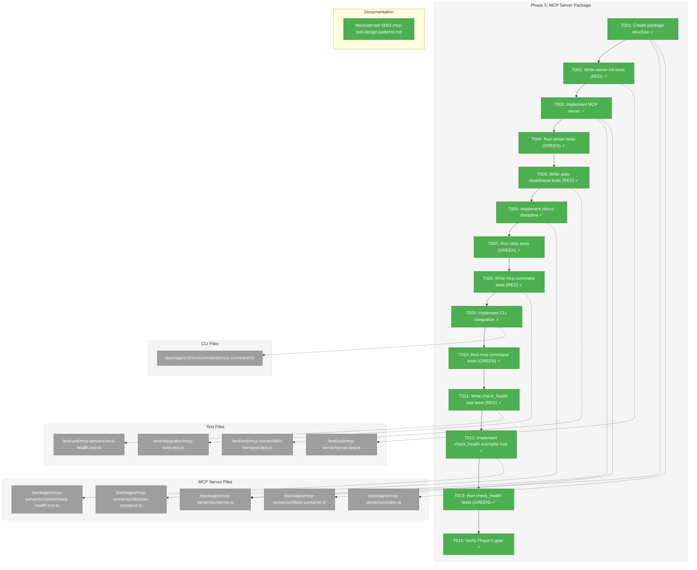
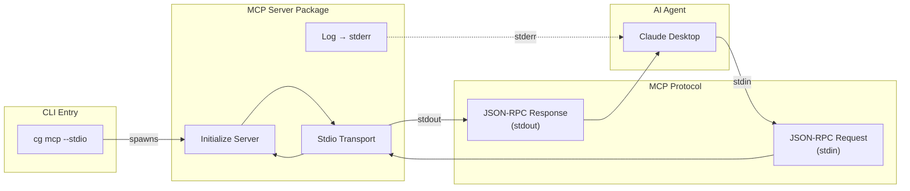
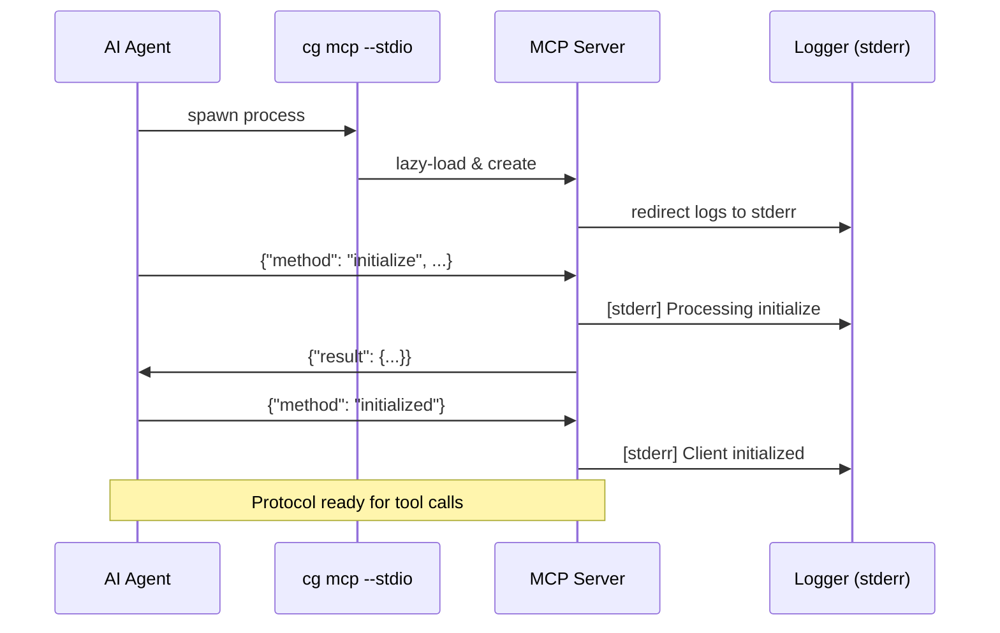

# Phase 5: MCP Server Package – Tasks & Alignment Brief

**Spec**: [../../project-setup-spec.md](../../project-setup-spec.md)
**Plan**: [../../project-setup-plan.md](../../project-setup-plan.md)
**Date**: 2026-01-19

---

## Executive Briefing

### Purpose

This phase implements the MCP (Model Context Protocol) server package that enables AI agents like Claude to integrate with Chainglass. Without this, Chainglass would only be accessible via web UI and CLI—MCP opens the door to agentic workflows where AI assistants can programmatically invoke Chainglass capabilities.

### What We're Building

An MCP server at `packages/mcp-server/` that:
- Implements the MCP protocol for AI agent communication
- Supports stdio transport (for local AI agents like Claude Desktop)
- Maintains strict stdout discipline (JSON-RPC only on stdout, logs to stderr)
- Integrates with CLI via `cg mcp --stdio` command
- Uses the same DI patterns established in Phase 3 for testability
- Includes an **exemplar `check_health` tool** that demonstrates best practices for all future MCP tools (see ADR-0001)

### User Value

AI agents can programmatically interact with Chainglass capabilities, enabling automated spec-driven workflows. Users running Claude Desktop or similar MCP-compatible agents can invoke Chainglass tools directly from their AI assistant conversations.

### Example

**Agent Request** (JSON-RPC via stdin):
```json
{"jsonrpc": "2.0", "id": 1, "method": "initialize", "params": {"protocolVersion": "2024-11-05", "capabilities": {}, "clientInfo": {"name": "claude-desktop", "version": "1.0.0"}}}
```

**Server Response** (JSON-RPC via stdout):
```json
{"jsonrpc": "2.0", "id": 1, "result": {"protocolVersion": "2024-11-05", "capabilities": {}, "serverInfo": {"name": "chainglass", "version": "0.0.1"}}}
```

---

## Objectives & Scope

### Objective

Implement the MCP server package as specified in the plan, with stdio transport support and strict stdout discipline per Critical Discovery 10.

### Goals

- ✅ Create MCP server structure in `packages/mcp-server/`
- ✅ Implement stdio transport using @modelcontextprotocol/sdk
- ✅ Handle MCP protocol `initialize` request correctly
- ✅ Maintain strict stdout discipline (no startup noise, JSON-RPC only)
- ✅ Redirect all logging to stderr in stdio mode
- ✅ Update CLI `cg mcp` command to lazy-load and start the server
- ✅ Add tests verifying protocol compliance and stdout cleanliness
- ✅ Implement `check_health` tool as exemplar following ADR-0001 best practices

### Non-Goals

- ❌ HTTP transport (defer to future phase or feature)
- ❌ SSE transport (defer to future phase or feature)
- ❌ Additional tools beyond `check_health` (this phase establishes the pattern)
- ❌ Resource implementations (future feature)
- ❌ MCP prompts implementation (future feature)
- ❌ Authentication/authorization (out of scope for MVP)
- ❌ Rate limiting or request validation beyond protocol (future)

---

## Architecture Map

### Component Diagram

<!-- Status: grey=pending, orange=in-progress, green=completed, red=blocked -->
<!-- Updated by plan-6 during implementation -->



### Task-to-Component Mapping

<!-- Status: ⬜ Pending | 🟧 In Progress | ✅ Complete | 🔴 Blocked -->

| Task | Component(s) | Files | Status | Comment |
|------|-------------|-------|--------|---------|
| T001 | Package Structure | /packages/mcp-server/src/ | ✅ Complete | Created server.ts, lib/, tools/ directory structure |
| T002 | Test Suite | /test/unit/mcp-server/server.test.ts | ✅ Complete | TDD: RED - 6 tests failing as expected |
| T003 | MCP Server | /packages/mcp-server/src/server.ts | ✅ Complete | Implemented with McpServer API, Zod schemas |
| T004 | Test Verification | (same as T002) | ✅ Complete | TDD: GREEN - 6 tests passing |
| T005 | Stdio Tests | /test/unit/mcp-server/stdio-transport.test.ts | ✅ Complete | TDD: RED - 4 tests failing as expected |
| T006 | Stdout Discipline | /packages/cli/src/commands/mcp.command.ts | ✅ Complete | Lazy-loading pattern with console redirection |
| T007 | Test Verification | (same as T005) | ✅ Complete | TDD: GREEN - 4 tests passing |
| T008 | CLI Integration Tests | /test/integration/mcp-stdio.test.ts | ✅ Complete | TDD: 5 integration tests passing |
| T009 | CLI Command | /packages/cli/src/commands/mcp.command.ts | ✅ Complete | Implemented in T006 with lazy-loading pattern |
| T010 | Test Verification | (same as T008) | ✅ Complete | TDD: GREEN - 5 integration tests passing |
| T011 | Tool Tests | /test/unit/mcp-server/check-health.test.ts | ✅ Complete | TDD: 6 tests passing, ADR-0001 compliant |
| T012 | Exemplar Tool | /packages/mcp-server/src/server.ts | ✅ Complete | Implemented in T003 with full ADR-0001 compliance |
| T013 | Test Verification | (same as T011) | ✅ Complete | TDD: GREEN - 6 tests passing |
| T014 | Gate Verification | All | ✅ Complete | All gates passed: 66 tests, clean lint |

---

## Tasks

| Status | ID | Task | CS | Type | Dependencies | Absolute Path(s) | Validation | Subtasks | Notes |
|--------|------|-----------------------------------|-----|------|--------------|-------------------------------|-------------------------------|----------|-------------------|
| [x] | T001 | Create packages/mcp-server/src structure with server.ts, lib/, tools/ directories | 1 | Setup | – | `/Users/jordanknight/substrate/chainglass/packages/mcp-server/src/server.ts`, `/Users/jordanknight/substrate/chainglass/packages/mcp-server/src/lib/`, `/Users/jordanknight/substrate/chainglass/packages/mcp-server/src/tools/` | Files exist, TypeScript compiles | – | – |
| [x] | T002 | Write tests for MCP server initialization (server creates, handles initialize request) | 2 | Test | T001 | `/Users/jordanknight/substrate/chainglass/test/unit/mcp-server/server.test.ts` | Tests compile, all fail (RED) | – | TDD: RED |
| [x] | T003 | Implement basic MCP server using @modelcontextprotocol/sdk | 2 | Core | T002 | `/Users/jordanknight/substrate/chainglass/packages/mcp-server/src/server.ts`, `/Users/jordanknight/substrate/chainglass/packages/mcp-server/src/lib/di-container.ts` | Server initializes, responds to initialize request | Add `PinoLoggerAdapter.createForStderr()` to shared | Per CD-02: decorator-free DI; DI container uses factory for stderr logger |
| [x] | T004 | Run server tests - expect GREEN | 1 | Test | T003 | (same as T002) | All server initialization tests pass | – | TDD: GREEN |
| [x] | T005 | Write tests for stdio cleanliness (no stdout before input, only JSON-RPC on stdout) | 2 | Test | T004 | `/Users/jordanknight/substrate/chainglass/test/unit/mcp-server/stdio-transport.test.ts` | Tests compile, all fail (RED) | – | TDD: RED; Per CD-10; ADR-0001 IMP-001 |
| [x] | T006 | Implement strict stdout discipline (redirect logs to stderr in stdio mode) | 2 | Core | T005 | `/Users/jordanknight/substrate/chainglass/packages/mcp-server/src/lib/stdio-transport.ts`, `/Users/jordanknight/substrate/chainglass/packages/mcp-server/src/server.ts` | No startup noise, logs go to stderr | – | Per CD-10; ADR-0001 Decision #1; DI uses `PinoLoggerAdapter.createForStderr()` |
| [x] | T007 | Run stdio tests - expect GREEN | 1 | Test | T006 | (same as T005) | All stdio cleanliness tests pass | – | TDD: GREEN; ADR-0001 |
| [x] | T008 | Write tests for mcp command (`cg mcp --help`, `cg mcp --stdio` starts server) | 2 | Test | T007 | `/Users/jordanknight/substrate/chainglass/test/integration/mcp-stdio.test.ts` | Tests compile, all fail (RED) | – | TDD: RED |
| [x] | T009 | Implement mcp command CLI integration (lazy-load MCP server, pass options) | 2 | Core | T008 | `/Users/jordanknight/substrate/chainglass/packages/cli/src/commands/mcp.command.ts` | `cg mcp --stdio` starts server, JSON-RPC works | – | Update existing stub |
| [x] | T010 | Run mcp command tests - expect GREEN | 1 | Test | T009 | (same as T008) | All MCP command tests pass | – | TDD: GREEN |
| [x] | T011 | Write tests for check_health tool (tool invocation, response format, annotations) | 2 | Test | T010 | `/Users/jordanknight/substrate/chainglass/test/unit/mcp-server/check-health.test.ts` | Tests compile, all fail (RED) | – | TDD: RED; Exemplar; ADR-0001 IMP-002, IMP-003 |
| [x] | T012 | Implement check_health tool following ADR-0001 best practices | 2 | Core | T011 | `/Users/jordanknight/substrate/chainglass/packages/mcp-server/src/tools/check-health.tool.ts` | Tool registered, returns health status | – | EXEMPLAR TOOL; ADR-0001 Decisions #2-7 |
| [x] | T013 | Run check_health tests - expect GREEN | 1 | Test | T012 | (same as T011) | All check_health tests pass | – | TDD: GREEN; ADR-0001 |
| [x] | T014 | Verify Phase 5 gate | 1 | Gate | T013 | All | `just build`, `just test`, `just fft` pass; `cg mcp --help` shows options; check_health tool invocable | 001-subtask-migrate-mcp-tests-to-sdk-client | GATE |

---

## Alignment Brief

### Prior Phases Review

#### Phase-by-Phase Summary (Evolution of Implementation)

**Phase 1 (Monorepo Foundation)**: Established pnpm workspace with 4 packages (shared, cli, mcp-server, web). Created build infrastructure via Turborepo, test infrastructure via Vitest, and developer tooling via justfile. Key insight: bootstrap sequence must be strict (workspace yaml → package stubs → pnpm install → tooling).

**Phase 2 (Shared Package)**: Created `@chainglass/shared` with ILogger interface, FakeLogger, and PinoLoggerAdapter. Established interface-first TDD pattern and contract tests to prevent fake drift. Key insight: use `export type` for type re-exports with `isolatedModules: true`.

**Phase 3 (Next.js App)**: Implemented DI container with child container pattern (Critical Discovery 04). Established `useFactory` pattern as decorator-free alternative (Critical Discovery 02). Created test fixtures for automatic container/logger injection. Key insight: `useClass` fails without decorators—always use `useFactory`.

**Phase 4 (CLI Package)**: Created Commander.js CLI with `testMode` factory pattern for safe testing. Implemented `cg web` command with Next.js standalone bundling. Created MCP command stub. Key insight: CJS format required for Commander.js + esbuild; SIGINT forwarding required for clean shutdown.

#### Cumulative Deliverables (Organized by Phase of Origin)

**From Phase 1**:
- Just commands: `install`, `dev`, `build`, `test`, `lint`, `format`, `fft`, `typecheck`, `check`, `clean`, `reset`
- Path aliases: `@chainglass/shared`, `@chainglass/cli`, `@chainglass/mcp-server`, `@chainglass/web`, `@test/*`
- Turborepo build orchestration with dependency-aware caching

**From Phase 2**:
- `ILogger` interface with all log levels
- `FakeLogger` with test assertion helpers (`getEntries()`, `getEntriesByLevel()`, `assertLoggedAtLevel()`, `clear()`)
- `PinoLoggerAdapter` for production logging
- Contract test pattern in `/test/contracts/logger.contract.ts`
- `LogLevel` enum, `LogEntry` interface

**From Phase 3**:
- `createProductionContainer()` / `createTestContainer()` pattern
- `useFactory` DI registration pattern (decorator-free)
- `DI_TOKENS` constant pattern for type-safe resolution
- `SampleService` as reference implementation
- `/api/health` endpoint pattern
- Test fixtures in `/test/base/web-test.ts`

**From Phase 4**:
- `createProgram({ testMode: true })` pattern for Commander.js testing
- MCP command stub at `/packages/cli/src/commands/mcp.command.ts`
- Process cleanup pattern: `afterEach(() => proc?.kill())`
- Random port pattern for tests: `30000 + Math.floor(Math.random() * 10000)`
- SIGINT forwarding pattern for child processes

#### Complete Dependency Tree

```
Phase 5 depends on:
├── Phase 4: CLI Package
│   ├── mcp.command.ts (stub to update)
│   └── createProgram() (for CLI testing)
├── Phase 3: Next.js App
│   └── DI container patterns (useFactory, child containers)
├── Phase 2: Shared Package
│   ├── ILogger interface
│   ├── FakeLogger (for testing)
│   └── PinoLoggerAdapter (for production)
└── Phase 1: Monorepo Foundation
    ├── Build infrastructure
    └── Test infrastructure
```

#### Pattern Evolution

| Pattern | Phase Introduced | Evolution |
|---------|-----------------|-----------|
| Interface-first TDD | Phase 2 | Consistent throughout |
| Contract tests | Phase 2 | Reused for any new interface |
| useFactory DI | Phase 3 | Standard for all containers |
| Child containers | Phase 3 | Required for test isolation |
| testMode factory | Phase 4 | Applicable to any CLI testing |
| Process cleanup | Phase 4 | Required for any subprocess tests |

#### Recurring Issues

1. **ESM/CJS compatibility**: Phase 4 discovered Commander.js requires CJS. Phase 5 may encounter similar issues with MCP SDK.
2. **Path resolution**: Phases 1, 3 all had path alias issues. Need to ensure MCP server package has correct tsconfig paths.
3. **Test isolation**: Phases 3, 4 required careful process/container cleanup. Phase 5 stdio tests need same discipline.

#### Cross-Phase Learnings

1. **Always use `useFactory` for DI** - `useClass` fails without decorators
2. **Always forward SIGINT** - Prevents zombie processes
3. **Always use testMode patterns** - Prevents test runner crashes from `process.exit()`
4. **Always use child containers** - Prevents test pollution
5. **Always cleanup spawned processes** - `afterEach(() => proc?.kill())`

#### Foundation for Current Phase

Phase 5 builds directly on:
- **Phase 4** MCP command stub (to update with real implementation)
- **Phase 3** DI container patterns (to reuse for MCP server)
- **Phase 2** ILogger interface (to use for MCP server logging)
- **Phase 1** test infrastructure (to add MCP-specific tests)

#### Reusable Test Infrastructure

| Infrastructure | Source | Reusable For |
|----------------|--------|--------------|
| FakeLogger | Phase 2 | MCP server logging tests |
| Contract tests | Phase 2 | Any new interface |
| createTestContainer() | Phase 3 | MCP server container |
| Process cleanup pattern | Phase 4 | MCP stdio tests |
| testMode factory pattern | Phase 4 | N/A (MCP uses stdio, not CLI) |

#### Architectural Continuity

**Patterns to Maintain**:
- DI with `useFactory` (no decorators)
- Child containers for test isolation
- Interface-first TDD with contract tests
- Centralized tests in `/test/`
- FakeLogger over mocks

**Anti-Patterns to Avoid**:
- `@injectable()` decorators
- `useClass` DI registration
- Global container in tests
- `process.exit()` in testable code
- Zombie child processes

#### Critical Findings Timeline

| Finding | Phase Discovered | Impact on Phase 5 |
|---------|-----------------|-------------------|
| CD-02: No decorators in RSC | Phase 3 | MCP server must use useFactory pattern |
| CD-04: Child containers required | Phase 3 | MCP tests need isolated containers |
| CD-10: MCP stdout discipline | Phase 5 (defined in plan) | Core requirement for this phase |
| Commander.js testMode | Phase 4 | N/A for MCP (stdio-based) |

---

### Critical Findings Affecting This Phase

#### 🚨 Critical Discovery 10: MCP stdio Transport Requires stdout Discipline

**Finding**: In stdio mode, stdout is reserved for JSON-RPC. Any extraneous output (logs, console.log) corrupts the protocol.

**What It Constrains**:
- NO startup messages on stdout
- NO logging to stdout in stdio mode
- Only valid JSON-RPC messages on stdout
- All logs MUST go to stderr

**Solution Pattern** (clarified via /didyouknow session 2026-01-19):
```typescript
// In mcp.command.ts - CRITICAL: redirect BEFORE dynamic import
export async function runMcpCommand(options: McpCommandOptions): Promise<void> {
  if (options.stdio) {
    // STEP 1: Redirect console BEFORE any imports (catches module side effects)
    console.log = (...args) => console.error('[LOG]', ...args);
    console.warn = (...args) => console.error('[WARN]', ...args);
    console.info = (...args) => console.error('[INFO]', ...args);
  }

  // STEP 2: Now safe to dynamic import (any module side effects go to stderr)
  const { createMcpServer } = await import('@chainglass/mcp-server');

  // STEP 3: MCP server also uses stderr-configured logger (defense in depth)
  const server = await createMcpServer({ stdio: options.stdio });
  await server.run();
}
```

**Key Insight**: Lazy-loading via dynamic import is REQUIRED. Static imports at top of file would execute before console redirection.

**Tasks Addressing This**: T005, T006, T007, T009

#### Critical Discovery 02: TSyringe Decorators Fail in RSC

**Relevance to Phase 5**: While MCP server isn't RSC, we maintain consistent patterns across the codebase. All DI uses `useFactory` pattern.

**Tasks Addressing This**: T003 (DI container setup)

#### Critical Discovery 04: Child Container Pattern Required

**Relevance to Phase 5**: MCP server tests must use child containers to prevent test pollution.

**Tasks Addressing This**: T002, T003 (createTestContainer pattern)

---

### ADR Decision Constraints

#### ADR-0001: MCP Tool Design Patterns (Accepted)

**Location**: [../../adr/adr-0001-mcp-tool-design-patterns.md](../../../../adr/adr-0001-mcp-tool-design-patterns.md)

**Key Decisions Affecting This Phase**:

| Decision | Constraint | Tasks Affected |
|----------|------------|----------------|
| STDIO Protocol Compliance | stdout reserved for JSON-RPC only; all logs to stderr | T005, T006, T007 |
| Tool Naming | `verb_object` format, snake_case | T011, T012 |
| Tool Descriptions | 3-4 sentences: action, scope, returns, alternatives | T012 |
| Parameter Design | JSON Schema constraints (`enum`, `minimum`/`maximum`) over natural language | T012 |
| Response Design | Semantic fields + `summary` field mandatory | T012 |
| Error Handling | `action` field with remediation guidance | T012 |
| Annotations | Complete `readOnlyHint`, `destructiveHint`, `idempotentHint`, `openWorldHint` | T012 |
| Testing | Three-level strategy: Unit → Integration → E2E | T002, T005, T008, T011 |

**Implementation Notes from ADR**:
- **IMP-001**: STDIO compliance must be configured BEFORE any imports in the entry point
- **IMP-002**: The `check_health` tool serves as the exemplar implementation
- **IMP-003**: Tool PRs must include evidence of all three test levels
- **IMP-005**: Tool count should remain under 25 total

**References**:
- [ADR-0001](../../../../adr/adr-0001-mcp-tool-design-patterns.md) - Architectural decision record for MCP tool design

---

### Invariants & Guardrails

| Invariant | Measurement | Threshold |
|-----------|-------------|-----------|
| Test execution time | `just test` duration | < 5 seconds |
| Build success | `just build` exit code | 0 |
| Type safety | `just typecheck` exit code | 0 |
| Lint compliance | `just lint` exit code | 0 |
| Stdio cleanliness | Bytes on stdout before first request | 0 |

---

### Inputs to Read

| File | Purpose |
|------|---------|
| `/Users/jordanknight/substrate/chainglass/packages/mcp-server/package.json` | Current dependencies (has @modelcontextprotocol/sdk) |
| `/Users/jordanknight/substrate/chainglass/packages/mcp-server/src/index.ts` | Current entry point (empty stub) |
| `/Users/jordanknight/substrate/chainglass/packages/cli/src/commands/mcp.command.ts` | CLI stub to update |
| `/Users/jordanknight/substrate/chainglass/apps/web/src/lib/di-container.ts` | Reference DI pattern |
| `/Users/jordanknight/substrate/chainglass/test/base/web-test.ts` | Reference test fixtures |
| `/Users/jordanknight/substrate/chainglass/docs/adr/adr-0001-mcp-tool-design-patterns.md` | **ADR-0001: MCP tool design patterns (MUST READ before T011)** |

---

### Exemplar Tool: `check_health`

This is the **reference implementation** for all future MCP tools. Study this pattern before implementing any new tools.

**Why an Exemplar?**
- Establishes patterns that future tools MUST follow
- Demonstrates best practices from ADR-0001
- Provides a working template for copy-paste-modify development
- Validates the MCP server infrastructure end-to-end

#### Tool Definition

```typescript
{
  name: 'check_health',

  description: `Check the health status of all Chainglass system components.
Use this tool to verify the system is operational before performing other
operations or when diagnosing issues. Returns component-level status
(ok/degraded/error) with diagnostic details for any unhealthy components.`,

  inputSchema: {
    type: 'object',
    properties: {
      components: {
        type: 'array',
        items: {
          type: 'string',
          enum: ['all', 'api', 'database', 'cache', 'queue']
        },
        default: ['all'],
        description: "Components to check. Defaults to ['all']. Example: ['api', 'database']"
      },
      include_details: {
        type: 'boolean',
        default: false,
        description: 'Include detailed diagnostics for each component. Defaults to false.'
      }
    },
    required: []
  },

  annotations: {
    title: 'Check System Health',
    readOnlyHint: true,
    destructiveHint: false,
    idempotentHint: true,
    openWorldHint: false
  }
}
```

#### Expected Response (for MVP)

For Phase 5, the tool returns a simple "ok" status. Future phases will add real component checks.

```json
{
  "status": "ok",
  "components": [
    {
      "name": "api",
      "status": "ok",
      "message": "API server responding normally"
    }
  ],
  "summary": "All 1 components healthy",
  "checked_at": "2026-01-19T10:30:00Z"
}
```

#### Best Practices Demonstrated

| Practice | How check_health Demonstrates It |
|----------|----------------------------------|
| `verb_object` naming | `check_health` - action verb + noun |
| snake_case | `check_health`, `include_details` |
| 3+ sentence description | Covers what, when to use, what returns |
| Explicit enum | `components` uses enum for valid values |
| Sensible defaults | `components: ['all']`, `include_details: false` |
| Semantic response | `summary` field, `name` not just IDs |
| Accurate annotations | `readOnlyHint: true`, `idempotentHint: true` |
| No required params | All parameters optional with defaults |

---

### Visual Alignment Aids

#### System State Flow Diagram



#### Sequence Diagram: MCP Initialization



---

### Test Plan

**Testing Approach**: Full TDD per spec (RED-GREEN-REFACTOR)
**Mock Policy**: Fakes only (FakeLogger), no vi.mock()

#### Unit Tests

| Test File | Tests | Purpose | Fixtures |
|-----------|-------|---------|----------|
| `test/unit/mcp-server/server.test.ts` | 4-5 | Server initialization, handle initialize request, server info | FakeLogger, createTestContainer |
| `test/unit/mcp-server/stdio-transport.test.ts` | 3-4 | No stdout before input, logs to stderr, JSON-RPC format | Process spawn, stdout/stderr capture |

#### Integration Tests

| Test File | Tests | Purpose | Fixtures |
|-----------|-------|---------|----------|
| `test/integration/mcp-stdio.test.ts` | 3-4 | `cg mcp --help`, `cg mcp --stdio` startup, JSON-RPC roundtrip | Child process, random ports |

#### Test Examples

```typescript
// test/unit/mcp-server/server.test.ts
import { describe, it, expect, beforeEach } from 'vitest';
import { createMcpServer } from '@chainglass/mcp-server';
import { FakeLogger } from '@chainglass/shared';

describe('MCP Server', () => {
  let fakeLogger: FakeLogger;

  beforeEach(() => {
    fakeLogger = new FakeLogger();
  });

  it('should create server instance', () => {
    /*
    Test Doc:
    - Why: MCP server is the core of Phase 5; must be instantiable
    - Contract: createMcpServer(options) returns a valid server instance
    - Usage Notes: Pass logger; server doesn't start until run() called
    - Quality Contribution: Catches constructor errors, missing deps
    - Worked Example: createMcpServer({ logger }) returns object with run()
    */
    const server = createMcpServer({ logger: fakeLogger });
    expect(server).toBeDefined();
    expect(typeof server.run).toBe('function');
  });

  it('should respond to initialize request', async () => {
    /*
    Test Doc:
    - Why: Initialize is mandatory first request per MCP spec
    - Contract: Server responds with protocolVersion, capabilities, serverInfo
    - Usage Notes: Send initialize via handleRequest or internal mock
    - Quality Contribution: Catches protocol non-compliance
    - Worked Example: initialize request -> result with serverInfo.name='chainglass'
    */
    const server = createMcpServer({ logger: fakeLogger });
    const response = await server.handleRequest({
      jsonrpc: '2.0',
      id: 1,
      method: 'initialize',
      params: {
        protocolVersion: '2024-11-05',
        capabilities: {},
        clientInfo: { name: 'test', version: '1.0.0' },
      },
    });

    expect(response.result.serverInfo.name).toBe('chainglass');
    expect(response.result.protocolVersion).toBe('2024-11-05');
  });
});

// test/unit/mcp-server/stdio-transport.test.ts
import { describe, it, expect, afterEach } from 'vitest';
import { spawn, ChildProcess } from 'child_process';

describe('MCP stdio transport', () => {
  let proc: ChildProcess | null = null;

  afterEach(() => {
    if (proc) {
      proc.kill();
      proc = null;
    }
  });

  it('should not output anything to stdout before receiving input', async () => {
    /*
    Test Doc:
    - Why: MCP stdio protocol requires stdout reserved for JSON-RPC only
    - Contract: No bytes on stdout until first request received
    - Usage Notes: Spawn mcp server, wait 500ms, check stdout buffer
    - Quality Contribution: Catches console.log or startup messages
    - Worked Example: spawn, wait 500ms, stdout.join('') === ''
    */
    proc = spawn('node', ['packages/mcp-server/dist/index.js', '--stdio'], {
      stdio: ['pipe', 'pipe', 'pipe'],
    });

    const stdout: string[] = [];
    proc.stdout?.on('data', (data) => stdout.push(data.toString()));

    await new Promise((r) => setTimeout(r, 500));
    expect(stdout.join('')).toBe('');
  });
});
```

---

### Step-by-Step Implementation Outline

| Step | Task | Action | Validation |
|------|------|--------|------------|
| 1 | T001 | Create `server.ts`, `lib/`, `tools/` directory structure | Files exist, `tsc` compiles |
| 2 | T002 | Write server tests (createMcpServer, handleRequest) | Tests fail (RED) |
| 3 | T003 | Implement MCP server with @modelcontextprotocol/sdk | Code compiles |
| 4 | T004 | Run tests | All server tests GREEN |
| 5 | T005 | Write stdio cleanliness tests | Tests fail (RED) |
| 6 | T006 | Implement stdout discipline (stderr redirect) | Code compiles |
| 7 | T007 | Run tests | All stdio tests GREEN |
| 8 | T008 | Write CLI integration tests | Tests fail (RED) |
| 9 | T009 | Update mcp.command.ts to lazy-load server | Code compiles |
| 10 | T010 | Run tests | All CLI tests GREEN |
| 11 | T011 | Write check_health tool tests | Tests fail (RED) |
| 12 | T012 | Implement check_health tool per ADR-0001 best practices | Code compiles, tool registered |
| 13 | T013 | Run tests | All check_health tests GREEN |
| 14 | T014 | Run full gate verification | `just build`, `just test`, `just fft` pass; tool invocable |

---

### Commands to Run

```bash
# Environment setup (if needed)
just install

# Build all packages (ensures mcp-server builds)
just build

# Run tests (should fail initially - TDD RED)
just test

# Run specific test file
pnpm vitest run test/unit/mcp-server/server.test.ts

# Run integration tests only
pnpm vitest run test/integration/mcp-stdio.test.ts

# Type check
just typecheck

# Full quality check
just fft

# Verify MCP command help
node packages/cli/dist/cli.cjs mcp --help

# Manual MCP stdio test (will hang waiting for input)
node packages/cli/dist/cli.cjs mcp --stdio
```

---

### Risks/Unknowns

| Risk | Severity | Likelihood | Mitigation |
|------|----------|------------|------------|
| @modelcontextprotocol/sdk API unfamiliarity | Medium | Medium | Read SDK docs/examples first; start with minimal server |
| stdout capture in tests unreliable | Medium | Low | Use process spawn with explicit stdio pipes; add timeout |
| ESM/CJS compatibility issues | Medium | Medium | Follow Phase 4 CJS pattern if needed |
| pnpm symlink issues (like Phase 4) | Low | Low | Test in monorepo context first; document limitations |

---

### Ready Check

- [ ] Plan document reviewed and understood
- [ ] All prior phases reviewed (Phase 1-4)
- [ ] Critical Discovery 10 (stdout discipline) understood
- [ ] @modelcontextprotocol/sdk dependency present in package.json
- [ ] Test infrastructure ready (Vitest, FakeLogger)
- [ ] DI patterns from Phase 3 understood (useFactory, child containers)
- [ ] Process cleanup patterns from Phase 4 understood
- [ ] **ADR-0001 reviewed** (`docs/adr/adr-0001-mcp-tool-design-patterns.md`)
- [ ] **Exemplar tool definition understood** (check_health in this doc)
- [ ] ADR constraints mapped to tasks (see ADR Decision Constraints section above)

**Awaiting explicit GO/NO-GO from human sponsor.**

---

## Phase Footnote Stubs

_Populated by plan-6a-update-progress during implementation._

| Footnote | Content | Tasks | Files |
|----------|---------|-------|-------|
| | | | |

[^21]: Phase 5 - MCP Server Package implementation
  - `file:packages/mcp-server/src/server.ts` - Main MCP server with check_health tool
  - `file:packages/mcp-server/src/lib/di-container.ts` - DI container for MCP server
  - `file:packages/mcp-server/src/lib/index.ts` - Lib exports
  - `file:packages/mcp-server/src/tools/index.ts` - Tools exports
  - `file:packages/mcp-server/src/index.ts` - Package exports
  - `file:packages/cli/src/commands/mcp.command.ts` - CLI mcp command with lazy loading
  - `file:packages/shared/src/adapters/pino-logger.adapter.ts` - Added createForStderr() factory
  - `file:test/unit/mcp-server/server.test.ts` - Server initialization tests (6 tests)
  - `file:test/unit/mcp-server/stdio-transport.test.ts` - Stdio cleanliness tests (4 tests)
  - `file:test/unit/mcp-server/check-health.test.ts` - ADR-0001 compliance tests (6 tests)
  - `file:test/integration/mcp-stdio.test.ts` - MCP command integration tests (5 tests)

---

## Evidence Artifacts

- **Execution Log**: `./execution.log.md` (created by plan-6)
- **Test Results**: Captured in execution log
- **Build Artifacts**: `packages/mcp-server/dist/`

---

## Discoveries & Learnings

_Populated during implementation by plan-6. Log anything of interest to your future self._

| Date | Task | Type | Discovery | Resolution | References |
|------|------|------|-----------|------------|------------|
| 2026-01-19 | T006 | decision | STDIO compliance requires console redirection BEFORE any imports per ADR-0001 IMP-001 | Use lazy-loading pattern: redirect console in mcp.command.ts handler, then dynamic import MCP server | ADR-0001:94, V1-03, V1-07 |
| 2026-01-19 | T001,T003 | decision | Each package owns its own DI container (like web app pattern) | CLI: `packages/cli/src/lib/di-container.ts`, MCP: `packages/mcp-server/src/lib/di-container.ts` | apps/web/src/lib/di-container.ts |
| 2026-01-19 | T003 | decision | MCP needs stderr-configured logger; keep pino config encapsulated | Add static factory `PinoLoggerAdapter.createForStderr()` to shared package | packages/shared/src/adapters/pino-logger.adapter.ts |
| 2026-01-19 | T002,T005,T008,T011 | decision | Full Test Doc format required for every test (no abbreviations) | All 5 parts: Why, Contract, Usage Notes, Quality Contribution, Worked Example | test/unit/cli/web-command.test.ts:31-47 |
| 2026-01-19 | T003,T012 | decision | Use McpServer high-level API (not raw Server class) | `import { McpServer } from '@modelcontextprotocol/sdk/server/mcp'`; use `server.tool()` for registration | V4-04 |
| 2026-01-19 | T011,T012,T013 | decision | check_health is Gold Standard exemplar - implement ALL ADR-0001 patterns | Full error handling with `action` field, all annotations, complete response structure; future tools copy this | ADR-0001 IMP-002 |

**Types**: `gotcha` | `research-needed` | `unexpected-behavior` | `workaround` | `decision` | `debt` | `insight`

**What to log**:
- Things that didn't work as expected
- External research that was required
- Implementation troubles and how they were resolved
- Gotchas and edge cases discovered
- Decisions made during implementation
- Technical debt introduced (and why)
- Insights that future phases should know about

_See also: `execution.log.md` for detailed narrative._

---

## Directory Layout

```
docs/plans/001-project-setup/
├── project-setup-spec.md
├── project-setup-plan.md
└── tasks/
    ├── phase-1-monorepo-foundation/
    │   ├── tasks.md
    │   └── execution.log.md
    ├── phase-2-shared-package/
    │   ├── tasks.md
    │   └── execution.log.md
    ├── phase-3-nextjs-app-clean-architecture/
    │   ├── tasks.md
    │   └── execution.log.md
    ├── phase-4-cli-package/
    │   ├── tasks.md
    │   └── execution.log.md
    └── phase-5-mcp-server-package/
        ├── tasks.md              ← This file
        └── execution.log.md      ← Created by plan-6
```

---

## Critical Insights Discussion

**Session**: 2026-01-19
**Context**: Phase 5: MCP Server Package - Pre-implementation clarity session
**Analyst**: AI Clarity Agent
**Reviewer**: Development Team
**Format**: Water Cooler Conversation (5 Critical Insights)

### Insight 1: STDIO Compliance Must Happen BEFORE Any Imports

**Did you know**: The current `mcp.command.ts` stub uses `console.log()` which would corrupt the MCP protocol if run with `--stdio` flag.

**Implications**:
- Any stdout output before JSON-RPC corrupts protocol
- Module-level side effects during import can pollute stdout
- ADR-0001 IMP-001 mandates console redirection BEFORE imports

**Options Considered**:
- Option A: Pre-Import Redirection in CLI - redirect console, then dynamic import
- Option B: Entry Point Bootstrap Module - separate file for setup
- Option C: StdioServerTransport Only - rely on SDK (Not Feasible)

**AI Recommendation**: Option A - Pre-Import Redirection in CLI

**Discussion Summary**: User agreed. Lazy-loading via dynamic import allows console redirection before any MCP server code executes.

**Decision**: Use lazy-loading pattern with console redirection before dynamic import

**Action Items**:
- [x] Update CD-10 solution pattern in tasks.md with complete example

**Affects**: T005, T006, T009

---

### Insight 2: DI Container Ownership and Logger Configuration

**Did you know**: The MCP server needs its own DI container, and the logger must be configured for stderr in stdio mode.

**Implications**:
- Each package owns its own DI container (like web app pattern)
- MCP server shouldn't know about PinoLoggerAdapter internals
- DI container configuration is where stdio awareness lives

**Options Considered**:
- Option A: Each package owns its own DI container
- Option B: CLI configures, MCP receives container
- Option C: Shared base factory in @chainglass/shared

**Sub-decision - Logger Configuration**:
- Option A: Static factory `PinoLoggerAdapter.createForStderr()` (chosen)
- Option B: Constructor options object

**AI Recommendation**: Option A for both decisions

**Discussion Summary**: User confirmed each package owns its DI container. Also decided to add static factory method to keep pino config encapsulated in the adapter.

**Decision**:
1. Each package owns its own DI container
2. Add `PinoLoggerAdapter.createForStderr()` to shared package

**Action Items**:
- [x] Document DI container locations in tasks.md
- [x] Add subtask to T003 for factory method

**Affects**: T001, T003, T006

---

### Insight 3: Test Doc Format Is Mandatory

**Did you know**: Every test requires a 5-part documentation block (Why, Contract, Usage Notes, Quality Contribution, Worked Example).

**Implications**:
- Phase 5 has 17+ test cases across 4 files
- Missing any part violates project standard
- Consistency enables understanding of test purpose

**Options Considered**:
- Option A: Full Test Doc for every test (no exceptions)
- Option B: Abbreviated for trivial tests

**AI Recommendation**: Option A - Full Test Doc everywhere

**Discussion Summary**: User agreed. 30 seconds per test ensures anyone can understand why it exists.

**Decision**: Full Test Doc format required for every test

**Action Items**: None (standard already documented)

**Affects**: T002, T005, T008, T011

---

### Insight 4: MCP SDK Has Two API Levels

**Did you know**: The SDK provides both low-level `Server` and high-level `McpServer` APIs with different trade-offs.

**Implications**:
- McpServer has built-in `tool()`, `resource()`, `prompt()` methods
- Server requires manual request handler registration
- Choice affects code complexity and maintainability

**Options Considered**:
- Option A: McpServer (high-level) - cleaner tool registration
- Option B: Server (low-level) - full protocol control
- Option C: Custom wrapper (Not Feasible)

**AI Recommendation**: Option A - McpServer

**Discussion Summary**: User agreed. High-level API provides exactly what we need with less code.

**Decision**: Use `McpServer` from `@modelcontextprotocol/sdk/server/mcp`

**Action Items**: None

**Affects**: T003, T012

---

### Insight 5: check_health Is an Exemplar, Not Just a Tool

**Did you know**: check_health is the reference implementation that all future tools must copy, per ADR-0001 IMP-002.

**Implications**:
- Must demonstrate every ADR-0001 pattern perfectly
- If it cuts corners, future tools will copy those shortcuts
- Extra investment here pays off in consistency

**Options Considered**:
- Option A: Gold Standard - implement all patterns even if "overkill"
- Option B: Minimal Viable - just enough to prove MCP works

**AI Recommendation**: Option A - Gold Standard

**Discussion Summary**: User agreed. This is the one tool where we invest extra effort because it's the template.

**Decision**: Gold Standard implementation with all ADR-0001 patterns

**Action Items**: None

**Affects**: T011, T012, T013

---

## Session Summary

**Insights Surfaced**: 5 critical insights identified and discussed
**Decisions Made**: 7 decisions reached through collaborative discussion
**Action Items Created**: 3 updates applied to tasks.md during session
**Areas Updated**:
- CD-10 solution pattern (enhanced with complete example)
- Discoveries & Learnings table (5 new entries)
- Task notes (T003, T006 updated)

**Shared Understanding Achieved**: ✓

**Confidence Level**: High - All architectural questions resolved, clear implementation path

**Next Steps**:
- Phase 5 ready for implementation
- Start with T001 (package structure)
- Add `PinoLoggerAdapter.createForStderr()` to shared package as part of T003
