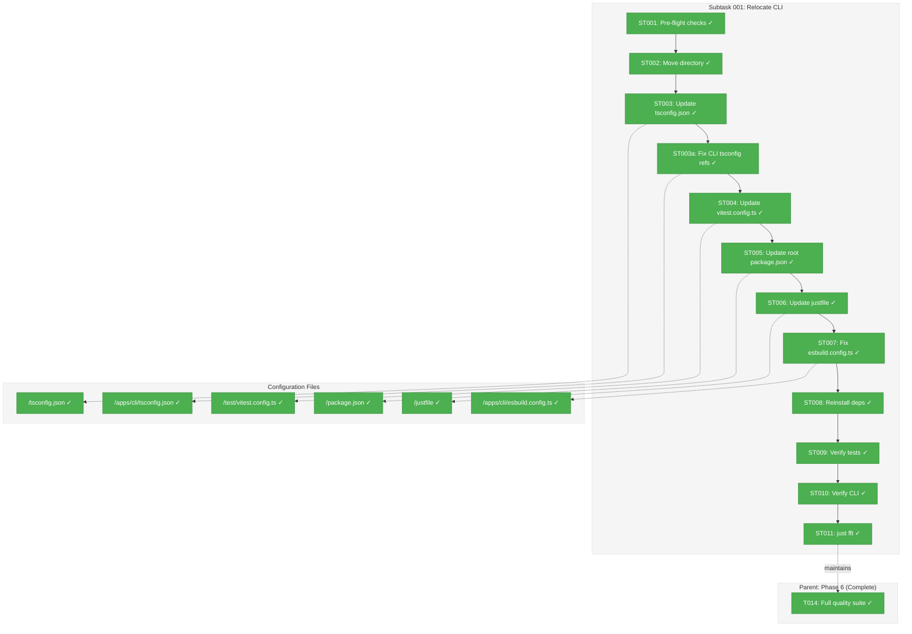
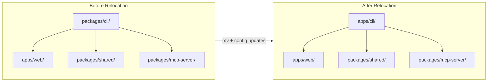
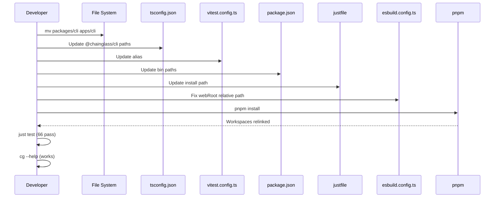

# Subtask 001: Relocate CLI from packages/ to apps/

**Parent Plan:** [View Plan](../../project-setup-plan.md)
**Parent Phase:** Phase 6: Documentation & Polish
**Parent Task(s):** Post-completion refinement (Phase 6 complete, structure improvement)
**Plan Task Reference:** [Phase 6](../../project-setup-plan.md#phase-6-documentation--polish)

**Why This Subtask:**
During Phase 6 verification, we identified that `@chainglass/cli` is mislocated in `packages/` when it should be in `apps/`. The CLI is a runnable entry point (has `bin` field), not a library that gets imported. Moving it to `apps/cli` aligns with monorepo conventions where `apps/` contains deployable products and `packages/` contains reusable libraries.

**Created:** 2026-01-20
**Requested By:** Development Team (architecture refinement)

---

## Executive Briefing

### Purpose
This subtask moves the CLI package from `packages/cli` to `apps/cli` to align with standard monorepo conventions. The CLI is the top-level entry point that imports other packages—nothing imports it—making it an "app" not a "package" in pnpm/Turborepo terminology.

### What We're Building
A clean directory reorganization that:
- Moves `packages/cli/` to `apps/cli/` (physical relocation)
- Updates 5 configuration files with new paths
- Fixes internal relative paths in `esbuild.config.ts`
- Maintains all existing functionality (no code changes)

### Unblocks
- Architectural consistency with monorepo conventions
- Cleaner mental model: `apps/` = runnable, `packages/` = libraries

### Example
**Before:**
```
chainglass/
├── apps/
│   └── web/           # ✓ Correct (deployable app)
└── packages/
    ├── cli/           # ✗ Wrong (should be in apps/)
    ├── mcp-server/    # ✓ Correct (embedded library)
    └── shared/        # ✓ Correct (shared library)
```

**After:**
```
chainglass/
├── apps/
│   ├── cli/           # ✓ Correct (runnable entry point)
│   └── web/           # ✓ Correct (deployable app)
└── packages/
    ├── mcp-server/    # ✓ Correct (embedded library)
    └── shared/        # ✓ Correct (shared library)
```

---

## Objectives & Scope

### Objective
Relocate the CLI from `packages/cli` to `apps/cli` to follow monorepo conventions, updating all configuration references to maintain full functionality.

### Goals

- ✅ Move `packages/cli/` directory to `apps/cli/`
- ✅ Update `tsconfig.json` path aliases for `@chainglass/cli`
- ✅ Update `test/vitest.config.ts` alias for `@chainglass/cli`
- ✅ Update root `package.json` bin paths
- ✅ Update `justfile` install command path
- ✅ Fix `esbuild.config.ts` relative path to web assets
- ✅ Reinstall dependencies (`pnpm install`)
- ✅ Verify all tests pass (66 tests)
- ✅ Verify CLI commands work (`cg --help`, `cg web`, `cg mcp`)
- ✅ Run full quality suite (`just fft` passes)

### Non-Goals

- ❌ Renaming the package (stays `@chainglass/cli`)
- ❌ Code logic changes (paths only)
- ❌ Updating historical documentation in `docs/plans/` (optional, low priority)
- ❌ Moving other packages (mcp-server, shared stay in packages/)

---

## Architecture Map

### Component Diagram
<!-- Status: grey=pending, orange=in-progress, green=completed, red=blocked -->
<!-- Updated by plan-6 during implementation -->



### Task-to-Component Mapping

<!-- Status: ⬜ Pending | 🟧 In Progress | ✅ Complete | 🔴 Blocked -->

| Task | Component(s) | Files | Status | Comment |
|------|-------------|-------|--------|---------|
| ST001 | Pre-flight | All | ✅ Complete | Verify current state passes `just check` |
| ST002 | Directory Move | packages/cli → apps/cli | ✅ Complete | Physical file relocation |
| ST003 | TypeScript Config | /tsconfig.json | ✅ Complete | Update @chainglass/cli paths |
| ST003a | CLI TypeScript Config | /apps/cli/tsconfig.json | ✅ Complete | Fix references path to shared |
| ST004 | Vitest Config | /test/vitest.config.ts | ✅ Complete | Update alias resolution |
| ST005 | Root Package | /package.json | ✅ Complete | Update bin paths |
| ST006 | Justfile | /justfile | ✅ Complete | Update install command path |
| ST007 | Build Config | /apps/cli/esbuild.config.ts | ✅ Complete | Fix relative path to web assets |
| ST008 | Dependencies | pnpm-lock.yaml | ✅ Complete | Reinstall to relink workspaces |
| ST009 | Test Verification | test/ | ✅ Complete | All 66 tests must pass |
| ST010 | CLI Verification | apps/cli | ✅ Complete | cg --help, cg web, cg mcp work |
| ST011 | Quality Gate | All | ✅ Complete | `just fft` passes |

---

## Tasks

| Status | ID | Task | CS | Type | Dependencies | Absolute Path(s) | Validation | Subtasks | Notes |
|--------|------|------|-----|------|--------------|------------------|------------|----------|-------|
| [x] | ST001 | Run pre-flight checks | 1 | Verify | – | /Users/jordanknight/substrate/chainglass/ | `just check` passes | – | Baseline before changes |
| [x] | ST002 | Move packages/cli to apps/cli | 1 | Refactor | ST001 | /Users/jordanknight/substrate/chainglass/apps/cli/ | Directory exists at new location, git history preserved | – | `git mv packages/cli apps/cli` (preserves history) |
| [x] | ST003 | Update tsconfig.json paths | 1 | Config | ST002 | /Users/jordanknight/substrate/chainglass/tsconfig.json | @chainglass/cli points to apps/cli/src | – | Lines 24-25 |
| [x] | ST003a | Fix CLI tsconfig.json references | 1 | Config | ST003 | /Users/jordanknight/substrate/chainglass/apps/cli/tsconfig.json | references path points to ../../packages/shared | – | Line 13: `../shared` → `../../packages/shared` (DYK-05) |
| [x] | ST004 | Update vitest.config.ts alias | 1 | Config | ST003a | /Users/jordanknight/substrate/chainglass/test/vitest.config.ts | Alias resolves to apps/cli/src | – | Line 18 |
| [x] | ST005 | Update root package.json bin | 1 | Config | ST004 | /Users/jordanknight/substrate/chainglass/package.json | Bin points to apps/cli/dist | – | Lines 8-9 |
| [x] | ST006 | Update justfile install path | 1 | Config | ST005 | /Users/jordanknight/substrate/chainglass/justfile | cd apps/cli in install recipe | – | Line 12 |
| [x] | ST007 | Fix esbuild.config.ts web path | 1 | Config | ST006 | /Users/jordanknight/substrate/chainglass/apps/cli/esbuild.config.ts | webRoot = '../web' (not ../../apps/web) | – | Line 89 |
| [x] | ST008 | Reinstall dependencies | 1 | Setup | ST007 | /Users/jordanknight/substrate/chainglass/node_modules/ | `pnpm install` succeeds, symlinks correct | – | Relinks workspaces |
| [x] | ST009 | Verify all tests pass | 1 | Verify | ST008 | /Users/jordanknight/substrate/chainglass/test/ | 66 tests pass | – | `just test` |
| [x] | ST010 | Verify CLI functionality | 1 | Verify | ST009 | /Users/jordanknight/substrate/chainglass/apps/cli/ | `cg --help`, `cg web`, `cg mcp` work | – | Clean stale npm links first, then pnpm link from apps/cli |
| [x] | ST011 | Run full quality suite | 1 | Gate | ST010 | /Users/jordanknight/substrate/chainglass/ | `just fft` passes (lint, format, test) | – | FINAL GATE |

---

## Alignment Brief

### Objective Recap

Relocate CLI to `apps/cli` to follow monorepo conventions, maintaining all Phase 6 acceptance criteria and full CLI functionality.

### Critical Findings Affecting This Subtask

| Finding | Impact |
|---------|--------|
| CD-01: Bootstrap Sequence | Not affected—package already exists |
| CD-05: Path Resolution | CRITICAL—must update TS, Vitest, and pnpm paths in sync |

### Invariants & Guardrails

- **Test Count**: Must remain at 66 tests passing
- **CLI Commands**: `cg --help`, `cg web`, `cg mcp` must all work
- **Build**: `just build` must succeed
- **Package Name**: Stays `@chainglass/cli` (no rename)

### Inputs to Read

| File | Purpose | Absolute Path |
|------|---------|---------------|
| tsconfig.json | Current path aliases | /Users/jordanknight/substrate/chainglass/tsconfig.json |
| cli/tsconfig.json | Current references path | /Users/jordanknight/substrate/chainglass/packages/cli/tsconfig.json |
| vitest.config.ts | Current alias | /Users/jordanknight/substrate/chainglass/test/vitest.config.ts |
| package.json (root) | Current bin paths | /Users/jordanknight/substrate/chainglass/package.json |
| justfile | Current install path | /Users/jordanknight/substrate/chainglass/justfile |
| esbuild.config.ts | Current web path | /Users/jordanknight/substrate/chainglass/packages/cli/esbuild.config.ts |

### Visual Alignment Aids

#### Relocation Flow



#### Configuration Update Sequence



### Test Plan

No new tests required. Verification uses existing infrastructure:

| Verification | Command | Expected |
|--------------|---------|----------|
| Pre-flight | `just check` | All pass |
| Tests | `just test` | 66 tests pass |
| CLI help | `cg --help` | Shows commands |
| CLI web | `cg web --port 3458` | Server starts |
| CLI mcp | `cg mcp --help` | Shows MCP options |
| Build | `just build` | Completes, dist/cli.cjs exists |
| Final gate | `just fft` | Lint, format, tests all pass |

### Step-by-Step Implementation Outline

1. **ST001**: Run `just check` to verify baseline
2. **ST002**: `git mv packages/cli apps/cli` (preserves git history)
3. **ST003**: Edit tsconfig.json lines 24-25: `./packages/cli/src` → `./apps/cli/src`
3a. **ST003a**: Edit apps/cli/tsconfig.json line 13: `../shared` → `../../packages/shared`
4. **ST004**: Edit vitest.config.ts line 18: `packages/cli/src` → `apps/cli/src`
5. **ST005**: Edit package.json lines 8-9: `./packages/cli/dist` → `./apps/cli/dist`
6. **ST006**: Edit justfile line 12: `cd packages/cli` → `cd apps/cli`
7. **ST007**: Edit esbuild.config.ts line 89: `'..', '..', 'apps', 'web'` → `'..', 'web'`
8. **ST008**: Run `pnpm install` to relink
9. **ST009**: Run `just test`, verify 66 pass
10. **ST010**: Clean stale npm links, re-link from `apps/cli`, test `cg --help`, `cg web`, `cg mcp`
11. **ST011**: Run `just fft` to verify lint, format, and tests all pass

### Commands to Run

```bash
# ST001: Pre-flight
just check

# ST002: Move directory (preserves git history)
git mv packages/cli apps/cli

# ST003-ST007: Config updates (use editor)
# ST003: tsconfig.json lines 24-25: ./packages/cli/src → ./apps/cli/src
# ST003a: apps/cli/tsconfig.json line 13: ../shared → ../../packages/shared
# ST004: vitest.config.ts line 18: packages/cli/src → apps/cli/src
# ST005: package.json lines 8-9: ./packages/cli/dist → ./apps/cli/dist
# ST006: justfile line 12: cd packages/cli → cd apps/cli
# ST007: esbuild.config.ts line 89: '..', '..', 'apps', 'web' → '..', 'web'

# ST008: Reinstall
pnpm install

# ST009: Test
just test

# ST010: CLI verification
# First, clean up any stale global links to prevent ghost behavior
npm unlink -g @chainglass/cli 2>/dev/null || true
npm unlink -g chainglass 2>/dev/null || true

# Re-establish clean global link from new location
cd apps/cli && pnpm link --global

# Verify CLI works from new location
cg --help
cg --version
cg web --port 3458  # Ctrl+C after confirming
cg mcp --help

# ST011: Final quality gate
just fft
```

### Risks/Unknowns

| Risk | Severity | Mitigation |
|------|----------|------------|
| Path alias mismatch | Low | TypeScript will error immediately if paths wrong |
| pnpm symlink stale | Low | `pnpm install` recreates symlinks |
| npm global link stale | Medium | Run `npm unlink -g` before re-linking to prevent ghost behavior |
| Git history loss | Low | Use `git mv` instead of plain `mv` (DYK-01 decision) |
| npm link conflict | Low | Use `--force` flag if EEXIST error |
| esbuild path wrong | Medium | Test `just build` immediately after edit |

### Ready Check

- [x] Parent phase complete (Phase 6 all tasks done)
- [x] Research complete (CLI relocation analysis done)
- [x] Files to modify identified (5 config files)
- [x] Verification plan defined (existing tests + CLI commands)
- [x] Commands documented and ready to run

---

## Phase Footnote Stubs

<!-- plan-6 will add footnotes here during implementation -->

---

## Evidence Artifacts

**Execution Log**: `docs/plans/001-project-setup/tasks/phase-6-documentation-polish/001-subtask-relocate-cli-to-apps.execution.log.md`

**Supporting Files** (modified during implementation):
- `/Users/jordanknight/substrate/chainglass/tsconfig.json`
- `/Users/jordanknight/substrate/chainglass/apps/cli/tsconfig.json` (ST003a - fix references path)
- `/Users/jordanknight/substrate/chainglass/test/vitest.config.ts`
- `/Users/jordanknight/substrate/chainglass/package.json`
- `/Users/jordanknight/substrate/chainglass/justfile`
- `/Users/jordanknight/substrate/chainglass/apps/cli/esbuild.config.ts`

---

## Discoveries & Learnings

_Populated during implementation by plan-6. Log anything of interest to your future self._

| Date | Task | Type | Discovery | Resolution | References |
|------|------|------|-----------|------------|------------|
| | | | | | |

**Types**: `gotcha` | `research-needed` | `unexpected-behavior` | `workaround` | `decision` | `debt` | `insight`

**What to log**:
- Things that didn't work as expected
- External research that was required
- Implementation troubles and how they were resolved
- Gotchas and edge cases discovered
- Decisions made during implementation
- Technical debt introduced (and why)
- Insights that future phases should know about

_See also: `execution.log.md` for detailed narrative._

---

## After Subtask Completion

**This subtask improves:**
- Architectural consistency with monorepo conventions
- Developer mental model alignment

**When all ST### tasks complete:**

1. **Record completion** in parent execution log:
   ```
   ### Subtask 001-subtask-relocate-cli-to-apps Complete

   Resolved: CLI moved from packages/cli to apps/cli
   See detailed log: [subtask execution log](./001-subtask-relocate-cli-to-apps.execution.log.md)
   ```

2. **Update subtask status** in plan Subtasks Registry:
   - Open: [`project-setup-plan.md`](../../project-setup-plan.md)
   - Find: Subtasks Registry table
   - Update Status: `[ ] Pending` → `[x] Complete`

3. **Optionally update documentation**:
   - Update `docs/rules/architecture.md` project structure section
   - Update `README.md` project structure section
   - (Low priority—historical docs in plans/ can remain unchanged)

**Quick Links:**
- [Parent Dossier](./tasks.md)
- [Parent Plan](../../project-setup-plan.md)
- [Parent Execution Log](./execution.log.md)

---

## Directory Layout After Subtask

```
chainglass/
├── apps/
│   ├── cli/                    # ← MOVED HERE
│   │   ├── src/
│   │   │   ├── bin/
│   │   │   │   ├── cg.ts
│   │   │   │   └── index.ts
│   │   │   ├── commands/
│   │   │   │   ├── mcp.command.ts
│   │   │   │   ├── web.command.ts
│   │   │   │   └── index.ts
│   │   │   └── index.ts
│   │   ├── esbuild.config.ts   # webRoot path updated
│   │   ├── package.json
│   │   └── tsconfig.json
│   └── web/
│       └── ...
├── packages/
│   ├── mcp-server/             # Stays here (library)
│   └── shared/                 # Stays here (library)
├── tsconfig.json               # Paths updated
├── package.json                # Bin paths updated
├── justfile                    # Install path updated
└── test/
    └── vitest.config.ts        # Alias updated
```

---

**Subtask Generated**: 2026-01-20
**STOP**: Do NOT edit code. Wait for human **GO**.

---

## Critical Insights Discussion

**Session**: 2026-01-20
**Context**: CLI Relocation Subtask (001-subtask-relocate-cli-to-apps) pre-implementation review
**Analyst**: AI Clarity Agent
**Reviewer**: Development Team
**Format**: Water Cooler Conversation (5 Critical Insights)

### Insight 1: Git History Preservation (DYK-01)

**Did you know**: Using plain `mv packages/cli apps/cli` would orphan 4 commits of CLI development history, breaking `git blame` and code archaeology.

**Implications**:
- Code archaeology breaks for CLI development decisions
- `git log --follow` won't trace back before the move
- PRs that reference commit hashes become harder to trace

**Options Considered**:
- Option A: Use `git mv` instead of `mv` - Preserves history, atomic operation
- Option B: Keep plain `mv` - Simpler but loses history

**AI Recommendation**: Option A (Use `git mv`)
- Reasoning: Zero cost difference, preserves 4 commits of development history

**Decision**: Use `git mv packages/cli apps/cli` instead of plain `mv`

**Action Items**:
- [x] Updated ST002 to use `git mv`
- [x] Updated Commands section
- [x] Added to Risks table

**Affects**: ST002

---

### Insight 2: esbuild Path Change Validation (DYK-02)

**Did you know**: The planned ST007 path change from `'..', '..', 'apps', 'web'` to `'..', 'web'` is correct and makes the path cleaner.

**Implications**:
- Both paths mathematically resolve to same location
- Shorter path better expresses "sibling directory" intent

**Options Considered**:
- Option A: Make the change as planned (`'..', 'web'`) - Cleaner
- Option B: Keep original path unchanged - Works but longer
- Option C: Use absolute path resolution - Immune to future moves

**AI Recommendation**: Option A (proceed as planned)
- Reasoning: Cleaner path that clearly expresses sibling relationship

**Decision**: Proceed with ST007 as documented

**Action Items**: None - subtask already correct

**Affects**: ST007 (confirmed correct)

---

### Insight 3: npm Global Link Cleanup (DYK-03)

**Did you know**: Two global npm links exist that could cause "ghost" CLI behavior after the move.

**Implications**:
- `@chainglass/cli` symlink would become broken after move
- ST010 verification could pass with stale code (false positive)
- Future `cg` runs could be confusing

**Options Considered**:
- Option A: Add npm unlink cleanup step before ST010
- Option B: Just re-run npm link and hope it overwrites
- Option C: Skip npm link, use pnpm link only

**AI Recommendation**: Option A (add cleanup step)
- Reasoning: Clean slate ensures deterministic verification

**Decision**: Add `npm unlink -g` cleanup before re-linking in ST010

**Action Items**:
- [x] Updated ST010 commands with unlink steps
- [x] Updated ST010 task description
- [x] Added to Risks table

**Affects**: ST010

---

### Insight 4: pnpm-workspace.yaml Requires No Changes (DYK-04)

**Did you know**: The `apps/*` glob in pnpm-workspace.yaml will automatically cover `apps/cli` - no configuration change needed.

**Implications**:
- Subtask correctly doesn't mention workspace.yaml
- Glob pattern is forward-compatible

**Decision**: Confirmed subtask scope is correct - no action needed

**Affects**: Nothing (scope validation)

---

### Insight 5: Missing CLI tsconfig.json References Update (DYK-05)

**Did you know**: After moving to `apps/cli`, the `references: [{ "path": "../shared" }]` in CLI's tsconfig.json would point to non-existent `apps/shared` instead of `packages/shared`.

**Implications**:
- TypeScript composite build would fail
- `../shared` from `apps/cli` → `apps/shared` (doesn't exist!)
- Critical missing step in original subtask

**Options Considered**:
- Option A: Add new task ST003a to fix CLI's tsconfig references
- Option B: Fold into ST003 (root tsconfig update)

**AI Recommendation**: Option A (add ST003a)
- Reasoning: Keeps tasks atomic, addresses critical gap

**Decision**: Add ST003a to fix `apps/cli/tsconfig.json` references path

**Action Items**:
- [x] Added ST003a to task table
- [x] Updated Task-to-Component Mapping
- [x] Updated Mermaid diagram
- [x] Updated step-by-step outline
- [x] Updated Commands section
- [x] Added to Inputs to Read
- [x] Added to Supporting Files

**Affects**: ST003a (new task), ST004 dependency chain

---

## Session Summary

**Insights Surfaced**: 5 critical insights identified and discussed
**Decisions Made**: 5 decisions reached through collaborative discussion
**Action Items Created**: 1 new task (ST003a) + multiple documentation updates
**Areas Updated**:
- ST002: Changed `mv` to `git mv`
- ST003a: Added new task for CLI tsconfig references fix
- ST010: Added npm unlink cleanup steps
- Risks table: Added 2 new risks
- Mermaid diagram: Added ST003a node
- Multiple supporting sections updated

**Shared Understanding Achieved**: ✓

**Confidence Level**: High - All critical gaps identified and addressed

**Next Steps**:
- Subtask is ready for implementation
- Run `/plan-6-implement-phase --subtask 001-subtask-relocate-cli-to-apps` when ready
