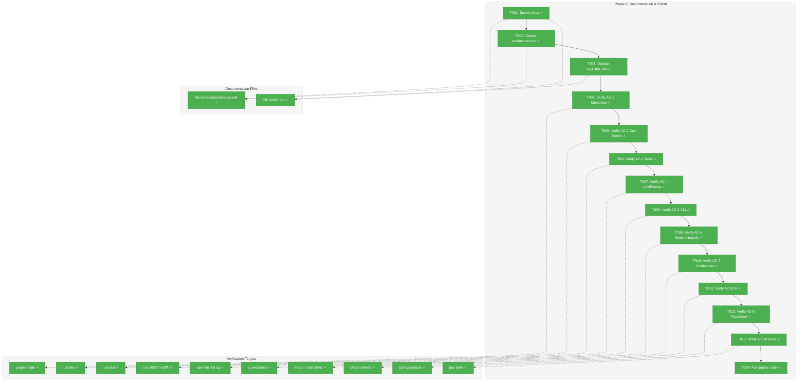
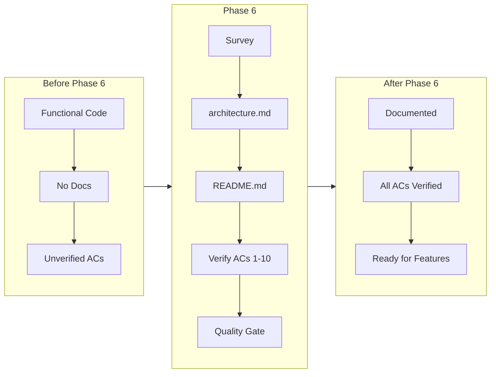
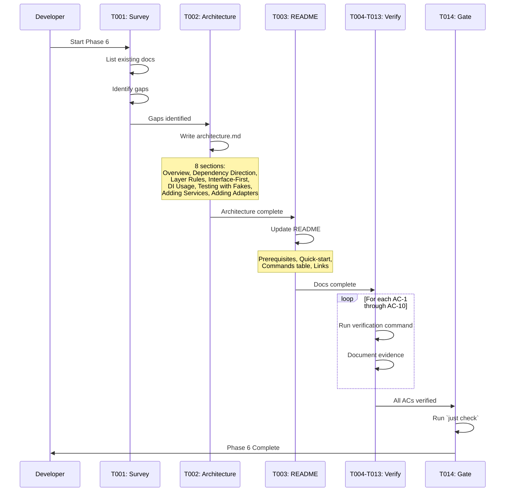

# Phase 6: Documentation & Polish – Tasks & Alignment Brief

**Spec**: [../../project-setup-spec.md](../../project-setup-spec.md)
**Plan**: [../../project-setup-plan.md](../../project-setup-plan.md)
**Date**: 2026-01-19

---

## Executive Briefing

### Purpose
This phase completes the Chainglass project setup by creating essential documentation and verifying all 10 acceptance criteria from the spec. It transforms a functional but undocumented codebase into a self-documenting project that onboards developers quickly and maintains architectural consistency over time.

### What We're Building
Documentation and verification deliverables:
- **Architecture documentation** (`docs/rules/architecture.md`) - Clean architecture patterns, dependency direction rules, DI usage, testing with fakes
- **Updated README.md** - Prerequisites, quick-start guide, common commands table, links to detailed docs
- **Full verification suite** - Systematic validation of all 10 spec acceptance criteria (AC-1 through AC-10)

### User Value
New developers can clone the repo and become productive within minutes using `just install && just dev`. Architecture documentation provides a reference for implementing new features correctly, ensuring patterns established in Phases 1-5 are consistently followed.

### Example
**Before Phase 6**: Developer clones repo, runs `just dev`, but doesn't know how to add a new service or what patterns to follow.
**After Phase 6**: Developer reads README for quick-start, then reads `docs/rules/architecture.md` for pattern guidance: "To add a new service, first create the interface in `@chainglass/shared/interfaces`, then implement the fake, write contract tests..."

---

## Objectives & Scope

### Objective
Create architecture documentation, update README, and verify all 10 acceptance criteria from the spec pass, ensuring the project is complete and ready for feature development.

### Goals

- ✅ Create `docs/rules/architecture.md` with clean architecture patterns and rules
- ✅ Update `README.md` with prerequisites, quick-start, and command reference
- ✅ Verify AC-1: Monorepo Structure (`pnpm install` links all packages)
- ✅ Verify AC-2: Development Server (`just dev` starts localhost:3000)
- ✅ Verify AC-3: Test Execution (`just test` passes)
- ✅ Verify AC-4: Linting and Formatting (`just lint`, `just format`, `just fft`)
- ✅ Verify AC-5: CLI Availability (`npm link && cg --help`)
- ✅ Verify AC-6: CLI Subcommands (`cg web` and `cg mcp` work)
- ✅ Verify AC-7: Clean Architecture (import restrictions enforced)
- ✅ Verify AC-8: Dependency Injection (services receive injected adapters)
- ✅ Verify AC-9: Type Check (`just typecheck` passes)
- ✅ Verify AC-10: Build Pipeline (`just build` creates dist/cli.cjs, cached <1s)
- ✅ Run full quality suite (`just check` passes)

### Non-Goals (Scope Boundaries)

- ❌ Adding new features or functionality (documentation only)
- ❌ Automated architecture enforcement tooling (code review only per DYK-03 from Phase 3)
- ❌ API documentation (no external APIs exist yet)
- ❌ Deployment documentation (out of scope per spec Non-Goals)
- ❌ User documentation (developer-focused only)
- ❌ Refactoring existing code (verification only)
- ❌ Performance optimization (not needed for setup phase)
- ❌ Additional test coverage (66 tests already passing)

---

## Architecture Map

### Component Diagram
<!-- Status: grey=pending, orange=in-progress, green=completed, red=blocked -->
<!-- Updated by plan-6 during implementation -->



### Task-to-Component Mapping

<!-- Status: ⬜ Pending | 🟧 In Progress | ✅ Complete | 🔴 Blocked -->

| Task | Component(s) | Files | Status | Comment |
|------|-------------|-------|--------|---------|
| T001 | Documentation Survey | /docs/, /README.md | ✅ Complete | docs/rules/ missing, README minimal |
| T002 | Architecture Docs | /docs/rules/architecture.md | ✅ Complete | 375 lines, 9 sections |
| T003 | README | /README.md | ✅ Complete | 107 lines, 8 sections |
| T004 | AC-1 Verification | pnpm-workspace.yaml, node_modules | ✅ Complete | 4 symlinks verified |
| T005 | AC-2 Verification | apps/web, next.config.ts | ✅ Complete | localhost:3000 ready |
| T006 | AC-3 Verification | test/, vitest.config.ts | ✅ Complete | 66 tests pass |
| T007 | AC-4 Verification | biome.json, justfile | ✅ Complete | 60 files clean |
| T008 | AC-5 Verification | packages/cli, package.json | ✅ Complete | web, mcp commands listed |
| T009 | AC-6 Verification | packages/cli/src/commands | ✅ Complete | web and mcp work |
| T010 | AC-7 Verification | apps/web/src/services | ✅ Complete | ILogger interface only |
| T011 | AC-8 Verification | apps/web/src/lib/di-container.ts | ✅ Complete | FakeLogger in tests |
| T012 | AC-9 Verification | tsconfig.json | ✅ Complete | strict: true |
| T013 | AC-10 Verification | packages/cli/dist | ✅ Complete | dist/cli.cjs created |
| T014 | Quality Gate | All | ✅ Complete | All gates pass |

---

## Tasks

| Status | ID | Task | CS | Type | Dependencies | Absolute Path(s) | Validation | Subtasks | Notes |
|--------|------|------|-----|------|--------------|------------------|------------|----------|-------|
| [x] | T001 | Survey existing docs structure | 1 | Setup | – | /Users/jordanknight/substrate/chainglass/docs/, /Users/jordanknight/substrate/chainglass/README.md | Document what exists, identify gaps | – | Foundation for T002-T003 |
| [x] | T002 | Create docs/rules/ directory and architecture.md | 3 | Doc | T001 | /Users/jordanknight/substrate/chainglass/docs/rules/architecture.md | Directory created, file exists with all 8 sections | – | mkdir -p docs/rules first |
| [x] | T003 | Update README.md | 2 | Doc | T002 | /Users/jordanknight/substrate/chainglass/README.md | Prerequisites, quick-start, commands table, links | – | Core deliverable |
| [x] | T004 | Verify AC-1: Monorepo Structure | 1 | Verify | T003 | /Users/jordanknight/substrate/chainglass/pnpm-workspace.yaml, /Users/jordanknight/substrate/chainglass/node_modules/ | `pnpm install` links all packages, symlinks exist | – | Per spec AC-1 |
| [x] | T005 | Verify AC-2: Development Server | 1 | Verify | T004 | /Users/jordanknight/substrate/chainglass/apps/web/ | `just dev` starts localhost:3000 | – | Per spec AC-2 |
| [x] | T006 | Verify AC-3: Test Execution | 1 | Verify | T005 | /Users/jordanknight/substrate/chainglass/test/ | `just test` passes | – | Per spec AC-3 |
| [x] | T007 | Verify AC-4: Linting and Formatting | 1 | Verify | T006 | /Users/jordanknight/substrate/chainglass/biome.json, /Users/jordanknight/substrate/chainglass/justfile | `just lint`, `just format`, `just fft` all work | – | Per spec AC-4 |
| [x] | T008 | Verify AC-5: CLI Availability | 1 | Verify | T007 | /Users/jordanknight/substrate/chainglass/packages/cli/ | `npm link && cg --help` shows help | – | Per spec AC-5 |
| [x] | T009 | Verify AC-6: CLI Subcommands | 1 | Verify | T008 | /Users/jordanknight/substrate/chainglass/packages/cli/src/commands/ | `cg web` starts server, `cg mcp --stdio` starts MCP | – | Per spec AC-6 |
| [x] | T010 | Verify AC-7: Clean Architecture | 1 | Verify | T009 | /Users/jordanknight/substrate/chainglass/apps/web/src/services/ | Manual inspection: services import only interfaces, no *.adapter.ts imports | – | Code review per DYK-03 |
| [x] | T011 | Verify AC-8: Dependency Injection | 1 | Verify | T010 | /Users/jordanknight/substrate/chainglass/apps/web/src/lib/di-container.ts | Services receive injected adapters, tests use FakeLogger | – | Per spec AC-8 |
| [x] | T012 | Verify AC-9: Type Check | 1 | Verify | T011 | /Users/jordanknight/substrate/chainglass/tsconfig.json | `just typecheck` passes with strict mode | – | Per spec AC-9 |
| [x] | T013 | Verify AC-10: Build Pipeline | 1 | Verify | T012 | /Users/jordanknight/substrate/chainglass/packages/cli/dist/ | `just build` creates dist/cli.cjs, cached build <1s | – | Per spec AC-10 |
| [x] | T014 | Run full quality suite | 1 | Gate | T013 | /Users/jordanknight/substrate/chainglass/ | `just check` passes all quality gates | – | FINAL GATE |
| [ ] | T015 | Relocate CLI to apps/ | 2 | Refactor | T014 | /Users/jordanknight/substrate/chainglass/apps/cli/ | CLI at apps/cli, all tests pass, CLI works | [001-subtask-relocate-cli-to-apps](./001-subtask-relocate-cli-to-apps.md) | Post-phase structure improvement |

---

## Alignment Brief

### Prior Phases Review

#### Phase-by-Phase Summary

**Phase 1: Monorepo Foundation** (12/12 tasks)
- Established pnpm workspaces + Turborepo infrastructure
- Created base tsconfig.json with path aliases
- Set up Vitest with centralized test suite at `test/`
- Configured Biome for linting/formatting
- Created justfile with developer commands
- Key learning: Bootstrap order is critical (workspace yaml → package stubs → pnpm install → tooling)

**Phase 2: Shared Package** (12/12 tasks)
- Created `@chainglass/shared` with ILogger interface, FakeLogger, PinoLoggerAdapter
- Established contract test pattern to prevent fake drift
- Interface-first TDD cycle proven effective
- 18 tests (8 unit + 10 contract)
- Key learning: Use `export type` for interface re-exports with isolatedModules

**Phase 3: Next.js App with Clean Architecture** (12/12 tasks)
- Created DI container with child container pattern (decorator-free)
- Implemented SampleService as reference implementation
- Created test/base/web-test.ts with Vitest fixtures
- Added /api/health endpoint
- 7 tests (4 DI + 3 service), 25 total
- Key learning: TSyringe useClass requires decorators; use useFactory instead

**Phase 4: CLI Package** (16/16 tasks)
- Created `cg` CLI with Commander.js and factory pattern
- Implemented `cg web` for production standalone server
- Bundled with esbuild (CJS format)
- npx and npm link workflows functional
- 14 tests, 39 total
- Key learning: CJS format required for Commander.js compatibility

**Phase 5: MCP Server Package** (14/14 tasks)
- Created MCP server with strict stdout discipline
- Implemented check_health exemplar tool (ADR-0001 compliant)
- Added PinoLoggerAdapter.createForStderr() factory
- Lazy-loading pattern for stdio compliance
- 21 tests, 66 total
- Key learning: Console redirection MUST happen BEFORE any imports

#### Cumulative Deliverables

**Packages**:
| Package | Location | Tests |
|---------|----------|-------|
| @chainglass/shared | packages/shared/ | 18 |
| @chainglass/cli | packages/cli/ | 14 |
| @chainglass/mcp-server | packages/mcp-server/ | 21 |
| @chainglass/web | apps/web/ | 7 |

**Key Files Created** (organized by phase):
- **Phase 1**: package.json, pnpm-workspace.yaml, tsconfig.json, biome.json, turbo.json, justfile, test/vitest.config.ts, test/setup.ts
- **Phase 2**: packages/shared/src/interfaces/logger.interface.ts, packages/shared/src/fakes/fake-logger.ts, packages/shared/src/adapters/pino-logger.adapter.ts, test/contracts/logger.contract.ts
- **Phase 3**: apps/web/src/lib/di-container.ts, apps/web/src/services/sample.service.ts, apps/web/app/api/health/route.ts, test/base/web-test.ts
- **Phase 4**: packages/cli/src/bin/cg.ts, packages/cli/src/commands/web.command.ts, packages/cli/esbuild.config.ts
- **Phase 5**: packages/mcp-server/src/server.ts, packages/mcp-server/src/lib/di-container.ts, packages/cli/src/commands/mcp.command.ts

**Commands Available**:
- `just install` - Install dependencies
- `just dev` - Start development (Next.js dev server)
- `just build` - Build all packages
- `just test` - Run all tests
- `just lint` - Run Biome linter
- `just format` - Format with Biome
- `just fft` - Fix + Format + Test
- `just typecheck` - TypeScript type check
- `just check` - Full quality suite
- `just clean` - Clean build artifacts
- `just reset` - Full reset (clean + install)
- `cg web` - Start production web server
- `cg mcp --stdio` - Start MCP server

#### Pattern Evolution

1. **DI Container Pattern**: Phase 3 established `useFactory` pattern → Phase 5 reused for MCP server
2. **Test Documentation**: Full Test Doc format (5 fields) enforced across all 66 tests
3. **Fakes Over Mocks**: Consistent throughout - FakeLogger used in all test containers
4. **Contract Testing**: Established in Phase 2, ensures fake/real behavioral parity

#### Recurring Issues

1. **pnpm Symlink Structure**: Caused T013 partial completion in Phase 4 (isolated bundle execution)
2. **TypeScript Path Resolution**: Required multiple alignments (pnpm, TS, Vitest) - documented in Critical Discovery 05

#### Reusable Infrastructure

From any prior phase:
- `test/base/web-test.ts` - Vitest fixtures with auto-injected container/logger
- `test/contracts/logger.contract.ts` - Parameterized contract test suite
- `createProductionContainer()` / `createTestContainer()` - DI factory pattern
- `FakeLogger` - Primary test double with assertion helpers
- `loggerContractTests()` - Contract test runner function

### Critical Findings Affecting This Phase

This phase is primarily documentation and verification. No critical research findings from the plan directly constrain the documentation tasks. However, documentation must accurately describe patterns established based on these findings:

| Finding | Documentation Impact |
|---------|---------------------|
| CD-01: Bootstrap Sequence | Document in README quick-start |
| CD-02: TSyringe Decorators | Document useFactory pattern in architecture.md |
| CD-04: Child Container Pattern | Document DI isolation in architecture.md |
| CD-07: Architecture Enforcement | Document code review approach (no automated tooling) |
| CD-10: MCP stdout Discipline | Reference ADR-0001 for MCP tool development |

### ADR Decision Constraints

#### ADR-0001: MCP Tool Design Patterns

- **Status**: Accepted
- **Decision**: All MCP tools must follow check_health exemplar pattern
- **Constraints for Phase 6**:
  - Documentation must reference ADR-0001 for MCP tool development guidance
  - Architecture.md should link to ADR-0001 for tool patterns
- **Addressed by**: T002 (architecture.md should reference ADR-0001)

### Invariants & Guardrails

- **Test Count**: Must remain at 66 tests passing (no regression)
- **Build Time**: `just build` should complete successfully
- **Type Safety**: `just typecheck` must pass with strict mode
- **Documentation Links**: All links in README and architecture.md must be valid

### Inputs to Read

| File | Purpose | Absolute Path |
|------|---------|---------------|
| Current README.md | Understand existing state | /Users/jordanknight/substrate/chainglass/README.md |
| Spec | AC definitions | /Users/jordanknight/substrate/chainglass/docs/plans/001-project-setup/project-setup-spec.md |
| Plan | Phase details, footnotes | /Users/jordanknight/substrate/chainglass/docs/plans/001-project-setup/project-setup-plan.md |
| ADR-0001 | MCP patterns | /Users/jordanknight/substrate/chainglass/docs/adr/adr-0001-mcp-tool-design-patterns.md |
| justfile | Command reference | /Users/jordanknight/substrate/chainglass/justfile |

### Visual Alignment Aids

#### System State Flow



#### Documentation Workflow Sequence



### Test Plan

No new tests required for Phase 6 (documentation and verification phase). Verification tasks (T004-T013) run existing infrastructure to confirm acceptance criteria.

**Verification Commands**:
| AC | Command | Expected Result |
|----|---------|-----------------|
| AC-1 | `pnpm install` | Links all packages, node_modules contains symlinks |
| AC-2 | `just dev` | Next.js starts on localhost:3000 |
| AC-3 | `just test` | All 66 tests pass |
| AC-4 | `just lint && just format && just fft` | All pass |
| AC-5 | `npm link && cg --help` | Help output with dev, mcp commands |
| AC-6 | `cg web` and `cg mcp --stdio` | Both start correctly |
| AC-7 | Code inspection | SampleService imports only ILogger interface |
| AC-8 | Test inspection | createTestContainer provides FakeLogger |
| AC-9 | `just typecheck` | No TypeScript errors |
| AC-10 | `just build` | dist/cli.cjs created; second build <1s |

### Step-by-Step Implementation Outline

1. **T001**: Read existing docs (README.md, docs/ structure), document findings
2. **T002**: Create architecture.md with 8 sections covering all patterns from Phases 1-5
3. **T003**: Update README.md with prerequisites, quick-start, commands table
4. **T004-T013**: Execute each AC verification, document evidence
5. **T014**: Run `just check` to confirm full quality gate

### Commands to Run

```bash
# Survey (T001)
ls -la docs/
cat README.md

# Documentation verification (T002-T003)
cat docs/rules/architecture.md | wc -l  # Should be substantial
grep -q "Prerequisites" README.md && echo "OK"

# AC-1: Monorepo (T004)
pnpm install
ls -la node_modules/@chainglass

# AC-2: Dev Server (T005)
just dev  # Ctrl+C after confirming localhost:3000

# AC-3: Tests (T006)
just test

# AC-4: Lint/Format (T007)
just lint && just format && just fft

# AC-5: CLI (T008)
npm link
cg --help

# AC-6: Subcommands (T009)
cg web --help   # Production web server
cg mcp --help   # MCP server (stdio transport)

# AC-7: Architecture (T010) - Manual code review
# Inspect service files to confirm no concrete adapter imports:
cat apps/web/src/services/sample.service.ts | grep "import"
# Should show only: import type { ILogger } from '@chainglass/shared'
# NO imports from *.adapter.ts files

# AC-8: DI (T011)
grep "FakeLogger" test/unit/web/

# AC-9: Typecheck (T012)
just typecheck

# AC-10: Build (T013)
just build
ls -la packages/cli/dist/cli.cjs
just build  # Second run, verify cache

# Final Gate (T014)
just check
```

### Risks/Unknowns

| Risk | Severity | Mitigation |
|------|----------|------------|
| Documentation drift from actual code | Low | Write docs from working code, not from spec |
| Broken links in documentation | Low | Verify all links during T003 |
| AC-6 verification requires manual interaction | Low | Use timeout/automated signal for process tests |
| `just dev` blocks terminal | Low | Run in background with timeout, or manual verification |

### Ready Check

- [ ] ADR constraints mapped to tasks (T002 notes ADR-0001 reference)
- [ ] Prior phases review complete (all 5 phases reviewed above)
- [ ] Critical findings documented (none directly constrain Phase 6)
- [ ] Test plan defined (verification only, no new tests)
- [ ] Commands documented and ready to run

---

## Phase Footnote Stubs

<!-- plan-6 will add footnotes here during implementation -->

---

## Evidence Artifacts

**Execution Log**: `docs/plans/001-project-setup/tasks/phase-6-documentation-polish/execution.log.md`

**Supporting Files** (created during implementation):
- `/Users/jordanknight/substrate/chainglass/docs/rules/architecture.md`
- `/Users/jordanknight/substrate/chainglass/README.md` (updated)

---

## Discoveries & Learnings

_Populated during implementation by plan-6. Log anything of interest to your future self._

| Date | Task | Type | Discovery | Resolution | References |
|------|------|------|-----------|------------|------------|
| | | | | | |

**Types**: `gotcha` | `research-needed` | `unexpected-behavior` | `workaround` | `decision` | `debt` | `insight`

**What to log**:
- Things that didn't work as expected
- External research that was required
- Implementation troubles and how they were resolved
- Gotchas and edge cases discovered
- Decisions made during implementation
- Technical debt introduced (and why)
- Insights that future phases should know about

_See also: `execution.log.md` for detailed narrative._

---

## Directory Layout

```
docs/plans/001-project-setup/
├── project-setup-spec.md
├── project-setup-plan.md
└── tasks/
    ├── phase-1-monorepo-foundation/
    │   ├── tasks.md
    │   └── execution.log.md
    ├── phase-2-shared-package/
    │   ├── tasks.md
    │   └── execution.log.md
    ├── phase-3-nextjs-app-clean-architecture/
    │   ├── tasks.md
    │   └── execution.log.md
    ├── phase-4-cli-package/
    │   ├── tasks.md
    │   └── execution.log.md
    ├── phase-5-mcp-server-package/
    │   ├── tasks.md
    │   └── execution.log.md
    └── phase-6-documentation-polish/
        ├── tasks.md          # This file
        └── execution.log.md  # Created by plan-6
```

---

## Documentation Content Outline

### docs/rules/architecture.md (T002)

1. **Overview and Principles**
   - Clean architecture philosophy
   - Dependency direction: Services ← Adapters
   - Package structure: @chainglass/shared, @chainglass/cli, @chainglass/mcp-server, apps/web

2. **Dependency Direction Rules**
   - Services depend only on interfaces
   - Adapters implement interfaces
   - Services never import from `*/adapters/*.adapter.ts`
   - Diagram showing allowed imports

3. **Layer Rules Table**
   | Layer | Can Import From | Cannot Import From |
   |-------|-----------------|-------------------|
   | Services | Interfaces only | Adapters, external libs |
   | Adapters | Interfaces, external libs | Services |
   | Fakes | Interfaces | Services, Adapters |

4. **Interface-First Design**
   - Always create interface first
   - Interface lives in @chainglass/shared/interfaces
   - Example: ILogger interface

5. **DI Container Usage**
   - Child container pattern (why)
   - useFactory pattern (not useClass)
   - Production vs Test container
   - Code examples from di-container.ts

6. **Testing with Fakes**
   - Fakes over mocks policy
   - FakeLogger example with assertion helpers
   - Contract tests prevent drift
   - Full Test Doc format (5 fields)

7. **Adding New Services** (step-by-step)
   1. Create interface in @chainglass/shared/interfaces
   2. Create fake in @chainglass/shared/fakes
   3. Write contract tests
   4. Implement real adapter
   5. Register in DI container
   6. Write unit tests using fake

8. **Adding New Adapters** (step-by-step)
   1. Create/extend interface if needed
   2. Implement adapter in appropriate package
   3. Run contract tests to verify compliance
   4. Register in production container

9. **MCP Tool Development**
   - Reference ADR-0001 for tool design patterns
   - check_health exemplar
   - STDIO discipline requirements

### README.md (T003)

1. **What is Chainglass**
   - Brief description (1-2 sentences)

2. **Prerequisites**
   - Node.js 18+
   - pnpm (with corepack instructions)
   - Just task runner (with installation link)

3. **Quick Start**
   ```bash
   just install && just dev
   ```

4. **Common Commands Table**
   | Command | Description |
   |---------|-------------|
   | `just dev` | Start development server |
   | `just build` | Build all packages |
   | `just test` | Run all tests |
   | `just fft` | Fix, format, test |
   | `just check` | Full quality suite |
   | `cg web` | Start production server |
   | `cg mcp --stdio` | Start MCP server |

5. **Documentation Links**
   - Link to docs/rules/architecture.md
   - Link to docs/adr/ for ADRs

---

**Plan Generated**: 2026-01-19
**STOP**: Do NOT edit code. Wait for human **GO**.
