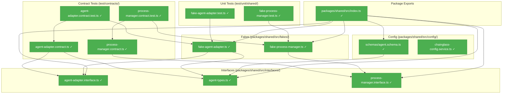
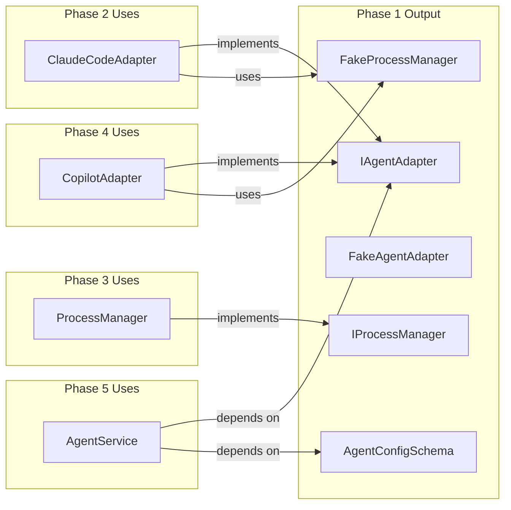
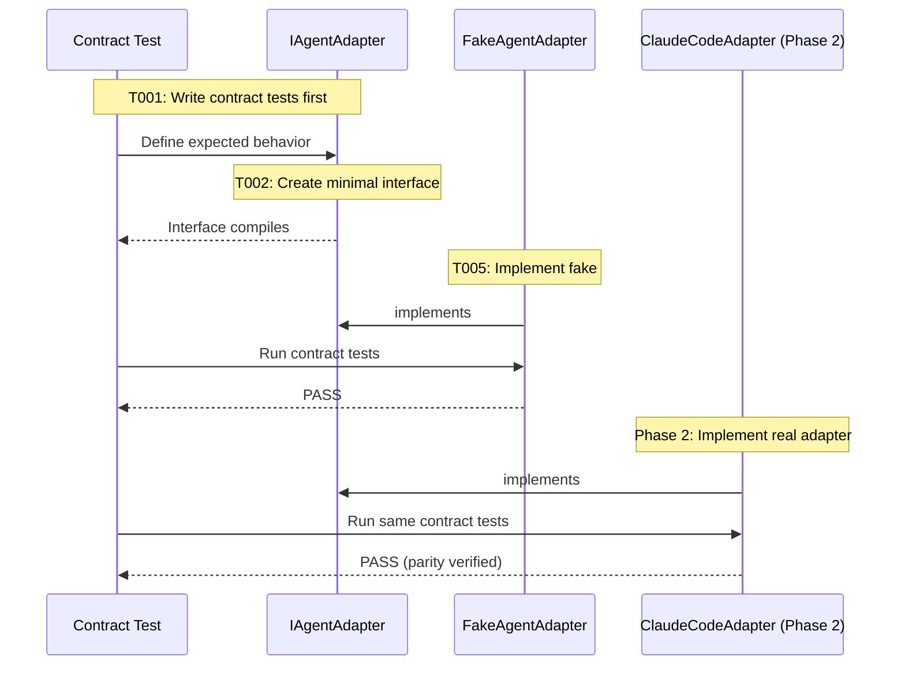

# Phase 1: Interfaces & Fakes – Tasks & Alignment Brief

**Spec**: [../../agent-control-spec.md](../../agent-control-spec.md)
**Plan**: [../../agent-control-plan.md](../../agent-control-plan.md)
**Date**: 2026-01-22

---

## Executive Briefing

### Purpose

This phase establishes the foundational contracts and test doubles for the Agent Control Service. Without these interfaces and fakes, subsequent phases cannot proceed with TDD—tests would have nothing to mock against, and implementation would lack clear contracts to fulfill.

### What We're Building

A complete interface layer and fake implementation set:
- **IAgentAdapter**: The primary interface for executing prompts through any AI coding agent
- **IProcessManager**: Interface for spawning processes and handling termination with signal escalation
- **AgentResult**: Structured result type containing output, session ID, status, exit code, and token metrics
- **FakeAgentAdapter**: Full test double with assertion helpers for unit testing
- **FakeProcessManager**: Test double that records signals for verification
- **AgentConfigSchema**: Zod schema for timeout configuration integrated with existing config system
- **Contract test factories**: Reusable test suites ensuring fake-real parity

### User Value

Developers consuming this service will have:
- Clear, typed interfaces to code against (compile-time safety)
- Ready-to-use fakes for testing their integration code
- Contract tests they can run to verify their adapters match expected behavior
- Configuration schema that validates timeout settings

### Example

**Before**: No way to test agent orchestration without spawning real CLI processes.

**After**:
```typescript
// Unit test using FakeAgentAdapter (all methods async per DYK-01)
const fakeAdapter = new FakeAgentAdapter({
  sessionId: 'test-session-123',
  tokens: { used: 100, total: 500, limit: 200000 }
});
const result = await fakeAdapter.run({ prompt: 'write hello world' }); // async!
expect(result.sessionId).toBe('test-session-123');
expect(result.status).toBe('completed');
fakeAdapter.assertRunCalled({ prompt: 'write hello world' }); // sync assertion helper
```

---

## Objectives & Scope

### Objective

Define contracts and test doubles for all agent control components as specified in the plan. Establish the foundation that enables TDD in Phases 2-5.

**Behavior Checklist** (from spec acceptance criteria):
- [ ] Result objects contain: `output`, `sessionId`, `status`, `exitCode`, `tokens` (AC-4)
- [ ] Status values: `'completed' | 'failed' | 'killed'` (AC-5, AC-6, AC-7)
- [ ] Token metrics include `used`, `total`, `limit` (AC-9, AC-10, AC-11)
- [ ] Adapters are injectable via DI (AC-18)

### Goals

- ✅ Create IAgentAdapter interface with run(), compact(), terminate() methods
- ✅ Create AgentResult, AgentRunOptions, TokenMetrics type definitions
- ✅ Create IProcessManager interface with spawn(), terminate(), signal() methods
- ✅ Implement FakeAgentAdapter with configurable responses and assertion helpers
- ✅ Implement FakeProcessManager with signal sequence recording
- ✅ Create AgentConfigSchema (Zod) with timeout field
- ✅ Register AgentConfigType in config system following ADR-0003 pattern
- ✅ Create contract test factories for IAgentAdapter and IProcessManager
- ✅ Export all interfaces from @chainglass/shared

### Non-Goals

- ❌ Real CLI integration (Phase 2 and Phase 4)
- ❌ Actual process spawning or signal handling (Phase 3)
- ❌ Stream-json parsing or log file parsing (Phase 2 and Phase 4)
- ❌ AgentService orchestration layer (Phase 5)
- ❌ Any stdout/stderr capture (Phase 2/3/4)
- ❌ Platform-specific implementations (Phase 3)
- ❌ Documentation files (Phase 6)

---

## Architecture Map

### Component Diagram

<!-- Status: grey=pending, orange=in-progress, green=completed, red=blocked -->
<!-- Updated by plan-6 during implementation -->



### Task-to-Component Mapping

<!-- Status: ⬜ Pending | 🟧 In Progress | ✅ Complete | 🔴 Blocked -->

| Task | Component(s) | Files | Status | Comment |
|------|-------------|-------|--------|---------|
| T001 | Contract Tests | /test/contracts/agent-adapter.contract.ts | ✅ Complete | Define IAgentAdapter behavioral contract |
| T002 | Interface | /packages/shared/src/interfaces/agent-adapter.interface.ts | ✅ Complete | Minimal interface to make T001 compile |
| T003 | Types | /packages/shared/src/interfaces/agent-types.ts | ✅ Complete | AgentResult, AgentRunOptions, TokenMetrics |
| T004 | Unit Tests | /test/unit/shared/fake-agent-adapter.test.ts | ✅ Complete | Test FakeAgentAdapter assertion helpers |
| T005 | Fake | /packages/shared/src/fakes/fake-agent-adapter.ts | ✅ Complete | Implement fake, pass T001 + T004 |
| T006 | Contract Tests | /test/contracts/process-manager.contract.ts | ✅ Complete | Define IProcessManager behavioral contract |
| T007 | Interface | /packages/shared/src/interfaces/process-manager.interface.ts | ✅ Complete | Minimal interface to make T006 compile |
| T008 | Unit Tests | /test/unit/shared/fake-process-manager.test.ts | ✅ Complete | Test FakeProcessManager signal tracking |
| T009 | Fake | /packages/shared/src/fakes/fake-process-manager.ts | ✅ Complete | Implement fake, pass T006 + T008 |
| T010 | Config Schema | /packages/shared/src/config/schemas/agent.schema.ts | ✅ Complete | Zod schema with timeout field |
| T011 | Config Service | /packages/shared/src/config/chainglass-config.service.ts | ✅ Complete | Register AgentConfigType in registry |
| T012 | Exports | /packages/shared/src/index.ts | ✅ Complete | Export all new interfaces/fakes/types |
| T013 | Contract Run | /test/contracts/agent-adapter.contract.test.ts | ✅ Complete | Wire FakeAgentAdapter to contract tests |
| T014 | Contract Run | /test/contracts/process-manager.contract.test.ts | ✅ Complete | Wire FakeProcessManager to contract tests |

---

## Tasks

| Status | ID | Task | CS | Type | Dependencies | Absolute Path(s) | Validation | Subtasks | Notes |
|--------|------|------|-----|------|--------------|------------------|------------|----------|-------|
| [x] | T001 | Write contract tests for IAgentAdapter | 2 | Test | – | /home/jak/substrate/002-agents/test/contracts/agent-adapter.contract.ts | Contract tests compile; define run(), compact(), terminate() behaviors | – | Per ADR-0002: Exemplar-first sequence |
| [x] | T002 | Create IAgentAdapter interface | 1 | Core | T001 | /home/jak/substrate/002-agents/packages/shared/src/interfaces/agent-adapter.interface.ts | Interface compiles; T001 tests can import it | – | – |
| [x] | T003 | Create AgentResult and supporting type definitions | 1 | Core | T002 | /home/jak/substrate/002-agents/packages/shared/src/interfaces/agent-types.ts | Types include: AgentResult, AgentRunOptions, TokenMetrics, AgentStatus | – | Per spec AC-4 |
| [x] | T004 | Write unit tests for FakeAgentAdapter assertion helpers | 2 | Test | T002, T003 | /home/jak/substrate/002-agents/test/unit/shared/fake-agent-adapter.test.ts | Tests cover: assertRunCalled(), assertTerminateCalled(), getRunHistory() | – | – |
| [x] | T005 | Implement FakeAgentAdapter | 2 | Core | T001, T004 | /home/jak/substrate/002-agents/packages/shared/src/fakes/fake-agent-adapter.ts | All contract tests pass; all unit tests pass | – | Follow FakeLogger exemplar pattern |
| [x] | T006 | Write contract tests for IProcessManager | 2 | Test | – | /home/jak/substrate/002-agents/test/contracts/process-manager.contract.ts | Contract tests compile; define spawn(), terminate(), signal escalation behaviors | – | Per ADR-0002 |
| [x] | T007 | Create IProcessManager interface | 1 | Core | T006 | /home/jak/substrate/002-agents/packages/shared/src/interfaces/process-manager.interface.ts | Interface compiles; T006 tests can import it | – | – |
| [x] | T008 | Write unit tests for FakeProcessManager signal tracking | 2 | Test | T007 | /home/jak/substrate/002-agents/test/unit/shared/fake-process-manager.test.ts | Tests cover: getSignalsSent(), getSignalTimings(), createStubbornProcess() | – | – |
| [x] | T009 | Implement FakeProcessManager | 2 | Core | T006, T008 | /home/jak/substrate/002-agents/packages/shared/src/fakes/fake-process-manager.ts | All contract tests pass; all unit tests pass | – | Follow FakeLogger exemplar pattern |
| [x] | T010 | Create AgentConfigSchema (Zod) | 2 | Core | – | /home/jak/substrate/002-agents/packages/shared/src/config/schemas/agent.schema.ts | Schema validates: timeout (1000-3600000, default 600000), flags object | – | Per ADR-0003 IMP-006 |
| [x] | T011 | Register AgentConfigType in config system | 1 | Core | T010 | /home/jak/substrate/002-agents/packages/shared/src/config/chainglass-config.service.ts | Config accessible via configService.require(AgentConfigType) | – | Per ADR-0003 |
| [x] | T012 | Export all interfaces from @chainglass/shared | 1 | Core | T002, T003, T005, T007, T009, T010 | /home/jak/substrate/002-agents/packages/shared/src/index.ts | Can import IAgentAdapter, FakeAgentAdapter, etc. from @chainglass/shared | – | – |
| [x] | T013 | Wire FakeAgentAdapter to contract tests | 1 | Test | T005 | /home/jak/substrate/002-agents/test/contracts/agent-adapter.contract.test.ts | Contract tests pass for FakeAgentAdapter | – | Per Discovery 08 |
| [x] | T014 | Wire FakeProcessManager to contract tests | 1 | Test | T009 | /home/jak/substrate/002-agents/test/contracts/process-manager.contract.test.ts | Contract tests pass for FakeProcessManager | – | Per Discovery 08 |

---

## Alignment Brief

### Critical Findings Affecting This Phase

| Finding | Constraint/Requirement | Addressed By |
|---------|----------------------|--------------|
| Discovery 01: Dual I/O Pattern Divergence | IAgentAdapter must be abstract enough to handle both stdout (Claude Code) and log file (Copilot) extraction | T002: Interface design |
| Discovery 06: Result Object State Machine | AgentResult must support four exit paths: completed, failed, killed, timeout | T003: Type definitions |
| Discovery 08: Contract Tests for Fake-Real Parity | Create agentAdapterContractTests() factory | T001, T013, T014 |
| Discovery 09: Configuration Integration for Timeout | Add AgentConfigSchema following SampleConfigSchema exemplar | T010, T011 |

### ADR Decision Constraints

| ADR | Decision | Constrains | Addressed By |
|-----|----------|-----------|--------------|
| ADR-0001 | MCP Tool Design Patterns | If agent control is exposed via MCP, use verb_object naming. Three-level testing. | T001, T006 (contract tests) |
| ADR-0002 | Exemplar-Driven Development | Exemplar-first sequence: write contracts → interface → fake → tests | T001→T002→T005; T006→T007→T009 |
| ADR-0003 | Configuration System | Use ConfigType<T> pattern, Zod schema, register in CONFIG_REGISTRY | T010, T011 |

### Invariants & Guardrails

- **No vi.mock()**: Use FakeAgentAdapter and FakeProcessManager exclusively
- **Contract test parity**: Both fakes pass identical contract tests (verified in Phase 2/3/4 when real adapters exist)
- **Type derivation**: Use `z.infer<typeof Schema>` for config types (never separate interface)
- **DI pattern**: Follow useFactory registration pattern per constitution
- **Async interface pattern**: All IAgentAdapter methods return `Promise<T>` - this is the gold standard for long-running operation interfaces (DYK-01)

### Inputs to Read

| Path | Purpose |
|------|---------|
| /home/jak/substrate/002-agents/packages/shared/src/interfaces/logger.interface.ts | Exemplar interface pattern |
| /home/jak/substrate/002-agents/packages/shared/src/fakes/fake-logger.ts | Exemplar fake pattern |
| /home/jak/substrate/002-agents/packages/shared/src/config/schemas/sample.schema.ts | Exemplar config schema |
| /home/jak/substrate/002-agents/test/contracts/logger.contract.ts | Exemplar contract test factory |

### Visual Alignment Aids

#### System State Flow



#### Interface Design Sequence



### Test Plan (Full TDD)

Per spec testing strategy: Full TDD with fakes over mocks.

| Test | Type | Fixture | Expected Outcome | Rationale |
|------|------|---------|------------------|-----------|
| `should return structured result with sessionId` | Contract | agentAdapterContractTests factory | result.sessionId defined, non-empty | AC-1: Session ID in result |
| `should return status completed on success` | Contract | agentAdapterContractTests factory | result.status === 'completed', exitCode === 0 | AC-5: Exit 0 → completed |
| `should return status failed on error` | Contract | agentAdapterContractTests factory | result.status === 'failed', exitCode > 0 | AC-6: Exit N → failed |
| `should return status killed on terminate` | Contract | agentAdapterContractTests factory | result.status === 'killed' | AC-7: Terminate → killed |
| `should return tokens in result` | Contract | agentAdapterContractTests factory | result.tokens.used, total, limit defined | AC-9, AC-10, AC-11 |
| `should escalate signals with timing` | Contract | processManagerContractTests factory | SIGINT → SIGTERM → SIGKILL sequence | AC-14: Signal escalation |
| `should record all run calls` | Unit | FakeAgentAdapter | getRunHistory() returns all calls | Test helper verification |
| `should record signal sequence` | Unit | FakeProcessManager | getSignalsSent() returns signal sequence | Test helper verification |

### Step-by-Step Implementation Outline

1. **T001**: Create `test/contracts/agent-adapter.contract.ts`
   - Import Vitest describe/it/expect
   - Define `agentAdapterContractTests(name, createAdapter)` factory
   - Write tests for: run() returns result, sessionId present, status values, tokens present
   - Tests will fail (RED) - no interface yet

2. **T002**: Create `packages/shared/src/interfaces/agent-adapter.interface.ts`
   - Define IAgentAdapter with run(), compact(), terminate() signatures
   - Import AgentResult, AgentRunOptions from agent-types.ts (circular - create stub)

3. **T003**: Create `packages/shared/src/interfaces/agent-types.ts`
   - Define AgentStatus type: `'completed' | 'failed' | 'killed'`
   - Define TokenMetrics: `{ used: number; total: number; limit: number }`
   - Define AgentResult: `{ output, sessionId, status, exitCode, stderr?, tokens }`
   - Define AgentRunOptions: `{ prompt, agentType?, sessionId?, cwd? }`

4. **T004**: Create `test/unit/shared/fake-agent-adapter.test.ts`
   - Test assertion helpers: assertRunCalled(), assertTerminateCalled()
   - Test getRunHistory() returns call history
   - Test configurable responses via constructor

5. **T005**: Implement `packages/shared/src/fakes/fake-agent-adapter.ts`
   - Follow FakeLogger pattern
   - Store run/compact/terminate call history
   - Configurable responses via constructor
   - Assertion helpers for testing
   - Run T001 + T004 tests (GREEN)

6. **T006-T009**: Repeat pattern for IProcessManager/FakeProcessManager

7. **T010**: Create `packages/shared/src/config/schemas/agent.schema.ts`
   - Define AgentConfigSchema with Zod
   - timeout: z.coerce.number().min(1000).max(3600000).default(600000)
   - Export AgentConfigType following SampleConfigType pattern

8. **T011**: Update `packages/shared/src/config/chainglass-config.service.ts`
   - Add AgentConfigSchema to CONFIG_REGISTRY

9. **T012**: Update `packages/shared/src/index.ts`
   - Export all new interfaces, types, fakes, config

10. **T013-T014**: Create contract test runner files
    - Wire fakes to contract test factories

### Commands to Run

```bash
# Run all tests
just test

# Run specific test file
pnpm -F @chainglass/shared test test/contracts/agent-adapter.contract.test.ts

# Type check
just typecheck

# Lint
just lint

# Full quality check
just check
```

### Risks/Unknowns

| Risk | Severity | Mitigation |
|------|----------|------------|
| Interface too narrow for Phase 2-4 adapters | Medium | Review against research dossier; iterate early |
| Fake complexity creeps up | Low | Keep fakes simple; add helpers as needed |
| Config schema conflicts with existing schemas | Low | Follow ADR-0003 registry pattern exactly |

### Ready Check

- [ ] ADR constraints mapped to tasks (IDs noted in Notes column)
- [ ] All exemplar files read and understood
- [ ] Contract test factory pattern understood (from logger.contract.ts)
- [ ] Config schema pattern understood (from sample.schema.ts)
- [ ] FakeLogger exemplar pattern understood
- [ ] No time estimates in any task

**Await explicit GO before proceeding to implementation.**

---

## Phase Footnote Stubs

<!-- Populated by plan-6a-update-progress during implementation -->

| Footnote | Date | Task | Description |
|----------|------|------|-------------|
| | | | |

---

## Evidence Artifacts

- **Execution Log**: `/home/jak/substrate/002-agents/docs/plans/002-agent-control/tasks/phase-1-interfaces-fakes/execution.log.md`
- **Test Results**: Captured in execution log after each `just test` run
- **Type Check Results**: Captured in execution log after each `just typecheck` run

---

## Discoveries & Learnings

_Populated during implementation by plan-6. Log anything of interest to your future self._

| Date | Task | Type | Discovery | Resolution | References |
|------|------|------|-----------|------------|------------|
| 2026-01-22 | T002 | decision | DYK-01: IAgentAdapter breaks sync-only interface pattern - first async interface in codebase | Establish as gold standard for long-running operation interfaces, not deviation | /didyouknow session |
| 2026-01-22 | T005 | decision | DYK-02: FakeAgentAdapter is stateless with call history (not session-aware) | Mirrors service statelessness per spec Q5; test harness manages session IDs | /didyouknow session |
| 2026-01-22 | T003 | decision | DYK-03: TokenMetrics uses `| null` pattern (not optional fields) for unavailable data | Aligns with plan Discovery 04; null clearly signals Copilot unavailability | /didyouknow session |
| 2026-01-22 | T007 | decision | DYK-04: IProcessManager defines full 5-method interface (spawn, terminate, signal, isRunning, getPid) | Complete contract from day one per ILogger exemplar; Phase 1 tests need signal() | /didyouknow session |
| 2026-01-22 | T001 | insight | DYK-05: TDD order works via `import type` pattern - tests can import interface types before implementation | Factory pattern + type imports enable pure RED-GREEN-REFACTOR; no @ts-expect-error needed | /didyouknow session |

**Types**: `gotcha` | `research-needed` | `unexpected-behavior` | `workaround` | `decision` | `debt` | `insight`

**What to log**:
- Things that didn't work as expected
- External research that was required
- Implementation troubles and how they were resolved
- Gotchas and edge cases discovered
- Decisions made during implementation
- Technical debt introduced (and why)
- Insights that future phases should know about

_See also: `execution.log.md` for detailed narrative._

---

## Directory Layout

```
docs/plans/002-agent-control/
├── agent-control-plan.md
├── agent-control-spec.md
├── research-dossier.md
└── tasks/
    └── phase-1-interfaces-fakes/
        ├── tasks.md              # This file
        └── execution.log.md      # Created by plan-6 during implementation
```

---

*Tasks dossier generated: 2026-01-22*
*Next step: Await **GO** approval, then run `/plan-6-implement-phase --phase "Phase 1: Interfaces & Fakes"`*

---

## Critical Insights Discussion

**Session**: 2026-01-22
**Context**: Phase 1 Tasks Dossier - Interfaces & Fakes
**Analyst**: AI Clarity Agent
**Reviewer**: Development Team
**Format**: Water Cooler Conversation (5 Critical Insights)

### Insight 1: Async Interface Pattern (DYK-01)

**Did you know**: IAgentAdapter will be the first interface in the codebase to use async/Promise methods, breaking the sync-only pattern established by ILogger and IConfigService.

**Implications**:
- All existing interfaces are synchronous; this establishes a new pattern
- Spec requires multi-minute operations - async is mandatory
- Tests will use `await` for adapter calls; assertion helpers remain sync

**Options Considered**:
- Option A: All methods async - SELECTED
- Option B: Mixed sync/async
- Option C: Callbacks/events - Not Feasible

**AI Recommendation**: Option A
- Reasoning: Spec requires multi-minute ops; consistent async contract is clearest

**Discussion Summary**: User confirmed async as gold standard for long-running operation interfaces.

**Decision**: All IAgentAdapter methods return Promise<T>. Establishes gold standard pattern, not deviation.

**Action Items**:
- [x] Document async pattern in Invariants & Guardrails

**Affects**: T002, T005, all Phase 2-5 implementations

---

### Insight 2: Stateless Fake Design (DYK-02)

**Did you know**: The spec says service is "stateless" but AC-2 requires "agent has access to prior context" - these aren't contradictory because the AGENT tracks state, not the service.

**Implications**:
- FakeAgentAdapter should be stateless internally
- Call history tracking (like FakeLogger) but not session state
- Test harness manages sessionId consistency

**Options Considered**:
- Option A: Stateless with call history - SELECTED
- Option B: Session-aware fake - Not Feasible (violates spec)
- Option C: Hybrid/configurable

**AI Recommendation**: Option A
- Reasoning: Mirrors service statelessness per spec Q5; follows FakeLogger exemplar

**Discussion Summary**: User confirmed Option A with clarification that fake's OUTPUT should look like Claude's responses.

**Decision**: FakeAgentAdapter is stateless internally; configured responses mimic realistic Claude output.

**Action Items**: None

**Affects**: T004, T005

---

### Insight 3: TokenMetrics Nullability (DYK-03)

**Did you know**: Copilot token reporting is undocumented, requiring a type decision: make the entire TokenMetrics object nullable vs optional fields.

**Implications**:
- Plan Discovery 04 specifies `TokenMetrics | null` pattern
- When non-null, all fields (used, total, limit) are present
- Breaks optional-field pattern used elsewhere but aligns with plan

**Options Considered**:
- Option A: `TokenMetrics | null` - SELECTED
- Option B: Optional fields - Partial match
- Option C: Sentinel values - Not Feasible

**AI Recommendation**: Option A
- Reasoning: Plan explicitly documents this; null clearly signals unavailable

**Discussion Summary**: User confirmed Option A.

**Decision**: `tokens: TokenMetrics | null` in AgentResult type.

**Action Items**: None

**Affects**: T003

---

### Insight 4: Full IProcessManager Interface (DYK-04)

**Did you know**: A minimal IProcessManager (just spawn/terminate) would force breaking changes in Phase 3 because Phase 1 signal escalation tests require a signal() method.

**Implications**:
- ILogger exemplar proves "complete contract from day one"
- Phase 1 tests need signal tracking → need signal() method
- Research dossier already documents all 5 methods

**Options Considered**:
- Option A: Minimal interface - Not Feasible (tests can't run)
- Option B: Full 5-method interface - SELECTED
- Option C: Split interfaces - Not Feasible (KISS violation)

**AI Recommendation**: Option B
- Reasoning: Tests require signal(); exemplar proves complete contracts; no Phase 3 changes

**Discussion Summary**: User confirmed Option B.

**Decision**: IProcessManager defines spawn(), terminate(), signal(), isRunning(), getPid() from Phase 1.

**Action Items**: None

**Affects**: T006, T007, T009

---

### Insight 5: TDD Order Feasibility (DYK-05)

**Did you know**: Writing contract tests BEFORE the interface exists seems impossible, but TypeScript's `import type` pattern makes it work without compilation errors.

**Implications**:
- `import type` is erased at compile time
- Factory pattern decouples tests from implementations
- Logger exemplar proves this with zero @ts-expect-error

**Options Considered**:
- Option A: Strict T001→T002→T005 with import type - SELECTED
- Option B: @ts-expect-error - Not Feasible (unnecessary)
- Option C: Simultaneous creation - Partial

**AI Recommendation**: Option A
- Reasoning: Exemplar-proven; maintains pure TDD flow

**Discussion Summary**: User confirmed Option A.

**Decision**: Task order is correct as written. `import type` enables tests-before-interface.

**Action Items**: None

**Affects**: T001, T002, T005 execution order

---

## Session Summary

**Insights Surfaced**: 5 critical insights identified and discussed
**Decisions Made**: 5 decisions reached through collaborative discussion
**Action Items Created**: 1 (document async pattern)
**Areas Requiring Updates**: Invariants & Guardrails updated; Discoveries table populated

**Shared Understanding Achieved**: ✓

**Confidence Level**: High - All 5 insights verified against codebase; decisions align with exemplars and spec.

**Next Steps**: Proceed to `/plan-6-implement-phase --phase "Phase 1: Interfaces & Fakes"` with GO approval.

**Notes**: The async interface pattern (DYK-01) establishes a new gold standard for long-running operation interfaces in this codebase.
