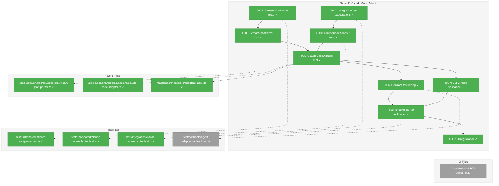
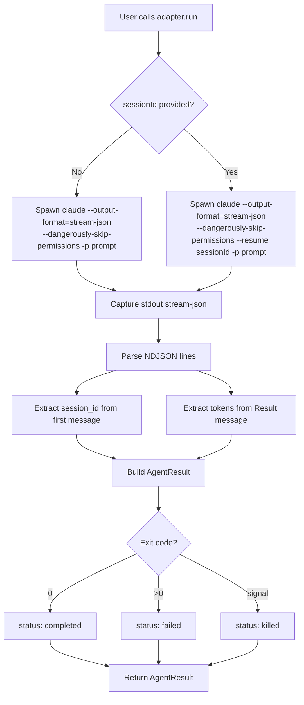
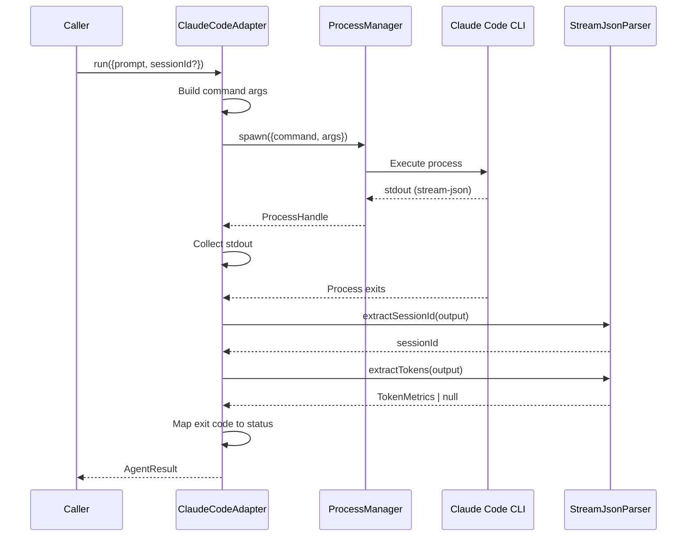

# Phase 2: Claude Code Adapter – Tasks & Alignment Brief

**Spec**: [../../agent-control-spec.md](../../agent-control-spec.md)
**Plan**: [../../agent-control-plan.md](../../agent-control-plan.md)
**Date**: 2026-01-22
**Phase Slug**: `phase-2-claude-code-adapter`

---

## Executive Briefing

### Purpose
This phase implements the ClaudeCodeAdapter that spawns and controls the Claude Code CLI, enabling programmatic execution of prompts with session continuity and token tracking. This is the first real adapter implementation after the foundational interfaces established in Phase 1.

### What We're Building
A `ClaudeCodeAdapter` class that:
- Implements `IAgentAdapter` interface (run, compact, terminate)
- Spawns Claude Code CLI with `--output-format=stream-json` and `--dangerously-skip-permissions`
- Parses stream-json output to extract session IDs and token metrics
- Supports session resumption via `--resume` flag
- Uses `FakeProcessManager` for unit tests, real CLI for integration tests

### User Value
Developers can programmatically run prompts through Claude Code and receive structured results with session IDs for context continuity and token metrics for compaction decisions.

### Example
**Input**: `adapter.run({ prompt: "List 5 programming languages" })`
**Output**:
```typescript
{
  output: "1. Python\n2. JavaScript\n3. Go\n4. Rust\n5. TypeScript",
  sessionId: "abc-123-def",
  status: "completed",
  exitCode: 0,
  tokens: { used: 150, total: 150, limit: 200000 }
}
```

---

## Objectives & Scope

### Objective
Implement ClaudeCodeAdapter as specified in the plan, satisfying AC-1, AC-4, AC-5, AC-6, AC-9, AC-10, AC-11, AC-16.

### Behavior Checklist
- [ ] `run()` spawns Claude Code CLI with correct flags
- [ ] `run()` extracts session ID from stream-json output
- [ ] `run()` extracts token metrics from usage field
- [ ] `run()` with sessionId uses `--resume` flag
- [ ] `compact()` sends `/compact` command to agent
- [ ] `terminate()` uses ProcessManager for signal escalation
- [ ] CLI version is logged for debugging (per Discovery 07)

### Goals

- ✅ Create StreamJsonParser for output parsing
- ✅ Implement ClaudeCodeAdapter with IAgentAdapter contract
- ✅ Extract session ID from stream-json messages
- ✅ Extract token metrics from Result message usage field
- ✅ Support session resumption with --resume flag
- ✅ Pass all contract tests (agentAdapterContractTests)
- ✅ Integration tests with real CLI (skip-if-not-available)
- ✅ Register ClaudeCodeAdapter in DI container

### Non-Goals (Scope Boundaries)

- ❌ Real process management (Phase 3 - using FakeProcessManager for unit tests)
- ❌ Copilot adapter (Phase 4)
- ❌ AgentService orchestration (Phase 5)
- ❌ Timeout handling (Phase 5 - AgentService responsibility)
- ❌ Error message translation for AC-19 (Phase 5)
- ❌ Performance optimization (not needed for MVP)
- ❌ Streaming output (spec non-goal: output returned on completion)

---

## Architecture Map

### Component Diagram
<!-- Status: grey=pending, orange=in-progress, green=completed, red=blocked -->
<!-- Updated by plan-6 during implementation -->



### Task-to-Component Mapping

<!-- Status: ⬜ Pending | 🟧 In Progress | ✅ Complete | 🔴 Blocked -->

| Task | Component(s) | Files | Status | Comment |
|------|-------------|-------|--------|---------|
| T001 | Integration Tests | /test/integration/claude-code-adapter.test.ts | ✅ Complete | Define expected behaviors with skip-if-no-CLI guard |
| T002 | StreamJsonParser Tests | /test/unit/shared/stream-json-parser.test.ts | ✅ Complete | TDD: write failing tests for parser |
| T003 | StreamJsonParser | /packages/shared/src/adapters/stream-json-parser.ts | ✅ Complete | Parse NDJSON, extract session ID and tokens |
| T004 | ClaudeCodeAdapter Tests | /test/unit/shared/claude-code-adapter.test.ts | ✅ Complete | TDD: test with FakeProcessManager |
| T005 | ClaudeCodeAdapter | /packages/shared/src/adapters/claude-code.adapter.ts | ✅ Complete | Implement IAgentAdapter for Claude Code CLI |
| T006 | Contract Test Wiring | /test/contracts/agent-adapter.contract.test.ts | ✅ Complete | Wire ClaudeCodeAdapter to contract factory |
| T007 | CLI Version Validation | /packages/shared/src/adapters/claude-code.adapter.ts | ✅ Complete | Log CLI version for debugging |
| T008 | Integration Verification | /test/integration/claude-code-adapter.test.ts | ✅ Complete | Verify with real CLI (if available) |
| T009 | DI Registration | /apps/web/src/lib/di-container.ts | ✅ Complete | Register ClaudeCodeAdapter in app container |

---

## Tasks

| Status | ID | Task | CS | Type | Dependencies | Absolute Path(s) | Validation | Subtasks | Notes |
|--------|------|-----------------------------------|-----|------|--------------|--------------------------------|-------------------------------|----------|-------|
| [x] | T001 | Write integration test expectations for real CLI | 3 | Test | – | /home/jak/substrate/002-agents/test/integration/claude-code-adapter.test.ts | Test file created with skip-if-no-CLI guard; tests define expected session ID and token extraction | – | Per Discovery 07: include version check |
| [x] | T002 | Write unit tests for StreamJsonParser | 2 | Test | – | /home/jak/substrate/002-agents/test/unit/shared/stream-json-parser.test.ts | Tests cover: session ID extraction, token extraction, malformed JSON, missing fields | – | Per Discovery 03: test usage field parsing |
| [x] | T003 | Implement StreamJsonParser | 2 | Core | T002 | /home/jak/substrate/002-agents/packages/shared/src/adapters/stream-json-parser.ts | All parser tests pass; exports from adapters/index.ts | – | Per Discovery 03: sum input+output+cache tokens |
| [x] | T004 | Write unit tests for ClaudeCodeAdapter | 3 | Test | T001, T003 | /home/jak/substrate/002-agents/test/unit/shared/claude-code-adapter.test.ts | Tests verify: run(), resume, flags, token extraction; uses FakeProcessManager | – | Per Discovery 01: test stream-json output |
| [x] | T005 | Implement ClaudeCodeAdapter | 3 | Core | T003, T004 | /home/jak/substrate/002-agents/packages/shared/src/adapters/claude-code.adapter.ts, /home/jak/substrate/002-agents/packages/shared/src/adapters/index.ts | All unit tests pass; implements IAgentAdapter | – | Per Discovery 06: handle completed/failed/killed states |
| [x] | T006 | Wire ClaudeCodeAdapter to contract tests | 2 | Test | T005 | /home/jak/substrate/002-agents/test/contracts/agent-adapter.contract.test.ts | Contract tests pass for ClaudeCodeAdapter (with FakeProcessManager) | – | Per Discovery 08: ensures fake-real parity |
| [x] | T007 | Add CLI version validation | 1 | Core | T005 | /home/jak/substrate/002-agents/packages/shared/src/adapters/claude-code.adapter.ts | Logs CLI version on first use; no version pinning | – | Per Discovery 07: version logging for debugging |
| [x] | T008 | Verify integration tests pass with real CLI | 2 | Integration | T006, T007 | /home/jak/substrate/002-agents/test/integration/claude-code-adapter.test.ts | Real CLI spawn, output parsing, session ID extraction validated | – | Tests skip gracefully if CLI not installed |
| [x] | T009 | Register ClaudeCodeAdapter in app DI containers | 1 | Setup | T005 | /home/jak/substrate/002-agents/apps/web/src/lib/di-container.ts | Resolvable from container via useFactory | – | Per DYK-08: defer shared DI to Phase 5 |

---

## Alignment Brief

### Prior Phases Review

#### Phase 1: Interfaces & Fakes (Complete)

**A. Deliverables Created**

| Component | Absolute Path | Description |
|-----------|---------------|-------------|
| IAgentAdapter | /home/jak/substrate/002-agents/packages/shared/src/interfaces/agent-adapter.interface.ts | Async interface: run(), compact(), terminate() |
| AgentResult | /home/jak/substrate/002-agents/packages/shared/src/interfaces/agent-types.ts | Result type: output, sessionId, status, exitCode, tokens |
| AgentRunOptions | /home/jak/substrate/002-agents/packages/shared/src/interfaces/agent-types.ts | Options: prompt, sessionId?, cwd? |
| AgentStatus | /home/jak/substrate/002-agents/packages/shared/src/interfaces/agent-types.ts | Type: 'completed' | 'failed' | 'killed' |
| TokenMetrics | /home/jak/substrate/002-agents/packages/shared/src/interfaces/agent-types.ts | Type: { used, total, limit } |
| IProcessManager | /home/jak/substrate/002-agents/packages/shared/src/interfaces/process-manager.interface.ts | 5-method interface: spawn(), terminate(), signal(), isRunning(), getPid() |
| FakeAgentAdapter | /home/jak/substrate/002-agents/packages/shared/src/fakes/fake-agent-adapter.ts | Test double with assertion helpers |
| FakeProcessManager | /home/jak/substrate/002-agents/packages/shared/src/fakes/fake-process-manager.ts | Test double with signal tracking |
| AgentConfigType | /home/jak/substrate/002-agents/packages/shared/src/config/schemas/agent.schema.ts | Config type with timeout field |
| Contract tests | /home/jak/substrate/002-agents/test/contracts/agent-adapter.contract.ts | agentAdapterContractTests() factory |

**B. Lessons Learned**
- DYK-05: `import type` pattern enables TDD (tests before interface)
- Exemplar-first development (FakeLogger pattern) reduces design decisions
- Complete interface from day one prevents breaking changes

**C. Technical Discoveries**
- DYK-01: All IAgentAdapter methods return `Promise<T>` (gold standard for long-running ops)
- DYK-02: FakeAgentAdapter is stateless with call history
- DYK-03: `tokens: TokenMetrics | null` pattern for unavailable data
- DYK-04: Full 5-method IProcessManager interface from Phase 1

**D. Dependencies Exported for Phase 2**
- `IAgentAdapter` — ClaudeCodeAdapter must implement this
- `AgentResult`, `AgentRunOptions`, `AgentStatus`, `TokenMetrics` — return/parameter types
- `IProcessManager` — for spawning CLI processes
- `FakeProcessManager` — for unit testing without real processes
- `agentAdapterContractTests()` — for verifying contract compliance
- `AgentConfigType` — for timeout configuration (used in Phase 5)

**E. Critical Findings Applied**
- Discovery 08 (Contract Tests): Created `agentAdapterContractTests()` factory
- Discovery 09 (Config): AgentConfigSchema with timeout field registered

**F. Incomplete/Blocked Items**
- None — all 14 Phase 1 tasks completed

**G. Test Infrastructure**
- FakeAgentAdapter with assertRunCalled(), assertTerminateCalled(), assertCompactCalled()
- FakeProcessManager with makeProcessStubborn(), exitProcessOnSignal(), getSignalsSent()
- Contract test factories for fake-real parity

**H. Technical Debt**
- None introduced in Phase 1

**I. Architectural Decisions**
- Contract test factory pattern for fake-real parity
- Async interface pattern (all methods return Promise)
- Nullable object pattern (`tokens: TokenMetrics | null`)

**J. Scope Changes**
- None

**K. Key Log References**
- Phase 1 execution log: /home/jak/substrate/002-agents/docs/plans/002-agent-control/tasks/phase-1-interfaces-fakes/execution.log.md

---

### Critical Findings Affecting This Phase

| Finding | What It Requires | Addressed By |
|---------|------------------|--------------|
| **Discovery 01: Dual I/O Pattern** | Claude Code uses stdout/stream-json; must parse NDJSON output | T002, T003 (StreamJsonParser) |
| **Discovery 03: Token Usage Extraction** | Extract tokens from `usage` field in Result messages; sum `input_tokens + output_tokens + cache_tokens` | T002, T003 (StreamJsonParser.extractTokens) |
| **Discovery 06: Result State Machine** | Handle completed (exit 0), failed (exit >0), killed states | T004, T005 (status mapping) |
| **Discovery 07: CLI Version Stability** | Log CLI version for debugging; no version pinning | T007 (version logging) |
| **Discovery 08: Contract Tests** | ClaudeCodeAdapter must pass same tests as FakeAgentAdapter | T006 (contract wiring) |

---

### ADR Decision Constraints

| ADR | Decision | Constraints for This Phase |
|-----|----------|---------------------------|
| **ADR-0001** | MCP Tool Design Patterns | Three-level testing (unit → integration → E2E); snake_case if exposed via MCP |
| **ADR-0002** | Exemplar-Driven Development | Contract tests ensure fake-real parity; tests reference exemplar pattern |
| **ADR-0003** | Configuration System | DI registration follows useFactory pattern; timeout via AgentConfigType |

**Addressed in Tasks**:
- ADR-0002: T006 (contract test wiring)
- ADR-0003: T009 (DI registration)

---

### Invariants & Guardrails

- **Flag Requirements**: Always use `--output-format=stream-json` and `--dangerously-skip-permissions`
- **Token Calculation**: `used = input_tokens + output_tokens + cache_creation_input_tokens + cache_read_input_tokens`
- **Status Mapping**: exit 0 → 'completed', exit >0 → 'failed', terminated → 'killed'
- **No vi.mock()**: Use FakeProcessManager for unit tests

---

### Inputs to Read

| File | Purpose |
|------|---------|
| /home/jak/substrate/002-agents/packages/shared/src/interfaces/agent-adapter.interface.ts | Interface to implement |
| /home/jak/substrate/002-agents/packages/shared/src/interfaces/agent-types.ts | Return types |
| /home/jak/substrate/002-agents/packages/shared/src/interfaces/process-manager.interface.ts | Process spawning interface |
| /home/jak/substrate/002-agents/packages/shared/src/fakes/fake-process-manager.ts | Test double for unit tests |
| /home/jak/substrate/002-agents/test/contracts/agent-adapter.contract.ts | Contract test factory |
| /home/jak/substrate/002-agents/packages/shared/src/adapters/pino-logger.adapter.ts | Adapter pattern exemplar |

---

### Visual Alignment: Flow Diagram



### Visual Alignment: Sequence Diagram



---

### Test Plan (Full TDD)

| Test | File | Purpose | Fixtures | Expected Output |
|------|------|---------|----------|-----------------|
| extractSessionId from message | stream-json-parser.test.ts | Verify session ID parsing | NDJSON with session_id field | Returns extracted ID |
| extractSessionId missing field | stream-json-parser.test.ts | Handle missing session_id | NDJSON without session_id | Returns undefined |
| extractTokens from Result | stream-json-parser.test.ts | Verify token calculation | Result message with usage | TokenMetrics with correct sums |
| extractTokens malformed | stream-json-parser.test.ts | Handle invalid JSON | Malformed NDJSON | Returns null |
| run() spawns with flags | claude-code-adapter.test.ts | Verify CLI invocation | FakeProcessManager | assertSpawnCalled with flags |
| run() extracts sessionId | claude-code-adapter.test.ts | Verify session extraction | Fake output with session_id | Result has sessionId |
| run() extracts tokens | claude-code-adapter.test.ts | Verify token extraction | Fake Result message | Result has tokens |
| run() with sessionId uses --resume | claude-code-adapter.test.ts | Verify resume flag | FakeProcessManager | assertSpawnCalled with --resume |
| terminate() calls processManager | claude-code-adapter.test.ts | Verify termination | FakeProcessManager | assertSignalSent |
| compact() sends command | claude-code-adapter.test.ts | Verify compact | FakeProcessManager | assertSpawnCalled with /compact |
| Contract tests pass | agent-adapter.contract.test.ts | Verify interface compliance | FakeProcessManager | All 9 contract tests pass |
| Integration: real CLI spawn | claude-code-adapter.test.ts | Verify real behavior | Real CLI (if available) | Session ID extracted |

---

### Step-by-Step Implementation Outline

1. **T001**: Write integration test file with skip-if-no-CLI guard; define expected behaviors
2. **T002**: Write StreamJsonParser tests (extractSessionId, extractTokens, edge cases)
3. **T003**: Implement StreamJsonParser to pass tests
4. **T004**: Write ClaudeCodeAdapter unit tests using FakeProcessManager
5. **T005**: Implement ClaudeCodeAdapter to pass unit tests
6. **T006**: Add ClaudeCodeAdapter to contract test runner
7. **T007**: Add CLI version logging to adapter
8. **T008**: Run integration tests with real CLI (verify or document skip)
9. **T009**: Register adapter in DI container

---

### Commands to Run

```bash
# Run unit tests
pnpm run test -- test/unit/shared/stream-json-parser.test.ts
pnpm run test -- test/unit/shared/claude-code-adapter.test.ts

# Run contract tests
pnpm run test -- test/contracts/agent-adapter.contract.test.ts

# Run integration tests (requires Claude Code CLI)
pnpm run test -- test/integration/claude-code-adapter.test.ts

# Type checking
pnpm run typecheck

# All tests
pnpm run test
```

---

### Risks/Unknowns

| Risk | Severity | Mitigation |
|------|----------|------------|
| Claude Code CLI not installed in test environment | Medium | skip-if-no-CLI guard in integration tests |
| stream-json output format changes | Low | Version logging for debugging; parser handles unknown fields gracefully |
| Session ID extraction timing | Low | First message contains session_id; parse all messages |

---

### Ready Check

- [x] Phase 1 review complete — all deliverables documented
- [x] Critical findings mapped to tasks
- [x] ADR constraints identified and mapped
- [ ] ADR constraints mapped to tasks (IDs noted in Notes column) - N/A, no ADR-specific tasks needed
- [x] Test plan covers all acceptance criteria for this phase
- [x] Integration test strategy defined (skip-if-no-CLI)
- [x] Non-goals explicitly listed to prevent scope creep

---

## Phase Footnote Stubs

| Footnote | Task | Description |
|----------|------|-------------|
| | | _To be populated by plan-6 during implementation_ |

---

## Evidence Artifacts

- **Execution Log**: `phase-2-claude-code-adapter/execution.log.md`
- **Test Results**: Captured in execution log
- **TypeCheck Results**: Captured in execution log

---

## Discoveries & Learnings

_Populated during implementation by plan-6. Log anything of interest to your future self._

| Date | Task | Type | Discovery | Resolution | References |
|------|------|------|-----------|------------|------------|
| 2026-01-22 | T004 | decision | DYK-06: FakeProcessManager lacks stdout streams for testing | Use buffered output pattern: `setProcessOutput(pid, output)` + parse after waitForExit() | V1-01 through V1-05 |
| 2026-01-22 | T002 | decision | DYK-07: Session ID appears in ALL messages, not just first | Parse all NDJSON lines, return first session_id found (resilient pattern from demo scripts) | V2-01, agent-interaction-guide.md:151 |
| 2026-01-22 | T009 | decision | DYK-08: Shared DI infrastructure doesn't exist yet | Defer to Phase 5; register in app containers for now (pragmatic approach) | V3-04, V3-08 |
| 2026-01-22 | T005 | decision | DYK-09: Compact command differs between agents | Claude Code: `-p "/compact"` works; Copilot: stdin only. For Phase 2, compact() delegates to run() | agent-interaction-guide.md:234-246, 404-426 |
| 2026-01-22 | T006 | decision | DYK-10: Contract tests verify AgentResult shape, not streams | Wire ClaudeCodeAdapter + FakeProcessManager to contract tests; satisfies Critical Discovery 08 | V5-03, plan:254-277 |

**Types**: `gotcha` | `research-needed` | `unexpected-behavior` | `workaround` | `decision` | `debt` | `insight`

**What to log**:
- Things that didn't work as expected
- External research that was required
- Implementation troubles and how they were resolved
- Gotchas and edge cases discovered
- Decisions made during implementation
- Technical debt introduced (and why)
- Insights that future phases should know about

_See also: `execution.log.md` for detailed narrative._

---

## Directory Layout

```
docs/plans/002-agent-control/
  ├── agent-control-spec.md
  ├── agent-control-plan.md
  └── tasks/
      ├── phase-1-interfaces-fakes/
      │   ├── tasks.md
      │   └── execution.log.md
      └── phase-2-claude-code-adapter/
          ├── tasks.md              # This file
          └── execution.log.md      # Created by plan-6
```

---

## Critical Insights Discussion

**Session**: 2026-01-22
**Context**: Phase 2: Claude Code Adapter Tasks & Alignment Brief
**Analyst**: AI Clarity Agent
**Reviewer**: Development Team
**Format**: Water Cooler Conversation (5 Critical Insights)

### Insight 1: FakeProcessManager stdout Gap

**Did you know**: FakeProcessManager returns ProcessHandles without stdout/stderr streams, meaning ClaudeCodeAdapter unit tests won't have fake output to parse.

**Implications**:
- ClaudeCodeAdapter needs to read stdout to parse stream-json
- FakeProcessManager only returns `{ pid, waitForExit() }`
- Contract tests can't verify output parsing without enhancement

**Options Considered**:
- Option A: Extend FakeProcessManager with configurable stdout AsyncIterable
- Option B: Inject stdout separately into ClaudeCodeAdapter constructor
- Option C: Parse buffered output after process exits

**AI Recommendation**: Option C (Buffered output parsing)
- Reasoning: Spec says no streaming; simpler than async iterators; matches AgentResult.output pattern

**Discussion Summary**: User agreed buffered approach aligns with spec's "output returned on completion" design.

**Decision**: Use buffered output pattern with `setProcessOutput(pid, output)` method

**Action Items**:
- [ ] Add `setProcessOutput(pid, output: string)` to FakeProcessManager
- [ ] ClaudeCodeAdapter collects stdout buffer, parses after waitForExit()

**Affects**: T003, T004, T005, FakeProcessManager

---

### Insight 2: Session ID in Every Message

**Did you know**: Claude Code includes `session_id` in every stream-json message, not just the first one.

**Implications**:
- First message guaranteed to have session_id
- Later messages also have it (automatic fallback)
- "Parse all messages" pattern is more resilient

**Options Considered**:
- Option A: Parse all messages, capture first session_id found
- Option B: Only check first message
- Option C: Extract from final Result message

**AI Recommendation**: Option A (Parse all, capture first)
- Reasoning: Established pattern in all demo scripts; resilient to parsing errors

**Discussion Summary**: User confirmed this matches existing codebase patterns.

**Decision**: StreamJsonParser.extractSessionId() iterates all lines, returns first session_id found

**Action Items**:
- [ ] Implement resilient session ID extraction in StreamJsonParser

**Affects**: T002, T003

---

### Insight 3: Shared DI Infrastructure Missing

**Did you know**: T009 references `/packages/shared/src/di/` files that don't exist — there's no shared DI infrastructure.

**Implications**:
- Creating shared DI is scope creep for Phase 2
- Each app currently has its own DI_TOKENS
- AgentService (Phase 5) will need clearer DI picture

**Options Considered**:
- Option A: Create shared DI infrastructure in packages/shared/src/di/
- Option B: Register in existing app containers only
- Option C: Defer DI registration to Phase 5

**AI Recommendation**: Option B (App containers for now)
- Reasoning: Reduces Phase 2 scope; can refactor to shared DI when pattern stabilizes

**Discussion Summary**: User chose pragmatic approach — defer shared infrastructure.

**Decision**: Register ClaudeCodeAdapter in app containers; defer shared DI to Phase 5

**Action Items**:
- [ ] T009 simplified to add registration to apps/web/src/lib/di-container.ts

**Affects**: T009 (simplified scope)

---

### Insight 4: Compact Command Mechanism

**Did you know**: `/compact` is sent as a literal prompt string via `-p` flag for Claude Code, but Copilot requires stdin piping.

**Implications**:
- Claude Code: `-p "/compact"` works
- Copilot: stdin only (`echo "/compact" | ...`)
- Phase 2 and Phase 4 need different implementations

**Options Considered**:
- Option A: Implement compact() as run() with "/compact" prompt (Claude Code)
- Option B: Separate implementation path for compact

**AI Recommendation**: Option A (Delegate to run())
- Reasoning: Simple; matches Claude Code CLI behavior; Copilot is Phase 4 concern

**Discussion Summary**: User confirmed difference was documented in research; subagent verified the stdin vs -p distinction.

**Decision**: ClaudeCodeAdapter.compact() delegates to run({ prompt: "/compact", sessionId })

**Action Items**:
- [ ] Implement compact() as delegation to run()
- [ ] Note for Phase 4: CopilotAdapter needs stdin approach

**Affects**: T005

---

### Insight 5: Contract Test Compatibility

**Did you know**: Contract tests verify AgentResult shape (strings), not ProcessHandle streams — so ClaudeCodeAdapter can pass them with FakeProcessManager.

**Implications**:
- Contract tests check `result.output` as string
- They don't inspect ProcessHandle.stdout directly
- ClaudeCodeAdapter + FakeProcessManager can satisfy contract

**Options Considered**:
- Option A: Wire ClaudeCodeAdapter + FakeProcessManager to contract tests
- Option B: Only run integration tests (violates Critical Discovery 08)
- Option C: Custom unit tests without contract factory

**AI Recommendation**: Option A (Wire to contract tests)
- Reasoning: Critical Discovery 08 mandates contract tests for all adapters; prevents drift

**Discussion Summary**: User agreed contract tests are essential for fake-real parity.

**Decision**: Wire ClaudeCodeAdapter to agentAdapterContractTests() factory

**Action Items**:
- [ ] Enhance FakeProcessManager with setProcessOutput()
- [ ] Add ClaudeCodeAdapter to contract test runner

**Affects**: T006

---

## Session Summary

**Insights Surfaced**: 5 critical insights identified and discussed
**Decisions Made**: 5 decisions reached through collaborative discussion
**Action Items Created**: 8 follow-up tasks identified
**Areas Updated**:
- T009 simplified (app containers vs shared DI)
- Architecture map updated (removed non-existent DI files)
- Discoveries table populated with DYK-06 through DYK-10

**Shared Understanding Achieved**: ✓

**Confidence Level**: High - All critical implementation decisions clarified

**Next Steps**:
Proceed with `/plan-6-implement-phase --phase "Phase 2: Claude Code Adapter"`

**Notes**:
- FakeProcessManager enhancement (setProcessOutput) is prerequisite for T004-T006
- Phase 4 (Copilot) will need stdin-based compact implementation
