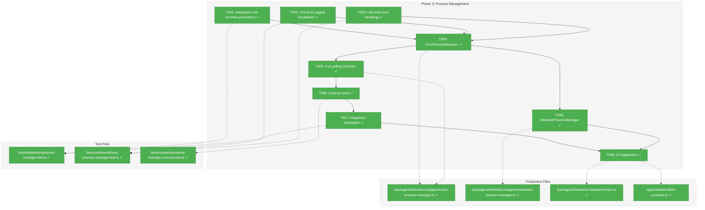
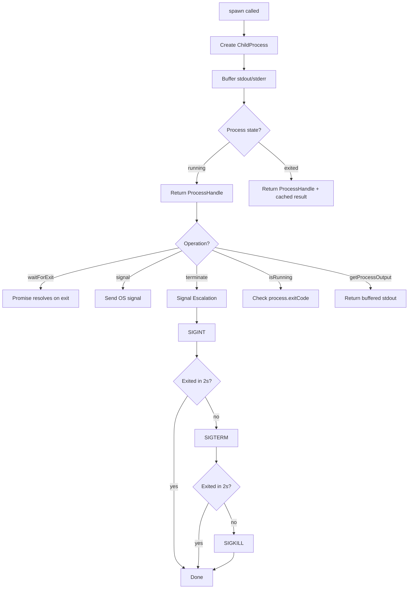
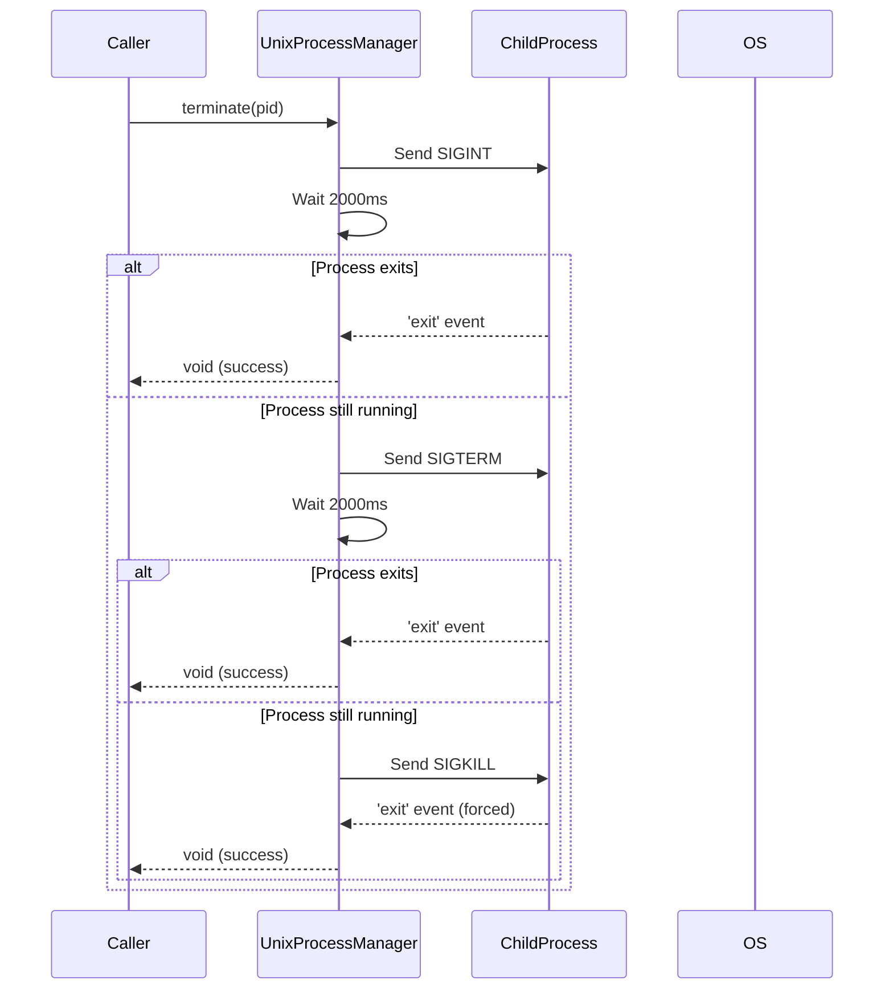

# Phase 3: Process Management – Tasks & Alignment Brief

**Spec**: [agent-control-spec.md](../../agent-control-spec.md)
**Plan**: [agent-control-plan.md](../../agent-control-plan.md)
**Date**: 2026-01-22

---

## Executive Briefing

### Purpose
This phase implements the real `UnixProcessManager` that spawns, monitors, and terminates actual operating system processes. It replaces `FakeProcessManager` in production while keeping the fake for unit tests. Without this, the ClaudeCodeAdapter cannot run real CLI commands.

### What We're Building
A production-ready `UnixProcessManager` class that:
- Spawns child processes using Node.js `child_process.spawn()`
- Captures stdout/stderr output with buffering for post-exit retrieval
- Implements signal escalation: SIGINT (2s) → SIGTERM (2s) → SIGKILL
- Monitors process lifecycle via 250ms polling
- Provides platform-specific Windows fallback via `taskkill`

### User Value
Developers can execute AI coding agent CLI commands (Claude Code, Copilot) as real processes with reliable termination, preventing zombie processes and ensuring clean resource cleanup even when agents become unresponsive.

### Example
```typescript
// Spawn Claude Code CLI
const pm = new UnixProcessManager(logger);
const handle = await pm.spawn({
  command: 'npx',
  args: ['claude', '-p', 'Write hello world', '--output-format=stream-json'],
  cwd: '/workspace'
});

// Wait for completion
const result = await handle.waitForExit();
const output = pm.getProcessOutput(handle.pid); // Buffered stdout

// Or terminate if needed
await pm.terminate(handle.pid); // SIGINT → SIGTERM → SIGKILL
```

---

## Objectives & Scope

### Objective
Implement robust process lifecycle management as specified in AC-14 (termination within 10 seconds) with signal escalation per Critical Discovery 02.

### Behavior Checklist (from plan)
- [ ] Signal escalation: SIGINT (2s) → SIGTERM (2s) → SIGKILL
- [ ] Process exit monitoring via 250ms polling
- [ ] No zombie processes after 100 spawn/exit cycles (integration test)
- [ ] Platform detection: Unix vs Windows
- [ ] Windows fallback using `taskkill /PID /F`
- [ ] Correct exit code mapping (0=completed, >0=failed, signal=killed)

### Goals

- ✅ Implement `UnixProcessManager` with real `child_process.spawn()`
- ✅ Implement signal escalation with configurable timing intervals
- ✅ Implement stdout/stderr buffering with `getProcessOutput()` retrieval
- ✅ Implement 250ms exit polling for process state detection
- ✅ Run contract tests against real `UnixProcessManager`
- ✅ Add zombie prevention integration test (100 spawn/exit cycles)
- ✅ Implement `WindowsProcessManager` with `taskkill` fallback
- ✅ Register platform-appropriate manager in DI container

### Non-Goals (Scope Boundaries)

- ❌ Streaming stdout/stderr (spec non-goal: "no streaming"; output returned on completion)
- ❌ Process isolation/sandboxing (runs in caller's security context)
- ❌ Cross-platform signal forwarding to child processes (Node.js limitation)
- ❌ Process group management (Rust's `group_spawn()` has no Node.js equivalent; documented limitation)
- ❌ Custom signal handlers beyond SIGINT/SIGTERM/SIGKILL (not needed for spec)
- ❌ Timeout logic (belongs to `AgentService` in Phase 5, not ProcessManager)
- ❌ Session tracking (ProcessManager is stateless; caller tracks PIDs)

---

## Architecture Map

### Component Diagram
<!-- Status: grey=pending, orange=in-progress, green=completed, red=blocked -->
<!-- Updated by plan-6 during implementation -->



### Task-to-Component Mapping

<!-- Status: ⬜ Pending | 🟧 In Progress | ✅ Complete | 🔴 Blocked -->

| Task | Component(s) | Files | Status | Comment |
|------|-------------|-------|--------|---------|
| T001 | Integration Test | `/test/integration/process-manager.test.ts` | ✅ Complete | Zombie prevention: 100 spawn/exit cycles |
| T002 | Unit Test | `/test/unit/shared/unix-process-manager.test.ts` | ✅ Complete | Signal escalation timing verification |
| T003 | Unit Test | `/test/unit/shared/unix-process-manager.test.ts` | ✅ Complete | Exit code mapping: 0, >0, signal |
| T004 | UnixProcessManager | `/packages/shared/src/adapters/unix-process-manager.ts` | ✅ Complete | Core spawn + signal + buffered output |
| T005 | Exit Polling | `/packages/shared/src/adapters/unix-process-manager.ts` | ✅ Complete | 250ms polling for exit detection |
| T006 | Contract Tests | `/test/contracts/process-manager.contract.test.ts` | ✅ Complete | Wire UnixProcessManager to contract factory |
| T007 | Integration Verify | `/test/integration/process-manager.test.ts` | ✅ Complete | Verify no zombies after 100 cycles |
| T008 | WindowsProcessManager | `/packages/shared/src/adapters/windows-process-manager.ts` | ✅ Complete | taskkill fallback for Windows |
| T009 | DI Registration | `/apps/web/src/lib/di-container.ts` | ✅ Complete | Platform-appropriate manager binding |

---

## Tasks

| Status | ID | Task | CS | Type | Dependencies | Absolute Path(s) | Validation | Subtasks | Notes |
|--------|------|------|-----|------|--------------|------------------|------------|----------|-------|
| [x] | T001 | Write integration test for zombie prevention (100 spawn/exit cycles) | 3 | Test | – | `/home/jak/substrate/002-agents/test/integration/process-manager.test.ts` | Test file exists; defines 100-cycle expectation; initially fails | – | Per Critical Discovery 02 |
| [x] | T002 | Write unit tests for signal escalation timing (SIGINT→SIGTERM→SIGKILL with 2s intervals) | 2 | Test | – | `/home/jak/substrate/002-agents/test/unit/shared/unix-process-manager.test.ts` | Tests verify 2000ms intervals; use vi.useFakeTimers() for determinism | – | Per AC-14 |
| [x] | T003 | Write unit tests for process exit handling (exit 0, exit N>0, signal termination) | 2 | Test | – | `/home/jak/substrate/002-agents/test/unit/shared/unix-process-manager.test.ts` | Tests cover all 3 exit paths; verify exit code and signal in result | – | Per Discovery 06 |
| [x] | T004 | Implement UnixProcessManager with child_process.spawn() | 3 | Core | T001, T002, T003 | `/home/jak/substrate/002-agents/packages/shared/src/adapters/unix-process-manager.ts` | spawn() creates real process; signal() sends OS signals; stdout buffered | – | ILogger injection |
| [x] | T005 | Implement exit monitoring with 250ms polling | 2 | Core | T004 | `/home/jak/substrate/002-agents/packages/shared/src/adapters/unix-process-manager.ts` | isRunning() polls process state; terminate() waits between signals | – | Configurable interval for testing |
| [x] | T006 | Run contract tests against UnixProcessManager | 2 | Test | T004, T005 | `/home/jak/substrate/002-agents/test/contracts/process-manager.contract.test.ts` | All 9 contract tests pass with UnixProcessManager | – | Per ADR-0002 |
| [x] | T007 | Verify integration test passes (no zombies after 100 cycles) | 2 | Test | T006 | `/home/jak/substrate/002-agents/test/integration/process-manager.test.ts` | No zombie processes; memory stable; all exits clean | – | May need CI-specific handling |
| [x] | T008 | Implement WindowsProcessManager with taskkill fallback | 2 | Core | T004 | `/home/jak/substrate/002-agents/packages/shared/src/adapters/windows-process-manager.ts` | taskkill /PID /F used instead of signals; document as limitation | – | Per plan risk table |
| [x] | T009 | Register platform-appropriate ProcessManager in DI container | 1 | Setup | T007, T008 | `/home/jak/substrate/002-agents/packages/shared/src/adapters/index.ts`, `/home/jak/substrate/002-agents/apps/web/src/lib/di-container.ts` | process.platform detection; Unix or Windows manager resolved | – | – |

---

## Alignment Brief

### Prior Phases Review

#### Phase-by-Phase Summary

**Phase 1: Interfaces & Fakes** → **Phase 2: Claude Code Adapter** → **Phase 3: Process Management (current)**

The implementation evolved from defining contracts (Phase 1) to implementing the first real adapter (Phase 2), now requiring real process management (Phase 3).

#### Phase 1 Deliverables (Foundation)

| Component | Path | What Phase 3 Uses |
|-----------|------|-------------------|
| `IProcessManager` interface | `/packages/shared/src/interfaces/process-manager.interface.ts` | Interface contract to implement |
| `FakeProcessManager` | `/packages/shared/src/fakes/fake-process-manager.ts` | Test double pattern to follow; assertion helpers |
| `processManagerContractTests()` | `/test/contracts/process-manager.contract.ts` | Contract test factory to wire UnixProcessManager |
| `ProcessSignal` type | `/packages/shared/src/interfaces/process-manager.interface.ts` | Type for SIGINT/SIGTERM/SIGKILL |
| `SpawnOptions` type | `/packages/shared/src/interfaces/process-manager.interface.ts` | Options interface for spawn() |
| `ProcessHandle` type | `/packages/shared/src/interfaces/process-manager.interface.ts` | Return type from spawn() |
| `ProcessExitResult` type | `/packages/shared/src/interfaces/process-manager.interface.ts` | Return type from waitForExit() |

**Key Phase 1 Patterns to Maintain**:
- DYK-01: Async-first interface (all methods return Promise)
- DYK-04: Full 5-method interface (spawn, terminate, signal, isRunning, getPid)
- getProcessOutput() optional method for buffered output retrieval

#### Phase 2 Deliverables (Consumer)

| Component | Path | Relevance to Phase 3 |
|-----------|------|----------------------|
| `ClaudeCodeAdapter` | `/packages/shared/src/adapters/claude-code.adapter.ts` | Primary consumer of ProcessManager |
| `StreamJsonParser` | `/packages/shared/src/adapters/stream-json-parser.ts` | Parses output from getProcessOutput() |

**Key Phase 2 Patterns**:
- DYK-06: Buffered output via `getProcessOutput(pid)` - ClaudeCodeAdapter calls this after `waitForExit()` completes
- No streaming; output returned as single string on completion

#### Cumulative Dependencies for Phase 3

```
Phase 1 Provides:
├── IProcessManager (interface to implement)
├── FakeProcessManager (pattern reference)
├── ProcessSignal, SpawnOptions, ProcessHandle, ProcessExitResult (types)
└── processManagerContractTests() (verification factory)

Phase 2 Provides:
├── ClaudeCodeAdapter (real consumer to test against)
└── Buffered output pattern (getProcessOutput after waitForExit)
```

#### Test Infrastructure from Prior Phases

| Infrastructure | Source | Reuse in Phase 3 |
|---------------|--------|------------------|
| `processManagerContractTests()` factory | Phase 1 | Wire to UnixProcessManager |
| FakeProcessManager assertion helpers | Phase 1 | Pattern for debugging |
| Test Doc comment format | Phase 1/2 | Continue for all tests |
| `vi.useFakeTimers()` pattern | Vitest | Signal timing tests |

#### Architectural Continuity

**Patterns to Maintain**:
1. Async-first interface (all public methods return `Promise<T>`)
2. ILogger injection for observability
3. No `vi.mock()` - use fakes for dependencies
4. Contract tests verify fake-real parity
5. Test Doc comments on every test

**Anti-patterns to Avoid**:
1. ❌ Throwing errors on already-exited processes (handle gracefully)
2. ❌ Blocking operations (use async/await throughout)
3. ❌ Internal session state (ProcessManager is stateless)
4. ❌ Platform-specific code in common paths (use strategy pattern)

---

### Critical Findings Affecting This Phase

| Finding | Impact | Tasks Affected |
|---------|--------|----------------|
| **Discovery 02: Process Group Management** | SIGINT/SIGTERM may not propagate to agent child processes; signal escalation required | T002, T004, T005 |
| **Discovery 06: Result State Machine** | Exit code mapping: 0=completed, >0=failed, signal=killed | T003, T004 |
| **Discovery 10: Session Memory Management** | No internal state retention; clean up handles after termination | T004, T005 |

**Discovery 02 Details**:
> Problem: Incorrect process group spawning leaves zombie processes. Windows has different process model. SIGINT/SIGTERM may not propagate to agent child processes.
> Solution: Implement IProcessManager with platform-specific implementations. Use signal escalation: SIGINT (2s) → SIGTERM (2s) → SIGKILL.

This directly shapes T002 (timing tests) and T004/T005 (implementation).

---

### ADR Decision Constraints

| ADR | Constraint | Affected Tasks |
|-----|------------|----------------|
| **ADR-0001** | MCP Tool Design: semantic response fields, three-level testing | T001-T007 (test layers) |
| **ADR-0002** | Exemplar-Driven: contract tests for fake-real parity | T006 (contract tests verify UnixProcessManager matches FakeProcessManager behavior) |

Per ADR-0002: UnixProcessManager must pass the same `processManagerContractTests()` that FakeProcessManager passes.

---

### Invariants & Guardrails

| Invariant | Value | Enforcement |
|-----------|-------|-------------|
| Termination timeout | <10 seconds total | SIGINT(2s) + SIGTERM(2s) + SIGKILL = 6s max per AC-14 |
| Polling interval | 250ms | Configurable for testing; default 250ms |
| Signal sequence | SIGINT → SIGTERM → SIGKILL | Hard-coded order; 2s between each |
| Exit code mapping | 0=completed, >0=failed, null+signal=killed | Per Discovery 06 |

---

### Inputs to Read

| File | Purpose |
|------|---------|
| `/home/jak/substrate/002-agents/packages/shared/src/interfaces/process-manager.interface.ts` | Interface to implement |
| `/home/jak/substrate/002-agents/packages/shared/src/fakes/fake-process-manager.ts` | Pattern reference |
| `/home/jak/substrate/002-agents/test/contracts/process-manager.contract.ts` | Contract test factory |
| `/home/jak/substrate/002-agents/test/unit/shared/fake-process-manager.test.ts` | Test patterns |
| `/home/jak/substrate/002-agents/packages/shared/src/adapters/claude-code.adapter.ts` | Consumer (uses getProcessOutput) |

---

### Visual Alignment Aids

#### Process Lifecycle Flow



#### Signal Escalation Sequence



---

### Test Plan (Full TDD per Spec)

#### Unit Tests (`/test/unit/shared/unix-process-manager.test.ts`)

| Test Name | Rationale | Fixtures | Expected Output |
|-----------|-----------|----------|-----------------|
| `should spawn process and return handle with pid` | Core spawn functionality | Command: `echo test` | Handle with pid > 0 |
| `should buffer stdout for getProcessOutput retrieval` | Per DYK-06 | Command: `echo hello` | Output: "hello\n" |
| `should send SIGINT then SIGTERM then SIGKILL with 2s intervals` | Per AC-14 | vi.useFakeTimers(), stubborn process | Signals sent at t=0, t=2000, t=4000 |
| `should stop escalation when process exits on SIGTERM` | Early exit handling | Process exits on SIGTERM | Only SIGINT + SIGTERM sent |
| `should return exitCode 0 for successful process` | Exit code mapping | `exit 0` command | result.exitCode === 0 |
| `should return exitCode > 0 for failed process` | Exit code mapping | `exit 1` command | result.exitCode === 1 |
| `should return exitCode null with signal for killed process` | Signal termination | Kill process | result.exitCode null, result.signal defined |
| `should report isRunning true for active process` | State tracking | Long-running command | isRunning returns true |
| `should report isRunning false after exit` | State tracking | Quick command | isRunning returns false |
| `should handle terminate on already-exited process` | Idempotency | Pre-exited process | No error thrown |

#### Contract Tests (`/test/contracts/process-manager.contract.test.ts`)

Existing 9 contract tests from Phase 1 to run against UnixProcessManager:
1. spawn returns handle with pid
2. isRunning reports correctly for active process
3. getPid returns pid from handle
4. signal sends without throwing
5. terminate with signal escalation
6. terminate on already-exited process
7. capture exit code
8. support env variables
9. support cwd option

#### Integration Tests (`/test/integration/process-manager.test.ts`)

| Test Name | Rationale | Setup | Expected Outcome |
|-----------|-----------|-------|------------------|
| `should spawn and terminate 100 processes without zombies` | Per Discovery 02 | Loop 100 times: spawn sleep, terminate | All PIDs no longer exist; `process.kill(pid, 0)` throws ESRCH for each |
| `should terminate real long-running process` | Real CLI termination | Spawn `sleep 60`, terminate | Process exits; isRunning false |
| `should buffer large stdout output` | Memory safety | Command producing 1MB output | Output retrieved correctly |

---

### Step-by-Step Implementation Outline

| Step | Task | Description | Validation |
|------|------|-------------|------------|
| 1 | T001 | Create integration test file with 100-cycle zombie test (expect fail initially) | File exists; test fails |
| 2 | T002 | Create unit test file with signal escalation timing tests (vi.useFakeTimers) | Tests fail (no impl) |
| 3 | T003 | Add exit handling tests to unit test file | Tests fail |
| 4 | T004 | Implement UnixProcessManager.spawn() with stdout buffering | spawn tests pass |
| 5 | T004 | Implement UnixProcessManager.signal() and terminate() | signal tests pass |
| 6 | T005 | Implement isRunning() with 250ms polling | isRunning tests pass |
| 7 | T006 | Wire UnixProcessManager to processManagerContractTests() | All 9 contract tests pass |
| 8 | T007 | Run integration tests; verify no zombies | 100-cycle test passes |
| 9 | T008 | Implement WindowsProcessManager with taskkill | Windows tests pass (if on Windows) |
| 10 | T009 | Register platform-appropriate manager in DI | Container resolves correct impl |

---

### Commands to Run

```bash
# Run all tests (should have 346 passing before Phase 3)
pnpm test

# Run only unit tests for new ProcessManager
pnpm test test/unit/shared/unix-process-manager.test.ts

# Run contract tests
pnpm test test/contracts/process-manager.contract.test.ts

# Run integration tests (slower; spawns real processes)
pnpm test test/integration/process-manager.test.ts

# Check for zombie processes (cross-platform Node.js approach)
# In test: process.kill(pid, 0) throws ESRCH if process doesn't exist

# TypeScript strict mode check
pnpm typecheck

# Lint
pnpm lint
```

---

### Risks/Unknowns

| Risk | Severity | Mitigation |
|------|----------|------------|
| **Zombie processes on CI** | High | Integration test verifies; may need CI-specific cleanup |
| **Windows signal differences** | Medium | WindowsProcessManager uses `taskkill`; documented limitation |
| **Child process signal propagation** | Medium | Agent processes may not forward signals to their children; SIGKILL as fallback |
| **Large stdout memory** | Low | Buffering may consume memory; add max buffer size if needed |
| **Flaky timing tests** | Medium | Use `vi.useFakeTimers()` for unit tests; real timing only in integration |

---

### Ready Check

- [x] Prior phases reviewed (Phase 1 + Phase 2 deliverables understood)
- [x] Critical Discovery 02 understood (signal escalation, platform differences)
- [x] IProcessManager interface reviewed (5 methods + getProcessOutput optional)
- [x] FakeProcessManager pattern understood (assertion helpers, state tracking)
- [x] Contract test factory ready (`processManagerContractTests()`)
- [x] Test plan complete (unit, contract, integration)
- [x] Implementation steps clear (TDD: tests first, then impl)
- [x] ADR constraints mapped (ADR-0002 contract tests required)

**Phase Status**: ✅ COMPLETE

**Results**:
- 380 tests passing (+34 new tests)
- UnixProcessManager: Real process spawning with signal escalation
- WindowsProcessManager: taskkill fallback for Windows
- DI container: Platform-appropriate manager binding

---

## Phase Footnote Stubs

_To be populated during implementation by plan-6a-update-progress._

| Footnote | Date | Description |
|----------|------|-------------|
| | | |

---

## Evidence Artifacts

| Artifact | Path | Created By |
|----------|------|------------|
| Execution Log | `/home/jak/substrate/002-agents/docs/plans/002-agent-control/tasks/phase-3-process-management/execution.log.md` | plan-6 |
| Unit Tests | `/home/jak/substrate/002-agents/test/unit/shared/unix-process-manager.test.ts` | T002, T003 |
| Integration Tests | `/home/jak/substrate/002-agents/test/integration/process-manager.test.ts` | T001, T007 |
| Contract Test Wire | `/home/jak/substrate/002-agents/test/contracts/process-manager.contract.test.ts` | T006 |

---

## Discoveries & Learnings

_Populated during implementation by plan-6. Log anything of interest to your future self._

| Date | Task | Type | Discovery | Resolution | References |
|------|------|------|-----------|------------|------------|
| | | | | | |

**Types**: `gotcha` | `research-needed` | `unexpected-behavior` | `workaround` | `decision` | `debt` | `insight`

**What to log**:
- Things that didn't work as expected
- External research that was required
- Implementation troubles and how they were resolved
- Gotchas and edge cases discovered
- Decisions made during implementation
- Technical debt introduced (and why)
- Insights that future phases should know about

_See also: `execution.log.md` for detailed narrative._

---

## Critical Insights Discussion

**Session**: 2026-01-22 11:39 UTC
**Context**: Phase 3: Process Management tasks.md pre-implementation review
**Analyst**: AI Clarity Agent
**Reviewer**: Development Team
**Format**: Water Cooler Conversation (5 Critical Insights)

### Insight 1: FakeProcessManager Timing Mismatch

**Did you know**: FakeProcessManager uses 1ms intervals for signal escalation, but UnixProcessManager must use 2000ms intervals per AC-14.

**Implications**:
- Tests using FakeProcessManager pass instantly (3ms total termination)
- UnixProcessManager timing tests could take 6 seconds minimum
- Timing-based tests need careful setup to mock both implementations

**Options Considered**:
- Option A: Keep Timing Divergence (Document Only)
- Option B: Make FakeProcessManager Timing Configurable
- Option C: Always Use vi.useFakeTimers() for Timing Tests

**AI Recommendation**: Option C - vi.useFakeTimers()
- Reasoning: Idiomatic Vitest approach; keeps FakeProcessManager simple as behavioral double.

**Discussion Summary**: Quick agreement that vi.useFakeTimers() is the right approach for timing verification.

**Decision**: Use `vi.useFakeTimers()` for all UnixProcessManager timing tests

**Affects**: T002, T005 (timing tests)

---

### Insight 2: Zombie Detection Won't Work in CI

**Did you know**: The integration test validation `ps aux | grep defunct` is Unix-specific and won't work in CI environments or on Windows.

**Implications**:
- T007 can pass locally but fail in CI
- Windows development blocked from running integration tests
- CI may show false positives/negatives

**Options Considered**:
- Option A: Node.js-Based Detection (`process.kill(pid, 0)`)
- Option B: Platform-Conditional Tests
- Option C: Remove Zombie Detection, Trust Exit Verification
- Option D: Spawn Count + Memory Check

**AI Recommendation**: Option A - Node.js-Based Detection
- Reasoning: Cross-platform, catches practical concern (processes not terminating).

**Discussion Summary**: Agreed on Option A for cross-platform compatibility.

**Decision**: Use `process.kill(pid, 0)` for cross-platform process existence verification

**Action Items**:
- [x] Update T001/T007 validation criteria in tasks.md

**Affects**: T001, T007 (integration test validation)

---

### Insight 3: getProcessOutput() Is Optional But Required

**Did you know**: `getProcessOutput()` is marked optional on `IProcessManager` interface, but ClaudeCodeAdapter calls it (safely via optional chaining).

**Implications**:
- If UnixProcessManager doesn't implement it, adapter gets empty string
- Empty string = no parsed NDJSON output = no session ID, no token metrics
- Adapter "works" but returns useless results

**Options Considered**:
- Option A: Implement getProcessOutput() in UnixProcessManager
- Option B: Make getProcessOutput() Non-Optional on Interface
- Option C: Leave as Optional, Document Requirement

**AI Recommendation**: Option A (already in T004 scope)
- Reasoning: FakeProcessManager pattern exists; adapter handles optional gracefully.

**Discussion Summary**: Confirmed T004 already covers implementation; no interface change needed.

**Decision**: Implement `getProcessOutput()` in UnixProcessManager (already in T004 scope)

**Affects**: T004 (no change needed)

---

### Insight 4: DI Container Has TODO Comment

**Did you know**: `di-container.ts:104-106` already has a TODO comment pointing exactly where to wire the real ProcessManager.

**Implications**:
- T009 scope is clear - replace FakeProcessManager with platform detection
- Pattern exists: `process.platform === 'win32'`
- Test container already separate from production container

**Options Considered**:
- Option A: Simple Platform Switch
- Option B: Environment Variable Override
- Option C: Keep FakeProcessManager in Tests

**AI Recommendation**: Option A + C
- Reasoning: Pattern exists in codebase; test container already structured correctly.

**Discussion Summary**: Agreed on simple platform detection; no env var override needed.

**Decision**: Use `process.platform` switch in T009; tests continue using FakeProcessManager

**Affects**: T009 (no change needed)

---

### Insight 5: Node.js Cannot Kill Agent Child Processes

**Did you know**: When we send SIGINT/SIGTERM to an agent process, its child processes may NOT receive the signal due to Node.js lacking process group support.

**Implications**:
- Agent's children may become orphaned
- Signal escalation to SIGKILL ensures parent terminates
- Orphaned children eventually terminate or become system's problem

**Options Considered**:
- Option A: Accept Limitation, Document Clearly (Current Plan)
- Option B: Add `detached: true` + Process Group
- Option C: Track and Kill All Descendants (Not Feasible)

**AI Recommendation**: Option A - Accept Limitation
- Reasoning: Already documented as non-goal; signal escalation is pragmatic mitigation.

**Discussion Summary**: Confirmed as awareness item; plan already handles correctly.

**Decision**: Accept child process signal limitation as documented non-goal

**Affects**: None (already documented)

---

## Session Summary

**Insights Surfaced**: 5 critical insights identified and discussed
**Decisions Made**: 5 decisions reached through collaborative discussion
**Action Items Created**: 1 (T001/T007 validation criteria updated)
**Areas Requiring Updates**:
- [x] T001/T007 validation: Changed from `ps aux | grep defunct` to `process.kill(pid, 0)`

**Shared Understanding Achieved**: ✓

**Confidence Level**: High - Key risks identified and mitigated. Plan is solid.

**Next Steps**:
Run `/plan-6-implement-phase --phase "Phase 3: Process Management"` after GO approval.

**Notes**:
- All 5 insights confirmed existing plan is well-structured
- Only one documentation update needed (zombie detection approach)
- Node.js signal limitations are known and accepted as non-goal

---

## Directory Layout

```
docs/plans/002-agent-control/
├── agent-control-spec.md
├── agent-control-plan.md
└── tasks/
    ├── phase-1-interfaces-fakes/
    │   ├── tasks.md
    │   └── execution.log.md
    ├── phase-2-claude-code-adapter/
    │   ├── tasks.md
    │   └── execution.log.md
    └── phase-3-process-management/
        ├── tasks.md                  # This file
        └── execution.log.md          # Created by plan-6
```
