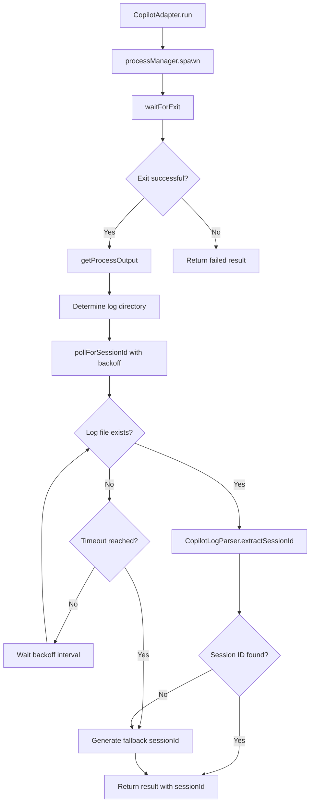
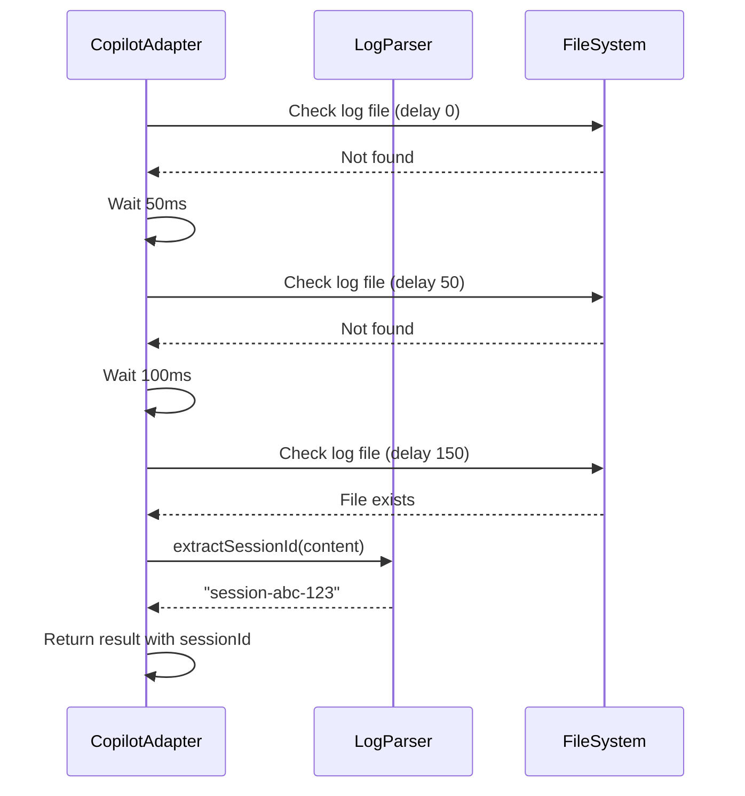

# Phase 4: Copilot Adapter – Tasks & Alignment Brief

**Spec**: [agent-control-spec.md](../../agent-control-spec.md)
**Plan**: [agent-control-plan.md](../../agent-control-plan.md)
**Date**: 2026-01-22

---

## Executive Briefing

### Purpose
This phase implements the GitHub Copilot CLI adapter, enabling Chainglass to programmatically run prompts through the Copilot CLI with session continuity. Unlike Claude Code (which uses stdout/stream-json), Copilot writes session data to log files asynchronously, requiring a polling-based extraction strategy with graceful degradation for missing token metrics.

### What We're Building
A `CopilotAdapter` class implementing `IAgentAdapter` that:
- Spawns the GitHub Copilot CLI via `IProcessManager`
- Extracts session IDs from asynchronous log files using exponential backoff polling
- Returns `tokens: null` gracefully (Copilot token reporting is undocumented)
- Passes the same contract tests as `FakeAgentAdapter` and `ClaudeCodeAdapter`

### User Value
Developers gain programmatic control over GitHub Copilot CLI with the same interface used for Claude Code. This enables:
- Multi-agent workflows switching between Claude Code and Copilot
- Session resumption across service restarts
- Unified monitoring and termination capabilities

### Example
```typescript
// Same interface as ClaudeCodeAdapter
const adapter = new CopilotAdapter(processManager, { logger });
const result = await adapter.run({ prompt: 'Explain this code', cwd: '/workspace' });

console.log(result.sessionId);  // Extracted from log files via polling
console.log(result.tokens);     // null (per Discovery 04: token reporting unavailable)
console.log(result.status);     // 'completed' | 'failed' | 'killed'
```

---

## Objectives & Scope

### Objective
Implement Copilot CLI adapter as specified in plan § Phase 4, addressing Critical Discoveries 01 (Dual I/O Pattern), 04 (Token Reporting Unknown), and 05 (Session ID Extraction Timing).

### Behavior Checklist (from plan)
- [ ] AC-1: Returns `sessionId` for session resumption (via log file extraction or fallback generation)
- [ ] AC-2: Resumes existing session when `sessionId` provided
- [ ] AC-4: Returns structured `AgentResult` object
- [ ] AC-5/AC-6/AC-7: Status reflects exit path (completed/failed/killed)
- [ ] AC-17: Session ID extracted from Copilot logs
- [ ] Discovery 04: Returns `tokens: null` when unavailable
- [ ] Discovery 05: Exponential backoff polling (50ms base, 5s max)

### Goals

- ✅ Write integration tests with skip-if-no-CLI guard for real Copilot CLI
- ✅ Implement `CopilotLogParser` for session ID extraction from log files
- ✅ Implement exponential backoff polling with configurable timing
- ✅ Implement `CopilotAdapter` with graceful token degradation
- ✅ Run contract tests to verify interface parity with FakeAgentAdapter
- ✅ Verify integration tests pass with real Copilot CLI
- ✅ Register `CopilotAdapter` in DI container

### Non-Goals (Scope Boundaries)

- ❌ Token metrics extraction (undocumented per Discovery 04; return `null`)
- ❌ Custom compact implementation (Copilot compact behavior unknown; may be no-op)
- ❌ Log file format specification (implementation detail; may change)
- ❌ Windows-specific log file paths (use platform-neutral approach where possible)
- ❌ Streaming output (spec non-goal; output returned on completion)
- ❌ Timeout enforcement (AgentService responsibility in Phase 5)

---

## Architecture Map

### Component Diagram

```mermaid
flowchart TD
    classDef pending fill:#9E9E9E,stroke:#757575,color:#fff
    classDef inprogress fill:#FF9800,stroke:#F57C00,color:#fff
    classDef completed fill:#4CAF50,stroke:#388E3C,color:#fff
    classDef blocked fill:#F44336,stroke:#D32F2F,color:#fff

    style Phase fill:#F5F5F5,stroke:#E0E0E0
    style Files fill:#F5F5F5,stroke:#E0E0E0
    style Tests fill:#F5F5F5,stroke:#E0E0E0
    style Deps fill:#F5F5F5,stroke:#E0E0E0

    subgraph Phase["Phase 4: Copilot Adapter"]
        T001["T001: Integration test expectations ✓"]:::completed
        T002["T002: Log parser unit tests ✓"]:::completed
        T003["T003: CopilotLogParser impl ✓"]:::completed
        T004["T004: Polling backoff unit tests ✓"]:::completed
        T005["T005: CopilotAdapter impl ✓"]:::completed
        T006["T006: Contract tests wiring ✓"]:::completed
        T007["T007: Token degradation ✓"]:::completed
        T008["T008: Integration verification ✓"]:::completed
        T009["T009: DI registration ✓"]:::completed

        T001 --> T005
        T002 --> T003
        T003 --> T005
        T004 --> T005
        T005 --> T006
        T006 --> T007
        T007 --> T008
        T008 --> T009
    end

    subgraph Files["Production Files"]
        F1["/packages/shared/src/adapters/copilot-log-parser.ts ✓"]:::completed
        F2["/packages/shared/src/adapters/copilot.adapter.ts ✓"]:::completed
        F3["/packages/shared/src/adapters/index.ts ✓"]:::completed
        F4["/apps/web/src/lib/di-container.ts ✓"]:::completed
    end

    subgraph Tests["Test Files"]
        T_INT["/test/integration/copilot-adapter.test.ts ✓"]:::completed
        T_UNIT1["/test/unit/shared/copilot-log-parser.test.ts ✓"]:::completed
        T_UNIT2["/test/unit/shared/copilot-adapter.test.ts ✓"]:::completed
        T_CONTRACT["/test/contracts/agent-adapter.contract.test.ts ✓"]:::completed
    end

    subgraph Deps["Dependencies (from prior phases)"]
        D1["IAgentAdapter interface (Phase 1)"]:::completed
        D2["IProcessManager (Phase 1,3)"]:::completed
        D3["FakeProcessManager (Phase 1)"]:::completed
        D4["agentAdapterContractTests (Phase 1)"]:::completed
        D5["UnixProcessManager (Phase 3)"]:::completed
    end

    T001 -.-> T_INT
    T002 -.-> T_UNIT1
    T003 -.-> F1
    T004 -.-> T_UNIT2
    T005 -.-> F2
    T006 -.-> T_CONTRACT
    T007 -.-> F2
    T008 -.-> T_INT
    T009 -.-> F3
    T009 -.-> F4

    D1 --> T005
    D2 --> T005
    D3 --> T004
    D4 --> T006
```

<!-- Status: grey=pending, orange=in-progress, green=completed, red=blocked -->
<!-- Updated by plan-6 during implementation -->



### Task-to-Component Mapping

<!-- Status: ⬜ Pending | 🟧 In Progress | ✅ Complete | 🔴 Blocked -->

| Task | Component(s) | Files | Status | Comment |
|------|-------------|-------|--------|---------|
| T001 | Integration Tests | /test/integration/copilot-adapter.test.ts | ✅ Complete | Skip-if-no-CLI guard; defines expected behaviors |
| T002 | Log Parser Tests | /test/unit/shared/copilot-log-parser.test.ts | ✅ Complete | TDD RED phase for session ID extraction |
| T003 | CopilotLogParser | /packages/shared/src/adapters/copilot-log-parser.ts | ✅ Complete | TDD GREEN phase; parses log files |
| T004 | Polling Tests | /test/unit/shared/copilot-adapter.test.ts | ✅ Complete | Exponential backoff verification |
| T005 | CopilotAdapter | /packages/shared/src/adapters/copilot.adapter.ts | ✅ Complete | Main adapter implementation |
| T006 | Contract Wiring | /test/contracts/agent-adapter.contract.test.ts | ✅ Complete | Wires CopilotAdapter to contract factory |
| T007 | Token Degradation | /packages/shared/src/adapters/copilot.adapter.ts | ✅ Complete | Returns null tokens per Discovery 04 |
| T008 | Integration Verify | /test/integration/copilot-adapter.test.ts | ✅ Complete | Verifies tests pass with real CLI |
| T009 | DI Registration | /apps/web/src/lib/di-container.ts, index.ts | ✅ Complete | Makes CopilotAdapter resolvable |

---

## Tasks

| Status | ID | Task | CS | Type | Dependencies | Absolute Path(s) | Validation | Subtasks | Notes |
|--------|-----|------|-----|------|--------------|------------------|------------|----------|-------|
| [x] | T001 | Write integration test expectations for Copilot CLI | 2 | Test | – | /home/jak/substrate/002-agents/test/integration/copilot-adapter.test.ts | Test file created with `describe.skipIf(!hasCopilotCli())` guard; 6+ test expectations defined | – | Per ClaudeCodeAdapter integration test pattern |
| [x] | T002 | Write unit tests for CopilotLogParser session ID extraction | 2 | Test | – | /home/jak/substrate/002-agents/test/unit/shared/copilot-log-parser.test.ts | Tests cover: found, not found, timeout, malformed, empty file; RED phase - tests fail initially | – | Per Discovery 05: parsing log files |
| [x] | T003 | Implement CopilotLogParser | 2 | Core | T002 | /home/jak/substrate/002-agents/packages/shared/src/adapters/copilot-log-parser.ts | Extracts session ID from log content; GREEN phase - unit tests pass | – | Fallback session ID if extraction fails |
| [x] | T004 | Write unit tests for exponential backoff polling | 2 | Test | T003 | /home/jak/substrate/002-agents/test/unit/shared/copilot-adapter.test.ts | Tests verify: 50ms base interval, 2x backoff multiplier, 5s max timeout, poll count tracking; RED phase | – | Per Discovery 05: backoff sequence [0, 50, 100, 200, 400, 800, 1600, 3200] |
| [x] | T005 | Implement CopilotAdapter | 3 | Core | T001, T003, T004 | /home/jak/substrate/002-agents/packages/shared/src/adapters/copilot.adapter.ts | Passes unit tests with FakeProcessManager; implements IAgentAdapter; handles run(), compact(), terminate() | – | Models after ClaudeCodeAdapter pattern |
| [x] | T006 | Run contract tests against CopilotAdapter | 2 | Integration | T005 | /home/jak/substrate/002-agents/test/contracts/agent-adapter.contract.test.ts | All 9 contract tests pass for CopilotAdapter (27 total: 9 Fake + 9 Claude + 9 Copilot) | – | Per ADR-0002: exemplar-driven parity |
| [x] | T007 | Implement graceful token degradation | 1 | Core | T005 | /home/jak/substrate/002-agents/packages/shared/src/adapters/copilot.adapter.ts | Returns `tokens: null` in AgentResult; logs warning when tokens unavailable | – | Per Discovery 04: Copilot tokens undocumented |
| [x] | T008 | Verify integration tests pass with real Copilot CLI | 2 | Integration | T006, T007 | /home/jak/substrate/002-agents/test/integration/copilot-adapter.test.ts | Real spawn, log parsing, session ID validated; tests unskip and pass when CLI available | – | Graceful skip if CLI not installed |
| [x] | T009 | Register CopilotAdapter in DI container | 1 | Setup | T008 | /home/jak/substrate/002-agents/packages/shared/src/adapters/index.ts, /home/jak/substrate/002-agents/apps/web/src/lib/di-container.ts | CopilotAdapter exported and resolvable from container | – | Follow ClaudeCodeAdapter DI pattern |

---

## Alignment Brief

### Prior Phases Review

#### Phase 1: Interfaces & Fakes (Complete ✅)
**Deliverables for Phase 4:**
- `IAgentAdapter` interface: `/home/jak/substrate/002-agents/packages/shared/src/interfaces/agent-adapter.interface.ts`
  - `run(options: AgentRunOptions): Promise<AgentResult>`
  - `compact(sessionId: string): Promise<AgentResult>`
  - `terminate(sessionId: string): Promise<AgentResult>`
- `AgentResult`, `AgentStatus`, `TokenMetrics`, `AgentRunOptions` types: `/home/jak/substrate/002-agents/packages/shared/src/interfaces/agent-types.ts`
- `FakeAgentAdapter`: `/home/jak/substrate/002-agents/packages/shared/src/fakes/fake-agent-adapter.ts`
  - Call history tracking, assertion helpers
- `agentAdapterContractTests()` factory: `/home/jak/substrate/002-agents/test/contracts/agent-adapter.contract.ts`
  - 9 contract tests ensuring interface compliance

**Key Decisions:**
- DYK-01: All IAgentAdapter methods are async (Promise<T>)
- DYK-03: TokenMetrics uses `| null` pattern for unavailable data (directly applicable to Copilot)
- DYK-04: Full IProcessManager interface defined upfront

#### Phase 2: Claude Code Adapter (Complete ✅)
**Deliverables for Phase 4:**
- `ClaudeCodeAdapter`: `/home/jak/substrate/002-agents/packages/shared/src/adapters/claude-code.adapter.ts`
  - Reference implementation for IAgentAdapter
  - Patterns: session tracking via Map, cwd validation, prompt validation
- `StreamJsonParser`: `/home/jak/substrate/002-agents/packages/shared/src/adapters/stream-json-parser.ts`
  - NDJSON parsing (different I/O model, but parsing pattern applicable)

**Key Learnings:**
- DYK-06: Buffered output pattern via `getProcessOutput(pid)` after `waitForExit()`
- DYK-09: Compact delegates to `run()` with `/compact` prompt for Claude Code
- Security: Prompt validation (length, control chars), workspace cwd validation

**Patterns to Reuse:**
1. Session tracking: `_activeSessions = new Map<string, number>()` (sessionId → pid)
2. Error handling: Spawn errors return `status: 'failed'` instead of throwing
3. CLI version logging for debugging
4. Integration test guard: `describe.skipIf(!hasCli())`

#### Phase 3: Process Management (Complete ✅)
**Deliverables for Phase 4:**
- `UnixProcessManager`: `/home/jak/substrate/002-agents/packages/shared/src/adapters/unix-process-manager.ts`
  - Real process spawning via `child_process.spawn()`
  - Signal escalation: SIGINT → SIGTERM → SIGKILL (2s intervals)
  - `getProcessOutput(pid)`: Buffered stdout retrieval
- `WindowsProcessManager`: `/home/jak/substrate/002-agents/packages/shared/src/adapters/windows-process-manager.ts`
- DI registration with platform detection

**Key Learnings:**
- DYK Insight 2: Cross-platform zombie detection via `process.kill(pid, 0)` throws ESRCH
- Configurable timing: Constructor parameter for signal intervals (2000ms prod, 100ms test)
- Contract test fix: Exit code test allows either `exitCode` OR `signal`

**Infrastructure Available:**
- `IProcessManager` interface with 5 methods + `getProcessOutput()`
- `FakeProcessManager` for unit testing
- Contract tests in `/home/jak/substrate/002-agents/test/contracts/process-manager.contract.ts`

### Critical Findings Affecting This Phase

| Finding | Requirement | Task(s) |
|---------|-------------|---------|
| **Discovery 01: Dual I/O Pattern** | Copilot uses log files vs Claude Code's stdout | T002, T003, T005 |
| **Discovery 04: Token Reporting Unknown** | Return `tokens: null`; document limitation | T007 |
| **Discovery 05: Session ID Extraction Timing** | Exponential backoff polling; fallback session ID | T002, T003, T004, T005 |
| **Discovery 07: CLI Version Stability** | Log version for debugging | T005 |
| **Discovery 08: Contract Tests** | Same 9 tests for Copilot as Fake/Claude | T006 |

### ADR Decision Constraints

**ADR-0001: MCP Tool Design Patterns**
- If CopilotAdapter is exposed via MCP: use `verb_object` naming, semantic response fields
- Constrains: Response structure; Addressed by: T005 (AgentResult shape)

**ADR-0002: Exemplar-Driven Development**
- Contract tests ensure fake-real parity
- Constrains: Must pass same tests as FakeAgentAdapter
- Addressed by: T006 (contract test wiring)

### Invariants & Guardrails

| Category | Constraint | Enforcement |
|----------|-----------|-------------|
| **Security** | Prompt length ≤ 100,000 characters | T005: Validation before spawn |
| **Security** | cwd must be within workspaceRoot | T005: Path traversal prevention |
| **Memory** | No unbounded log file reading | T003: Limit log file size to 10MB |
| **Timing** | Polling timeout ≤ 5 seconds | T004: Backoff sequence stops at 5s |
| **Testing** | No vi.mock() usage | All tasks: Fakes only (ADR-0002) |

### Visual Alignment Aids

#### Session ID Extraction Flow (Mermaid)



#### Polling Sequence (Mermaid)



### Test Plan (Full TDD per spec)

| Test Name | File | Rationale | Fixtures | Expected Output |
|-----------|------|-----------|----------|-----------------|
| `should detect Copilot CLI availability` | integration | Guard for skippable tests | None | Boolean |
| `should return sessionId from log file` | unit | AC-1, AC-17 | Sample log content | Extracted session ID |
| `should return fallback sessionId on timeout` | unit | Discovery 05 | Empty log dir | Generated `copilot-{pid}-{ts}` |
| `should poll with exponential backoff` | unit | Discovery 05 | FakeFileSystem | Poll count = 4 for 300ms file |
| `should return null tokens` | unit | Discovery 04 | Any | `tokens: null` |
| `should pass contract tests` | contract | ADR-0002 | FakeProcessManager | 9 tests pass |
| `should resume session with sessionId` | unit | AC-2 | Prior sessionId | Same sessionId returned |
| `should map exit codes to status` | unit | AC-5/6/7 | Exit 0, 1, signal | completed/failed/killed |

### Step-by-Step Implementation Outline

1. **T001 (RED)**: Create `/test/integration/copilot-adapter.test.ts`
   - Add `hasCopilotCli()` detection function
   - Write `describe.skipIf(!hasCopilotCli())` test suite
   - Define 6+ test expectations (run, resume, terminate, compact, error, log parsing)
   - Tests initially fail (no implementation yet)

2. **T002 (RED)**: Create `/test/unit/shared/copilot-log-parser.test.ts`
   - Write tests for `extractSessionId()` method
   - Cover: session found, not found, malformed, empty content
   - Tests fail (CopilotLogParser doesn't exist)

3. **T003 (GREEN)**: Create `/packages/shared/src/adapters/copilot-log-parser.ts`
   - Implement `CopilotLogParser` class
   - `extractSessionId(logContent: string): string | undefined`
   - Handle malformed log gracefully (return undefined)
   - Unit tests from T002 now pass

4. **T004 (RED)**: Add tests to `/test/unit/shared/copilot-adapter.test.ts`
   - Test polling behavior with FakeFileSystem (or similar pattern)
   - Verify backoff sequence: 0, 50, 100, 200, 400, 800, 1600, 3200
   - Test timeout after 5 seconds
   - Tests fail (CopilotAdapter doesn't exist)

5. **T005 (GREEN)**: Create `/packages/shared/src/adapters/copilot.adapter.ts`
   - Implement `CopilotAdapter` class
   - Constructor: `(processManager: IProcessManager, options?: CopilotAdapterOptions)`
   - Implement `run()`, `compact()`, `terminate()`
   - Include polling logic with backoff
   - Include prompt/cwd validation (reuse patterns from ClaudeCodeAdapter)
   - Unit tests from T004 now pass

6. **T006 (Integration)**: Update `/test/contracts/agent-adapter.contract.test.ts`
   - Add `agentAdapterContractTests('CopilotAdapter', () => new CopilotAdapter(fakeProcessManager))`
   - All 9 contract tests pass (27 total: 9 Fake + 9 Claude + 9 Copilot)

7. **T007 (Polish)**: Ensure `tokens: null` in all results
   - Verify `_extractTokens()` method returns `null`
   - Add logger warning: `Token metrics unavailable for Copilot CLI`
   - Per Discovery 04 graceful degradation

8. **T008 (Verify)**: Run integration tests with real CLI
   - If Copilot CLI installed: tests unskip and execute
   - If not installed: tests skip gracefully
   - Log CLI version for debugging (per Discovery 07)

9. **T009 (DI)**: Register in container
   - Export from `/packages/shared/src/adapters/index.ts`
   - Add factory to `/apps/web/src/lib/di-container.ts`
   - Follow pattern: `DI_TOKENS.COPILOT_ADAPTER`

### Commands to Run

```bash
# Environment setup (from repo root)
pnpm install

# Run unit tests (fast, uses fakes)
pnpm test test/unit/shared/copilot

# Run contract tests
pnpm test test/contracts/agent-adapter.contract.test.ts

# Run integration tests (skips if CLI not installed)
pnpm test test/integration/copilot-adapter.test.ts

# Run all tests
pnpm test

# Type checking
pnpm typecheck

# Linting
pnpm lint
```

### Risks & Unknowns

| Risk | Severity | Likelihood | Mitigation |
|------|----------|------------|------------|
| Log file format undocumented | HIGH | HIGH | Parse conservatively; fallback session ID |
| Log file path varies by platform | MEDIUM | MEDIUM | Use environment variable or common paths |
| Copilot CLI not installed in CI | LOW | HIGH | Integration tests skip gracefully |
| Token extraction may be possible | LOW | LOW | Implement null; upgrade later if format discovered |
| Compact command may differ from Claude Code | MEDIUM | MEDIUM | Implement best-effort; may be no-op |

### Ready Check

- [x] Prior phases reviewed (Phase 1, 2, 3 complete)
- [x] Critical findings mapped to tasks (01, 04, 05, 07, 08)
- [x] ADR constraints identified (ADR-0001, ADR-0002)
- [x] Test plan defined with TDD approach
- [x] Implementation outline matches task sequence
- [ ] Human GO/NO-GO confirmed

---

## Phase Footnote Stubs

| Footnote | Description | Added By |
|----------|-------------|----------|
| _Populated during implementation by plan-6_ | | |

---

## Evidence Artifacts

- **Execution Log**: `docs/plans/002-agent-control/tasks/phase-4-copilot-adapter/execution.log.md`
- **Test Results**: Test output captured in execution log
- **Code Review**: Recorded in execution log after implementation

---

## Discoveries & Learnings

_Populated during implementation by plan-6. Log anything of interest to your future self._

| Date | Task | Type | Discovery | Resolution | References |
|------|------|------|-----------|------------|------------|
| | | | | | |

**Types**: `gotcha` | `research-needed` | `unexpected-behavior` | `workaround` | `decision` | `debt` | `insight`

**What to log**:
- Things that didn't work as expected
- External research that was required
- Implementation troubles and how they were resolved
- Gotchas and edge cases discovered
- Decisions made during implementation
- Technical debt introduced (and why)
- Insights that future phases should know about

_See also: `execution.log.md` for detailed narrative._

---

## Directory Layout

```
docs/plans/002-agent-control/
├── agent-control-spec.md
├── agent-control-plan.md
└── tasks/
    ├── phase-1-interfaces-fakes/
    │   ├── tasks.md
    │   └── execution.log.md
    ├── phase-2-claude-code-adapter/
    │   ├── tasks.md
    │   └── execution.log.md
    ├── phase-3-process-management/
    │   ├── tasks.md
    │   └── execution.log.md
    └── phase-4-copilot-adapter/       <-- Current phase
        ├── tasks.md                   <-- This file
        └── execution.log.md           <-- Created by /plan-6
```

---

## Critical Insights Discussion

### Insight 1: Log File Discovery Strategy

**Challenge**: Copilot CLI writes session data to log files asynchronously. The exact log file location and format are not officially documented.

**DYK Session Decision (2026-01-22)**:
✅ **RESOLVED**: Use explicit `--log-dir` flag with `os.tmpdir()`

**Rationale**:
- Demo scripts (`test-model-tokens-copilot.ts`, `copilot-session-demo.ts`) prove this pattern works
- Copilot CLI doesn't write logs to default locations (`~/.copilot/`) without explicit flag
- Explicit log dir = deterministic location, no polling uncertainty, no platform-specific discovery

**Implementation**:
```typescript
// In CopilotAdapter.run()
const logDir = path.join(os.tmpdir(), `copilot-session-${Date.now()}`);
const args = ['--log-dir', logDir, ...otherArgs];
```

**Impact on Tasks**:
- T002/T003: CopilotLogParser still needed to parse logs from known location
- T004: Polling simplified — check known dir, not search for it
- T005: Must pass `--log-dir` flag when spawning Copilot CLI

### Insight 2: Compact Command Behavior

**Challenge**: Claude Code uses `-p "/compact"` flag, but Copilot has a different mechanism.

**DYK Session Decision (2026-01-22)**:
✅ **RESOLVED**: Use stdin for `/compact` command (NOT `-p` flag)

**Research Evidence** (from `docs/how/dev/agent-interaction-guide.md` lines 404-425):
```bash
# This WORKS - stdin respects slash commands
echo "/compact" | npx -y @github/copilot --resume <session_id>

# This does NOT work - -p treats it as regular prompt  
npx -y @github/copilot -p "/compact" --resume <session_id>
```

**Implementation**:
```typescript
async compact(sessionId: string): Promise<AgentResult> {
  // Must use stdin for slash commands - -p flag treats them as literal text
  return this._runWithStdin('/compact', sessionId);
}
```

**Key Insight**: `-p` flag sends text as prompt; stdin sends text as command.
This differs from ClaudeCodeAdapter which uses `run({ prompt: '/compact' })`.

### Insight 3: Fallback Session ID Format

**Per Discovery 05**: When log file parsing fails or times out, generate fallback session ID.

**Proposed Format**: `copilot-{pid}-{timestamp}`
- `pid`: Process ID from spawn
- `timestamp`: Unix milliseconds

**Rationale**: Ensures uniqueness without external dependencies; traceable to specific process.

### Insight 4: Testing Without Real CLI

**Challenge**: CI environment likely doesn't have Copilot CLI installed.

**Strategy**:
1. Unit tests use `FakeProcessManager` with `setProcessOutput()` pattern
2. Unit tests use mock log file content
3. Integration tests skip gracefully via `describe.skipIf(!hasCopilotCli())`
4. Contract tests use `FakeProcessManager` (same as ClaudeCodeAdapter pattern)

**DYK Session Decision (2026-01-22)**:
✅ **RESOLVED**: Use injectable `readLogFile` function instead of full FakeFileSystem

**Implementation**:
```typescript
export interface CopilotAdapterOptions {
  logger?: ILogger;
  workspaceRoot?: string;
  /** Injectable for testing - reads log file content. Default: fs.readFile */
  readLogFile?: (path: string) => Promise<string | null>;
}
```

**Rationale**:
- Minimal scope — just a function parameter, CS-1 trivial
- Deterministic tests — fake returns controlled values
- No duplication — refactor later if FakeFileSystem lands in Plan 003

**⚠️ MERGE NOTE**: 
Before merging Phase 4, check if Plan 003 (WF Basics) has implemented `IFileSystem`/`FakeFileSystem`. 
If so, refactor CopilotAdapter to use that abstraction instead of injectable function.
Consolidate concepts to avoid two different file I/O patterns in the codebase.

### Insight 5: Reusing ClaudeCodeAdapter Patterns

**Directly Reusable**:
- Session tracking map: `_activeSessions: Map<string, number>`
- Prompt validation (length, control characters)
- cwd validation against workspaceRoot
- Error handling: spawn errors → `status: 'failed'`
- CLI version logging

**Requires Adaptation**:
- Output parsing (log files vs stdout)
- Session ID extraction (polling vs synchronous)
- Token extraction (null vs parsed)

---

*Tasks.md generated: 2026-01-22*
*Next step: Run `/plan-6-implement-phase --phase "Phase 4: Copilot Adapter"` after human GO*
